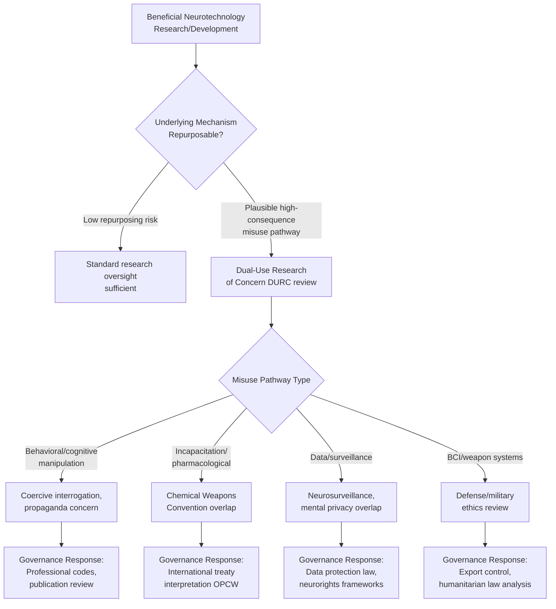

## Dual Use Concerns in Neurotechnology

### Overview

Dual-use concerns refer to the risk that neurotechnologies developed for beneficial purposes — clinical treatment, scientific research, human performance, or civilian applications — can be repurposed for harmful ends, including surveillance, coercive interrogation, weaponization, or malicious manipulation of cognition and behavior. This concept is adapted from established "dual-use research of concern" (DURC) frameworks in biosecurity (e.g., gain-of-function virology research) and applied to neuroscience and neurotechnology, an area sometimes termed "neurosecurity."

This topic spans neurotechnology engineering, military/defense ethics, international security policy, and biosecurity governance frameworks.

---

### Conceptual Foundations

#### Defining Dual Use in the Neurotechnology Context

**Key Points**

- Dual-use technology is characterized by having both a legitimate, beneficial application and a plausible pathway to harmful misuse, often using the *same* underlying technical mechanism.
- Neurotechnology dual-use concerns differ from classical biosecurity dual-use concerns (e.g., pathogen research) in that the "payload" of concern is not a biological agent but *information about, or intervention into, human cognition and behavior* — raising overlapping but distinct governance challenges.
- The field draws heavily on frameworks developed for chemical/biological weapons non-proliferation (e.g., the Australia Group, Biological Weapons Convention) as a starting point, while recognizing that neurotechnology's diffuse, often civilian/commercial origins make traditional arms-control-style governance more difficult to apply directly.

#### Why Neurotechnology Is Considered Particularly Dual-Use-Prone

**Key Points**

- Much neurotechnology research originates in civilian medical and academic contexts (treating paralysis, epilepsy, depression) with underlying mechanisms — neural signal decoding, closed-loop stimulation, pharmacological modulation of specific neural circuits — that are mechanism-agnostic regarding beneficial versus harmful application.
- Neurotechnology development is highly globally distributed and substantially driven by commercial and academic actors rather than centralized state defense programs, making conventional export-control and non-proliferation approaches (designed around identifiable state weapons programs) less straightforward to apply.
- [Inference] Many neuroethics and biosecurity scholars consider neurotechnology's civilian-dominant development pathway to be a core structural challenge for governance, since unlike, e.g., nuclear materials, there is no single controllable input or facility type that governance frameworks can target.

---

### Categories of Dual-Use Concern

#### 1. Cognitive/Behavioral Manipulation

**Key Points**

- Techniques developed to treat conditions via targeted neural modulation (e.g., deep brain stimulation for depression or OCD, neurofeedback for behavioral regulation) could in principle inform methods for **non-consensual behavioral influence**, though [Inference] current invasive techniques require surgical access and individualized calibration, making covert or mass non-consensual application technically implausible with present-day methods; non-invasive approaches (e.g., certain neurostimulation or pharmacological approaches) carry comparatively higher, though still constrained, misuse feasibility.
- Research on placebo/expectation effects, persuasion neuroscience, and decision-making under uncertainty — conducted for legitimate purposes in clinical and consumer research — has raised concern regarding potential application to manipulative advertising, propaganda, or coercive interrogation contexts, distinct from direct neural intervention.

#### 2. Neurological/Cognitive Incapacitation

**Key Points**

- Research into pharmacological agents affecting consciousness, motor control, or cognitive function (originally for anesthesia, sedation, or neurological treatment) has historical dual-use precedent — most notably the 2002 Moscow theater hostage crisis, in which Russian security forces used an aerosolized opioid-derivative incapacitating agent, resulting in substantial hostage fatalities due to uncontrolled dosing in an uncontrolled environment.
- This event is frequently cited in the arms-control and neuroethics literature as a case study illustrating both the potential appeal of "non-lethal" incapacitating agents to state actors and the severe practical risks of applying such agents outside precisely controlled clinical dosing conditions.
- The Chemical Weapons Convention (CWC) restricts use of toxic chemicals as weapons but contains a **law enforcement exemption** for domestic riot control and similar purposes; the scope and interpretation of this exemption regarding incapacitating chemical agents has been a subject of sustained international debate, including at CWC Review Conferences. [Unverified] The precise current (2026) state of international consensus or disagreement on this exemption's scope should be verified against the most recent OPCW (Organisation for the Prohibition of Chemical Weapons) review conference outcomes.

#### 3. Enhanced Interrogation and Coercive Neuroscience

**Key Points**

- Neuroscientific research on memory, stress physiology, and sleep deprivation's cognitive effects — conducted for legitimate clinical and basic-science purposes — has documented historical application to coercive interrogation practice.
- Post-9/11 U.S. interrogation program controversies involving psychologists and behavioral scientists (documented in the 2014 U.S. Senate Intelligence Committee report on CIA detention and interrogation) are frequently cited as a case study of dual-use concern realized in practice, where knowledge of stress physiology and learned helplessness (originally developed through basic behavioral science research, notably Martin Seligman's foundational learned-helplessness research) informed coercive interrogation technique design.
- [Inference] This case is widely regarded in neuroethics literature as demonstrating that dual-use risk in this domain is not merely speculative or futuristic, but has documented historical precedent involving repurposing of basic behavioral/psychological science.

#### 4. Neurosurveillance and Involuntary Neural Data Collection

**Key Points**

- Overlaps substantially with mental privacy concerns (see related chapter topic), specifically regarding covert or coercive collection of neural data for state security, interrogation, or population-monitoring purposes.
- Passive EEG-based deception or concealed-information detection technologies (e.g., "brain fingerprinting," discussed in the neurolaw context) raise dual-use concern regarding potential application in coercive state security contexts with weaker due-process protections than domestic forensic use.
- [Speculation] Some security policy analysts have raised concern regarding future covert or remote neural signal detection (e.g., via advanced radar/sensing technologies claimed capable of detecting physiological correlates from a distance); as of 2026, robust, validated covert neural-state detection at range is not established capability in the peer-reviewed open literature, and claims in this area should be treated with significant skepticism absent rigorous independent validation.

#### 5. Brain-Computer Interfaces and Neural Weapon Systems

**Key Points**

- Military research programs (e.g., in the U.S., work historically associated with DARPA) have explored BCI applications for defense purposes, including human-machine teaming, cognitive workload monitoring for personnel, and prosthetic/restorative applications for injured service members — largely analogous in underlying technology to civilian therapeutic BCI research.
- Concerns regarding offensive weaponization of BCI technology (e.g., direct neural interference with adversary combatants) remain, as of 2026, predominantly within the domain of prospective/theoretical security analysis rather than documented operational capability, given the technical requirements (proximity, calibration, invasiveness) that current BCI technology demands.
- [Inference] The most immediate, documented dual-use BCI concern in current defense-oriented literature centers on data security and adversarial manipulation of BCI systems used by military personnel (a cybersecurity-adjacent concern) rather than direct offensive neural weaponization, which remains largely speculative given present technical constraints.

---

### Governance Frameworks and Proposed Responses

#### International Governance Precedents Drawn Upon

**Key Points**

- **Biological Weapons Convention (BWC, 1972)** and **Chemical Weapons Convention (CWC, 1993)**: foundational non-proliferation treaties frequently referenced as partial governance models, though neither was designed with neurotechnology specifically in mind, creating interpretive gaps regarding novel neurotechnological agents and methods.
- **Dual-Use Research of Concern (DURC) policy frameworks** (originating in U.S. biosecurity policy, e.g., post-2011 H5N1 gain-of-function controversy) have been proposed as an adaptable model for neurotechnology research oversight, involving institutional review mechanisms for research with plausible high-consequence misuse potential.
- **International Committee of the Red Cross (ICRC)** and affiliated bodies have published analyses specifically addressing neurotechnology's implications for international humanitarian law and the laws of armed conflict, an active and evolving area of international legal scholarship.

#### Proposed Neurotechnology-Specific Governance Mechanisms

**Key Points**

- **Research oversight and institutional review**: proposals to extend dual-use research review (analogous to biosecurity DURC review boards) to neurotechnology research with plausible weaponization or manipulation pathways.
- **Export control extension**: proposals to extend existing dual-use technology export control regimes (e.g., the Wassenaar Arrangement, which already covers certain surveillance technologies) to specific neurotechnology categories, though [Inference] implementation faces the same civilian-diffusion challenge noted above — most neurotechnology components (EEG hardware, signal processing software) have overwhelmingly civilian/medical/consumer applications, complicating targeted export restriction without impeding beneficial research and commerce.
- **Professional codes of conduct**: neuroscience and neuroengineering professional societies (e.g., the International Neuroethics Society, Society for Neuroscience) have increasingly incorporated dual-use awareness into ethics guidance and training, encouraging researcher-level awareness of potential misuse pathways during research design and publication decisions.
- **Publication and information-hazard review**: analogous to biosecurity practice regarding potentially hazardous gain-of-function research publication, some scholars propose parallel review processes for neurotechnology research with high misuse potential prior to open publication, though this remains a less institutionalized practice in neuroscience than in virology as of 2026.

---

### The Governance Gap: Structural Challenges

**Key Points**

- **Attribution difficulty**: unlike physical weapons programs, neurotechnology misuse (e.g., coercive interrogation informed by publicly available stress-physiology research) is difficult to attribute to specific research inputs, complicating both prevention and accountability frameworks.
- **Beneficial-application dominance**: the overwhelming majority of neurotechnology research and development is directed toward legitimate clinical, therapeutic, and consumer applications, meaning restrictive governance risks disproportionately burdening beneficial research relative to the actual misuse risk it prevents — a recurring tension in dual-use governance generally, not unique to neurotechnology.
- **Rapid commercial diffusion**: consumer neurotechnology (wearable EEG, neurofeedback devices) diffuses through ordinary commercial channels largely outside traditional national security or defense-technology oversight structures, creating potential blind spots relative to more centrally controlled technology domains (e.g., nuclear materials).
- [Inference] Most neuroethics and security policy scholars analyzing this area characterize the core governance challenge as balancing proportionate risk mitigation against the risk of unduly restricting legitimate, high-value clinical and scientific research — a balance not yet resolved through binding international consensus as of 2026.

---

### Illustrative Diagram: Dual-Use Risk Pathway

---

### Diagram: Dual-Use Risk Landscape by Technology Maturity and Misuse Proximity (svg_diagram)

<svg xmlns="http://www.w3.org/2000/svg" viewBox="0 0 780 400" font-family="Helvetica, Arial, sans-serif">
<text x="390" y="28" text-anchor="middle" font-size="16" font-weight="bold" fill="#1a1a2e">Dual-Use Neurotechnology Risk Landscape (svg_diagram)</text>
<line x1="90" y1="350" x2="720" y2="350" stroke="#333" stroke-width="2" />
<line x1="90" y1="350" x2="90" y2="60" stroke="#333" stroke-width="2" />
<text x="405" y="378" text-anchor="middle" font-size="12" fill="#333">Technology/Research Maturity →</text>
<text x="45" y="205" text-anchor="middle" font-size="12" fill="#333" transform="rotate(-90 45 205)">Documented Misuse Proximity →</text>
<circle cx="180" cy="280" r="15" fill="#2ec4b6" />
<text x="180" y="305" text-anchor="middle" font-size="11" fill="#1a1a2e">Consumer EEG</text>
<text x="180" y="318" text-anchor="middle" font-size="11" fill="#1a1a2e">wearables</text>
<circle cx="290" cy="130" r="15" fill="#e63946" />
<text x="290" y="110" text-anchor="middle" font-size="11" fill="#1a1a2e">Stress physiology /</text>
<text x="290" y="123" text-anchor="middle" font-size="11" fill="#1a1a2e">interrogation (historical)</text>
<circle cx="410" cy="170" r="15" fill="#ff9f1c" />
<text x="410" y="150" text-anchor="middle" font-size="11" fill="#1a1a2e">Incapacitating</text>
<text x="410" y="163" text-anchor="middle" font-size="11" fill="#1a1a2e">chemical agents</text>
<circle cx="540" cy="230" r="15" fill="#4361ee" />
<text x="540" y="255" text-anchor="middle" font-size="11" fill="#1a1a2e">Therapeutic DBS /</text>
<text x="540" y="268" text-anchor="middle" font-size="11" fill="#1a1a2e">neuromodulation</text>
<circle cx="650" cy="300" r="15" fill="#3a86ff" />
<text x="650" y="325" text-anchor="middle" font-size="11" fill="#1a1a2e">Offensive BCI</text>
<text x="650" y="338" text-anchor="middle" font-size="11" fill="#1a1a2e">(prospective)</text>

<text x="690" y="368" text-anchor="middle" font-size="10" fill="#666">mature</text>

<text x="115" y="368" text-anchor="middle" font-size="10" fill="#666">emerging</text>

<text x="65" y="75" text-anchor="middle" font-size="10" fill="#666">documented</text>

<text x="65" y="335" text-anchor="middle" font-size="10" fill="#666">speculative</text>

</svg>

---

### Relationship to Adjacent Neuroethics Domains

**Key Points**

- Dual-use concerns overlap substantially with **mental privacy** (surveillance applications), **cognitive enhancement** (military human-performance research has direct civilian-enhancement dual-use character), and **neurolaw** (coercive interrogation neuroscience intersects with legal admissibility and human rights law).
- [Inference] Many neuroethics scholars treat dual-use concern less as a wholly separate ethical category and more as a cross-cutting lens applied across the other neuroethics domains, given that the same underlying technologies and research findings recur across privacy, enhancement, legal, and security contexts.

---

### Conclusion

**Conclusion**

Dual-use concerns in neurotechnology highlight a structural tension between the field's overwhelmingly beneficial civilian orientation (clinical treatment, scientific understanding, human performance) and documented historical precedent for repurposing neuroscientific knowledge toward coercive, manipulative, or weaponized ends. Unlike more centralized dual-use domains such as nuclear technology, neurotechnology's diffuse, commercially and academically driven development pathway makes conventional governance tools — export controls, treaty frameworks, institutional oversight — comparatively difficult to apply without disproportionately burdening legitimate research. Existing biosecurity governance models (DURC frameworks, chemical/biological weapons conventions) provide partial templates, but [Inference] most scholars in this area regard neurotechnology-specific governance as still substantially underdeveloped relative to the field's technical trajectory, making this an area of active policy development rather than settled international consensus as of 2026.

---

**Related Topics**

- Ethics of neuroimaging and mental privacy (related chapter topic)
- Dual-use research of concern (DURC) frameworks in biosecurity
- Chemical Weapons Convention and incapacitating agents policy debate
- Learned helplessness research and its application to coercive interrogation
- International humanitarian law and emerging military technologies
- Neurorights frameworks and international governance proposals
- Military and defense applications of brain-computer interfaces
- Research ethics review boards and information-hazard publication policy
- Export control regimes for emerging dual-use technologies (Wassenaar Arrangement)
- Cognitive enhancement debates (related chapter topic)