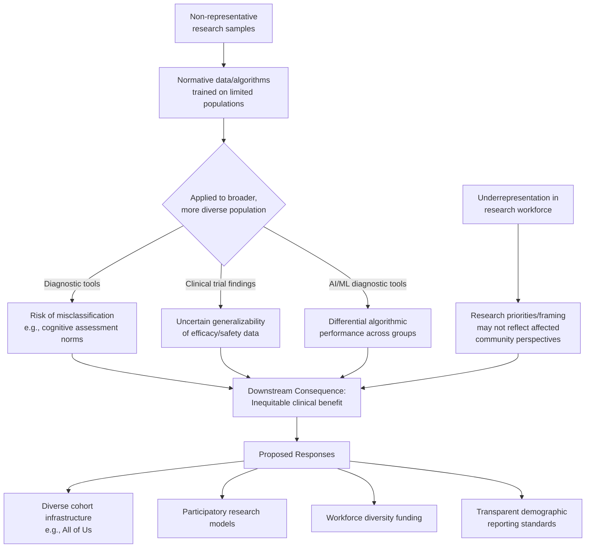

## Equity and Access in Neuroscience Research

### Overview

Equity and access in neuroscience research concerns the fair distribution of both the *benefits* of neuroscience (diagnostic tools, treatments, enhancement technologies) and *participation* in research (as subjects, researchers, and decision-makers) across populations differentiated by race, ethnicity, socioeconomic status, geography, sex/gender, disability status, and global region. It addresses systematic disparities in who is studied, who benefits from resulting discoveries, and who conducts the research itself.

This topic draws on bioethics, health equity/disparities research, science policy, global health, and the sociology of science.

---

### Dimensions of Inequity in Neuroscience Research

#### 1. Participant Diversity in Research Samples

**Key Points**

- Neuroimaging and cognitive neuroscience research has historically drawn disproportionately from convenience samples — typically university-affiliated populations in high-income countries, often characterized in the methodological literature by the acronym **WEIRD** (Western, Educated, Industrialized, Rich, Democratic), a term introduced by Henrich, Heine, and Norenzayan (2010) to describe a systematic sampling bias across psychological and behavioral science broadly, including neuroscience.
- This sampling pattern raises concerns about the generalizability of normative brain templates, developmental trajectories, and diagnostic thresholds derived predominantly from WEIRD populations when applied clinically to more diverse populations.
- Underrepresentation has been particularly well-documented for Black, Indigenous, and Hispanic/Latino populations in U.S.-based neuroimaging research, and for populations across most of Africa, South Asia, and Latin America in global neuroscience research overall.
- [Inference] The degree to which specific neuroimaging findings (e.g., normative structural brain volumes, functional connectivity patterns) vary meaningfully across ancestrally and socioeconomically diverse populations remains an active empirical question in many subfields; the concern is not necessarily that all findings are non-generalizable, but that the field has often lacked the diverse samples needed to test generalizability rigorously in the first place.

#### 2. Socioeconomic Status and Neurodevelopment Research

**Key Points**

- A substantial body of research (sometimes grouped under "socioeconomic status and brain development" or "poverty and the brain" literature) has documented associations between childhood socioeconomic disadvantage and measures of brain structure/function, particularly in regions supporting language, executive function, and stress regulation (e.g., hippocampus, prefrontal cortex).
- This research area carries a documented risk of **deficit-framing** — interpreting SES-associated neural differences as fixed individual or group deficits rather than as plausible reflections of modifiable environmental factors (nutrition, stress exposure, educational access, environmental toxin exposure), a distinction with significant policy and stigma implications.
- [Inference] Prominent researchers in this literature (e.g., work associated with Kimberly Noble and colleagues) generally frame SES-associated neurodevelopmental findings as evidence for the plasticity and environmental sensitivity of brain development — supporting policy intervention arguments — rather than as evidence of fixed capacity differences, though public and media interpretation of such findings has not always preserved this framing distinction.

#### 3. Global Disparities in Neuroscience Research Infrastructure

**Key Points**

- Advanced neuroimaging infrastructure (MRI scanners, especially research-grade high-field systems; specialized EEG/MEG facilities) is heavily concentrated in high-income countries; large regions of the Global South have markedly limited access to such research infrastructure, constraining both local research capacity and the geographic/ancestral diversity of global neuroscience datasets.
- Global Brain Health Institute-style capacity-building initiatives and international consortia (e.g., ENIGMA Consortium's efforts to incorporate more geographically diverse cohorts) represent partial responses to this disparity, aiming to build multi-site collaborative datasets and local research capacity rather than relying solely on data collected in high-income-country institutions.
- [Unverified] Specific quantitative estimates of the global distribution of neuroimaging infrastructure change over time as capacity-building investments occur; readers seeking current figures should consult recent World Health Organization or academic infrastructure survey data rather than relying on general characterizations.

#### 4. Disability Community Participation and "Nothing About Us Without Us"

**Key Points**

- Disability rights advocacy, including from neurodiversity movement perspectives (particularly prominent in autism research discourse), has raised concerns that neuroscience research on conditions like autism, ADHD, and other neurodevelopmental differences has often been conducted predominantly by non-disabled researchers with limited direct input from the populations studied regarding research priorities, framing, and outcome measures valued.
- This has motivated calls for **participatory research models** in neuroscience — incorporating affected communities in research design, priority-setting, and interpretation — analogous to participatory action research traditions in other health disparities fields.
- The neurodiversity movement specifically has raised critiques regarding research framing that treats neurodevelopmental differences primarily as deficits to be corrected/cured versus differences to be understood and accommodated; this remains an actively debated framing question within both the autism research community and autistic self-advocacy communities, without a single consensus position across all stakeholders.

#### 5. Representation Within the Neuroscience Research Workforce

**Key Points**

- Documented disparities exist in the representation of women, racial/ethnic minorities (particularly in the U.S. context, Black and Hispanic/Latino researchers), and researchers from lower-income countries at senior academic ranks, grant funding recipiency, and leadership positions within neuroscience as a field, patterns broadly consistent with disparities documented across STEM fields generally.
- [Unverified] Specific current statistics on workforce representation change over time with ongoing institutional initiatives; general characterizations here should be supplemented with current data from sources such as the NIH's workforce diversity reports or Society for Neuroscience membership demographic surveys for precise figures.
- Research on the "diversity of the research team" as itself methodologically relevant (i.e., team diversity affecting research question framing, interpretation, and translational relevance) is an active area within science-of-science and team-science scholarship.

---

### Downstream Consequences of Research Inequity

#### 1. Diagnostic and Clinical Tool Validity

**Key Points**

- Neuropsychological assessment tools (cognitive tests used in clinical diagnosis) were often normed predominantly on WEIRD populations; applying such norms to individuals from different cultural, linguistic, or educational backgrounds risks systematic misclassification (e.g., over- or under-diagnosis of cognitive impairment).
- This concern is well-documented in dementia and cognitive impairment diagnosis literature, where educational attainment and language/cultural factors are known to substantially affect performance on many standard cognitive screening instruments independent of underlying neurological status, motivating development of culturally and linguistically adapted assessment tools.

#### 2. Treatment Access and Clinical Trial Representation

**Key Points**

- Underrepresentation of diverse populations in clinical trials for neurological and psychiatric medications raises concerns about generalizability of efficacy and safety findings, an issue that led to specific U.S. regulatory responses (e.g., NIH Revitalization Act of 1993 requiring inclusion of women and minorities in NIH-funded clinical research, with later extensions addressing broader diversity considerations).
- Geographic and economic access barriers (specialist availability, cost, insurance coverage) to advanced neurological/psychiatric treatments (e.g., specialized epilepsy surgery centers, novel biologic psychiatric treatments, advanced neuroimaging-based diagnostics) remain well-documented globally and within high-income countries with significant internal disparities.

#### 3. Algorithmic and AI-Based Neuroscience Tools

**Key Points**

- Machine learning models increasingly used in neuroimaging-based diagnosis and research (e.g., automated brain age estimation, disease classification algorithms) are trained predominantly on available datasets, which — reflecting the sampling biases described above — often underrepresent certain populations, raising concern about differential algorithmic performance across demographic groups (a specific instance of the broader "algorithmic bias" concern relevant across AI applications).
- [Inference] This concern parallels well-documented algorithmic bias findings in other medical AI domains (e.g., dermatology AI trained predominantly on lighter skin tones); the neuroimaging-specific literature on this question is actively developing, and the magnitude of demographic performance disparities for specific neuroimaging AI tools should be evaluated on a tool-by-tool basis against published validation studies rather than assumed uniformly.

---

### Proposed Frameworks and Responses

#### 1. Diversity-Enhancing Research Infrastructure Initiatives

**Key Points**

- Large-scale, deliberately diverse cohort studies — e.g., the U.S. **All of Us Research Program** (NIH), which explicitly prioritizes recruitment of historically underrepresented populations — represent infrastructure-level responses aimed at building more representative foundational datasets for biomedical (including neuroscience-relevant) research.
- International multi-site consortia (e.g., ENIGMA, and various global mental health research networks) increasingly incorporate explicit diversity and capacity-building goals in study design, though [Inference] the pace and completeness of this shift varies considerably across specific research subfields and funding bodies.

#### 2. Community-Engaged and Participatory Research Models

**Key Points**

- Involve affected communities (patient groups, disability advocacy organizations, culturally specific community organizations) in research question formulation, study design, consent processes, and dissemination — intended to improve both ethical legitimacy and practical relevance/uptake of research findings.
- Community advisory boards, increasingly required or encouraged by some funding bodies and IRBs for research involving specific vulnerable or historically underrepresented populations, represent one institutionalized mechanism for this approach.

#### 3. Funding and Policy-Level Interventions

**Key Points**

- Targeted funding mechanisms (e.g., NIH diversity supplements, targeted funding calls for underrepresented researcher career development) aim to address workforce representation disparities directly.
- Data-sharing and open-science mandates from major funders (aiming to make diverse datasets, once collected, more broadly available for reanalysis) are intended to partially offset the disproportionate resource requirements of large-scale diverse-sample data collection, allowing broader research community benefit from investments in diverse cohort recruitment.

#### 4. Standard-Setting for Reporting and Study Design

**Key Points**

- Growing calls (reflected in some journal editorial policies) for neuroscience publications to report sample demographic composition transparently and to discuss generalizability limitations explicitly, rather than presenting findings from non-representative samples as universally generalizable without qualification.

---

### Illustrative Diagram: Pathway from Research Inequity to Clinical/Societal Consequence

---

### Diagram: Stages of the Research Pipeline Where Equity Gaps Arise (svg_diagram)

<svg xmlns="http://www.w3.org/2000/svg" viewBox="0 0 780 340" font-family="Helvetica, Arial, sans-serif">
<text x="390" y="28" text-anchor="middle" font-size="16" font-weight="bold" fill="#1a1a2e">Equity Gaps Across the Neuroscience Research Pipeline (svg_diagram)</text>
<rect x="40" y="80" width="130" height="70" rx="8" fill="#4361ee" opacity="0.15" stroke="#4361ee" stroke-width="2" />
<text x="105" y="110" text-anchor="middle" font-size="12" font-weight="bold" fill="#1a1a2e">Question</text>
<text x="105" y="126" text-anchor="middle" font-size="12" font-weight="bold" fill="#1a1a2e">Formulation</text>
<rect x="210" y="80" width="130" height="70" rx="8" fill="#f72585" opacity="0.15" stroke="#f72585" stroke-width="2" />
<text x="275" y="110" text-anchor="middle" font-size="12" font-weight="bold" fill="#1a1a2e">Participant</text>
<text x="275" y="126" text-anchor="middle" font-size="12" font-weight="bold" fill="#1a1a2e">Recruitment</text>
<rect x="380" y="80" width="130" height="70" rx="8" fill="#ff9f1c" opacity="0.15" stroke="#ff9f1c" stroke-width="2" />
<text x="445" y="110" text-anchor="middle" font-size="12" font-weight="bold" fill="#1a1a2e">Analysis &amp;</text>
<text x="445" y="126" text-anchor="middle" font-size="12" font-weight="bold" fill="#1a1a2e">Norm-Setting</text>
<rect x="550" y="80" width="130" height="70" rx="8" fill="#2ec4b6" opacity="0.15" stroke="#2ec4b6" stroke-width="2" />
<text x="615" y="110" text-anchor="middle" font-size="12" font-weight="bold" fill="#1a1a2e">Clinical/Real-World</text>
<text x="615" y="126" text-anchor="middle" font-size="12" font-weight="bold" fill="#1a1a2e">Application</text>
<path d="M170 115 L210 115" stroke="#333" stroke-width="2" marker-end="url(#arrow)" />
<path d="M340 115 L380 115" stroke="#333" stroke-width="2" marker-end="url(#arrow)" />
<path d="M510 115 L550 115" stroke="#333" stroke-width="2" marker-end="url(#arrow)" />
<text x="105" y="180" text-anchor="middle" font-size="10.5" fill="#555">Priorities set without</text>

<text x="105" y="193" text-anchor="middle" font-size="10.5" fill="#555">affected community input</text>

<text x="275" y="180" text-anchor="middle" font-size="10.5" fill="#555">WEIRD sampling bias,</text>

<text x="275" y="193" text-anchor="middle" font-size="10.5" fill="#555">infrastructure access limits</text>

<text x="445" y="180" text-anchor="middle" font-size="10.5" fill="#555">Norms/algorithms trained</text>

<text x="445" y="193" text-anchor="middle" font-size="10.5" fill="#555">on non-representative data</text>

<text x="615" y="180" text-anchor="middle" font-size="10.5" fill="#555">Misclassification, unequal</text>

<text x="615" y="193" text-anchor="middle" font-size="10.5" fill="#555">treatment access/efficacy</text>

</svg>

---

### Relationship to Broader Bioethics and Global Health Equity Frameworks

**Key Points**

- Equity concerns in neuroscience research parallel well-established health equity and research ethics literature across biomedical research broadly (e.g., historical research ethics violations such as the Tuskegee Syphilis Study informing contemporary informed consent and community trust frameworks), applied specifically to neuroscience's distinctive methodological and infrastructural features (imaging cost/access, specialized assessment tool validity).
- [Inference] Many scholars in this area frame neuroscience-specific equity concerns as a specific instance of general biomedical research equity challenges, while noting that neuroscience's particular reliance on expensive imaging infrastructure and culturally-sensitive cognitive assessment tools creates some domain-specific complications not equally present across all biomedical research areas.

---

### Conclusion

**Conclusion**

Equity and access concerns in neuroscience research reflect systematic patterns of underrepresentation — across research participants, research priorities, and the research workforce itself — that carry downstream consequences for diagnostic validity, treatment access, and the generalizability of neuroscientific knowledge across diverse populations. Unlike some other neuroethics domains centered on speculative future technology, [Inference] much of this concern rests on well-documented historical and ongoing sampling patterns (e.g., WEIRD sampling bias) rather than uncertain future risk, giving it a somewhat different evidentiary character within the neuroethics field. Response strategies — diverse cohort infrastructure investment, participatory research models, workforce diversity initiatives, and transparent reporting standards — are increasingly institutionalized in major funding and publication frameworks, though [Inference] most equity scholars in this space regard progress as partial and ongoing rather than resolved, given the scale of historical underrepresentation being addressed.

---

**Related Topics**

- WEIRD sampling bias in psychological and neuroscience research methodology
- Socioeconomic status and childhood brain development research
- Neurodiversity movement and participatory autism research
- Algorithmic bias in medical AI and neuroimaging-based diagnostic tools
- Global mental health research capacity-building initiatives
- Research ethics history: Tuskegee Study and informed consent frameworks
- Cultural and linguistic adaptation of neuropsychological assessment tools
- NIH All of Us Research Program and large-scale diverse cohort design
- Community-engaged and participatory action research methodology
- Ethics of neuroimaging and mental privacy (related chapter topic)