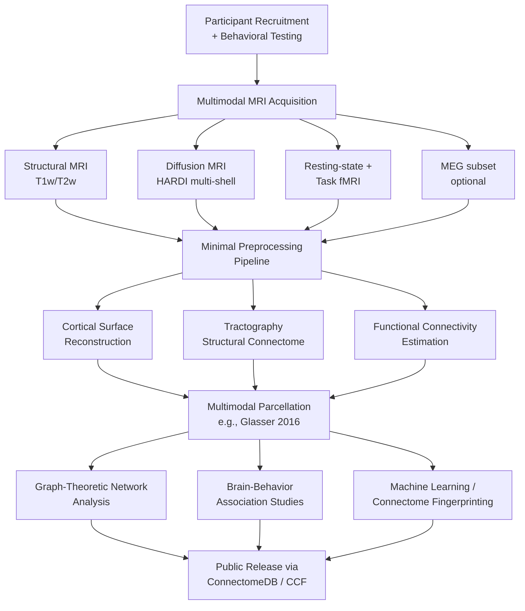

## The Human Connectome Project and Large-Scale Brain Mapping

### Overview

The Human Connectome Project (HCP) is a landmark scientific initiative to comprehensively map the structural and functional connections of the human brain — the "connectome" — and relate this connectivity to behavior, cognition, and disease. Launched in 2009 as one of the first Grand Challenges of the NIH Blueprint for Neuroscience Research, the HCP pioneered acquisition protocols, data-sharing infrastructure, and analysis pipelines that have become a de facto standard across human neuroimaging research, and it has since expanded into a broader family of connectome studies spanning the lifespan and multiple disease populations.

This topic draws on neuroimaging methodology (MRI/fMRI/dMRI physics and acquisition), network neuroscience, computational connectomics, and large-scale data infrastructure/open science practice.

---

### What Is a Connectome?

**Key Points**

- A connectome is a comprehensive map of neural connections in the brain, analogous conceptually to the genome as a comprehensive map of genetic information.
- Connectomes are studied at multiple scales: the **microscale** (synapse-level connectivity, as in electron-microscopy-based connectomics of small model organisms), the **mesoscale** (local circuit and cell-type-specific connectivity), and the **macroscale** (large-scale white-matter tract and functional network connectivity between brain regions, the primary focus of the HCP).
- The HCP focuses specifically on **macroscale, in vivo, non-invasive** mapping in living humans, distinct from microscale connectomics efforts in model organisms (e.g., the complete synaptic-resolution connectome of the fruit fly, *Drosophila*, completed via electron microscopy by a consortium including Princeton researchers) or invasive high-resolution animal connectomics.

---

### Historical Background and Program Structure

**Key Points**

- The original HCP was funded by sixteen components of the NIH as part of the NIH Blueprint for Neuroscience Research, launched in July 2009, structured as a five-year project later extended to approximately ten years.
- In September 2010, the NIH awarded two primary grants: a consortium led by Washington University in St. Louis and the University of Minnesota ("WU-Minn HCP," the flagship Young Adult study), and a separate consortium led by Massachusetts General Hospital and UCLA focused on complementary methods development.
- The original HCP formally concluded in 2021, having worked to map the neural pathways of the human brain and connect its structure to function and behavior, and to acquire and share data about structural and functional connectivity. [Nih](https://neuroscienceblueprint.nih.gov/human-connectome/connectome-programs)
- The project's scope subsequently expanded to include healthy subjects across all ages, including children and older adults, alongside structural and functional connectome data relevant to Alzheimer's disease subtypes, low vision and blindness, epilepsy, adolescent anxiety and depression, frontotemporal degeneration, early psychosis, and brain aging and dementia. [Nih](https://neuroscienceblueprint.nih.gov/human-connectome/connectome-programs)
- A dedicated Connectome Coordination Facility (CCF) now maintains a central data repository for HCP data from the original consortia as well as other contributing research laboratories. [Nih](https://neuroscienceblueprint.nih.gov/human-connectome/connectome-programs)

---

### Core Data Modalities Acquired

#### 1. Structural MRI (T1w/T2w)

**Key Points**

- Provides high-resolution anatomical images used for cortical surface reconstruction, parcellation, and morphometric measurement (cortical thickness, surface area, curvature).

#### 2. Diffusion MRI (dMRI) — Structural Connectivity

**Key Points**

- Measures the directional diffusion of water molecules along white-matter fiber tracts, enabling **tractography** — computational reconstruction of estimated white-matter pathways connecting different brain regions.
- The HCP employed high-angular-resolution diffusion imaging (HARDI) with multiple b-values, substantially improving the ability to resolve crossing-fiber configurations compared to earlier, lower-resolution diffusion tensor imaging (DTI) approaches used in prior-generation studies.

#### 3. Resting-State and Task fMRI — Functional Connectivity

**Key Points**

- Resting-state fMRI (rs-fMRI) measures spontaneous low-frequency fluctuations in the blood-oxygen-level-dependent (BOLD) signal, used to infer functional connectivity — statistical dependencies between the activity of spatially distinct brain regions — without requiring an explicit task.
- Task-based fMRI protocols in the HCP-Young Adult study spanned multiple cognitive domains (working memory, language, motor function, emotion processing, relational reasoning, social cognition, gambling/reward) to characterize task-evoked activation patterns alongside connectivity data.
- The resulting HCP-Task dataset comprises large-scale, multi-subject fMRI recordings collected under standardized cognitive task paradigms, facilitating high-dimensional exploration of dynamic brain connectivity, cognitive state decoding, biometric fingerprinting, and activation signature modeling. [Emergent Mind](https://www.emergentmind.com/topics/human-connectome-project-task-hcptask-dataset)

#### 4. MEG (Magnetoencephalography)

**Key Points**

- A subset of HCP participants underwent MEG recording, providing millisecond-scale temporal resolution to complement the high spatial but low temporal resolution of MRI-based measures, supporting studies of oscillatory dynamics and fast neural connectivity timing.

#### 5. Behavioral and Genetic Data

**Key Points**

- Extensive behavioral/cognitive testing batteries — built around tools and methods developed by the NIH Toolbox for Assessment of Neurological and Behavioral function — were collected alongside imaging data, allowing brain-behavior association analyses. [Wikipedia](https://en.wikipedia.org/wiki/Human_Connectome_Project)
- The HCP-Young Adult sample deliberately included twin and sibling pairs, enabling heritability analyses of brain structural and functional connectivity measures using classical twin-study designs.

---

### Key Methodological Innovations

**Key Points**

- **Multiband/simultaneous multi-slice acquisition**: accelerated fMRI acquisition allowing much faster whole-brain sampling rates (shorter repetition times), improving temporal resolution and statistical power for a given scan duration.
- **High gradient-strength scanners**: the WU-Minn HCP used a custom scanner with substantially higher maximum gradient strength than standard clinical scanners, improving diffusion MRI's ability to resolve fine white-matter fiber geometry.
- **Multimodal cortical surface-based registration and parcellation**: notably the Glasser et al. (2016) multimodal cortical parcellation, which combined structural, functional, and connectivity features to define ~180 distinct cortical areas per hemisphere — a widely adopted reference parcellation in subsequent connectomics research.
- **Minimal preprocessing pipelines**: the HCP developed standardized, publicly released preprocessing pipelines intended to minimize unnecessary spatial blurring and distortion while maximizing comparability of processed data across the large sample and across future studies using the same pipeline.

---

### Data Infrastructure and Open Science Model

**Key Points**

- Processed HCP data is de-identified and contains no personal health information, distributed via the ConnectomeDB platform. [Humanconnectome](https://www.humanconnectome.org/study/hcp-young-adult/document/hcp-young-adult-2025-release)
- The Connectome Coordination Facility currently supports approximately 20 distinct human connectome studies, reflecting the program's expansion well beyond the original single Young Adult cohort. [Humanconnectome](https://www.humanconnectome.org/)
- The HCP-Young Adult dataset underwent a significant 2025 Release, migrating to a new platform ("ConnectomeDB powered by BALSA"), with updated processing including elimination of movement-regressor regression as an fMRI cleaning step, addition of multi-run FIX denoising for 3T task fMRI data, and new Reclean/Temporal ICA processing pipelines for both 3T and 7T data. [Humanconnectome](https://www.humanconnectome.org/study/hcp-young-adult/document/hcp-young-adult-2025-release)
- Because of these substantial processing changes, data from the 2025 Release is not intended to be mixed with the original 2017 "S1200" Release, and processed data are available for 1,071 subjects under the new release structure. [Humanconnectome](https://www.humanconnectome.org/study/hcp-young-adult/document/hcp-young-adult-2025-release)
- [Unverified] Given the pace of ongoing releases (including the January 2026 "AABC Release 2" and October 2025 "AABC Release 1" noted on the HCP's own site), readers seeking the current dataset structure, subject counts, or release status should consult the Connectome Coordination Facility's website directly, as this infrastructure continues to be actively updated.

---

### The HCP Lifespan and Disease Study Families

**Key Points**

- HCP Lifespan Projects acquire and share multimodal imaging data across four age groups: prenatal, 0–5 years, 6–21 years, and 36–100+ years, using scanning protocols similar to but shorter in duration than the original WU-Minn Young Adult HCP protocol. [Humanconnectome](https://www.humanconnectome.org/)
- HCP Disease studies apply HCP-style data collection methods to cohorts at risk for or affected by specific neurological and psychiatric conditions, extending the core HCP methodological approach to clinical populations rather than only healthy controls. [Humanconnectome](https://www.humanconnectome.org/)
- A related but administratively separate initiative, the **Developing Human Connectome Project (dHCP)**, funded by the European Research Council, focuses specifically on fetal and neonatal brain connectivity and makes its data available to the public domain with no protected health information published. [Developingconnectome](https://www.developingconnectome.org/data-release/)

---

### Analytical Framework: Network Neuroscience

#### Graph-Theoretic Representation

**Key Points**

- Connectome data is commonly represented as a graph, with brain regions ("parcels," defined via a chosen parcellation scheme) as **nodes** and structural or functional connections as **edges**, often weighted by connection strength (e.g., number of estimated white-matter streamlines, or functional correlation coefficient).
- Standard graph-theoretic metrics applied to connectome graphs include node degree/strength, clustering coefficient, path length, modularity (community structure), and measures of hub centrality (e.g., betweenness centrality) used to identify highly connected "hub" regions.

#### Structural–Functional Relationship

**Key Points**

- A recurring research question is the degree to which functional connectivity (statistical co-activation) is constrained by or predictable from underlying structural connectivity (anatomical white-matter connections); empirical findings generally show a moderate, imperfect correspondence, with functional connectivity often observed between regions lacking direct structural connections (attributable to indirect, multi-synaptic pathways or additional processes beyond direct anatomical connection).
- [Inference] This structure-function relationship remains an active area of computational modeling research (e.g., biophysical and statistical models attempting to predict functional connectivity from structural connectivity matrices), without a fully resolved, universally accepted quantitative model as of 2026.

#### Individual Differences and "Connectotyping" / Fingerprinting

**Key Points**

- Functional connectome patterns have been shown to reliably identify individual subjects with high accuracy (up to 99.7% in some analyses) and to decode cognitive task states (up to 99.8% accuracy across eight states) using methods including linear discriminant analysis, support vector machines, and neural network classifiers. [Emergent Mind](https://www.emergentmind.com/topics/human-connectome-project-task-hcptask-dataset)
- This "connectome fingerprinting" finding — that an individual's functional connectivity pattern is distinctive and stable enough to serve as an identifying biometric-like signature — has motivated substantial subsequent research into individual-differences neuroscience, moving beyond group-averaged connectivity analysis toward precision/personalized approaches.

---

### Applications and Scientific Impact

**Key Points**

- **Brain-behavior mapping**: large sample sizes and standardized multimodal data have enabled more statistically robust studies of associations between connectivity patterns and cognitive traits, personality measures, and behavioral phenotypes than were feasible with smaller, single-site studies.
- **Clinical/disease connectomics**: HCP-style protocols applied to disease cohorts support identification of connectivity-based biomarkers for conditions including Alzheimer's disease, psychosis, and epilepsy, potentially informing future diagnostic or prognostic tools.
- **Methodological standardization**: HCP preprocessing pipelines, parcellations, and acquisition protocols have been widely adopted across the broader neuroimaging field, functioning as a de facto reference standard that improves cross-study comparability.
- **Foundation for large-scale/AI-based neuroscience**: HCP's large, standardized, multimodal dataset has served as key training and benchmark data for machine learning approaches in neuroimaging, including "brain age" prediction models, cognitive state decoders, and generative/foundation models of brain connectivity.

---

### Limitations and Ongoing Challenges

**Key Points**

- **Sampling representativeness**: as discussed in the related equity-in-research topic, the original HCP-Young Adult cohort, while large, was drawn substantially from the St. Louis and Minneapolis-area populations and does not fully represent global population diversity; the broader HCP Lifespan and Disease study expansions and initiatives like the NIH's All of Us Research Program partially address this limitation at the wider biomedical research infrastructure level.
- **Structural connectivity estimation uncertainty**: diffusion MRI tractography, while substantially improved by HCP-era acquisition protocols, remains an indirect inference technique subject to known limitations (e.g., difficulty resolving crossing fibers with full accuracy, susceptibility to false-positive and false-negative tract reconstructions); tractography-derived structural connectomes should be interpreted as probabilistic reconstructions rather than direct anatomical ground truth.
- **Macroscale-microscale gap**: HCP-style macroscale connectomics cannot resolve synapse-level or cell-type-specific connectivity; bridging insights from microscale connectomics (e.g., invertebrate electron-microscopy connectomes) to macroscale human in vivo findings remains a significant open methodological challenge, given the vastly different scales and invasiveness involved.
- [Inference] Most connectomics researchers regard current macroscale human connectome data as providing a valuable but incomplete picture of brain connectivity — informative for large-scale network organization and individual-differences research, but not yet capable of resolving the cellular/synaptic-level detail achieved in smaller model-organism connectomes.

---

### Illustrative Diagram: HCP Data Acquisition-to-Analysis Pipeline

---

### Diagram: Structural vs. Functional Connectome Representation (svg_diagram)

<svg xmlns="http://www.w3.org/2000/svg" viewBox="0 0 780 380" font-family="Helvetica, Arial, sans-serif">
<text x="390" y="28" text-anchor="middle" font-size="16" font-weight="bold" fill="#1a1a2e">Structural vs. Functional Connectome (svg_diagram)</text>

<text x="195" y="60" text-anchor="middle" font-size="13" font-weight="bold" fill="`#4361ee`">Structural (dMRI/Tractography)</text>

<circle cx="120" cy="150" r="18" fill="`#4361ee`" opacity="0.7" />

<circle cx="270" cy="120" r="18" fill="`#4361ee`" opacity="0.7" />

<circle cx="270" cy="220" r="18" fill="`#4361ee`" opacity="0.7" />

<circle cx="120" cy="260" r="18" fill="`#4361ee`" opacity="0.7" />

<line x1="120" y1="150" x2="270" y2="120" stroke="#333" stroke-width="3" />

<line x1="120" y1="150" x2="270" y2="220" stroke="#333" stroke-width="2" />

<line x1="120" y1="260" x2="270" y2="220" stroke="#333" stroke-width="3" />

<line x1="120" y1="150" x2="120" y2="260" stroke="#333" stroke-width="1.5" />

<text x="195" y="305" text-anchor="middle" font-size="11" fill="#555">Edges = estimated</text>

<text x="195" y="320" text-anchor="middle" font-size="11" fill="#555">white-matter tracts</text>

<line x1="360" y1="190" x2="420" y2="190" stroke="#999" stroke-width="1" stroke-dasharray="4" />

<text x="585" y="60" text-anchor="middle" font-size="13" font-weight="bold" fill="`#f72585`">Functional (rs-fMRI correlation)</text>

<circle cx="510" cy="150" r="18" fill="`#f72585`" opacity="0.7" />

<circle cx="660" cy="120" r="18" fill="`#f72585`" opacity="0.7" />

<circle cx="660" cy="220" r="18" fill="`#f72585`" opacity="0.7" />

<circle cx="510" cy="260" r="18" fill="`#f72585`" opacity="0.7" />

<line x1="510" y1="150" x2="660" y2="120" stroke="`#e63946`" stroke-width="2" stroke-dasharray="3,2" />

<line x1="510" y1="150" x2="660" y2="220" stroke="`#e63946`" stroke-width="2" stroke-dasharray="3,2" />

<line x1="660" y1="120" x2="660" y2="220" stroke="`#e63946`" stroke-width="3" stroke-dasharray="3,2" />

<line x1="510" y1="150" x2="510" y2="260" stroke="`#e63946`" stroke-width="1.5" stroke-dasharray="3,2" />

<line x1="510" y1="260" x2="660" y2="120" stroke="`#e63946`" stroke-width="1" stroke-dasharray="3,2" />

<text x="585" y="305" text-anchor="middle" font-size="11" fill="#555">Edges = statistical</text>

<text x="585" y="320" text-anchor="middle" font-size="11" fill="#555">co-activation, not direct wiring</text>

<text x="390" y="360" text-anchor="middle" font-size="11" fill="#666">Correspondence between the two is moderate and imperfect</text>

</svg>

---

### Related Global Connectomics Efforts (Context)

**Key Points**

- In microscale connectomics, an international team led by Princeton's Mala Murthy and Sebastian Seung mapped every neuron and synaptic connection in an adult fruit fly's brain, representing a major step in electron-microscopy-based connectomics, distinct in scale and method from HCP's macroscale human MRI-based approach. [Princeton University](https://www.princeton.edu/news/2025/04/09/first-time-scientists-map-half-billion-connections-allow-mice-see)
- Related mouse visual-system connectomics work has mapped approximately half a billion synaptic connections underlying visual processing, illustrating the broader landscape of connectomics research spanning multiple species and spatial scales alongside the human-focused HCP effort. [Princeton University](https://www.princeton.edu/news/2025/04/09/first-time-scientists-map-half-billion-connections-allow-mice-see)
- [Inference] These microscale efforts and the HCP's macroscale human connectomics are generally regarded by the field as complementary rather than competing approaches, addressing different levels of the brain's organizational hierarchy.

---

### Conclusion

**Conclusion**

The Human Connectome Project fundamentally shaped how large-scale human neuroimaging research is conducted, establishing acquisition protocols, preprocessing pipelines, and open-data-sharing norms now used well beyond its original scope. While the original flagship project concluded in 2021, its methodological legacy continues through an expanding family of Lifespan and Disease-focused connectome studies now coordinated across roughly 20 distinct studies, and through continued dataset updates such as the 2025 HCP-Young Adult data release with substantially revised processing pipelines. The project's core scientific contribution — demonstrating that individual differences in macroscale brain connectivity are both measurable at scale and behaviorally/cognitively meaningful — has become foundational to network neuroscience and precision-neuroscience approaches, even as significant open challenges remain regarding structural-functional correspondence, sampling representativeness, and bridging macroscale findings to the cellular-resolution detail achieved in parallel microscale connectomics efforts in model organisms. [NIH Blueprint for Neuroscience Research | National Institute of Neurological Disorders and Stroke +2](https://neuroscienceblueprint.nih.gov/human-connectome/connectome-programs)

---

**Related Topics**

- Graph theory and network neuroscience analytical methods
- Diffusion MRI tractography: methods and known limitations
- Multimodal cortical parcellation (Glasser et al., 2016) and its applications
- Precision/individual-differences neuroscience and connectome fingerprinting
- Microscale connectomics: electron-microscopy mapping in model organisms
- The Developing Human Connectome Project (dHCP) and fetal/neonatal brain mapping
- Machine learning applications in neuroimaging (brain age, cognitive state decoding)
- Open science and data-sharing infrastructure in neuroscience (ConnectomeDB, OpenNeuro)
- Equity and access in neuroscience research (related chapter topic)
- Resting-state vs. task-based fMRI methodology