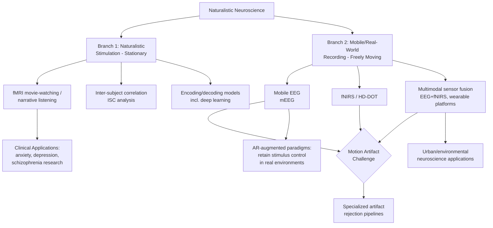

## Naturalistic Neuroscience and Real-World Cognition

### Overview

Naturalistic neuroscience is an approach to studying brain function using dynamic, ecologically valid stimuli and settings — narratives, films, music, conversation, virtual reality, and free movement in real-world environments — rather than the brief, tightly controlled, trial-based paradigms that have historically dominated cognitive neuroscience. The field aims to increase **ecological validity**: the degree to which findings obtained in an experimental setting generalize to real-world cognitive and behavioral function. It spans both *naturalistic stimulation* (using rich, dynamic stimuli within conventional scanners) and *mobile/real-world recording* (measuring brain activity as participants physically move and interact with real environments).

This topic draws on neuroimaging methodology, signal processing, computational modeling (including deep learning encoding models), and experimental design theory.

---

### Motivation: The Ecological Validity Problem

**Key Points**

- Cognitive neuroscience studies in humans have enabled decades of impactful discoveries but have primarily been limited to recording brain activity of immobile participants in a laboratory setting, using simplified, repetitive, experimenter-controlled stimuli.
- Traditional trial-based designs (e.g., brief isolated stimulus presentations, button-press responses) offer strong experimental control and statistical power but may fail to engage — or may engage differently — the broader neural networks involved in perception, attention, emotion, and cognition during real-world experience.
- Naturalistic paradigms use dynamic, multimodal stimuli (spoken narratives, video clips, television advertisements, news articles, video games, virtual reality encounters) that more closely resemble daily experience, and empirically tend to activate broader neural networks and produce more consistent, reliable neural response patterns across the cortex than simplified trial-based stimuli.

---

### Two Major Branches of Naturalistic Neuroscience

#### Branch 1: Naturalistic Stimulation (Stationary, Rich Stimuli)

**Key Points**

- Participants remain stationary (typically in an MRI scanner or seated EEG setup) while viewing/listening to continuous, dynamic, naturalistic stimuli (movies, spoken stories, music) rather than discrete controlled trials.
- Enables study of continuous, temporally extended cognitive processes — narrative comprehension, sustained attention, emotional engagement, predictive processing — that are difficult to probe with brief isolated trials.
- **Inter-subject correlation (ISC)** analysis, pioneered substantially through work by Uri Hasson and colleagues, quantifies the degree to which different individuals' brain activity time-courses correlate while experiencing the same naturalistic stimulus, providing a data-driven method for identifying stimulus-locked, reliably engaged brain regions without requiring a predefined task model.
- Large-scale datasets built on this paradigm include HCP movie-watching protocols; recent work has analyzed high-resolution 7T fMRI data from large cohorts (e.g., 178 individuals in HCP movie-watching data) using multimodal deep learning encoding models to capture the temporal and semantic richness of naturalistic video/audio stimuli.

#### Branch 2: Mobile and Real-World Neuroimaging (Freely Moving Participants)

**Key Points**

- Recent technological advances have enabled recordings of human brain activity during freely moving behaviors in the real world, extending beyond the traditional immobile-participant laboratory paradigm.
- Mobile neuroimaging methods aim to provide insights into neural mechanisms of cognition with increased ecological validity, potentially informing understanding of and treatments for neurological and psychiatric disorders under conditions that better reflect real-world functioning.
- This branch faces distinct technical challenges — motion artifact, portability, power/battery constraints, and synchronization of neural with environmental/behavioral data — not present in stationary naturalistic-stimulation paradigms.

---

### Primary Modalities for Mobile/Real-World Recording

#### 1. Mobile EEG (mEEG)

**Key Points**

- Wireless, wearable EEG systems allow electrophysiological recording during walking, physical activity, and free movement in indoor or outdoor environments.
- A central technical challenge is **motion artifact**: physical movement introduces substantial signal contamination (e.g., from electrode-skin impedance changes, muscle activity, cable movement) requiring specialized artifact-rejection and signal-processing pipelines beyond those used in stationary EEG.
- Many published mobile EEG studies to date have relied on low-density electrode montages or setups vulnerable to motion artifacts, which is noted in the recent methodological literature as limiting robustness of findings obtained in fully naturalistic (as opposed to constrained treadmill-based) conditions.
- **Combination with augmented reality (AR)**: pairing mobile EEG with AR head-mounted displays allows researchers to place virtual controlled stimuli into real-world environments as participants physically navigate them, retaining some experimental stimulus control while participants are immersed in natural settings. This approach has been validated using well-characterized cognitive effects (e.g., replicating the face-inversion effect) across lab-based, real-face walking, and virtual-face walking conditions.

#### 2. Functional Near-Infrared Spectroscopy (fNIRS) and Diffuse Optical Tomography (DOT)

**Key Points**

- fNIRS measures cortical hemodynamic activity (analogous in principle to the BOLD signal in fMRI) using near-infrared light, offering a wearable, motion-tolerant alternative to fMRI with better spatial resolution than standard EEG (though still substantially lower than fMRI) and good temporal resolution for hemodynamic signals (on the order of ~1 second).
- High-density diffuse optical tomography (HD-DOT) extends fNIRS spatial resolution and coverage, positioned in recent literature as a promising direction for naturalistic brain-activity decoding with improved spatiotemporal resolution relative to standard sparse-channel fNIRS.
- fNIRS and DOT are noted as beginning to bridge the gap toward understanding brain activity in dynamic, complex, multisensory real-world environments, an area described in the current literature as still relatively early in its development compared to more mature stationary neuroimaging methods.

#### 3. Multimodal Sensor Fusion (EEG + fNIRS, and Beyond)

**Key Points**

- Combining EEG's high temporal resolution with fNIRS/DOT's improved spatial resolution and motion tolerance is an active methodological direction, aiming for a wearable modality combination offering better spatiotemporal coverage than either technique alone in naturalistic conditions.
- Recent methodological reviews specifically address data-driven, multimodal fNIRS-EEG sensor fusion methods as a promising direction for brain activity decoding in naturalistic scenarios, indicating this is an actively developing area of technical methodology rather than a mature, standardized approach as of the current literature.

#### 4. Multimodal Wearable Platforms (Beyond Neural Signals Alone)

**Key Points**

- Some research platforms integrate neural recording with environmental and physiological sensing — for example, wearable backpack-based systems combining EEG, mobile eye-tracking, and wrist-based physiological monitoring with environmental sensors (microclimate, air pollution, acoustic monitoring) — designed to study interactions between urban/environmental exposures and brain/physiological states in real-world settings.
- This reflects a broader trend toward studying brain function not in isolation but as embedded within, and responsive to, the physical and social environment participants actually inhabit.

#### 5. Simultaneous EEG-fMRI in Naturalistic Paradigms

**Key Points**

- Combining EEG and fMRI (either simultaneously in-scanner or via separate sessions with shared naturalistic stimuli) integrates fMRI's spatial resolution with EEG's temporal resolution, applied to naturalistic stimulus paradigms to study neural mechanisms with both precision advantages.
- A substantial decade-spanning review (covering 2014–2024) synthesizes research using integrated EEG-fMRI naturalistic paradigms to study neural mechanisms of anxiety, depression, and schizophrenia, finding naturalistic paradigms using dynamic, multimodal stimuli capture complex emotional and cognitive processes more effectively than traditional experimental designs for these clinical populations, with disorder-relevant findings including altered amygdala, prefrontal cortex, anterior cingulate cortex, and insula activity patterns alongside changes in dorsal attention, default mode, and frontoparietal network engagement in anxiety specifically.

---

### Analytical Approaches Specific to Naturalistic Data

#### Encoding and Decoding Models

**Key Points**

- **Encoding models** predict brain activity from stimulus features (e.g., using computational models of visual, linguistic, or semantic content extracted from a movie or narrative to predict voxel-wise or channel-wise neural response).
- **Decoding models** perform the inverse: predicting stimulus content or cognitive state from observed neural activity patterns.
- Recent work applies multimodal deep learning approaches (combining video and text/semantic representations) to build more comprehensive encoding models of naturalistic stimuli, aiming to capture the temporal and semantic richness of real-world input more fully than earlier, modality-limited models — with described applications extending toward brain-computer interfaces, clinical neuroimaging, and next-generation cognitive models.
- [Inference] Video-text multimodal alignment approaches are characterized in recent literature as a developing methodological bridge between deep learning and naturalistic neuroscience, rather than an established, standardized analysis pipeline as of the current literature.

#### Generalized Linear Model (GLM) Approaches Adapted for Continuous Stimuli

**Key Points**

- Naturalistic paradigms require adapting standard neuroimaging statistical approaches (traditionally built around discrete, repeated trial structures) to continuous, non-repeating stimulus streams.
- Mobile EEG studies analyzing real-world walking paradigms have employed GLM approaches similar in nature to those used in naturalistic fMRI movie-watching studies and MEG studies of language comprehension, establishing routines to relate dynamically unfolding environmental/stimulus content to dynamic neural signatures recorded during free movement.

---

### Applications and Research Domains

**Key Points**

- **Clinical/psychiatric research**: naturalistic paradigms are increasingly applied to study affective and psychiatric conditions (anxiety, depression, schizophrenia) under conditions argued to better approximate the complex emotional and cognitive demands of real-world experience than traditional simplified tasks.
- **Personalized neuromodulation targeting**: innovations in network neuroscience, including whole-brain connectivity analyses derived partly from naturalistic and resting data, have informed personalized targeting strategies for non-invasive neuromodulation approaches.
- **Neuroplasticity and rehabilitation research**: combining neuromodulation techniques (TMS, tDCS) with pre/post imaging (TMS-EEG, tDCS-fMRI) to strengthen causal inference about naturalistic-relevant neuroplasticity markers, including in traumatic brain injury recovery contexts.
- **Urban and environmental neuroscience**: multimodal wearable platforms combining neural and environmental sensing support research into how urban environmental exposures (pollution, acoustic environment, microclimate) relate to real-time brain and physiological states — addressing a research gap left by conventional lab-based approaches, which offer experimental control but often lack representativeness of real-world environmental exposures.

---

### Key Technical Challenges

**Key Points**

- **Motion and physiological artifact**: a persistent core challenge for all mobile recording modalities, requiring ongoing methodological development in artifact detection, rejection, and correction algorithms specific to naturalistic movement conditions.
- **Stimulus/environment control vs. ecological validity trade-off**: naturalistic and mobile approaches inherently sacrifice some experimental control (relative to fully controlled lab trials) in exchange for improved ecological validity; approaches like AR-based hybrid paradigms attempt to partially reconcile this trade-off by retaining stimulus control within real-world navigation contexts.
- **Statistical modeling of continuous, non-repeated data**: naturalistic stimuli are typically not repeated across many trials in the traditional sense, requiring specialized modeling approaches (ISC, encoding models, GLM adaptations) rather than conventional trial-averaging statistics.
- **Data volume and multimodal synchronization**: combining multiple sensor streams (neural, physiological, environmental, behavioral/movement) at different sampling rates and with potential clock-drift requires careful synchronization infrastructure.
- [Inference] Researchers in this area generally characterize real-world/mobile neuroimaging as a genuinely emerging methodological frontier — meaningfully more technically mature than a decade ago but still substantially less standardized than conventional stationary lab-based neuroimaging, based on the framing in recent editorial and review literature describing these methods as still "in its infancy" for certain modalities (e.g., mobile optical imaging) even as other aspects (e.g., naturalistic fMRI stimulation) are comparatively more established.

---

### Illustrative Diagram: Naturalistic Neuroscience Methodological Landscape

---

### Diagram: Trade-off Between Experimental Control and Ecological Validity (svg_diagram)

<svg xmlns="http://www.w3.org/2000/svg" viewBox="0 0 780 360" font-family="Helvetica, Arial, sans-serif">
<text x="390" y="28" text-anchor="middle" font-size="16" font-weight="bold" fill="#1a1a2e">Control vs. Ecological Validity Across Paradigms (svg_diagram)</text>
<line x1="90" y1="310" x2="710" y2="310" stroke="#333" stroke-width="2" />
<line x1="90" y1="310" x2="90" y2="60" stroke="#333" stroke-width="2" />
<text x="400" y="338" text-anchor="middle" font-size="12" fill="#333">Ecological Validity →</text>
<text x="45" y="185" text-anchor="middle" font-size="12" fill="#333" transform="rotate(-90 45 185)">Experimental Control →</text>
<circle cx="150" cy="110" r="15" fill="#4361ee" />
<text x="150" y="90" text-anchor="middle" font-size="11" fill="#1a1a2e">Trial-based lab</text>
<text x="150" y="103" text-anchor="middle" font-size="11" fill="#1a1a2e">fMRI/EEG task</text>
<circle cx="290" cy="150" r="15" fill="#3a86ff" />
<text x="290" y="130" text-anchor="middle" font-size="11" fill="#1a1a2e">Naturalistic movie-</text>
<text x="290" y="143" text-anchor="middle" font-size="11" fill="#1a1a2e">watching fMRI</text>
<circle cx="430" cy="200" r="15" fill="#2ec4b6" />
<text x="430" y="180" text-anchor="middle" font-size="11" fill="#1a1a2e">AR + mobile EEG</text>
<text x="430" y="193" text-anchor="middle" font-size="11" fill="#1a1a2e">(hybrid control)</text>
<circle cx="580" cy="240" r="15" fill="#ff9f1c" />
<text x="580" y="220" text-anchor="middle" font-size="11" fill="#1a1a2e">Treadmill-based</text>
<text x="580" y="233" text-anchor="middle" font-size="11" fill="#1a1a2e">mobile fNIRS/EEG</text>
<circle cx="660" cy="280" r="15" fill="#e63946" />
<text x="660" y="300" text-anchor="middle" font-size="11" fill="#1a1a2e">Free outdoor</text>
<text x="660" y="313" text-anchor="middle" font-size="11" fill="#1a1a2e">urban wearable sensing</text>

<text x="675" y="330" text-anchor="middle" font-size="10" fill="#666">high</text>

<text x="115" y="330" text-anchor="middle" font-size="10" fill="#666">low</text>

<text x="65" y="75" text-anchor="middle" font-size="10" fill="#666">high</text>

<text x="65" y="295" text-anchor="middle" font-size="10" fill="#666">low</text>

</svg>

---

### Comparison of Naturalistic-Relevant Modalities

| Modality | Motion Tolerance | Spatial Resolution | Temporal Resolution | Real-World Portability |
| --- | --- | --- | --- | --- |
| Naturalistic fMRI (stationary) | Very low | High | Moderate (~seconds) | None (fixed scanner) |
| Mobile EEG | Moderate (artifact-prone) | Low | Very high (ms) | High |
| fNIRS / HD-DOT | Moderate-high | Moderate | Moderate (~1 sec) | High |
| EEG-fNIRS fusion | Moderate-high | Moderate (improved vs. EEG alone) | High | High |
| Multimodal wearable (EEG+eye-tracking+physio+environmental) | High | Low-moderate | Mixed across sensors | Very high |

---

### Conclusion

**Conclusion**

Naturalistic neuroscience represents a methodological shift toward studying the brain under conditions that more closely approximate real-world cognitive and behavioral demands, spanning both richly dynamic stationary stimulation paradigms (movie-watching, narrative listening) and genuinely mobile, real-world recording approaches (mobile EEG, fNIRS, multimodal wearable sensing). The field has produced methodological advances — inter-subject correlation analysis, deep-learning-based encoding models, AR-augmented hybrid paradigms, and multimodal sensor fusion — that partially address the fundamental trade-off between experimental control and ecological validity. However, [Inference] based on how recent reviews and editorials characterize the field, real-world/mobile neuroimaging specifically remains a genuinely emerging area with substantial open technical challenges (particularly motion artifact management and cross-modal synchronization), positioning it as meaningfully less mature and standardized than conventional stationary naturalistic-stimulation paradigms, which have a longer track record of validated methodology.

---

**Related Topics**

- Inter-subject correlation (ISC) analysis methodology
- Deep learning encoding/decoding models for naturalistic stimuli
- Mobile brain/body imaging (MoBI) and motion artifact correction
- Functional near-infrared spectroscopy (fNIRS) technical principles
- Augmented and virtual reality paradigms in cognitive neuroscience
- The Human Connectome Project and large-scale brain mapping (related chapter topic)
- Default mode network and naturalistic task engagement
- EEG-fMRI simultaneous recording methodology
- Ecological validity as a methodological concept in psychological science
- Precision/individual-differences neuroscience approaches