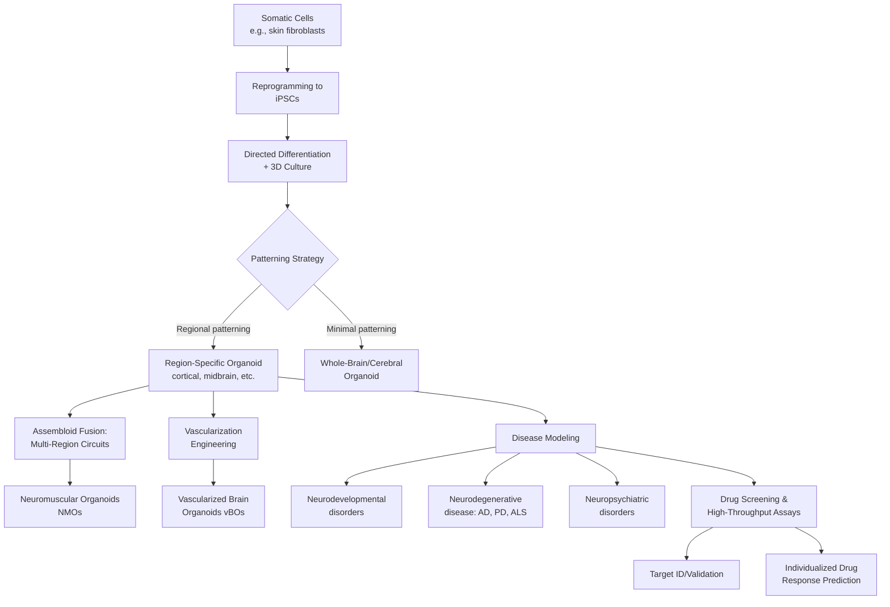

## Brain Organoids and In Vitro Neural Models

### Overview

Brain organoids are three-dimensional, self-organizing cell cultures derived from stem cells (typically human induced pluripotent stem cells, iPSCs) that recapitulate aspects of the cellular diversity, spatial architecture, and functional connectivity of the developing human brain. They represent a major technical advance over traditional two-dimensional (2D) neuronal cell cultures and offer a human-specific alternative or complement to animal models for studying neurodevelopment, neurological and psychiatric disease mechanisms, and drug discovery.

This topic spans stem cell biology, developmental neuroscience, bioengineering/tissue engineering, and translational/pharmacological research methodology.

---

### Foundational Concepts

#### What Distinguishes an Organoid from Traditional Cell Culture

**Key Points**

- Brain organoids are three-dimensional in vitro neural models that closely mimic the cellular diversity, spatial structure, and functional connectivity of the human brain, providing a platform that outperforms traditional 2D cultures and animal models for studying neurodevelopment and neurological disorders in several specific respects (particularly human-specific gene expression and developmental timing).
- Organoids are generated primarily from human iPSCs, which are reprogrammed from adult somatic cells (e.g., skin fibroblasts or blood cells) back to a pluripotent state, then guided through directed differentiation protocols using specific growth factors and small molecules to form neural tissue.
- The use of three-dimensional culture is a key advance that increases controllability and physiological relevance relative to 2D monolayer cultures, allowing cells to self-organize into structures with regional identity and layered architecture more closely resembling in vivo brain tissue.

#### Historical Development

**Key Points**

- The field has undergone roughly three decades of methodological evolution, from simple neurospheres (unstructured 3D cell aggregates) toward functionally mature, region-specific organoids, with major milestones spanning progress in culture optimization and functional maturation, innovations in reprogramming and engineered culture platforms, and advances in morphogenesis and cell-lineage specification enabling region- or subtype-specific organoid generation.
- Early landmark work (notably from the Lancaster/Knoblich lab and subsequently extended by numerous groups including Paşca and colleagues) established foundational protocols for generating cerebral organoids with self-organized neural tissue architecture.
- Long-term culture protocols have since been developed showing that human cortical organoids can achieve maturation trajectories matching key early postnatal developmental transitions when maintained in extended culture.

---

### Types of Neural Organoids and Related In Vitro Models

#### 1. Region-Specific (Regionalized) Brain Organoids

**Key Points**

- Generated using patterning factors that direct differentiation toward specific brain regional identities (e.g., cortical, forebrain, midbrain, hippocampal, cerebellar organoids), in contrast to earlier, less-patterned "whole-brain" cerebral organoid protocols that produce more heterogeneous regional identity within a single organoid.
- Regional specificity allows more targeted modeling of disorders with regionally localized pathology (e.g., midbrain organoids for Parkinson's disease dopaminergic neuron loss).

#### 2. Assembloids (Fused Multi-Region Organoids)

**Key Points**

- Assembloids are created by fusing two or more region-specific organoids (e.g., cortical and subcortical, or cortical and spinal organoid components) to model inter-regional connectivity and circuit-level interactions not captured by single-region organoids alone.
- This approach enables study of processes such as neuronal migration between regions and the formation of functionally integrated, multi-region neural circuits in vitro — engineering protocols for such circuit interrogation have been developed and refined across multiple research groups.
- Recent work has expanded from single-region brain organoids toward heterogeneous multi-regional brain organoids aiming to simulate more complex structural and functional connections resembling the human brain, though the construction of such heterogeneous multi-regional organoids faces ongoing technical challenges in achieving precise regional identity control and ordered 3D assembly.

#### 3. Neuromuscular Organoids (NMOs) and Circuit-Level Systems

**Key Points**

- More complex integrated systems combine cortical/spinal organoids with muscle tissue to model neuromuscular junction (NMJ) formation and function, enabling system-level phenotypic modeling of conditions like amyotrophic lateral sclerosis (ALS), where cortical organoids capture upper motor neuron pathology, spinal organoids reveal local microenvironment dysfunction, and NMOs model neuromuscular junction disruption and distal degeneration.
- Such integrated organoid ecosystems enable phenotypic drug screening at a systems level — for example, functional evidence of therapeutic efficacy has been demonstrated by measuring changes in glutamate-induced muscle contraction force in response to candidate compounds in ALS-relevant organoid models.

#### 4. Vascularized Brain Organoids (vBOs)

**Key Points**

- A major limitation of conventional brain organoids is their lack of vascular structures, which constrains organoid size (due to diffusion limits for oxygen and nutrients without a vascular network) and prevents modeling of blood-brain barrier (BBB) function and neurovascular disease processes.
- Engineering strategies for vascularized brain organoids aim to incorporate functional vascular-like structures, marking a significant step toward creating more physiologically accurate in vitro models of the human brain with applications spanning neuroscience research, drug development, and regenerative medicine, particularly for neurovascular disease modeling.

#### 5. Ex Vivo Human Brain Slice Cultures (Related but Distinct Model)

**Key Points**

- Distinct from stem-cell-derived organoids, organotypic slice cultures use live tissue directly obtained from human brain biopsies (e.g., surgical resection tissue), offering access to mature, patient-derived brain tissue with minimal additional ethical concern beyond the original clinical procedure, expanding prospects for preclinical therapeutic validation.
- Both approaches have complementary strengths: organoids allow extended culture and genetic manipulation from a renewable stem-cell source, while slice cultures provide directly sampled mature human tissue architecture; [Inference] researchers in the field generally advocate for more rigorous direct comparison between organoid models and actual human brain tissue to better characterize the specific respects in which organoid models diverge from in vivo tissue.

---

### Applications in Neuroscience Research

#### 1. Neurodevelopmental Disease Modeling

**Key Points**

- Patient-derived iPSC organoids preserve individual genetic backgrounds, enabling modeling of neurodevelopmental disorders (e.g., autism spectrum conditions) using cells genetically matched to specific patients or patient populations, supporting study of how genetic variation shapes neurodevelopmental trajectories.
- Chimeric organoid approaches (combining cells from different genetic backgrounds within a single organoid) allow researchers to dissect gene-environment and genotype-phenotype interactions in a controlled in vitro system.

#### 2. Neurodegenerative Disease Modeling

**Key Points**

- Brain organoids have been used to model Alzheimer's disease pathology, including amyloid-beta (Aβ) deposition and tau hyperphosphorylation; early landmark work (Choi et al., 2014) used AD-modeling organoids as a drug-screening platform, demonstrating that β-/γ-secretase modulators could simultaneously reduce Aβ deposition and tau pathology.
- More recent proteomic analyses using AD-mimetic organoids have identified unexpected candidate mechanisms — for example, findings that certain hallucinogenic compounds may attenuate Aβ plaque deposition and inhibit tau hyperphosphorylation via 5-HT2A receptor activation, illustrating the platform's utility for novel mechanism and drug-candidate discovery. [Inference] Such findings represent early-stage preclinical discovery-platform results; translation to validated clinical therapeutic candidates requires substantial further validation beyond organoid-level findings.
- Precision organoid models incorporating patient-specific genetic backgrounds are increasingly positioned as tools for individualized drug-response prediction and disease-subtype stratification in neurodegenerative disease research.

#### 3. Drug Discovery and High-Throughput Screening

**Key Points**

- Advances in iPSC technology and 3D culture systems have enabled brain organoids to evolve from primarily disease-modeling tools into functional drug-discovery platforms supporting high-throughput compound screening, target identification and validation, individualized drug-response prediction, and neurotoxicity assessment.
- Emerging translational/commercial platforms now offer organoid-based drug screening as contract research services for pharmaceutical development, reflecting growing industry adoption of organoid technology within standard preclinical drug development pipelines.

#### 4. Comparative and Evolutionary Neuroscience

**Key Points**

- Comparing organoids generated from human versus non-human primate stem cells allows researchers to investigate evolutionary mechanisms underlying human-specific features of brain development, an application not feasible with traditional animal models alone given cross-species developmental and molecular differences.

#### 5. Neuroimmune Interactions

**Key Points**

- Co-culture approaches incorporating microglia (the brain's resident immune cells, not intrinsically generated in most standard organoid protocols) with brain organoids have been developed to investigate neuroimmune interactions relevant to neurodevelopmental and neurodegenerative disease processes.

---

### Technical and Methodological Challenges

**Key Points**

- **Vascularization and size/maturity limits**: without vascular structures, oxygen and nutrient diffusion limits constrain organoid size and can produce a necrotic core in larger organoids, motivating vascularization engineering strategies as a major current research direction.
- **Cellular and regional heterogeneity/reproducibility**: batch-to-batch and organoid-to-organoid variability in cellular composition and regional identity remains a documented methodological challenge affecting experimental reproducibility across labs and protocols.
- **Functional maturity relative to adult tissue**: even with extended culture protocols achieving developmental transitions matching early postnatal stages, organoids generally do not fully replicate the mature functional and structural complexity of the adult human brain.
- **Absence of native brain microenvironment components**: standard organoid protocols typically lack native vasculature, resident immune cells (unless specifically co-cultured), and normal sensory/environmental inputs present in vivo, representing systematic model limitations relevant to interpreting findings.
- [Inference] The field broadly characterizes current brain organoids as valuable but still artificial and incomplete models; researchers in recent reviews explicitly note that brain organoids remain artificial systems that would benefit from more rigorous direct comparison with actual human brain tissue obtained via biopsy, rather than being treated as fully equivalent replacements for either animal models or direct human tissue study.

---

### Illustrative Diagram: Brain Organoid Generation and Application Pipeline

---

### Diagram: Organoid Complexity Spectrum (svg_diagram)

<svg viewBox="0 0 780 340" xmlns="http://www.w3.org/2000/svg" font-family="Helvetica, Arial, sans-serif">
<text x="390" y="28" text-anchor="middle" font-size="16" font-weight="bold" fill="#1a1a2e">Neural In Vitro Model Complexity Spectrum (svg_diagram)</text>
<line x1="70" y1="200" x2="730" y2="200" stroke="#333" stroke-width="2"/>
<circle cx="130" cy="200" r="16" fill="#4361ee"/>
<text x="130" y="235" text-anchor="middle" font-size="11" fill="#1a1a2e">2D Neuronal</text>
<text x="130" y="248" text-anchor="middle" font-size="11" fill="#1a1a2e">Cell Culture</text>
<circle cx="260" cy="200" r="18" fill="#3a86ff"/>
<text x="260" y="235" text-anchor="middle" font-size="11" fill="#1a1a2e">Neurosphere</text>
<circle cx="390" cy="200" r="22" fill="#2ec4b6"/>
<text x="390" y="235" text-anchor="middle" font-size="11" fill="#1a1a2e">Region-Specific</text>
<text x="390" y="248" text-anchor="middle" font-size="11" fill="#1a1a2e">Organoid</text>
<circle cx="530" cy="200" r="26" fill="#ff9f1c"/>
<text x="530" y="240" text-anchor="middle" font-size="11" fill="#1a1a2e">Assembloid</text>
<text x="530" y="253" text-anchor="middle" font-size="11" fill="#1a1a2e">(Multi-Region)</text>
<circle cx="660" cy="200" r="30" fill="#e63946"/>
<text x="660" y="200" text-anchor="middle" font-size="10" fill="#fff" font-weight="bold">vBO +</text>
<text x="660" y="212" text-anchor="middle" font-size="10" fill="#fff" font-weight="bold">NMO</text>
<text x="660" y="248" text-anchor="middle" font-size="11" fill="#1a1a2e">Integrated Systems</text>

<text x="130" y="150" text-anchor="middle" font-size="10" fill="#666">Lowest</text>

<text x="660" y="150" text-anchor="middle" font-size="10" fill="#666">Highest</text>

<text x="390" y="285" text-anchor="middle" font-size="11" fill="#555">Increasing structural & functional complexity →</text>

</svg>

---

### Ethical Considerations (Cross-Reference)

**Key Points**

- As brain organoids increase in complexity, maturity, and (in some experimental contexts) integration with electrophysiological activity resembling neural network function, questions have arisen in the bioethics literature regarding the moral status of highly developed organoids — though [Inference] current brain organoids are generally regarded by the field as lacking the integrated structural complexity, sensory input, and developmental context associated with sentience or consciousness in intact organisms, this remains a topic of ongoing ethical discussion as organoid complexity continues to increase.
- This ethical dimension connects organoid research to broader neuroethics discussions of moral status and research oversight, distinct from but related to the human-subjects research ethics frameworks governing other neuroscience research methods discussed elsewhere in this chapter's companion chapter on neuroethics.

---

### Conclusion

**Conclusion**

Brain organoids and related in vitro neural models have transformed translational neuroscience by providing human-specific, genetically tractable, three-dimensional systems for studying brain development, disease mechanisms, and drug response — capabilities not fully achievable with either traditional 2D cell culture or animal models alone. The field has progressed substantially from simple neurospheres toward increasingly sophisticated region-specific organoids, multi-region assembloids, vascularized models, and integrated neuromuscular systems, with expanding applications in neurodevelopmental, neurodegenerative, and neuropsychiatric disease research and in pharmaceutical drug-discovery pipelines. Nonetheless, [Inference] current literature consistently frames brain organoids as valuable but still incomplete and artificial models relative to actual human brain tissue, with vascularization, functional maturity, cellular/regional reproducibility, and the absence of native brain microenvironment components remaining active areas of methodological development rather than fully resolved technical challenges.

---

**Related Topics**

- Induced pluripotent stem cell (iPSC) reprogramming methodology
- Assembloid engineering and multi-region neural circuit modeling
- Blood-brain barrier modeling and neurovascular disease research
- Alzheimer's disease and amyloid/tau pathology mechanisms
- Comparative and evolutionary developmental neuroscience
- High-throughput drug screening platforms in translational neuroscience
- Moral status and ethical considerations of advanced in vitro neural systems
- Neuroimmune interactions and microglia co-culture systems
- Ex vivo human brain slice culture methodology
- The Human Connectome Project and large-scale brain mapping (related chapter topic)