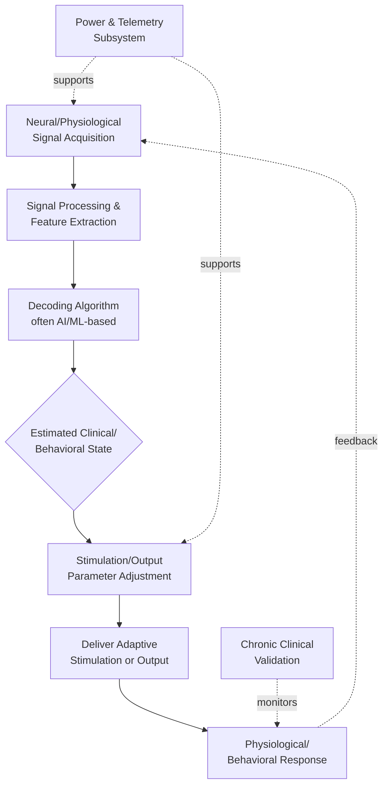

## Closed-Loop Neurotechnology

### Overview

Closed-loop neurotechnology refers to neural interface systems that continuously sense neural or physiological signals, process/decode that information in real time, and deliver adaptive stimulation or feedback based on the decoded state — forming a bidirectional sensing-stimulation loop, in contrast to conventional **open-loop** systems that deliver fixed, pre-programmed stimulation regardless of the patient's ongoing physiological or clinical state. This closed-loop architecture underlies a range of technologies including adaptive deep brain stimulation (aDBS), bidirectional brain-computer interfaces (BCIs), closed-loop neuroprosthetics, and neurofeedback systems.

This topic spans neuroengineering, signal processing, control theory, clinical neurology/psychiatry, and biomedical device regulation.

---

### Core Architecture: Shared Components Across Closed-Loop Systems

**Key Points**

- Despite targeting different clinical problems, DBS systems, BCIs, and speech neuroprostheses share a common closed-loop architecture consisting of five shared functional stages: **sensing**, **decoding**, **stimulation or output**, **power and telemetry**, and **chronic clinical validation** — and the field's overall translational pace is understood to be set by bottlenecks at these shared stages rather than by challenges unique to each specific technology.
- The closed-loop cycle can be described as a continuous process: neural signal acquisition → representation/decoding → targeted modulation → signal updating → adaptive re-decoding → parameter adjustment, forming an ongoing real-time feedback loop rather than a single sense-then-stimulate event.

#### Stage 1: Sensing

**Key Points**

- Signal sources vary by application and invasiveness: subcortical local field potentials (LFPs, commonly used in adaptive DBS, particularly from the subthalamic nucleus or globus pallidus internus in Parkinson's disease), cortical recordings via electrocorticography (ECoG), scalp EEG, and peripheral/wearable physiological sensors.
- Potential input signals for adaptive DBS specifically include basal ganglia local field potentials, cortical ECoG recordings, wearable sensors, and eHealth/mHealth device data, reflecting a trend toward multimodal sensing rather than reliance on a single signal source.

#### Stage 2: Decoding

**Key Points**

- Decoding algorithms translate raw neural signals into an estimate of the relevant clinical or behavioral state (e.g., symptom severity, intended movement, seizure onset, mood state).
- Increasing integration of artificial intelligence and machine learning methods is a defining trend in current closed-loop BCI development, used to improve the effectiveness of neurological assessments and interventions and to enable continuous, adaptive monitoring rather than static, pre-programmed responses.
- Enabling technical advances specifically highlighted in recent implantable neurotechnology reviews include flexible electrode materials, AI-assisted decoding algorithms, and neuromorphic edge processing (performing decoding computation locally on low-power specialized hardware rather than requiring external computation).

#### Stage 3: Stimulation/Output

**Key Points**

- Output modalities include electrical stimulation (the traditional DBS/BCI approach), and an expanding set of non-electrical modalities — diversification beyond electrical stimuli, including integration of acoustic and optical stimulation approaches, represents an active area of methodological development in current BCI/neurofeedback research.
- For motor and communication BCIs, "output" may instead be an external effector (robotic limb, computer cursor, synthesized speech) rather than neural stimulation per se — speech neuroprostheses specifically decode attempted speech into text, voice, and facial animation output.

#### Stage 4: Power and Telemetry

**Key Points**

- Chronic implantable closed-loop systems require power-efficient onboard processing (given battery longevity constraints, especially relevant for implanted devices requiring surgical replacement) and reliable wireless telemetry for data transfer and device programming/monitoring.
- Battery longevity and the balance between stimulation efficacy and power consumption are recurring practical constraints noted in the adaptive DBS literature as motivating closed-loop approaches over continuous open-loop stimulation in the first place.

#### Stage 5: Chronic Clinical Validation

**Key Points**

- Unlike single-session proof-of-concept studies, clinically deployable closed-loop systems require validation over extended real-world use, addressing signal stability over time, algorithm robustness to changing physiological conditions, and sustained clinical benefit — identified as one of the recurring bottlenecks common across DBS, BCI, and speech neuroprosthesis translation.

---

### Adaptive Deep Brain Stimulation (aDBS)

#### Rationale: Open-Loop vs. Closed-Loop DBS

**Key Points**

- Conventional open-loop DBS delivers continuous, fixed-parameter stimulation to a subcortical target (e.g., subthalamic nucleus or globus pallidus internus in Parkinson's disease) regardless of the patient's real-time clinical state, with no sensing or feedback loop.
- Closed-loop or adaptive DBS aims to overcome key limitations of open-loop stimulation — specifically the delicate balance between therapeutic benefit and adverse stimulation-related side effects, and limited battery longevity — through real-time adjustment of stimulation parameters based on continuous feedback signals representative of the patient's clinical state.

#### Clinical Trial Evidence

**Key Points**

- The **ADAPT-PD** trial (Adaptive DBS Algorithm for Personalized Therapy in Parkinson's Disease) is a notable multi-site clinical trial specifically evaluating adaptive DBS algorithms; reported early data indicate chronic adaptive DBS provided similar "on" time (time with good symptom control) compared to continuous conventional DBS, with a trend toward improvement, and a high proportion (98%) of participants who chose to remain on adaptive DBS after trial participation.
- [Inference] This participant retention finding is suggestive of patient-perceived benefit or at least non-inferiority relative to conventional DBS, though formal efficacy conclusions should be drawn from the trial's full peer-reviewed primary outcome publications rather than this summary characterization alone.
- Regulatory milestones relevant to this space include FDA safety and effectiveness documentation for implantable multi-programmable DBS systems, reflecting the ongoing regulatory pathway through which adaptive DBS capability is being incorporated into approved commercial devices.

#### Widening Clinical Indications

**Key Points**

- While Parkinson's disease remains the most established indication, closed-loop DBS is being investigated across a widening range of neurological and psychiatric indications, reflecting the generalizability of the closed-loop control approach beyond its original movement-disorder application.

---

### Closed-Loop Brain-Computer Interfaces (BCIs)

**Key Points**

- BCIs restoring motor and sensory function represent one of the three major current fronts in implantable neurotechnology (alongside adaptive DBS and speech neuroprostheses), with recent milestones including regulatory clearance of at least one cortical interface device and an expanding set of implanted-BCI clinical trials, reflecting accelerating translational progress in the field.
- **Speech neuroprostheses** — a closed-loop BCI application decoding attempted speech directly into text, synthesized voice, or facial animation — represent a rapidly advancing application area, particularly relevant for patients with severe motor/speech impairment (e.g., due to ALS, brainstem stroke, or locked-in syndrome).
- **Bidirectional BCIs** extend beyond pure motor decoding to include sensory feedback delivery (e.g., stimulation providing tactile sensory feedback to a prosthetic limb user), completing a genuine closed sensorimotor loop rather than a purely efferent (brain-to-device) or purely afferent (device-to-brain) pathway.

---

### Closed-Loop Brain-Body Interfaces (Integration with Peripheral Nerve Stimulation)

**Key Points**

- An emerging architecture integrates BCIs with peripheral nerve stimulation (PNS), using real-time neural feedback (e.g., EEG or autonomic physiological metrics) to dynamically adjust PNS parameters, enabling more precise, circuit-specific neuromodulation tailored to individual pathophysiology than fixed-parameter PNS alone.
- This PNS-BCI integration is motivated by the recognized difficulty of achieving precise multi-circuit, multi-target neural intervention through simpler single-target approaches, and is positioned in recent literature as promising unprecedented personalization for treating neuropsychiatric disorders specifically, though [Inference] this remains an emerging research direction rather than an established standard-of-care approach as of the current literature.

---

### Clinical Translation Landscape

**Key Points**

- Analysis of registered clinical trials in China's ChiCTR registry found closed-loop neuromodulation accounted for 23 of 134 registered relevant trials (17.2%), with the first registered study in 2020, followed by rapid expansion in trial registration after 2024 — indicating substantial recent acceleration in clinical translation activity for this specific technology category in this dataset.
- Leading indications in this trial landscape included stroke (16 studies), spinal cord injury (3 studies), and psychiatric/behavioral disorders (2 studies), suggesting stroke rehabilitation is currently a particularly active application area for closed-loop neuromodulation trials, at least within this specific national trial registry dataset. [Unverified] This distribution reflects one specific national registry (China) as of the data collection period referenced in the source; global distribution across indications and countries may differ and should be assessed against broader international trial registry data (e.g., ClinicalTrials.gov) for a comprehensive picture.

---

### Technical and Translational Bottlenecks

**Key Points**

- Across DBS, BCI, and speech neuroprosthesis technologies, recurring shared bottlenecks have been identified: **long-term signal/device stability** (maintaining reliable recording and stimulation performance over months to years of chronic implantation), **neural coding** (fundamental scientific challenges in robustly decoding the relevant neural signals across varying conditions and over time), and **equitable access** (ensuring these technologies, which currently require specialized surgical implantation and ongoing clinical support, do not remain accessible only to a narrow, resource-advantaged patient population).
- Unresolved engineering controversies specifically noted in recent implantable neurotechnology literature include debates over optimal electrode architecture (e.g., trade-offs between electrode density/coverage and long-term tissue biocompatibility/signal stability) and broader system design choices, indicating these are active areas of engineering disagreement rather than settled technical consensus.
- Data processing limitations, signal noise, and privacy concerns are identified as recurring practical challenges specifically hindering widespread implementation of AI/ML-enhanced closed-loop BCI systems for healthcare applications.

---

### Governance and Ethical Considerations

**Key Points**

- Recent reviews explicitly conclude that continued engineering progress in closed-loop neurotechnology needs to be accompanied by appropriate governance frameworks, reflecting an emerging consensus among researchers in this space that technical advancement and ethical/regulatory infrastructure development should proceed in parallel rather than sequentially.
- [Inference] This governance emphasis connects directly to broader neuroethics concerns addressed elsewhere in this course (mental privacy, mental integrity, and psychological continuity), since closed-loop systems capable of both reading and directly modulating neural activity raise these concerns in a particularly concrete, clinically deployed form compared to purely diagnostic or purely stimulation-only (open-loop) neurotechnologies.

---

### Illustrative Diagram: Closed-Loop Architecture

---

### Diagram: Open-Loop vs. Closed-Loop Stimulation Comparison (svg_diagram)

<svg xmlns="http://www.w3.org/2000/svg" viewBox="0 0 780 360" font-family="Helvetica, Arial, sans-serif">
<text x="390" y="28" text-anchor="middle" font-size="16" font-weight="bold" fill="#1a1a2e">Open-Loop vs. Closed-Loop Neuromodulation (svg_diagram)</text>

<text x="190" y="60" text-anchor="middle" font-size="13" font-weight="bold" fill="`#4361ee`">Open-Loop DBS</text>

<rect x="90" y="90" width="200" height="50" rx="8" fill="`#4361ee`" opacity="0.15" stroke="`#4361ee`" stroke-width="2" />

<text x="190" y="120" text-anchor="middle" font-size="12" fill="`#1a1a2e`">Pulse Generator</text>

<path d="M290 115 L340 115" stroke="#333" stroke-width="2" marker-end="url(#arrow2)" />

<rect x="340" y="90" width="160" height="50" rx="8" fill="#999" opacity="0.15" stroke="#666" stroke-width="2" />

<text x="420" y="115" text-anchor="middle" font-size="11" fill="`#1a1a2e`">Fixed Target</text>

<text x="420" y="128" text-anchor="middle" font-size="11" fill="`#1a1a2e`">(STN/GPi)</text>

<text x="290" y="170" text-anchor="middle" font-size="11" fill="#999">No sensing, no feedback</text>

<text x="190" y="220" text-anchor="middle" font-size="13" font-weight="bold" fill="`#e63946`">Closed-Loop (Adaptive) DBS</text>

<rect x="90" y="250" width="150" height="50" rx="8" fill="`#e63946`" opacity="0.15" stroke="`#e63946`" stroke-width="2" />

<text x="165" y="280" text-anchor="middle" font-size="11" fill="`#1a1a2e`">Sensing (LFP/ECoG)</text>

<path d="M240 275 L290 275" stroke="#333" stroke-width="2" marker-end="url(#arrow2)" />

<rect x="290" y="250" width="150" height="50" rx="8" fill="`#ff9f1c`" opacity="0.15" stroke="`#ff9f1c`" stroke-width="2" />

<text x="365" y="280" text-anchor="middle" font-size="11" fill="`#1a1a2e`">AI/ML Decoder</text>

<path d="M440 275 L490 275" stroke="#333" stroke-width="2" marker-end="url(#arrow2)" />

<rect x="490" y="250" width="150" height="50" rx="8" fill="`#2ec4b6`" opacity="0.15" stroke="`#2ec4b6`" stroke-width="2" />

<text x="565" y="280" text-anchor="middle" font-size="11" fill="`#1a1a2e`">Adaptive Stimulation</text>

<path d="M565 300 C565 340, 165 340, 165 300" stroke="#e63946" stroke-width="2" fill="none" marker-end="url(#arrow2)" stroke-dasharray="4" />
<text x="365" y="355" text-anchor="middle" font-size="11" fill="#e63946">continuous real-time feedback loop</text>
</svg>

---

### Comparison: Closed-Loop Neurotechnology Categories

| Technology | Primary Sensing Signal | Primary Output | Leading Clinical Indication(s) |
| --- | --- | --- | --- |
| Adaptive DBS (aDBS) | Subcortical LFPs, ECoG, wearables | Electrical stimulation (subcortical target) | Parkinson's disease; expanding to other neurological/psychiatric conditions |
| Motor/Sensory BCI | Cortical electrodes (ECoG/intracortical) | Robotic effector, sensory feedback stimulation | Paralysis, limb loss (sensorimotor restoration) |
| Speech Neuroprosthesis | Cortical electrodes | Decoded text, synthesized voice, facial animation | ALS, brainstem stroke, locked-in syndrome |
| Closed-Loop Brain-Body Interface | EEG + autonomic/physiological metrics | Peripheral nerve stimulation | Neuropsychiatric disorders (emerging) |
| Neurofeedback Systems | EEG, fNIRS | Sensory feedback to guide self-regulation | Various (research/clinical, variable evidence maturity) |

---

### Conclusion

**Conclusion**

Closed-loop neurotechnology represents a convergence point across deep brain stimulation, brain-computer interfaces, and neuroprosthetic devices, unified by a shared sensing-decoding-stimulation-power-validation architecture rather than fundamentally distinct engineering approaches for each clinical application. The field has moved substantially from proof-of-concept demonstrations toward early clinical deployment, evidenced by regulatory device clearances, expanding trial registries, and encouraging early adaptive DBS trial data showing comparable or improved outcomes relative to conventional open-loop stimulation. Nonetheless, [Inference] the recurring bottlenecks identified across this literature — long-term signal stability, robust neural decoding, and equitable access — are characterized as shared, unresolved challenges rather than problems solved by current engineering advances alone, suggesting that continued progress will depend as much on addressing these structural translational bottlenecks and developing appropriate governance frameworks as on further device-level innovation.

---

**Related Topics**

- Adaptive deep brain stimulation clinical trial methodology (e.g., ADAPT-PD)
- Brain-computer interface decoding algorithms and machine learning approaches
- Speech neuroprosthesis development and evaluation
- Electrode materials and long-term neural interface biocompatibility
- Neurofeedback: mechanisms and evidence base
- Ethics of neuroimaging and mental privacy (related chapter topic)
- Dual-use concerns in neurotechnology (related chapter topic)
- Peripheral nerve stimulation and autonomic neuromodulation
- Regulatory pathways for implantable neurotechnology devices
- Naturalistic neuroscience and real-world cognition (related chapter topic)