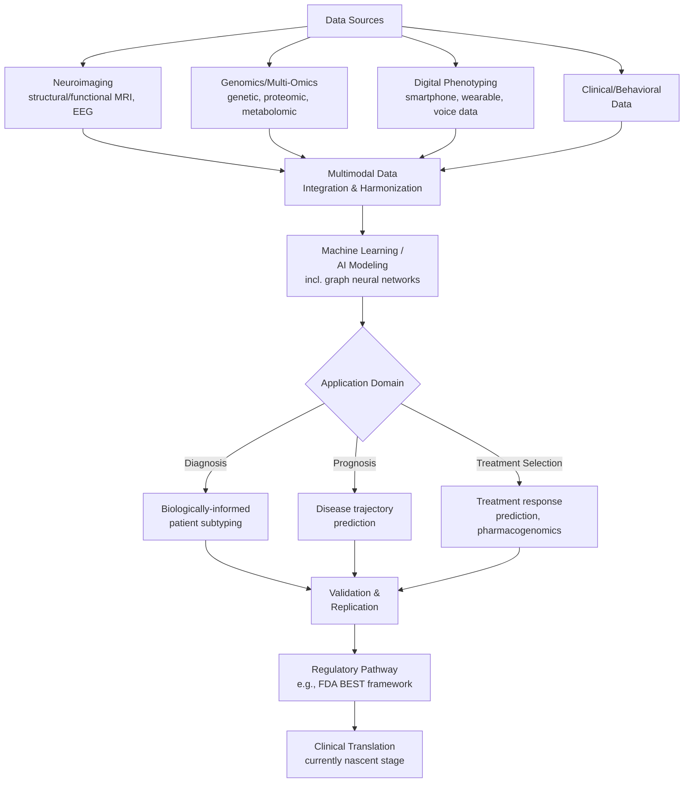

## Precision Psychiatry and Biomarker Discovery

### Overview

Precision psychiatry is an emerging approach that aims to move psychiatric diagnosis and treatment beyond traditional symptom-based diagnostic categories toward biologically and clinically homogeneous patient subgroups, using integrative biomarkers to improve diagnostic accuracy, prognosis, and treatment selection. It combines neuroimaging, genomics and multi-omics, digital phenotyping, and machine learning to identify objective, measurable indicators — biomarkers — that can stratify patients, predict treatment response, and eventually inform a more biologically grounded psychiatric nosology than the current symptom-based diagnostic systems.

This topic draws on computational psychiatry, neuroimaging methodology, genomics/pharmacogenomics, machine learning, and clinical psychiatric research methodology.

---

### The Core Problem Precision Psychiatry Addresses

**Key Points**

- Current psychiatric diagnostic criteria (e.g., DSM/ICD categories) rest predominantly on symptom-based classification rather than underlying biological etiology, which has historically led to a lack of objective biomarkers for diagnosis, differential diagnosis, and treatment selection for major psychiatric disorders including schizophrenia, bipolar disorder, and major depressive disorder.
- This symptom-based framework creates a well-documented clinical bottleneck: patients with the same diagnostic label may have substantially different underlying neurobiology, and patients with different diagnostic labels may share overlapping biological mechanisms (a "transdiagnostic" phenomenon), contributing to the frequently slow, trial-and-error nature of psychiatric treatment selection, including for conventional antidepressants, which are often slow-acting and ineffective for many patients.
- Psychiatric nosology has evolved historically from purely categorical toward more dimensional classification approaches, with neuroimaging increasingly sought as an intermediate phenotype — a biologically measurable intermediate step between genetic/molecular causes and clinical symptom presentation — to help address the diagnostic dilemma created by purely symptom-based classification.

---

### Core Components of the Precision Psychiatry Framework

#### 1. Biomarker Discovery

**Key Points**

- Biomarkers in this context include **fluid biomarkers** (blood-based, cerebrospinal fluid, or other biological sample markers — genetic, proteomic, metabolomic) and **functional biomarkers** (derived from neuroimaging, EEG, and related functional measures).
- AI-driven approaches are used to identify genetic, neuroimaging, or molecular markers associated with specific psychiatric disorders or symptom dimensions, supporting personalized diagnostic and treatment approaches.
- Identifying, validating, and clinically applying both fluid and functional biomarkers are described as critical sequential steps in developing, testing, and deploying new precision psychiatry diagnostics and treatments — validation being a distinct and often rate-limiting step beyond initial discovery.

#### 2. Multimodal Data Integration

**Key Points**

- A multimodal biomarker strategy integrating genetic, neuroimaging, molecular markers, and clinical parameters is proposed as a way to improve diagnostic accuracy, patient stratification, and therapeutic strategy selection, illustrated prominently in depression treatment research.
- Integrating omics, neuroimaging, EEG, and digital health data using machine learning is intended to enable accurate patient stratification, dynamic disease tracking over time, and prediction of individualized treatment response.
- Standardizing and harmonizing data across large clinical datasets is identified as essential for identifying reliable biomarkers for major depressive disorder and other serious mental illnesses, reflecting the field's dependence on large, well-curated, cross-site-comparable datasets.

#### 3. Digital Phenotyping

**Key Points**

- Digital phenotyping refers to the collection and real-time analysis of behavioral data captured via smartphones, wearable devices, and other digital sources (e.g., voice patterns, social media activity, smartphone usage patterns) to track ongoing mental health states.
- This approach can be used to predict relapse or the onset of psychiatric disorders based on continuously collected, naturalistic behavioral data, complementing episodic clinical assessment with more continuous monitoring.

#### 4. Machine Learning and AI-Driven Modeling

**Key Points**

- Machine learning approaches — including deep learning and neural network algorithms — are applied across neuroimaging, multi-omics, and digital phenotyping data streams to predict specific quantitative or categorical clinical phenotypes (diagnosis, prognosis, treatment response) from complex, high-dimensional input data.
- **Graph neural networks (GNNs)** applied to resting-state fMRI-derived functional connectivity data represent a specific and actively developing methodological approach for psychiatric biomarker discovery, leveraging the graph-structured nature of brain connectivity data (nodes = brain regions, edges = functional connections) as a natural fit for graph-based machine learning architectures.
- Multimodal imaging biomarkers incorporating both structural and functional MRI data have demonstrated high accuracy in identifying treatment-resistant schizophrenia specifically and in predicting broader disease trajectories in schizophrenia research.

---

### Illustrative Application: Schizophrenia Biomarker Research

**Key Points**

- Functional imaging studies in schizophrenia have shown reduced activation in the anterior insula and anterior cingulate cortex during socio-cognitive tasks, suggesting disturbed integration of emotional and cognitive processes — findings consistent with behavioral observations of impaired social functioning in this population.
- Individualized, multimodal MRI-derived biomarkers — combining structural morphology and functional topological characteristics via individualized brain parcellation analysis combined with machine learning — have been used to predict one-year clinical outcomes in first-episode, non-medicated schizophrenia patients, highlighting the potential of individual-specific (as opposed to group-averaged) network parcellation approaches for treatment-response prediction.
- Meta-analytic work on early-onset schizophrenia has identified significant structural or functional abnormalities in specific regions including the temporal gyri, prefrontal cortex, and striatum, potentially informing region-specific biomarker candidates for this population, though this research area continues to face the need for larger and more diverse patient samples to strengthen generalizability.

---

### Illustrative Application: Bipolar Disorder and Trauma-Related Disorders

**Key Points**

- Precision psychiatry approaches have contributed to predictive models of treatment response — for example, modeling effectiveness prediction of lithium treatment in bipolar disorder — and risk-stratification models relevant to schizophrenia outcomes, illustrating applications spanning both treatment-selection and prognosis domains.
- AI and machine learning approaches applied across diverse populations (including disaster survivors, military veterans, and refugees) have been proposed to advance biomarker discovery for trauma-related disorders such as acute stress disorder and PTSD, where core diagnostic features include persistent negative thoughts or feelings, avoidance, re-experiencing of traumatic events, and trauma-related reactivity/arousal.

---

### Illustrative Application: Pharmacogenomics-Integrated Precision Psychiatry

**Key Points**

- Precision psychiatry combined with pharmacogenomics aims to identify the accurate medication, at the accurate dose, at the accurate time for individual patients with psychiatric disorders — extending precision-medicine principles specifically to psychiatric pharmacotherapy selection and dosing.
- AI and machine learning techniques are applied to discover biomarkers and genetic loci associated with both psychiatric diseases and treatment response, employing combined neuroimaging and multi-omics data streams to build predictive models for treatment selection.

---

### Governance, Standardization, and Field-Wide Coordination Efforts

**Key Points**

- The **2025 Precision Psychiatry Roadmap** initiative (a meeting held in Frankfurt bringing together experts across the field) specifically addressed the current status of biomarker identification and validation, patient subtyping methodology, and targeted interventions for stratified patient groups, with resulting recommendations emphasizing standardization and collaboration across the field.
- The FDA's **Biomarkers, EndpointS, and other Tools (BEST)** guidance provides a regulatory framework for incorporating biomarkers into drug development processes generally, applicable to psychiatric biomarker-driven drug development specifically, though the field continues to face challenges related to validation rigor, standardization across studies/sites, and associated ethical considerations.
- [Inference] The explicit characterization of precision psychiatry as being in its "nascent stages" in recent (2025-2026) review literature indicates that, despite substantial research activity and methodological advancement, the field has not yet achieved routine clinical translation of validated biomarkers into standard psychiatric diagnostic or treatment-selection practice as of the current literature; significant adaptation will be required across clinical, industry, regulatory, and patient-facing dimensions before this becomes standard practice.

---

### Technical and Methodological Challenges

**Key Points**

- **Validation and replication**: many candidate biomarkers identified in initial discovery studies (often single-site, moderate sample size) require independent replication and rigorous validation before clinical utility can be established; this validation step is explicitly identified in the roadmap literature as a critical and currently incompletely addressed component of the biomarker development pipeline.
- **Data harmonization across sites**: combining large clinical neuroimaging and multi-omics datasets across different acquisition sites, scanners, and protocols introduces technical variability (site effects) that must be statistically addressed (harmonization methods) to avoid confounding true biological signal with site-specific technical artifact.
- **Transdiagnostic vs. disorder-specific biomarkers**: an ongoing methodological and conceptual question is whether useful biomarkers will primarily cut across traditional diagnostic categories (transdiagnostic dimensional biomarkers reflecting shared underlying mechanisms) or remain disorder-specific; current research pursues both approaches, without a resolved consensus on which framework will ultimately prove more clinically useful.
- **Sample size and generalizability**: as with neuroimaging research more broadly (see related equity-in-research topic), psychiatric neuroimaging biomarker studies have historically faced sample size and population-diversity limitations that can constrain the generalizability and robustness of identified biomarkers.
- [Inference] Methodological reviews in this area (e.g., systematic reviews of graph neural network approaches to resting-state fMRI biomarker discovery) frame current machine-learning-derived psychiatric biomarkers as promising but not yet robustly established for individual-level clinical prediction, reflecting ongoing concerns about model generalizability across independent datasets and populations.

---

### Illustrative Diagram: Precision Psychiatry Data-to-Clinical-Application Pipeline

---

### Diagram: Precision Psychiatry Data Integration Model (svg_diagram)

<svg xmlns="http://www.w3.org/2000/svg" viewBox="0 0 760 400" font-family="Helvetica, Arial, sans-serif">
<text x="380" y="28" text-anchor="middle" font-size="16" font-weight="bold" fill="#1a1a2e">Multimodal Biomarker Integration (svg_diagram)</text>
<circle cx="380" cy="220" r="75" fill="#1a1a2e" opacity="0.08" stroke="#1a1a2e" stroke-width="2" />
<text x="380" y="215" text-anchor="middle" font-size="13" font-weight="bold" fill="#1a1a2e">Patient</text>
<text x="380" y="232" text-anchor="middle" font-size="13" font-weight="bold" fill="#1a1a2e">Subtype</text>
<circle cx="220" cy="120" r="60" fill="#4361ee" opacity="0.15" stroke="#4361ee" stroke-width="2" />
<text x="220" y="115" text-anchor="middle" font-size="12" font-weight="bold" fill="#1a1a2e">Neuroimaging</text>
<text x="220" y="130" text-anchor="middle" font-size="12" font-weight="bold" fill="#1a1a2e">MRI/EEG</text>
<circle cx="560" cy="120" r="60" fill="#f72585" opacity="0.15" stroke="#f72585" stroke-width="2" />
<text x="560" y="115" text-anchor="middle" font-size="12" font-weight="bold" fill="#1a1a2e">Genomics/</text>
<text x="560" y="130" text-anchor="middle" font-size="12" font-weight="bold" fill="#1a1a2e">Multi-Omics</text>
<circle cx="220" cy="320" r="60" fill="#ff9f1c" opacity="0.15" stroke="#ff9f1c" stroke-width="2" />
<text x="220" y="315" text-anchor="middle" font-size="12" font-weight="bold" fill="#1a1a2e">Digital</text>
<text x="220" y="330" text-anchor="middle" font-size="12" font-weight="bold" fill="#1a1a2e">Phenotyping</text>
<circle cx="560" cy="320" r="60" fill="#2ec4b6" opacity="0.15" stroke="#2ec4b6" stroke-width="2" />
<text x="560" y="315" text-anchor="middle" font-size="12" font-weight="bold" fill="#1a1a2e">Clinical/</text>
<text x="560" y="330" text-anchor="middle" font-size="12" font-weight="bold" fill="#1a1a2e">Behavioral Data</text>

<text x="380" y="390" text-anchor="middle" font-size="11" fill="#555">Integrated via machine learning for stratified diagnosis and treatment selection</text>

</svg>

---

### Conclusion

**Conclusion**

Precision psychiatry represents an ambitious effort to address the fundamental limitation of symptom-based psychiatric diagnosis by identifying biologically grounded, machine-learning-derived biomarkers spanning neuroimaging, genomics, digital phenotyping, and clinical data. Applications spanning schizophrenia treatment-resistance prediction, bipolar disorder lithium-response modeling, and trauma-related disorder biomarker discovery illustrate the field's breadth, while coordinated initiatives such as the 2025 Precision Psychiatry Roadmap and regulatory frameworks like the FDA's BEST guidance reflect growing efforts toward standardization and clinical translation pathways. However, [Inference] the field is consistently characterized in current review literature as being in a nascent stage — biomarker validation, cross-site data harmonization, and questions about transdiagnostic versus disorder-specific biomarker frameworks remain substantially unresolved, meaning that while methodological progress (particularly in AI/ML approaches to multimodal data integration) has been rapid, routine clinical deployment of validated precision psychiatry biomarkers for standard diagnostic or treatment-selection use remains an ongoing goal rather than current standard practice.

---

**Related Topics**

- Graph neural networks and resting-state fMRI biomarker discovery methodology
- Transdiagnostic approaches to psychiatric classification (RDoC framework)
- Pharmacogenomics and individualized psychiatric medication selection
- Digital phenotyping and wearable/smartphone-based mental health monitoring
- Equity and access in neuroscience research (related chapter topic)
- FDA Biomarkers, EndpointS, and other Tools (BEST) regulatory framework
- Treatment-resistant schizophrenia: neuroimaging predictors
- Data harmonization methods for multi-site neuroimaging studies
- Lithium response prediction in bipolar disorder
- Closed-loop neurotechnology (related chapter topic)