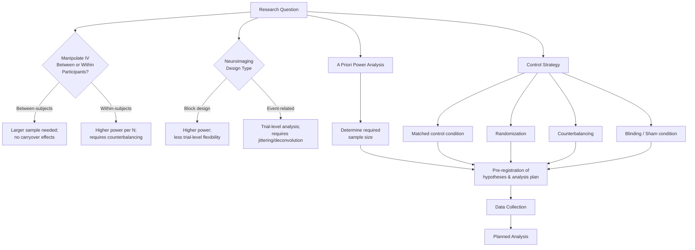

## Experimental Design Principles

### Overview

Experimental design principles constitute the methodological foundation for producing valid, reliable, and interpretable findings in cognitive neuroscience research. Good experimental design determines whether observed effects can be attributed to the variable of interest rather than confounds, artifacts, or chance, and whether findings will replicate and generalize. This topic covers the logic of causal inference, control strategies, statistical power, and design choices specific to neuroimaging and behavioral neuroscience research.

This topic draws on research methodology, statistics, experimental psychology, and neuroimaging-specific design considerations.

---

### Foundational Logic: Why Experimental Design Matters

**Key Points**

- The core goal of experimental design is enabling valid causal inference: establishing that manipulation of an independent variable produced the observed change in a dependent variable, rather than the change being attributable to confounding factors, measurement artifact, or chance variation.
- **Internal validity** refers to the degree to which a study's design supports confident causal conclusions about the specific relationship being tested within that study.
- **External validity** (related to ecological validity, discussed in the naturalistic neuroscience topic) refers to the degree to which findings generalize beyond the specific experimental context — participants, stimuli, setting — used in the study.
- [Inference] These two validity types often exist in tension: design features that maximize internal validity (tight experimental control, artificial/simplified stimuli) can reduce external validity, and vice versa; researchers must make deliberate trade-offs based on their specific research question rather than assuming one type of validity can be maximized without cost to the other.

---

### Core Design Elements

#### 1. Independent and Dependent Variables

**Key Points**

- The **independent variable (IV)** is the factor manipulated or systematically varied by the researcher (e.g., stimulus type, task difficulty, drug dose, stimulation condition).
- The **dependent variable (DV)** is the outcome measure (e.g., reaction time, accuracy, BOLD signal change, EEG amplitude) hypothesized to be influenced by the independent variable.
- Clear, operationalized definitions of both IV and DV — specifying exactly how each will be manipulated or measured — are a prerequisite for interpretable results and for enabling replication by other researchers.

#### 2. Control Conditions and Comparison Baselines

**Key Points**

- A control condition provides a baseline against which the experimental condition's effect can be measured, isolating the specific contribution of the manipulated variable.
- In neuroimaging specifically, control conditions must be carefully matched to the experimental condition on all dimensions except the variable of theoretical interest (e.g., matching visual complexity, motor demands, and task difficulty between an experimental and control condition) — a principle sometimes referred to as the **subtraction logic** underlying much of cognitive subtraction-based fMRI analysis.
- [Inference] Poorly matched control conditions represent one of the most common sources of confounded interpretation in cognitive neuroimaging, since a difference between conditions could reflect the variable of interest or any unmatched incidental difference between the stimuli/tasks.

#### 3. Randomization

**Key Points**

- Random assignment of participants to conditions (in between-subjects designs) or random ordering of trials/conditions (in within-subjects designs) helps ensure that confounding variables are distributed evenly across conditions on average, supporting causal inference.
- Randomization specifically addresses both known and *unknown* confounds, which is a key advantage over deliberate matching strategies that can only address confounds the researcher has anticipated and measured.

#### 4. Counterbalancing

**Key Points**

- Counterbalancing systematically varies the order of conditions/trials across participants (or across blocks within a participant) to prevent order effects (practice effects, fatigue, habituation) from being confounded with the experimental manipulation.
- Common counterbalancing schemes include full counterbalancing (all possible orderings, feasible only with small numbers of conditions), Latin square designs (a systematic subset of orderings ensuring each condition appears equally often in each position), and ABBA designs (alternating condition order within short blocks).

---

### Major Experimental Design Structures

#### Between-Subjects Designs

**Key Points**

- Different participants are assigned to different levels of the independent variable (e.g., one group receives a drug, another receives placebo).
- **Advantages**: no carryover effects between conditions, no risk of participants guessing the study's purpose across conditions.
- **Disadvantages**: requires larger sample sizes to achieve equivalent statistical power (since between-subject variability adds noise not present in within-subject comparisons), vulnerable to group-assignment confounds if randomization fails or is compromised.

#### Within-Subjects (Repeated-Measures) Designs

**Key Points**

- The same participants are tested under all levels of the independent variable, with each participant serving as their own control.
- **Advantages**: substantially higher statistical power for a given sample size (removes between-subject variability as a source of noise in the comparison), requires fewer participants.
- **Disadvantages**: vulnerable to carryover effects (practice, fatigue, sensitization) and demand characteristics (participants may infer the study's hypothesis from experiencing multiple conditions); requires careful counterbalancing to mitigate order effects.
- Within-subjects designs are particularly common in cognitive neuroimaging given the practical value of maximizing statistical power within typically expensive and time-limited scanning sessions.

#### Mixed (Factorial) Designs

**Key Points**

- Combine between-subjects and within-subjects factors within a single study (e.g., comparing patient vs. healthy control groups — between-subjects — across multiple task conditions — within-subjects).
- **Factorial designs** manipulate two or more independent variables simultaneously, allowing not only assessment of each variable's main effect but also **interaction effects** — whether the effect of one variable depends on the level of another variable, which is often of substantial theoretical interest in cognitive neuroscience (e.g., whether a task manipulation's effect differs between patient and control groups).

---

### Neuroimaging-Specific Design Considerations

#### Block Design vs. Event-Related Design (fMRI)

**Key Points**

- **Block designs** present multiple trials of the same condition consecutively in extended blocks (e.g., 20-30 seconds), maximizing statistical power for detecting condition-related BOLD signal differences but sacrificing the ability to analyze individual trial-level responses or randomize/jitter trial types.
- **Event-related designs** present individual trials with variable, often randomized inter-trial intervals, allowing estimation of the hemodynamic response to individual events and more flexible randomization of trial types (reducing predictability and demand characteristics), at some cost to statistical power relative to block designs for a given scan duration.
- **Mixed/hybrid designs** combine block and event-related elements (e.g., sustained-activity blocks with embedded event-related trial analysis) to capture both sustained and transient neural response components.
- Design choice interacts with the hemodynamic response function's (HRF) sluggish temporal dynamics (peaking several seconds after neural events and lasting many seconds); event-related designs typically require jittering (variable inter-stimulus intervals) or deconvolution analysis approaches to disentangle overlapping hemodynamic responses from closely spaced trials.

#### Task-Based vs. Resting-State Paradigms

**Key Points**

- Task-based designs measure brain activity during a specific, experimenter-defined cognitive task, supporting inference about task-related neural processes but constrained by the specific task chosen.
- Resting-state paradigms measure spontaneous brain activity in the absence of an explicit task, used to study intrinsic functional connectivity; design considerations include instructions given to participants (eyes open vs. closed, fixation point vs. no fixation) and controlling for uncontrolled mentation (mind-wandering) that can vary systematically across participants and groups.

#### Stimulus Presentation and Timing Precision

**Key Points**

- Precise stimulus timing and synchronization with data acquisition (particularly important in EEG/MEG, where millisecond-level timing precision is often required for event-related potential analysis) requires careful hardware/software timing calibration distinct from typical behavioral experiment timing tolerances.

---

### Statistical Power and Sample Size Planning

**Key Points**

- **Statistical power** is the probability of correctly detecting a true effect of a given size, given the study's sample size, effect size, and significance threshold; conventionally, researchers often target 80% power, though this is a convention rather than a fixed requirement.
- **A priori power analysis** — calculating required sample size before data collection based on an expected or minimally interesting effect size — is considered current best practice, in contrast to post-hoc power calculations (calculating power using the observed effect size after data collection), which are now widely regarded in the methodological literature as statistically invalid and uninformative for interpreting a completed study's results.
- Neuroimaging studies have historically faced particular power challenges due to high per-participant data collection costs (fMRI scanner time is expensive) combined with the substantial multiple-comparisons burden across many analyzed brain voxels/regions, motivating both larger consortium-based studies (e.g., the Human Connectome Project, discussed in a related topic) and methodological approaches for improving power without proportionally increasing sample size (e.g., within-subjects designs, individual-specific functional localization).
- [Inference] The broader "replication crisis" discourse across psychological and neuroscience research (prominent particularly in the 2010s and continuing to inform current methodological standards) has substantially increased field-wide emphasis on adequately powered studies and pre-registration, though [Unverified] the degree to which underpowered study designs remain common in current cognitive neuroscience practice would require examination of current meta-scientific/methodological survey literature to characterize precisely.

---

### Controlling for Confounds and Bias

#### Blinding

**Key Points**

- **Single-blinding** (participants unaware of their condition assignment) and **double-blinding** (both participants and researchers/experimenters unaware of condition assignment during data collection and initial analysis) reduce the risk of expectation-driven bias affecting results, particularly important in pharmacological and intervention studies (e.g., drug trials, placebo-controlled neurostimulation studies).
- Double-blinding is often more difficult to fully achieve in neurostimulation studies (e.g., tDCS, TMS) than in pharmacological studies, since active stimulation can sometimes produce perceptible sensations (tingling, muscle twitches) that partially unblind participants or experimenters despite sham-condition design efforts.

#### Sham/Placebo Controls

**Key Points**

- Sham conditions in neurostimulation research (e.g., sham tDCS delivering brief initial current then ramping down, mimicking the sensory onset of active stimulation without sustained therapeutic dosing) aim to control for non-specific effects of the experimental procedure itself (expectation, attention, novelty) rather than the specific neural mechanism under investigation.
- [Inference] The adequacy of specific sham protocols (e.g., whether a given sham tDCS protocol truly produces indistinguishable subjective experience from active stimulation) is an active area of methodological scrutiny within the neurostimulation literature, given documented cases of incomplete blinding success.

#### Pre-registration and Registered Reports

**Key Points**

- Pre-registration involves publicly documenting a study's hypotheses, design, and planned analysis approach before data collection (or before data analysis, in some frameworks), intended to reduce the risk of undisclosed flexibility in analytical choices (sometimes termed "p-hacking" or "researcher degrees of freedom") inflating false-positive findings.
- **Registered Reports** extend this further: the study protocol undergoes peer review and in-principle acceptance by a journal *before* data collection, with publication guaranteed regardless of the study's results provided the pre-registered methodology is followed — intended to address publication bias favoring positive/novel findings over null results.

---

### Illustrative Diagram: Experimental Design Decision Framework

---

### Diagram: Block vs. Event-Related fMRI Design (svg_diagram)

<svg xmlns="http://www.w3.org/2000/svg" viewBox="0 0 780 320" font-family="Helvetica, Arial, sans-serif">
<text x="390" y="28" text-anchor="middle" font-size="16" font-weight="bold" fill="#1a1a2e">Block vs. Event-Related Design (svg_diagram)</text>

<text x="140" y="60" text-anchor="middle" font-size="13" font-weight="bold" fill="`#4361ee`">Block Design</text>

<rect x="60" y="80" width="80" height="40" fill="`#4361ee`" opacity="0.6" />

<text x="100" y="105" text-anchor="middle" font-size="10" fill="#fff">Cond A</text>

<rect x="140" y="80" width="80" height="40" fill="`#f72585`" opacity="0.6" />

<text x="180" y="105" text-anchor="middle" font-size="10" fill="#fff">Cond B</text>

<rect x="220" y="80" width="80" height="40" fill="`#4361ee`" opacity="0.6" />

<text x="260" y="105" text-anchor="middle" font-size="10" fill="#fff">Cond A</text>

<rect x="300" y="80" width="80" height="40" fill="`#f72585`" opacity="0.6" />

<text x="340" y="105" text-anchor="middle" font-size="10" fill="#fff">Cond B</text>

<text x="190" y="145" text-anchor="middle" font-size="10" fill="#555">Extended blocks per condition (~20-30s)</text>

<text x="590" y="60" text-anchor="middle" font-size="13" font-weight="bold" fill="`#2ec4b6`">Event-Related Design</text>

<rect x="450" y="80" width="20" height="40" fill="`#4361ee`" opacity="0.6" />

<rect x="490" y="80" width="20" height="40" fill="`#f72585`" opacity="0.6" />

<rect x="545" y="80" width="20" height="40" fill="`#f72585`" opacity="0.6" />

<rect x="600" y="80" width="20" height="40" fill="`#4361ee`" opacity="0.6" />

<rect x="630" y="80" width="20" height="40" fill="`#4361ee`" opacity="0.6" />

<rect x="690" y="80" width="20" height="40" fill="`#f72585`" opacity="0.6" />

<text x="570" y="145" text-anchor="middle" font-size="10" fill="#555">Brief, jittered trials, randomized order</text>

<line x1="60" y1="200" x2="740" y2="200" stroke="#333" stroke-width="1" />
<text x="190" y="230" text-anchor="middle" font-size="11" fill="#1a1a2e" font-weight="bold">Higher statistical power</text>
<text x="190" y="248" text-anchor="middle" font-size="11" fill="#1a1a2e" font-weight="bold">Lower trial-level flexibility</text>

<text x="570" y="230" text-anchor="middle" font-size="11" fill="`#1a1a2e`" font-weight="bold">Trial-level HRF estimation</text>

<text x="570" y="248" text-anchor="middle" font-size="11" fill="`#1a1a2e`" font-weight="bold">Reduced predictability/demand effects</text>

<text x="390" y="290" text-anchor="middle" font-size="11" fill="#666">Mixed/hybrid designs combine both approaches</text>

</svg>

---

### Common Threats to Valid Experimental Design

| Threat | Description | Typical Mitigation |
| --- | --- | --- |
| Confounding variables | Unmatched differences between conditions beyond the IV | Careful condition matching, randomization |
| Order/carryover effects | Practice, fatigue, or sensitization across repeated conditions | Counterbalancing, randomization |
| Demand characteristics | Participants inferring hypothesis and altering behavior | Blinding, deception (with ethical review), between-subjects design |
| Regression to the mean | Extreme baseline scores naturally moving toward average on retest | Appropriate control group, avoiding selection on extreme scores alone |
| Publication/analytical bias | Selective reporting of significant/novel findings | Pre-registration, Registered Reports |
| Insufficient statistical power | Sample too small to reliably detect true effect | A priori power analysis |
| Multiple comparisons inflation | Elevated false-positive rate from testing many voxels/variables | Correction methods (FWE, FDR), pre-specified regions of interest |

---

### Conclusion

**Conclusion**

Sound experimental design remains the foundation upon which valid cognitive neuroscience findings are built, requiring deliberate decisions about control conditions, randomization, counterbalancing, and design structure (between- vs. within-subjects, block vs. event-related), each carrying specific trade-offs between statistical power, internal validity, and practical feasibility. Neuroimaging research introduces additional domain-specific design considerations — hemodynamic response timing, task versus resting-state paradigms, and substantial multiple-comparisons burden — that compound general experimental design principles with method-specific technical constraints. Methodological reforms including a priori power analysis, pre-registration, and Registered Reports reflect the field's ongoing response to documented historical weaknesses in research design and reporting practices, and [Inference] represent current best-practice standards that reviewers, funders, and journals increasingly expect researchers to follow, even as the degree of field-wide adoption of these practices continues to vary across specific subfields and institutions.

---

**Related Topics**

- Statistical power analysis and sample size determination methodology
- Multiple comparisons correction in neuroimaging (FWE, FDR, cluster-based methods)
- Pre-registration and Registered Reports in psychological/neuroscience research
- Hemodynamic response function and its implications for fMRI design
- The replication crisis in psychological and neuroscience research
- Naturalistic neuroscience and real-world cognition (related chapter topic)
- Sham/placebo control design in neurostimulation research
- Factorial designs and interaction effect interpretation
- Individual differences and precision neuroscience approaches
- Research ethics and informed consent in experimental design