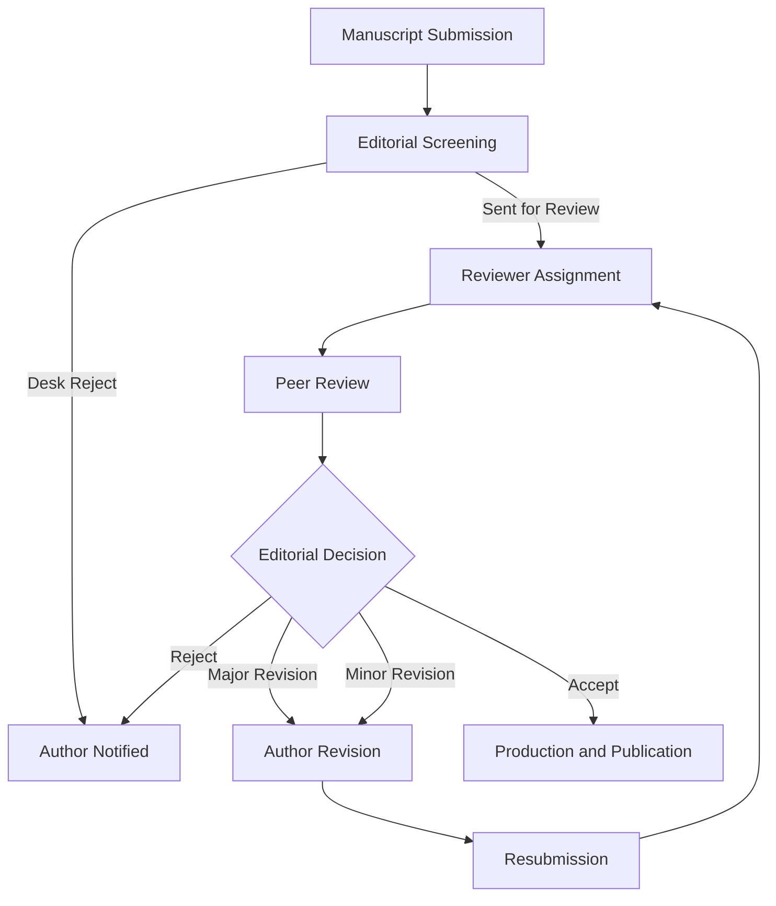

## Scientific writing and publication

### Overview

Scientific writing in cognitive neuroscience is the process of converting empirical findings, theoretical arguments, and methodological procedures into a standardized textual format that permits evaluation, replication, and integration into the cumulative literature. Publication is the formal mechanism by which this writing enters the scholarly record through peer review, editorial decision-making, and indexing. Together, these skills determine whether research has scientific impact, since unpublished or poorly communicated findings cannot be verified, cited, or built upon by the field.

### The IMRaD Structure

Most empirical cognitive neuroscience papers follow the IMRaD format (Introduction, Methods, Results, and Discussion), which mirrors the logical structure of the scientific method rather than the chronological order in which the research was conducted.

#### Introduction

- **Key Points**
  - Funnel structure: moves from broad theoretical context to the specific gap in knowledge
  - Establishes the theoretical framework (e.g., predictive coding, dual-process theories, global workspace theory)
  - Ends with explicit hypotheses or research questions, often with predicted directions of effects
  - Justifies the chosen method (e.g., why fMRI rather than EEG was appropriate for the question)
- **Example**

  A working memory fMRI study introduction might progress: general statement about working memory capacity limits → review of prefrontal cortex involvement → unresolved debate about dorsolateral versus ventrolateral contributions → the specific gap ("no study has isolated X") → the current study's hypothesis ("we predicted greater DLPFC activation during the manipulation condition").

#### Methods

- **Key Points**
  - Must provide sufficient detail for independent replication — this is the section most scrutinized during open-science evaluation
  - Standard subsections: Participants, Materials/Stimuli, Procedure, Apparatus (e.g., scanner specifications), Data Acquisition Parameters, Preprocessing Pipeline, Statistical Analysis Plan
  - Participant reporting should include sample size justification (power analysis), inclusion/exclusion criteria, demographic characteristics, and ethical approval statement
  - For neuroimaging: acquisition parameters (field strength, TR, TE, voxel size), preprocessing software and version (e.g., fMRIPrep, SPM12), and first- and second-level statistical model specifications
  - Preregistration status should be disclosed, with a link to the registered protocol (e.g., OSF, AsPredicted)
- **[Unverified]** Editorial expectations for methods granularity vary substantially by journal and subfield; some venues (e.g., those following the Transparency and Openness Promotion guidelines) enforce stricter reporting checklists than others.

#### Results

- **Key Points**
  - Reports findings without interpretation; interpretation is reserved for the Discussion
  - Organized around the hypotheses stated in the Introduction, typically in the same order
  - Statistics reported with full information: test statistic, degrees of freedom, exact p-value (or p < .001 threshold), effect size, and confidence interval
  - Figures and tables should be self-contained, interpretable without reference to the main text
  - Neuroimaging results conventionally reported with coordinates (MNI or Talairach space), cluster-level or voxel-level correction method, and statistical threshold
- **Example**

  "A repeated-measures ANOVA revealed a significant main effect of load, $F(2, 58) = 14.32$, $p < .001$, $\eta_p^2 = 0.33$, 95% CI $[0.18, 0.45]$."

#### Discussion

- **Key Points**
  - Opens with a restatement of the main findings in relation to the hypotheses
  - Situates findings within the broader theoretical literature, addressing convergence or divergence with prior work
  - Addresses alternative explanations and potential confounds
  - Explicitly states limitations (sample characteristics, methodological constraints, generalizability)
  - Closes with theoretical and/or practical implications and suggested directions for future research

### Statistical and Methodological Reporting Standards

Cognitive neuroscience reporting is governed by discipline-specific guidelines that supplement general scientific writing norms.

- APA Style (7th edition) governs manuscript formatting, in-text citation, and statistical notation for most psychology and cognitive science journals
- COBIDAS (Committee on Best Practice in Data Analysis and Sharing) reporting guidelines, issued by the Organization for Human Brain Mapping, specify minimum reporting standards for MRI studies, covering experimental design, acquisition, preprocessing, statistics, and data sharing
- ARRIVE guidelines apply when animal models are used
- CONSORT guidelines apply for clinical trial designs, including neuromodulation intervention studies (e.g., TMS, tDCS trials)
- Effect sizes (Cohen's $d$, $\eta_p^2$, $r$) are now generally expected alongside p-values, reflecting a broader shift away from sole reliance on null-hypothesis significance testing

$$d = \frac{M_1 - M_2}{SD_{pooled}}$$

### Open Science Practices in Publication

Open science reforms have substantially reshaped scientific writing conventions in the field over the past decade.

- **Preregistration**: specifying hypotheses, sample size, and analysis plan before data collection, distinguishing confirmatory from exploratory analyses in the write-up
- **Registered Reports**: a publication format where the Introduction and Methods are peer-reviewed and provisionally accepted before data collection begins, reducing publication bias toward positive results
- **Data and code sharing**: repositories such as OpenNeuro (for neuroimaging data in BIDS format), OSF, and GitHub are commonly linked in a Data Availability Statement
- **Preprints**: manuscripts posted to servers such as bioRxiv or PsyArXiv prior to or during peer review, accelerating dissemination

**[Inference]** The increasing adoption of these practices is generally attributed to the replication crisis discussions beginning around 2011–2015, though the pace and extent of adoption differ across specific journals and subfields.

### The Peer Review Process

- **Key Points**
  - Editorial screening filters manuscripts for scope, novelty, and basic quality before external review
  - Typically 2–4 reviewers with relevant subfield expertise evaluate the manuscript
  - Review criteria include theoretical contribution, methodological soundness, statistical validity, and clarity of writing
  - A point-by-point response letter addressing each reviewer comment is required during revision
  - Some journals (e.g., eLife's reformed model) have moved toward publishing reviews alongside accepted articles, increasing transparency

### Authorship and Ethical Considerations

- Authorship order conventions vary by subfield but commonly follow a contribution-based ordering, with the first author typically having led data collection and drafting, and the last author typically the supervising principal investigator
- The ICMJE (International Committee of Medical Journal Editors) criteria are widely referenced: substantial contribution to conception/design or analysis/interpretation, drafting or critical revision, final approval, and accountability for accuracy
- Conflicts of interest, funding sources, and ethical approval (IRB/ethics committee) must be disclosed
- Plagiarism, data fabrication, duplicate publication, and undisclosed image manipulation constitute research misconduct with formal retraction procedures

### Writing for Different Venues

| Venue Type | Length | Characteristics |
| --- | --- | --- |
| Empirical journal article | ~4,000–8,000 words | Full IMRaD structure, primary data |
| Review article | ~6,000–12,000 words | Synthesizes existing literature, often no new data |
| Letter/brief report | ~1,500–3,000 words | Condensed format for time-sensitive or focused findings |
| Conference abstract | ~250–500 words | Highly compressed summary for presentation submission |
| Preprint | Variable | Full manuscript, not yet peer-reviewed |

### Figure and Data Visualization Conventions

- Figures should follow the principle of minimal ink-to-information ratio, avoiding unnecessary decorative elements (chartjunk)
- Brain activation maps typically use standardized color scales (e.g., "hot" colormap for positive activation) overlaid on a template brain (e.g., MNI152)
- Error bars must be explicitly labeled as representing standard error, standard deviation, or confidence intervals, since these convey different statistical meanings
- Individual data points are increasingly expected alongside summary statistics (e.g., in strip plots or violin plots) to convey distributional information rather than relying solely on bar graphs

### Common Writing Pitfalls

- **Key Points**
  - Overinterpreting correlational neuroimaging data in causal language (e.g., "the amygdala controls fear" versus "amygdala activation was associated with fear ratings")
  - Reverse inference: inferring a specific cognitive process solely from activation in a brain region, without accounting for the region's broader functional profile
  - HARKing (Hypothesizing After Results are Known): presenting post-hoc findings as though they were predicted a priori
  - p-hacking: performing multiple undisclosed analyses until a significant result emerges
  - Excessive hedging or, conversely, overclaiming generalizability beyond the studied population and paradigm

### Submission and Revision Workflow (svg_diagram)

<svg viewBox="0 0 780 260" xmlns="http://www.w3.org/2000/svg" font-family="Helvetica, Arial, sans-serif">
<text x="390" y="22" font-size="15" font-weight="bold" text-anchor="middle" fill="#1a1a1a">Manuscript Lifecycle (svg_diagram)</text>
<rect x="20" y="60" width="120" height="55" rx="6" fill="#e8f0fe" stroke="#3b5bdb" stroke-width="1.5"/>
<text x="80" y="83" font-size="11" text-anchor="middle" fill="#1a1a1a">Draft</text>
<text x="80" y="98" font-size="11" text-anchor="middle" fill="#1a1a1a">Manuscript</text>
<rect x="170" y="60" width="120" height="55" rx="6" fill="#e8f0fe" stroke="#3b5bdb" stroke-width="1.5"/>
<text x="230" y="83" font-size="11" text-anchor="middle" fill="#1a1a1a">Internal</text>
<text x="230" y="98" font-size="11" text-anchor="middle" fill="#1a1a1a">Co-author Review</text>
<rect x="320" y="60" width="120" height="55" rx="6" fill="#e8f0fe" stroke="#3b5bdb" stroke-width="1.5"/>
<text x="380" y="83" font-size="11" text-anchor="middle" fill="#1a1a1a">Journal</text>
<text x="380" y="98" font-size="11" text-anchor="middle" fill="#1a1a1a">Submission</text>
<rect x="470" y="60" width="120" height="55" rx="6" fill="#fff3bf" stroke="#e8a33d" stroke-width="1.5"/>
<text x="530" y="83" font-size="11" text-anchor="middle" fill="#1a1a1a">Peer</text>
<text x="530" y="98" font-size="11" text-anchor="middle" fill="#1a1a1a">Review</text>
<rect x="620" y="60" width="140" height="55" rx="6" fill="#d3f9d8" stroke="#2f9e44" stroke-width="1.5"/>
<text x="690" y="83" font-size="11" text-anchor="middle" fill="#1a1a1a">Accept /</text>
<text x="690" y="98" font-size="11" text-anchor="middle" fill="#1a1a1a">Publication</text>
<rect x="320" y="170" width="120" height="55" rx="6" fill="#ffe3e3" stroke="#e03131" stroke-width="1.5"/>
<text x="380" y="193" font-size="11" text-anchor="middle" fill="#1a1a1a">Major/Minor</text>
<text x="380" y="208" font-size="11" text-anchor="middle" fill="#1a1a1a">Revision</text>
<line x1="140" y1="87" x2="170" y2="87" stroke="#495057" stroke-width="1.5" marker-end="url(#arrow)"/>
<line x1="290" y1="87" x2="320" y2="87" stroke="#495057" stroke-width="1.5" marker-end="url(#arrow)"/>
<line x1="440" y1="87" x2="470" y2="87" stroke="#495057" stroke-width="1.5" marker-end="url(#arrow)"/>
<line x1="590" y1="87" x2="620" y2="87" stroke="#495057" stroke-width="1.5" marker-end="url(#arrow)"/>
<line x1="530" y1="115" x2="430" y2="170" stroke="#495057" stroke-width="1.5" marker-end="url(#arrow)"/>
<line x1="380" y1="170" x2="380" y2="115" stroke="#495057" stroke-width="1.5" marker-end="url(#arrow)" transform="translate(0,0)"/>
<text x="440" y="150" font-size="9" fill="#495057">revise & resubmit</text>
<defs>
<marker id="arrow" markerWidth="8" markerHeight="8" refX="6" refY="3" orient="auto" markerUnits="strokeWidth">
<path d="M0,0 L6,3 L0,6 Z" fill="#495057"/>
</marker>
</defs>
</svg>

### Related Topics

- Research methods design and hypothesis testing
- Statistical inference and power analysis
- Neuroimaging data preprocessing pipelines (fMRIPrep, BIDS standard)
- Research ethics and IRB/ethics committee procedures
- Meta-analysis and systematic review methodology
- Grant writing and funding proposal structure
- Data management and FAIR data principles
- Science communication for non-specialist audiences