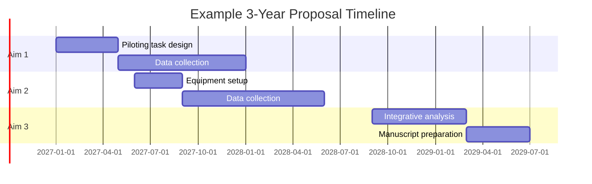
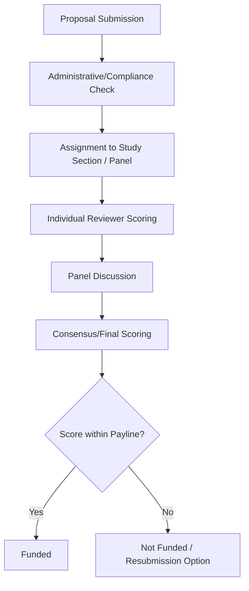

## Grant writing fundamentals

### Overview

Grant writing is the process of preparing formal funding proposals that persuade a reviewing body — a government agency, private foundation, or institutional body — to allocate financial resources to a proposed research program. In cognitive neuroscience, grant writing is a core professional skill because most empirical work (participant recruitment, neuroimaging scan time, EEG/MEG equipment, personnel salaries) depends on external funding. Success requires translating a scientific idea into a document that satisfies both scientific merit criteria and the specific administrative and strategic priorities of the funding mechanism.

### The Funding Landscape

- **Key Points**
  - Government agencies: in the United States, the primary funders are the National Institutes of Health (NIH, particularly NIMH and NINDS), the National Science Foundation (NSF), and the Department of Defense; internationally, equivalents include UKRI/MRC (UK), ERC (European Research Council), CIHR (Canada), and JSPS (Japan)
  - Private foundations: entities such as the Simons Foundation, McKnight Foundation, Kavli Foundation, and Wellcome Trust fund neuroscience-specific initiatives, often with narrower thematic priorities than government agencies
  - Institutional/internal funding: seed grants, pilot funding, and bridge funding provided by universities to generate preliminary data for larger external applications
  - Career-stage-specific mechanisms: predoctoral/postdoctoral fellowships (e.g., NIH F31/F32), early-career investigator awards (e.g., NIH K99/R00, NSF CAREER), distinguished from established-investigator R01-equivalent mechanisms

**[Unverified]** Specific funding priorities, payline percentages, and mechanism names change frequently with agency budget cycles and strategic plans; applicants should verify current details directly against the funder's current solicitation before drafting.

### Core Components of a Grant Proposal

Most proposals, regardless of funder, share a common logical skeleton, though section names and page limits vary by mechanism.

#### Specific Aims / Summary Page

- **Key Points**
  - Typically limited to a single page (NIH convention) and considered the most important page in the entire application, since it is read by all reviewers and often determines their initial impression
  - Structure: opens with the significance of the problem, identifies the knowledge gap, states an overarching hypothesis or objective, then lists 2–3 discrete, testable Specific Aims
  - Each aim should be independent enough that failure of one does not invalidate the others (non-dependency principle), while collectively supporting the overarching hypothesis
  - Closes with an "Expected Outcomes/Impact" statement connecting the aims back to the significance
- **Example**

  A proposal on prefrontal involvement in cognitive control might state: Aim 1 — characterize the temporal dynamics of DLPFC engagement using MEG; Aim 2 — test the causal necessity of DLPFC using TMS; Aim 3 — determine individual differences in DLPFC recruitment as a function of working memory capacity.

#### Significance / Background and Rationale

- Establishes why the problem matters theoretically, clinically, or societally
- Reviews the state of the literature and explicitly identifies the gap the proposal addresses
- Distinguishes the proposal from prior published work by the applicant and others (novelty argument)

#### Innovation

- Common as a distinct section in NIH-style applications
- Articulates what is conceptually, methodologically, or technically new — a novel technique, an unexplored theoretical integration, or application of an established method to a new population/question
- **[Inference]** Reviewers generally weight genuine methodological or conceptual novelty more heavily than incremental extensions of existing paradigms, though the relative emphasis on innovation versus feasibility varies by review panel and funding mechanism.

#### Approach / Research Strategy

- The most detailed section, organized by Specific Aim, each containing: rationale, preliminary data (if available), experimental design, expected outcomes, and a discussion of potential pitfalls with alternative approaches
- Preliminary data serves to demonstrate feasibility — that the applicant's lab can execute the proposed methods (e.g., a pilot fMRI dataset showing the expected activation pattern)
- A pitfalls-and-alternatives subsection anticipates reviewer skepticism and demonstrates methodological foresight
- Timeline (often a Gantt-style chart) shows the sequencing and expected duration of each aim

#### Budget and Budget Justification

- Direct costs: personnel salaries (effort expressed in person-months or % FTE), equipment, participant compensation, scanner/EEG time, travel to conferences, publication costs
- Indirect costs (facilities and administrative costs): institutional overhead, calculated as a negotiated percentage of direct costs, varies by institution and funder
- Budget justification narrative must explain and defend each line item's necessity in relation to the Specific Aims

### Review Criteria and the Evaluation Process

- **Key Points**
  - NIH-style review uses defined criteria: Significance, Investigator(s), Innovation, Approach, and Environment, each scored and combined into an overall Impact Score
  - Study sections (panels of peer scientists) discuss and score applications; only a subset of top-scored applications are typically funded within the agency's payline
  - NSF uses two overarching review criteria: Intellectual Merit and Broader Impacts, the latter requiring explicit discussion of societal benefit, education, or diversity outcomes
  - Private foundations often weight strategic fit with the foundation's mission more heavily than generalist government mechanisms

### Writing Style and Persuasive Strategy

- **Key Points**
  - Written for an expert but not hyper-specialized audience — reviewers on a panel may be broadly in cognitive neuroscience but not narrowly expert in the specific subfield
  - Emphasizes clarity and visual scannability: headers, bolded key sentences, and figures summarizing preliminary data or the conceptual model
  - Avoids excessive jargon; defines specialized terms on first use
  - Argues significance in terms the funder's mission recognizes (e.g., NIH proposals typically connect basic cognitive neuroscience questions to eventual clinical or public health relevance, even when the proposed work itself is not applied)
  - A strong narrative arc: problem → gap → solution → impact, mirroring but more condensed than the manuscript Introduction structure

### Common Pitfalls in Grant Writing

- **Key Points**
  - Aims that are overly dependent on one another, such that reviewers perceive the whole proposal as jeopardized if Aim 1 fails
  - Insufficient preliminary data to establish feasibility, particularly for expensive or technically demanding methods
  - Overly broad or vague aims lacking clear, falsifiable predictions
  - Neglecting the "Broader Impacts" or significance framing expected by the specific funder
  - Ignoring page limits, formatting requirements, or required sections specified in the funding announcement, which can result in administrative rejection without scientific review
  - Underestimating the iterative nature of the process: **[Inference]** first submissions are commonly not funded at many agencies, with resubmission after addressing reviewer critique being a standard and expected part of the funding cycle, though exact resubmission rates vary by mechanism and are subject to change.

### The Resubmission Process

- Most agencies allow (or require, structurally) a revised resubmission addressing prior critique
- A response-to-reviewers document (e.g., NIH's "Introduction to Resubmission" page) explicitly addresses each major criticism raised in the previous summary statement
- Substantial revision of the Approach section is typical, sometimes incorporating new preliminary data generated in response to specific reviewer concerns

### Grant Writing Across Career Stages

| Career Stage | Typical Mechanism Type | Emphasis |
| --- | --- | --- |
| Graduate student | Predoctoral fellowship | Training environment, mentor track record, candidate potential |
| Postdoctoral researcher | Postdoctoral fellowship / early-career award | Transition to independence, novel research direction |
| Early-career faculty | Career development / first R01-equivalent | Independent research program, institutional support |
| Established investigator | Renewal / program project grants | Track record, productivity, multi-PI collaboration |

### Related Topics

- Scientific writing and publication
- Research ethics and IRB/ethics committee procedures
- Study preregistration and Registered Reports
- Budget management and research administration
- Mentorship and career development in academic science
- Collaborative and multi-site research design
- Science communication and public engagement