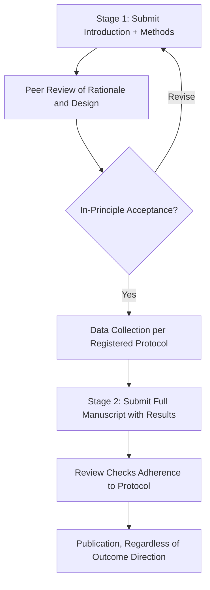

## Reproducibility and preregistration practices

### Overview

Reproducibility refers to the degree to which independent researchers, using the original data and code, can obtain the same results as an original study, while replicability refers to obtaining consistent findings when the study is repeated with new data. Preregistration is a procedural intervention — publicly time-stamping a study's hypotheses, design, and analysis plan before data collection or analysis — intended to reduce the researcher degrees of freedom that can inflate false-positive rates. These practices developed largely in response to the "replication crisis" discussions in psychology and neuroscience beginning around the early 2010s, and now constitute a core professional competency in cognitive neuroscience research practice.

### Terminology: Reproducibility, Replicability, and Generalizability

- **Key Points**
  - Reproducibility (computational): re-running the original analysis code on the original data yields the same results
  - Replicability: conducting a new study with new data, following the same or similar procedures, yields consistent findings
  - Generalizability: findings hold across different populations, settings, stimuli, or measurement approaches
  - These terms are sometimes used inconsistently across fields and even across papers within cognitive neuroscience; **[Unverified]** the specific terminology mapping above follows common usage in psychological and biomedical science but is not universally standardized across all subfields.

### Sources of Researcher Degrees of Freedom

- **Key Points**
  - Flexible stopping rules: continuing data collection until a significant result is obtained
  - Selective outcome reporting: measuring multiple dependent variables but only reporting those that reached significance
  - Flexible exclusion criteria: applying outlier removal or participant exclusion rules post hoc, in ways that favor the desired outcome
  - Multiple comparisons without correction: testing many contrasts, regions of interest, or time windows and reporting only the significant ones
  - HARKing (Hypothesizing After Results are Known): presenting an exploratory, data-driven finding as though it had been predicted a priori

**[Inference]** These practices are generally understood to inflate the false-positive rate substantially above the nominal alpha level (e.g., .05), though the precise magnitude of inflation depends on how many degrees of freedom are exploited and is difficult to estimate for any single published study after the fact.

### Preregistration

#### Purpose and Logic

- Distinguishes confirmatory analyses (planned in advance, hypothesis-testing) from exploratory analyses (data-driven, hypothesis-generating)
- Confirmatory results from a preregistered analysis carry stronger evidential weight because the analytic flexibility that can inflate false positives has been constrained in advance
- Exploratory findings remain valuable but should be explicitly labeled as such in the write-up, since they require independent replication before being treated as confirmed

#### What a Preregistration Typically Specifies

- **Key Points**
  - Research question(s) and directional or non-directional hypotheses
  - Sample size and a justification (commonly an a priori power analysis)
  - Full description of experimental design, including conditions, manipulations, and counterbalancing
  - Operational definitions of variables, including inclusion/exclusion criteria for participants and trials
  - Planned statistical analysis, including the specific model/test, covariates, and correction for multiple comparisons
  - For neuroimaging: planned regions of interest, preprocessing pipeline, and statistical thresholding approach

#### Platforms and Formats

- Open Science Framework (OSF): general-purpose preregistration with flexible templates and time-stamped, uneditable registration
- AsPredicted: a streamlined 8-9 question format designed for rapid preregistration of straightforward designs
- ClinicalTrials.gov: required registration for clinical trials, including many neuromodulation intervention studies (TMS, tDCS)
- Registered Reports: a publication format (offered by an increasing number of journals) where the Introduction and Methods, including the full analysis plan, undergo peer review and can receive in-principle acceptance before data collection begins, with publication guaranteed regardless of outcome contingent on adherence to the registered protocol

#### Registered Reports Workflow

### Open Data, Materials, and Code Sharing

- **Key Points**
  - Data sharing repositories: OpenNeuro (neuroimaging data in Brain Imaging Data Structure/BIDS format), Figshare, Dryad, OSF
  - Materials sharing: task scripts, stimulus sets, and questionnaires deposited alongside the manuscript
  - Code sharing: analysis pipelines shared via version-controlled repositories (e.g., GitHub), ideally with containerization (e.g., Docker) or environment specification files to support computational reproducibility
  - Data Availability Statements are now required by many journals, specifying where and under what conditions (e.g., de-identification, data use agreements) the data can be accessed
  - The FAIR principles (Findable, Accessible, Interoperable, Reusable) provide a widely cited framework for evaluating data sharing quality

### Statistical Practices Supporting Reproducibility

- Preregistered or a priori power analyses to justify sample size, reducing both underpowered null results and overpowered trivial-effect detection
- Correction for multiple comparisons (e.g., Bonferroni, false discovery rate/FDR, cluster-based permutation testing in neuroimaging) to control the family-wise error rate
- Reporting effect sizes and confidence intervals alongside p-values, since effect size estimates are directly relevant to replication planning
- **[Inference]** Bayesian approaches (e.g., Bayes factors) are increasingly used as a complement to or alternative for null-hypothesis significance testing, in part because they can quantify evidence for the null hypothesis rather than only failing to reject it, though adoption levels vary considerably across subfields and remain a topic of active methodological discussion.

### Large-Scale Replication Efforts in Cognitive Science

- **Key Points**
  - Multi-lab collaborative replication projects (e.g., the Many Labs series) have systematically tested the replicability of classic findings across numerous independent samples and sites
  - Findings from these efforts have prompted reassessment of specific effects and broader methodological reform discussions within psychology and cognitive science
  - **[Unverified]** Specific replication rate statistics and the identity of effects found to be more or less replicable are subject to ongoing empirical investigation and should be verified against current primary sources rather than treated as fixed figures, since new replication studies continue to be published.

### Neuroimaging-Specific Reproducibility Challenges

- **Key Points**
  - Analytic flexibility in preprocessing pipelines (e.g., choice of smoothing kernel, motion correction thresholds, normalization templates) can produce meaningfully different results from the same raw data
  - Multiverse analysis and specification curve analysis are methodological approaches that systematically report results across many reasonable analytic choices, rather than a single pipeline, to assess robustness
  - Standardized data organization (BIDS) and standardized preprocessing pipelines (e.g., fMRIPrep) aim to reduce undisclosed pipeline variability between labs
  - Small sample sizes historically common in neuroimaging research have been identified as a contributor to unstable, poorly replicable effect size estimates

### Institutional and Journal-Level Infrastructure

- Many journals now offer or require badges indicating open data, open materials, or preregistration, following frameworks such as the Transparency and Openness Promotion (TOP) guidelines
- Some funding agencies increasingly require or incentivize data management and sharing plans as part of the application
- Institutional review boards and data governance offices intersect with reproducibility practices when de-identification and data-sharing agreements are required for human neuroimaging or clinical data

### Common Pitfalls

- **Key Points**
  - Treating preregistration as a bureaucratic formality rather than genuinely constraining analytic choices, then silently deviating from the registered plan without disclosure
  - Preregistering vague or underspecified analysis plans that still permit substantial researcher discretion
  - Conflating exploratory findings with confirmatory ones in the write-up, obscuring which results were hypothesis-tested versus hypothesis-generating
  - Sharing data or code that is technically available but poorly documented, effectively limiting real reproducibility despite nominal compliance

### Related Topics

- Scientific writing and publication
- Statistical inference and power analysis
- Research ethics and IRB/ethics committee procedures
- Neuroimaging data preprocessing pipelines (BIDS, fMRIPrep)
- Bayesian statistics in cognitive neuroscience
- Meta-analysis and systematic review methodology
- Open science infrastructure (OSF, OpenNeuro, GitHub)