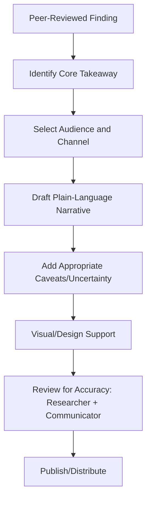

## Science communication

### Overview

Science communication is the practice of translating research findings, methods, and implications for audiences outside the immediate specialist community — including the general public, policymakers, clinicians, journalists, funders, and students. In cognitive neuroscience, effective communication is a professional skill distinct from academic writing: it requires simplifying complex neural and cognitive mechanisms without distorting them, managing the field's susceptibility to overclaiming (e.g., "neuromyths"), and adapting register, length, and framing to the audience and channel.

### Core Principles

- **Key Points**
  - Audience analysis precedes message design: a policymaker, a journalist, and a patient support group require different vocabulary, depth, and emphasis
  - Accuracy is preserved even under simplification — simplification should reduce technical density, not change the underlying claim (e.g., avoiding causal language for correlational findings)
  - A clear narrative structure (problem, discovery, implication) improves comprehension and retention more than a linear recitation of methods and statistics
  - Uncertainty should be communicated honestly rather than omitted, since overconfident public messaging can undermine trust when findings are later revised

### Audiences and Channels

| Audience | Typical Channel | Communication Goal |
| --- | --- | --- |
| General public | Press release, blog, social media, podcast | Broad comprehension, relevance, engagement |
| Journalists | Press release, interview, embargoed briefing | Accurate, quotable, newsworthy framing |
| Policymakers | Policy brief, testimony, one-page summary | Actionable implications, clear recommendations |
| Clinicians | Clinical commentary, grand rounds, review article | Practical relevance to diagnosis/treatment |
| Students/educators | Lecture, textbook chapter, explainer video | Conceptual scaffolding, pedagogical clarity |
| Fellow scientists (cross-subfield) | Conference talk, review paper | Technical accuracy with reduced jargon |

### Translating Findings for Lay Audiences

- **Key Points**
  - Replace statistical and technical jargon with plain-language equivalents while flagging where nuance is lost (e.g., "significant" in lay use versus statistical significance)
  - Use analogies and metaphors cautiously: they aid comprehension but can also introduce misconceptions if the analogy breaks down under scrutiny (e.g., "brain as computer" metaphors obscuring parallel, distributed processing)
  - Lead with the "so what" — the practical or conceptual significance — before the methodological details, inverting the structure of a typical journal Discussion section
  - Visualizations (brain activation maps, simplified diagrams) can aid understanding but risk implying more anatomical precision or localization certainty than the underlying statistics support
- **[Inference]** Audiences without statistical training are generally understood to interpret color-coded brain images as conveying stronger evidence of localized, discrete function than the underlying statistical thresholding actually supports; this interpretive gap has been a recurring concern raised in discussions of neuroimaging communication, though its magnitude likely varies with framing, image design, and audience background.

### Combating Neuromyths and Overclaiming

- **Key Points**
  - Neuromyths are persistent misconceptions about the brain that circulate in public and educational contexts despite lacking (or contradicting) empirical support — commonly cited examples include the claims that people use only 10% of their brain, that "left-brained" versus "right-brained" personality types exist, and that learning styles (visual/auditory/kinesthetic) determine effective teaching methods
  - Reverse inference errors (inferring a specific mental state solely from activation in a brain region) are a common source of overclaiming in both academic and public-facing communication, since most brain regions participate in multiple cognitive processes
  - "Neuroessentialism" or "neuro-realism": the tendency for a finding to be perceived as more real, causal, or immutable simply because it is described in neural rather than behavioral terms — **[Inference]** this effect (often discussed under the label "seductive allure of neuroscience explanations") has been examined in several published studies, though findings regarding its strength and the specific conditions under which it occurs are mixed and continue to be debated in the literature.
  - Communicators should distinguish established, replicated findings from single-study or preliminary results, particularly when a finding was covered by mainstream media before independent replication

### Writing a Press Release / Public-Facing Summary

- **Key Points**
  - Headline states the core finding in plain language without overstating causality or clinical applicability
  - Opening paragraph (the "lede") answers who, what, and why it matters within the first two to three sentences
  - A quote from the researcher, in accessible language, personalizes the finding and provides journalists with usable material
  - Caveats (sample size, population studied, correlational versus causal design, stage of research) are stated explicitly rather than buried or omitted
  - Institutional press offices typically review the release for both accuracy and legal/PR considerations before distribution

### Visual Science Communication

- **Key Points**
  - Effective figures for lay audiences prioritize a single clear takeaway rather than comprehensive data density (contrasting with the conventions of a journal figure aimed at expert reviewers)
  - Schematic diagrams (e.g., simplified neural pathway illustrations) trade anatomical completeness for conceptual clarity, which should be disclosed as a simplification
  - Infographics and explainer videos benefit from a clear visual hierarchy and minimal on-screen text per frame/panel

### Public Engagement Formats

- Science festivals and public lectures: interactive, often demonstration-based communication (e.g., live EEG demonstrations)
- Podcasts and video explainers: longer-form, conversational communication allowing more nuance than a press release
- Social media (research threads, short-form video): high accessibility but high risk of oversimplification and decontextualization, requiring careful framing
- Museum and science center exhibits: designed for broad, self-directed public audiences, often emphasizing hands-on interactivity

### Communicating with Policymakers

- **Key Points**
  - Policy briefs are typically short (one to two pages), lead with the actionable recommendation, and reserve technical justification for an appendix or secondary section
  - Framing findings in terms of policy-relevant outcomes (educational, clinical, economic) rather than purely theoretical significance increases relevance to this audience
  - Communicating the maturity/confidence level of the evidence base (preliminary versus well-replicated) is critical, since policy decisions may have downstream consequences disproportionate to a single study's certainty

### Common Pitfalls

- **Key Points**
  - Overstating causal claims from correlational neuroimaging or observational data
  - Omitting effect sizes or base rates, allowing lay audiences to overestimate the real-world magnitude of an effect
  - Using brain-based framing to imply a finding is more definitive, biological, or immutable than equivalent behavioral evidence would suggest
  - Failing to update public communication when a widely publicized finding fails to replicate or is substantially revised
  - Treating science communication as secondary to publication, rather than as a professional skill requiring its own preparation and review

### Related Topics

- Scientific writing and publication
- Reproducibility and preregistration practices
- Research ethics and public trust in science
- Neuroimaging methods and interpretation limits
- Grant writing fundamentals (Broader Impacts framing)
- Cognitive biases in public perception of science