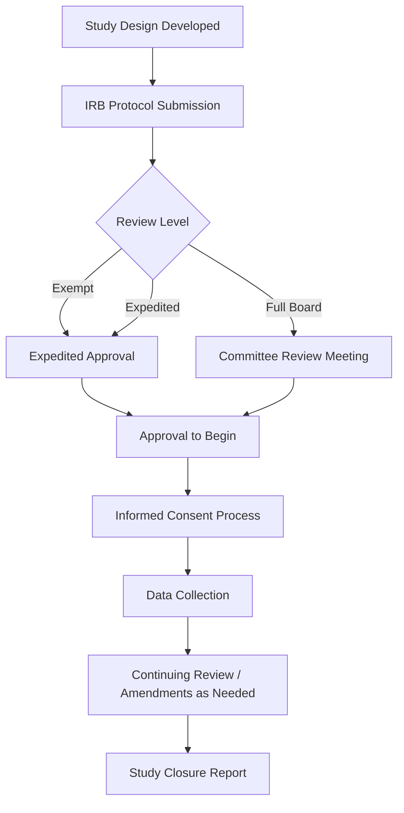

## Responsible conduct of research

### Overview

Responsible Conduct of Research (RCR) refers to the set of ethical principles, regulatory requirements, and professional norms governing how research is designed, conducted, reported, and reviewed. In cognitive neuroscience, RCR spans human subjects protections, data integrity, authorship practices, conflict of interest management, and mentorship responsibilities. Many funding agencies (e.g., NIH, NSF) mandate formal RCR training for trainees, making it both an ethical foundation and a formal professional requirement for researchers working with human participants and neural data.

### Core Domains of RCR

- **Key Points**
  - Human subjects protection and research ethics oversight
  - Data acquisition, management, and record-keeping
  - Research misconduct (fabrication, falsification, plagiarism) and questionable research practices
  - Authorship, publication, and peer review conduct
  - Mentor/mentee and collaborative research relationships
  - Conflicts of interest and conflicts of commitment
  - Animal welfare (when applicable to a given research program)

### Human Subjects Protections

#### Historical and Regulatory Foundation

- **Key Points**
  - The Belmont Report (1979) established three foundational ethical principles for human subjects research: respect for persons, beneficence, and justice
  - These principles were codified into US federal regulation as the "Common Rule" (45 CFR 46), which governs federally funded human subjects research
  - Historical research abuses (e.g., the Tuskegee syphilis study) directly motivated the development of formal ethical oversight structures; **[Unverified]** the precise chain of regulatory causation and dates of specific policy revisions should be verified against primary regulatory sources, as Common Rule provisions have been revised over time (e.g., the 2018 revised Common Rule).

#### Institutional Review Boards (IRBs)

- **Key Points**
  - IRBs (or equivalent Research Ethics Committees/Boards outside the US) review proposed studies for risk-benefit balance, adequacy of informed consent, and protection of vulnerable populations before research begins
  - Review categories typically include exempt, expedited, and full board review, determined by the level of risk and the population studied
  - Continuing review, protocol amendments, and adverse event reporting are required throughout an active study, not only at initial approval
  - In cognitive neuroscience, IRB review commonly addresses risks specific to neuroimaging (e.g., incidental findings on structural MRI scans, MRI contraindications such as ferromagnetic implants) and to interventional techniques (e.g., TMS seizure risk screening)

#### Informed Consent

- **Key Points**
  - Must convey, in comprehensible language, the study's purpose, procedures, risks, benefits, confidentiality protections, and the voluntary nature of participation including the right to withdraw without penalty
  - Special protections apply to vulnerable populations (children, cognitively impaired adults, individuals with reduced capacity to consent), often requiring assent procedures alongside parental/guardian consent
  - Deception designs (occasionally used in cognitive/behavioral paradigms) require special justification and mandatory debriefing, with IRB approval of the deception's necessity and minimal-risk nature

### Data Integrity and Record-Keeping

- **Key Points**
  - Accurate, contemporaneous, and complete documentation of experimental procedures, deviations, and analysis decisions supports both reproducibility and integrity verification
  - Raw data should be preserved and distinguished from processed/derived data, with a clear, documented analysis pipeline connecting the two
  - Institutions and funders (e.g., NIH) increasingly require formal Data Management and Sharing Plans specifying storage, security, retention period, and eventual sharing arrangements
  - De-identification and data security practices are particularly consequential for neuroimaging data, since structural MRI scans can in principle be used for facial reconstruction, raising re-identification concerns addressed through defacing/skull-stripping procedures before sharing

### Research Misconduct

- **Key Points**
  - Formally defined (in US federal policy) as fabrication, falsification, or plagiarism (FFP) in proposing, performing, or reviewing research, or in reporting research results
  - Fabrication: making up data or results and recording or reporting them
  - Falsification: manipulating research materials, equipment, or processes, or changing/omitting data such that the research is not accurately represented
  - Plagiarism: appropriation of another person's ideas, processes, results, or words without appropriate credit
  - Distinguished from honest error or differences of scientific opinion, which do not constitute misconduct
  - Institutions maintain formal misconduct investigation procedures, typically involving an inquiry phase followed by a full investigation if warranted, with findings reported to the relevant funding agency's oversight body (e.g., the Office of Research Integrity for US Public Health Service-funded research)

### Questionable Research Practices (QRPs)

Distinguished from outright misconduct, QRPs are practices that fall short of fabrication or falsification but compromise the integrity or interpretability of findings.

- **Key Points**
  - Undisclosed flexibility in data collection stopping rules, exclusion criteria, or outcome selection
  - HARKing (Hypothesizing After Results are Known)
  - Selective reporting of studies or analyses that support a favored hypothesis (publication bias contribution)
  - Insufficiently acknowledging the contributions of trainees, collaborators, or prior work
  - **[Inference]** These practices are generally distinguished from formal misconduct in that they may not involve intent to deceive but are nonetheless understood to compromise the reliability of the published literature, motivating the broader adoption of preregistration and open-science reforms discussed as separate topics.

### Authorship and Collaborative Conduct

- **Key Points**
  - Authorship criteria (e.g., ICMJE-style: substantial contribution to design/analysis, drafting/revision, final approval, and accountability) determine who qualifies as an author versus who should be acknowledged
  - Gift authorship (including someone who did not meet authorship criteria) and ghost authorship (omitting someone who did) are both considered violations of responsible authorship practice
  - Order of authorship conventions and their meaning vary by subfield and should be discussed and agreed upon explicitly among collaborators, ideally early in a project
  - Data and material sharing agreements in multi-site or multi-lab collaborations should specify usage rights, authorship expectations, and credit allocation in advance

### Conflicts of Interest

- **Key Points**
  - Financial conflicts of interest (e.g., consulting relationships, equity in a company related to the research topic) must generally be disclosed to institutions and, in publications, to readers
  - Conflicts of commitment involve competing demands on a researcher's time and obligations (e.g., outside consulting versus primary institutional responsibilities)
  - Non-financial conflicts (e.g., personal relationships affecting peer review objectivity) are also addressed by most institutional and journal policies, particularly in the context of peer review and grant review panels

### Mentorship Responsibilities

- **Key Points**
  - Mentors are expected to provide appropriate supervision, training in RCR itself, fair credit allocation, and support for trainee career development
  - Power differentials between mentors and trainees (e.g., control over funding, authorship, letters of recommendation) create heightened responsibility for mentors to avoid exploitation and to model responsible practices
  - Many institutions require documented Individual Development Plans or mentoring compacts to make expectations explicit

### RCR Training Requirements

- **[Unverified]** Formal RCR training requirements and their specific content requirements vary by funding agency, institution, and trainee career stage, and specific current requirements (e.g., NIH's training grant RCR requirements) should be verified against the funding agency's current policy documentation rather than assumed to be static.
- Training typically covers case-based discussion of the domains above, often delivered through a combination of coursework, workshops, and ongoing mentored discussion throughout a research career rather than a single one-time training event

### Common Pitfalls

- **Key Points**
  - Treating IRB approval as a one-time formality rather than an ongoing obligation requiring amendment submission when procedures change
  - Inadequate documentation of analysis decisions, making it difficult to distinguish planned/confirmatory choices from post hoc/exploratory ones after the fact
  - Ambiguous or undiscussed authorship expectations at the outset of a collaboration, leading to disputes later
  - Underestimating re-identification risk when sharing neuroimaging or genetic data, particularly structural MRI capable of facial reconstruction
  - Conflating questionable research practices with acceptable "flexibility," rather than recognizing their cumulative effect on the reliability of the literature

### Related Topics

- Reproducibility and preregistration practices
- Scientific writing and publication
- Grant writing fundamentals
- Data management and FAIR data principles
- Neuroimaging ethics and incidental findings
- Mentorship and professional development in academic science