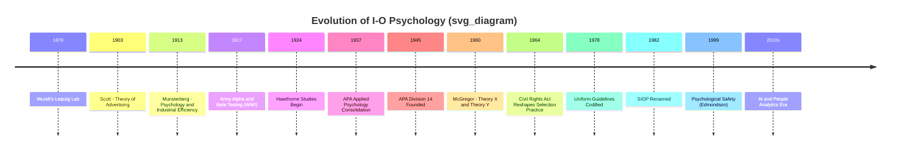

## Origins and Evolution of Industrial-Organizational Psychology

### Definition and Scope

Industrial-Organizational (I-O) Psychology is the scientific study of human behavior in the workplace, applying psychological principles and research methods to organizational problems. The field bifurcates into two historically distinct but interconnected branches:

- **Industrial (Personnel) Psychology**: Focuses on individual differences, selection, placement, training, and performance measurement
- **Organizational Psychology**: Focuses on group dynamics, leadership, motivation, organizational structure, and workplace culture

**Key Points**

- I-O Psychology sits at the intersection of psychology and business/management science
- It is applied science: theories are tested against real organizational outcomes (productivity, turnover, satisfaction)
- The field's evolution mirrors broader shifts in economic systems, from factory-based manufacturing to knowledge and service economies

### Early Precursors (1880s–1900s)

The intellectual roots of I-O Psychology predate its formal naming, emerging from the convergence of experimental psychology and industrial efficiency movements.

- **Wilhelm Wundt** established the first psychology laboratory at Leipzig (1879), training many early American psychologists in experimental methods later applied to work settings
- **Wilhelm Wundt's students**, including Hugo Münsterberg and James McKeen Cattell, carried experimental rigor into applied domains
- **Frederick Winslow Taylor** introduced *Scientific Management* (1911), a non-psychological but foundational management philosophy emphasizing time-and-motion studies, task standardization, and the separation of planning from execution. Taylorism is not I-O Psychology itself, but it created the organizational appetite for scientific approaches to worker efficiency that psychology would later fill.

### Founding Figures and the Birth of the Field (1900s–1920s)

**Hugo Münsterberg** is widely credited as the "father of Industrial Psychology." His 1913 book *Psychology and Industrial Efficiency* established three core application areas that still structure the field:

1. Finding the best possible worker for a job (selection)
2. Producing the best possible work from each worker (efficiency/training)
3. Producing the desired psychological effects for business objectives (marketing/influence, now largely separate as consumer psychology)

**Walter Dill Scott** applied psychological principles to advertising and personnel selection, publishing *The Theory of Advertising* (1903) and later working on employee selection systems, making him one of the first psychologists to consult directly for industry.

**World War I as an Accelerator**: The war created urgent, large-scale need for personnel classification.

- The **Army Alpha and Army Beta tests** (1917–1918), developed by a committee that included Robert Yerkes, were used to classify over 1.7 million recruits by cognitive ability, marking the first large-scale application of psychological testing in an institutional setting
- Alpha was verbal/text-based; Beta was designed for non-English speakers and illiterate recruits, using pictorial and performance-based items
- This effort proved the feasibility (and demonstrated the risks) of mass psychometric testing, directly seeding post-war corporate selection testing

**[Inference]** Historians generally treat WWI testing as the pivotal legitimizing event for I-O psychology as a credible applied discipline, though the precise causal weight relative to concurrent civilian industrial psychology work is debated among historians of science.

### The Hawthorne Studies and the Human Relations Movement (1924–1932)

Conducted at the Western Electric Hawthorne Works near Chicago, these studies fundamentally redirected the field from a purely mechanistic, efficiency-driven view of workers toward a social and psychological one.

**Study phases:**

- **Illumination studies (1924–1927)**: Tested whether lighting levels affected productivity; productivity rose regardless of whether lighting increased or decreased
- **Relay assembly test room studies**: Small group of workers monitored under varying conditions (breaks, hours, pay); productivity increased almost regardless of the specific change
- **Bank wiring observation room studies**: Documented informal group norms that restricted output below management-set standards, demonstrating the power of informal social structures

**The Hawthorne Effect**: The observed phenomenon that individuals modify behavior in response to being observed, regardless of the independent variable being manipulated. This term is now used broadly across behavioral and medical research as a methodological caution.

**Elton Mayo**, associated with the studies' interpretation, argued that social relationships, informal group dynamics, and feelings of being valued mattered more to output than physical working conditions or pay alone — launching the **Human Relations Movement**.

**[Unverified]** The Hawthorne studies' methodology and even the existence of a genuine "Hawthorne effect" have been substantially challenged by later reanalyses (e.g., Levitt & List, 2011), which found the original data supported weaker or different conclusions than commonly taught. This is a well-documented historiographical controversy, not a fringe claim, but the "textbook" version of the Hawthorne story is now considered oversimplified by many methodologists.

### Institutionalization and Professional Identity (1930s–1950s)

- **1937**: Publication and structuring of applied psychology sections within the American Psychological Association (APA) began consolidating industrial psychologists as a professional community
- **World War II** repeated the WWI pattern at larger scale: psychologists developed selection systems for pilots, engineered equipment for human use (birth of human factors/ergonomics as a sister discipline), and studied morale and leadership under Douglas McGregor, Rensis Likert, and others
- **1945**: Division 14 of the APA (Industrial Psychology) was formally established, later renamed the **Society for Industrial and Organizational Psychology (SIOP)** in 1982
- The term "Industrial-Organizational Psychology" itself did not fully replace "Industrial Psychology" until organizational-level phenomena (leadership, culture, group behavior) were recognized as equally central, roughly through the 1960s–1970s

### The Organizational Turn (1950s–1970s)

Where the "Industrial" side of the field concentrated on individual-level phenomena (testing, selection, training), a parallel intellectual tradition grew around organizational-level and group-level phenomena, eventually merging into the unified field.

- **Kurt Lewin**, a social psychologist, contributed foundational work on group dynamics, force-field analysis, and organizational change, and is considered a co-architect of the "O" side of I-O psychology, alongside founding what became known as **action research**
- **Douglas McGregor's Theory X and Theory Y** (1960) contrasted authoritarian versus participative management assumptions about worker motivation
- **Rensis Likert** developed systems of management theory and pioneered survey research methods for organizational diagnosis
- **Frederick Herzberg's Two-Factor Theory** (1959) distinguished hygiene factors from true motivators, shaping job design research
- **Abraham Maslow's Hierarchy of Needs** (1943), though originating in general/humanistic psychology, was widely imported into organizational motivation theory during this era

This period cemented the "O" in I-O: organizations came to be studied as systems, not just aggregates of individually-selected workers.

### Psychometric and Statistical Maturation (1950s–1980s)

- Development of **utility analysis** and **validity generalization** (Schmidt & Hunter, 1970s–1980s) allowed quantification of the economic value of selection systems and demonstrated that cognitive ability test validity generalizes across jobs and settings more than previously assumed
- Legal and civil rights developments — notably the U.S. **Civil Rights Act (1964)** and the **Griggs v. Duke Power Co.** Supreme Court case (1971) — forced I-O psychology to develop more rigorous, legally defensible, and adverse-impact-conscious selection methodologies
- The **Uniform Guidelines on Employee Selection Procedures (1978)** codified professional and legal standards for test validation in the U.S., permanently linking I-O practice to employment law compliance

### Modern Era (1980s–Present)

- **Personnel selection** matured with structured interviews, assessment centers, and meta-analytic validity evidence for various predictors
- **Organizational behavior** absorbed influences from sociology and management science, broadening into topics like organizational culture, justice, and change management
- **Positive Organizational Scholarship** and constructs like **employee engagement**, **psychological safety** (Amy Edmondson, 1999), and **authentic leadership** emerged from the late 1990s onward
- **Globalization** pushed cross-cultural I-O psychology, exemplified by frameworks like **Hofstede's Cultural Dimensions**
- **Technology integration**: computerized adaptive testing, people analytics, AI-driven candidate screening, and remote/hybrid work research represent the field's most recent evolution
- **[Inference]** The rapid adoption of AI-based selection tools since the 2010s is generally viewed within the field as outpacing the validation and fairness research needed to fully vindicate their use, an ongoing tension actively discussed in SIOP practice guidelines rather than a settled matter.

### Timeline Visualization

### Two Branches, One Field

<svg xmlns="http://www.w3.org/2000/svg" viewBox="0 0 720 320" font-family="Arial, sans-serif">
<text x="360" y="30" text-anchor="middle" font-size="18" font-weight="bold" fill="#1a1a1a">Industrial vs. Organizational Branches (svg_diagram)</text>
<rect x="40" y="60" width="280" height="220" rx="10" fill="#e8f0fe" stroke="#4a6fa5" stroke-width="2" />
<text x="180" y="90" text-anchor="middle" font-size="15" font-weight="bold" fill="#2a4d7a">Industrial (Personnel)</text>
<text x="60" y="120" font-size="12" fill="#333">• Selection &amp; Recruitment</text>
<text x="60" y="145" font-size="12" fill="#333">• Job Analysis</text>
<text x="60" y="170" font-size="12" fill="#333">• Performance Appraisal</text>
<text x="60" y="195" font-size="12" fill="#333">• Training &amp; Development</text>
<text x="60" y="220" font-size="12" fill="#333">• Psychometrics</text>
<text x="60" y="245" font-size="12" fill="#333">• Legal Compliance (EEO)</text>
<rect x="400" y="60" width="280" height="220" rx="10" fill="#fdf0e8" stroke="#b5674a" stroke-width="2" />
<text x="540" y="90" text-anchor="middle" font-size="15" font-weight="bold" fill="#8a3e22">Organizational</text>
<text x="420" y="120" font-size="12" fill="#333">• Leadership</text>
<text x="420" y="145" font-size="12" fill="#333">• Motivation Theory</text>
<text x="420" y="170" font-size="12" fill="#333">• Group Dynamics</text>
<text x="420" y="195" font-size="12" fill="#333">• Organizational Culture</text>
<text x="420" y="220" font-size="12" fill="#333">• Change Management</text>
<text x="420" y="245" font-size="12" fill="#333">• Employee Well-being</text>

<text x="360" y="175" text-anchor="middle" font-size="14" font-weight="bold" fill="#555">merged into</text>

<text x="360" y="195" text-anchor="middle" font-size="14" font-weight="bold" fill="#555">I-O Psychology</text>

<line x1="320" y1="170" x2="400" y2="170" stroke="#888" stroke-width="1.5" stroke-dasharray="4,3" />

</svg>

### Conclusion

I-O Psychology evolved from narrow, efficiency-focused industrial testing born out of wartime necessity into a broad discipline addressing both individual selection/performance and organizational-level dynamics like culture, leadership, and well-being. Its history is marked by recurring cycles: a crisis or societal need (war, civil rights legislation, globalization, AI adoption) drives methodological innovation, which then becomes institutionalized practice and professional standard.

**Related Topics**

- Hawthorne Studies: Detailed Methodology and Critiques
- Scientific Management (Taylorism) and Its Critics
- History and Development of SIOP as a Professional Body
- Legal Foundations of Employment Selection (Griggs v. Duke Power, Uniform Guidelines)
- Kurt Lewin and Action Research
- Psychometric Theory: Reliability and Validity Foundations
- Cross-Cultural I-O Psychology and Hofstede's Framework
- The Rise of People Analytics and AI in Selection