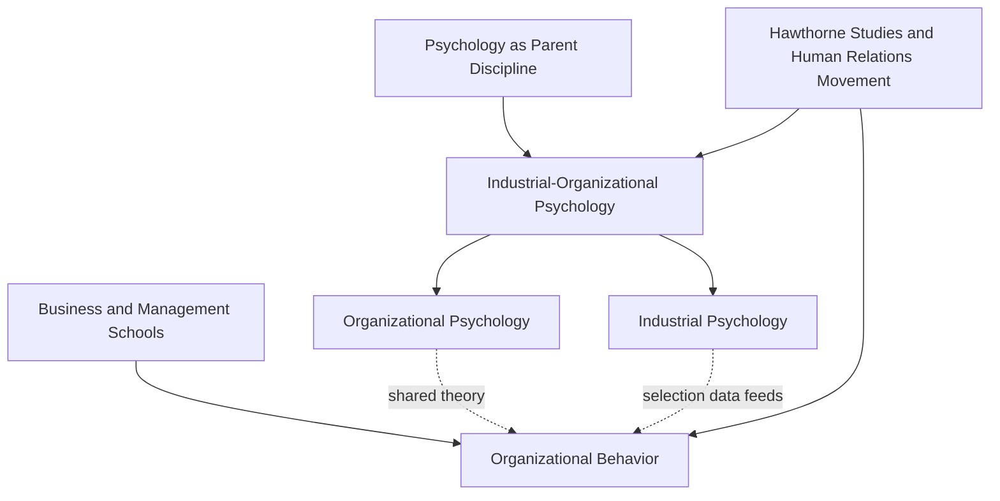

## Industrial Psychology, Organizational Psychology, and Organizational Behavior Compared

### Overview

These three fields overlap substantially in subject matter but differ in disciplinary origin, epistemology, methodology, and professional orientation. Understanding their distinctions clarifies why the same phenomenon (e.g., employee turnover) might be studied differently depending on which lens is applied.

**Key Points**

- Industrial Psychology and Organizational Psychology are sub-branches of the same applied psychology discipline (I-O Psychology)
- Organizational Behavior (OB) is a related but distinct field rooted in management/business schools rather than psychology departments
- All three share theoretical ancestry (Hawthorne studies, human relations movement) but diverged institutionally over the 20th century

### Industrial Psychology: Core Definition

Industrial Psychology (also called Personnel Psychology) is the branch concerned with **individual differences** and their measurement, application, and consequences in work settings.

**Primary domains:**

- Job analysis and job design
- Recruitment and selection (testing, interviews, assessment centers)
- Performance appraisal and measurement
- Training needs analysis and evaluation
- Compensation and job evaluation systems
- Employment law and validation (adverse impact, EEOC compliance in the U.S.)

**Methodological signature:** Heavy reliance on **psychometrics** — reliability theory, validity (content, criterion, construct), classical test theory, and item response theory. Industrial psychologists function as applied measurement specialists.

**[Inference]** Because its outputs (selection tests, appraisal instruments) carry legal liability, Industrial Psychology tends to be the more litigation-aware and standards-driven of the two psychology branches, though this emphasis is a matter of degree rather than an absolute distinction.

### Organizational Psychology: Core Definition

Organizational Psychology examines behavior at the **group and systems level** — how individuals interact within, are influenced by, and influence organizational structures.

**Primary domains:**

- Leadership theory and development
- Motivation and job attitudes (satisfaction, commitment, engagement)
- Organizational culture and climate
- Team dynamics and group processes
- Organizational change and development (OD)
- Employee well-being, stress, and work-life balance

**Methodological signature:** Greater use of survey research, multilevel modeling (individual nested within team nested within organization), qualitative/ethnographic methods, and longitudinal designs to capture emergent, system-level phenomena.

### Organizational Behavior (OB): Core Definition

OB is an interdisciplinary field, typically housed in business/management schools rather than psychology departments, that draws on psychology, sociology, anthropology, and political science to study organizational functioning.

**Primary domains:**

- Overlaps substantially with Organizational Psychology (motivation, leadership, teams, culture)
- Additionally incorporates **macro-level** topics more distinctly business-oriented: organizational structure and design, strategic human resource management, power and politics, negotiation, organizational economics
- Often integrates **sociological** perspectives (institutional theory, network analysis) and **strategic management** concerns (how people practices connect to firm performance/competitive advantage)

**[Unverified]** The precise boundary between "Organizational Psychology" and "Organizational Behavior" is contested and varies by country, institution, and era; some scholars treat them as near-synonyms while others insist on the disciplinary-origin distinction described here. This is a genuine, ongoing terminological ambiguity in the literature rather than a settled taxonomy.

### Comparative Table

| Dimension | Industrial Psychology | Organizational Psychology | Organizational Behavior |
| --- | --- | --- | --- |
| Disciplinary home | Psychology | Psychology | Business/Management School |
| Unit of analysis | Individual | Individual + Group | Individual + Group + Organization/System |
| Core method | Psychometrics, experimental design | Survey, multilevel, qualitative | Mixed methods, case studies, econometrics |
| Primary outputs | Tests, selection systems, job analyses | Culture diagnostics, leadership models | Structural/strategic frameworks, HR policy |
| Professional body (US) | SIOP (Div. 14, APA) | SIOP (Div. 14, APA) | Academy of Management (AOM) |
| Legal emphasis | High (EEOC, adverse impact) | Moderate | Variable, often strategic/economic framing |
| Typical degree | Ph.D./M.A. in I-O Psychology | Ph.D./M.A. in I-O Psychology | Ph.D./MBA in Management |

### Relationship Diagram

### Illustrative Example

**Scenario**: A company experiences high turnover among new engineering hires within their first year.

- **Industrial Psychology approach**: Audits the selection process — were the hiring assessments valid predictors of job performance and retention? Re-examines job analysis to confirm the role was accurately defined; may redesign structured interviews or cognitive/personality assessments.
- **Organizational Psychology approach**: Investigates onboarding experience, manager relationship quality, team climate, and whether engagement/psychological safety scores predict early attrition; may design an intervention around mentorship or team integration.
- **Organizational Behavior approach**: Examines whether the turnover reflects a structural issue (e.g., flat hierarchy limiting promotion pathways), compensation strategy relative to competitors, or broader labor market/strategic HR misalignment; may recommend redesigning career ladders or compensation architecture.

**[Inference]** In practice, real-world consulting engagements typically blend all three lenses rather than applying them in isolation; the separation above is pedagogical rather than a description of how practitioners actually partition their work.

### Institutional and Publishing Distinctions

- **Journals**: Industrial/Organizational Psychology research tends to publish in *Journal of Applied Psychology*, *Personnel Psychology*, *Journal of Occupational and Organizational Psychology*. Organizational Behavior research tends toward *Academy of Management Journal*, *Organization Science*, *Administrative Science Quarterly*.
- **Professional bodies**: SIOP (psychology-rooted) versus the Academy of Management's OB division (management-rooted)
- **Training**: I-O psychologists typically complete doctoral training emphasizing statistics, psychometrics, and research methods within psychology departments; OB scholars often complete doctoral training within business schools with stronger emphasis on organizational theory and strategy

### Conclusion

While Industrial Psychology, Organizational Psychology, and Organizational Behavior share deep historical roots and substantial topical overlap, they are distinguished by unit of analysis (individual vs. group vs. system), disciplinary home (psychology vs. business school), and methodological emphasis (psychometric rigor vs. multilevel/qualitative approaches vs. strategic/structural analysis). In applied practice, these boundaries blur considerably, and many practitioners operate fluidly across all three.

**Related Topics**

- Job Analysis Methods and Techniques
- Psychometric Theory: Reliability and Validity
- Organizational Development (OD) as a Practice Area
- Multilevel Modeling in Organizational Research
- Strategic Human Resource Management (SHRM)
- Academy of Management vs. SIOP: Professional Identity Differences
- Person-Organization Fit Theory