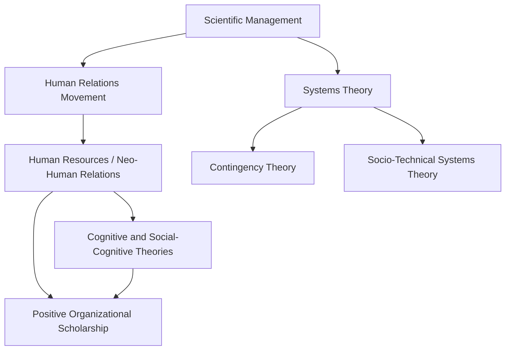

## Major Theoretical Perspectives and Schools of Thought

### Overview

Organizational Psychology has been shaped by several distinct theoretical traditions, each offering a different lens on why people behave as they do at work and how organizations should be structured. These schools of thought are not strictly chronological successors; several coexist and are combined in contemporary practice.

**Key Points**

- No single "grand theory" unifies the field; instead, competing and complementary paradigms address different levels of analysis (individual cognition, group dynamics, organizational systems)
- Each perspective implies different intervention strategies (e.g., redesign the job vs. redesign the social environment vs. redesign the selection system)
- Modern I-O practice is largely eclectic, drawing on multiple schools simultaneously depending on the problem

### Scientific Management (Classical/Rational Perspective)

**Originator**: Frederick Winslow Taylor (early 1900s), with contributions from Frank and Lillian Gilbreth (motion study).

**Core assumptions:**

- Workers are primarily motivated by economic self-interest (the "rational-economic" model of human nature)
- Jobs can be broken into optimal, standardized component tasks through time-and-motion analysis
- Efficiency is maximized by separating planning (management) from execution (labor)
- There exists "one best way" to perform any task, discoverable through systematic observation

**Legacy and critique**: Contributed methodological rigor and the foundation for job analysis and process engineering, but was criticized for treating workers as mechanistic inputs, ignoring social/psychological needs, and enabling exploitative work intensification. **[Inference]** Much of the later Human Relations backlash is best understood as a direct corrective reaction to Taylorism's perceived dehumanization of labor, a widely accepted historical narrative though the degree of direct causal reaction (versus independent intellectual development) is debated by historians.

### Human Relations Movement

**Originators**: Elton Mayo, Fritz Roethlisberger, drawing on the Hawthorne studies (1924–1932, see prior chapter item).

**Core assumptions:**

- Workers are social beings whose productivity is heavily influenced by group belonging, informal norms, and feeling valued/attended to — not purely economic incentives
- Informal organizational structures (friendship groups, group norms) often matter more than formal structures
- Supportive supervision and attention to employee sentiment increase morale and output

**Legacy and critique**: Shifted the field toward the "social person" model of motivation and legitimized morale, communication, and leadership style as scientific subjects. Critics note it can understate structural/economic factors and that some founding empirical claims (see Hawthorne effect controversy) do not hold up well under reanalysis.

### Human Resources / Neo-Human Relations School

**Originators**: Douglas McGregor, Abraham Maslow, Frederick Herzberg, Rensis Likert (1950s–1960s).

**Core assumptions:**

- Workers have higher-order psychological needs (growth, self-actualization, achievement) beyond social belonging and economic security
- **McGregor's Theory X/Theory Y**: Theory X assumes workers are inherently lazy and need control; Theory Y assumes workers are inherently motivated and seek responsibility when conditions allow
- **Herzberg's Two-Factor Theory**: Distinguishes hygiene factors (pay, conditions — prevent dissatisfaction but don't motivate) from motivators (achievement, recognition, growth — drive genuine satisfaction and performance)
- Participative management and job enrichment (vertically expanding job responsibilities) unlock intrinsic motivation

**Legacy**: Directly informed job design theory, participative decision-making practices, and later self-determination theory approaches to motivation.

### Systems Theory / Open Systems Perspective

**Originators**: Daniel Katz and Robert Kahn, *The Social Psychology of Organizations* (1966), drawing on general systems theory (Ludwig von Bertalanffy).

**Core assumptions:**

- Organizations are **open systems**: they import inputs (labor, capital, information) from the environment, transform them through internal processes, and export outputs (products, services) back into the environment
- Organizations must maintain **homeostasis** (equilibrium) while adapting to environmental change; failure to adapt threatens survival (entropy)
- Subsystems (production, maintenance, adaptive, managerial) must be understood in relation to each other, not in isolation
- Feedback loops regulate organizational behavior

**Legacy**: Foundational to organizational development (OD), change management theory, and later contingency and socio-technical systems approaches. Shifted focus from "the organization" as a closed, self-contained machine to an entity embedded in and dependent on its environment.

### Contingency Theory

**Originators**: Joan Woodward, Paul Lawrence and Jay Lorsch, Fred Fiedler (leadership-specific contingency theory) (1960s–1970s).

**Core assumptions:**

- There is no single "best" way to organize, lead, or manage; optimal structures and practices depend on situational variables (environmental uncertainty, technology type, task complexity, organization size)
- Fit between organizational design and context (contingency factors) determines effectiveness, not adherence to universal principles

**Legacy**: Directly challenged the "one best way" assumption of both Scientific Management and some Human Relations prescriptions; still underlies modern strategic HR and leadership theory (e.g., situational leadership models).

### Cognitive and Social-Cognitive Perspectives

**Originators**: Drawing on Albert Bandura (social learning/self-efficacy theory), Edwin Locke and Gary Latham (goal-setting theory), Victor Vroom (expectancy theory) — roughly 1960s–1980s.

**Core assumptions:**

- Employee behavior is shaped by internal cognitive processes: expectations, self-efficacy beliefs, goal-setting, and perceived fairness — not solely by external stimuli or social belonging
- **Expectancy Theory (Vroom)**: Motivation is a function of expectancy (effort→performance belief) × instrumentality (performance→reward belief) × valence (value placed on reward)
- **Goal-Setting Theory (Locke & Latham)**: Specific, challenging goals (with feedback) produce higher performance than vague or easy goals
- **Self-Efficacy Theory (Bandura)**: Belief in one's own capability to execute a task predicts performance and persistence

**Legacy**: Underpins modern performance management, goal-setting interventions, and much of contemporary motivation research; considered among the most empirically robust theoretical traditions in I-O Psychology.

### Socio-Technical Systems Theory

**Originators**: Eric Trist and Ken Bamforth, Tavistock Institute (1950s), based on studies of British coal mining.

**Core assumptions:**

- Organizational effectiveness requires **joint optimization** of both the technical system (equipment, processes) and the social system (relationships, group structures) — optimizing one while ignoring the other produces suboptimal outcomes
- Autonomous or semi-autonomous work groups, given control over how tasks are organized, often outperform rigidly engineered individual task structures

**Legacy**: Directly influenced self-managed team design and quality-of-work-life movements from the 1970s onward.

### Positive Organizational Scholarship / Positive Psychology Perspective

**Originators**: Building on Martin Seligman's positive psychology (1998 onward), applied organizationally via Kim Cameron, Jane Dutton, and others; related concepts include Amy Edmondson's psychological safety (1999).

**Core assumptions:**

- Traditional I-O psychology historically emphasized diagnosing and fixing dysfunction (absenteeism, turnover, low performance); positive perspectives instead study what enables thriving, engagement, and flourishing
- Constructs include psychological capital (hope, efficacy, resilience, optimism), employee engagement, strengths-based development, and psychological safety

**Legacy**: **[Inference]** This represents the most recent major paradigm shift in the field's theoretical emphasis, though whether it constitutes a genuinely distinct "school" versus an extension/rebranding of humanistic and cognitive traditions remains a matter of scholarly discussion rather than settled consensus.

### Comparative Summary Table

| School | Era | Unit of Focus | Core Driver of Behavior | Key Figures |
| --- | --- | --- | --- | --- |
| Scientific Management | 1900s–1920s | Individual task | Economic incentive | Taylor, Gilbreths |
| Human Relations | 1920s–1950s | Social group | Belonging, attention | Mayo, Roethlisberger |
| Human Resources/Neo-Human Relations | 1950s–1960s | Individual growth needs | Intrinsic/higher-order needs | McGregor, Maslow, Herzberg |
| Systems Theory | 1960s | Organization as whole | Environmental adaptation | Katz, Kahn |
| Contingency Theory | 1960s–1970s | Organization-environment fit | Situational fit | Woodward, Lawrence & Lorsch, Fiedler |
| Cognitive/Social-Cognitive | 1960s–1980s | Individual cognition | Beliefs, goals, expectations | Vroom, Locke & Latham, Bandura |
| Socio-Technical Systems | 1950s–1970s | Work group + technology | Joint social-technical optimization | Trist, Bamforth |
| Positive Organizational Scholarship | 1990s–present | Individual and organizational flourishing | Strengths, meaning, safety | Seligman, Cameron, Dutton, Edmondson |

### Theoretical Lineage Diagram

### Illustrative Example: Same Problem, Different Lenses

**Scenario**: A manufacturing team shows declining output over six months.

- **Scientific Management lens**: Re-time the tasks; check whether workflow deviates from the standardized optimal method
- **Human Relations lens**: Investigate group morale, informal norms, and whether workers feel socially supported by supervisors
- **Cognitive lens**: Examine whether goals are clear and challenging, and whether workers believe effort will translate into rewarded performance (expectancy)
- **Systems/Contingency lens**: Examine whether the team's structure fits recent environmental changes (new suppliers, demand volatility, technology shifts)
- **Socio-Technical lens**: Assess whether new equipment was introduced without corresponding adjustment to team roles and autonomy

### Conclusion

The theoretical evolution of Organizational Psychology reflects a broadening from purely rational-economic models of the worker, through social and humanistic correctives, toward increasingly systemic, cognitive, and strength-based frameworks. Contemporary practitioners typically integrate multiple perspectives rather than adhering to a single school, selecting the lens best suited to the diagnostic question at hand.

**Related Topics**

- Motivation Theories in Depth: Expectancy, Goal-Setting, and Self-Determination Theory
- Organizational Development (OD) as an Applied Discipline
- Job Characteristics Model and Job Design Theory
- Leadership Theory Evolution: Trait, Behavioral, Contingency, Transformational
- Psychological Safety and Team Learning
- Socio-Technical Systems in Modern Agile/Team-Based Work Design