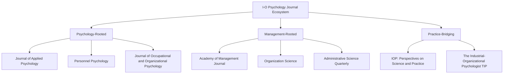

## Professional Associations, Journals, and Practice Standards

### Overview

The institutional infrastructure of I-O Psychology — its professional associations, scholarly journals, and codified practice standards — legitimizes the field, enforces quality and ethical norms, and provides the mechanisms by which research and practice remain connected (see the Scientist-Practitioner Model, prior chapter item).

**Key Points**

- Professional associations serve dual functions: advancing the science (conferences, journals) and protecting practice quality (ethics codes, credentialing advocacy)
- Journal ecosystems are stratified by rigor, audience (academic vs. practitioner), and topical focus
- Practice standards, especially in personnel selection, carry direct legal weight in jurisdictions like the United States

### Major Professional Associations

**Society for Industrial and Organizational Psychology (SIOP)**

- The primary professional body for I-O psychologists in the United States; constituted as **Division 14 of the American Psychological Association (APA)**, established 1945, renamed SIOP in 1982
- Hosts the field's largest annual conference, publishes practice guidelines, and sets voice for the profession in policy matters (e.g., commenting on EEOC guidance, testifying on employment law)
- Publishes the *Principles for the Validation and Use of Personnel Selection Procedures*, a foundational practice standard document (most recent edition 2018, 5th edition)

**Academy of Management (AOM)**

- The primary professional body for Organizational Behavior and management scholars, broader in scope than I-O Psychology (includes strategy, entrepreneurship, organizational theory divisions alongside OB)
- Its OB division overlaps substantially with Organizational Psychology in subject matter but is rooted in business school rather than psychology department traditions

**European Association of Work and Organizational Psychology (EAWOP)**

- The primary pan-European professional body, analogous to SIOP but with distinct regional emphases (stronger tradition of work psychology/ergonomics integration, occupational health psychology)

**International Association of Applied Psychology (IAAP) — Division 1: Organizational Psychology**

- A global umbrella organization connecting national and regional I-O/work psychology associations

**American Psychological Association (APA)**

- The parent body of SIOP (as Division 14); sets overarching ethical principles (APA Ethics Code) that apply to all psychology practice including I-O

**[Inference]** National associations in other regions (e.g., the Chinese Association for Industrial and Organizational Psychology, Australian Psychological Society's College of Organisational Psychologists) exist and are professionally significant within their contexts, though comprehensive comparative coverage of all national bodies is beyond commonly available synthesized reference material and would benefit from targeted regional research if needed.

### Journal Landscape

Journals are typically categorized along two dimensions: **rigor/scope** (top-tier general vs. specialized vs. practitioner-oriented) and **disciplinary home** (psychology vs. management).

**Top-tier academic journals (psychology-rooted):**

- *Journal of Applied Psychology* — widely regarded as the flagship outlet for empirical I-O research; publishes across selection, motivation, leadership, and methodology
- *Personnel Psychology* — historically strong emphasis on selection, staffing, and personnel research
- *Journal of Occupational and Organizational Psychology* — European-based, broad organizational psychology scope
- *Journal of Organizational Behavior* — straddles psychology and management, strong OB focus

**Top-tier academic journals (management-rooted):**

- *Academy of Management Journal*
- *Academy of Management Review* (theory-focused, not empirical)
- *Organization Science*
- *Administrative Science Quarterly*

**Practice-oriented and bridging journals:**

- *Industrial and Organizational Psychology: Perspectives on Science and Practice* — explicitly designed to bridge the research-practice gap, featuring focal articles with practitioner and academic commentaries
- *The Industrial-Organizational Psychologist (TIP)* — SIOP's own practitioner-facing publication (not peer-reviewed in the traditional sense; more magazine-style)
- *Consulting Psychology Journal* — practice and consulting-focused

**Methodological/statistical journals relevant to I-O:**

- *Organizational Research Methods*
- *Psychological Methods*

### Journal Ecosystem Diagram

### Practice Standards and Guidelines

**Principles for the Validation and Use of Personnel Selection Procedures (SIOP)**

- The authoritative professional standard for developing, validating, and implementing personnel selection systems in the U.S.
- Currently in its **5th edition (2018)**; addresses validity evidence, fairness, adverse impact, and documentation requirements
- Designed to align with (but is professionally distinct from) legal/regulatory standards

**Uniform Guidelines on Employee Selection Procedures (1978)**

- A U.S. federal regulatory document (jointly issued by EEOC, Department of Labor, Department of Justice, and Civil Service Commission) establishing legal standards for demonstrating that selection procedures do not produce unlawful adverse impact
- Not a SIOP document, but SIOP's *Principles* are explicitly designed to be consistent with and often exceed its requirements

**Standards for Educational and Psychological Testing (AERA, APA, NCME)**

- A broader cross-disciplinary standard (jointly published by the American Educational Research Association, APA, and National Council on Measurement in Education) governing test development and use generally, frequently cited in I-O validation work
- Most recent edition: 2014

**APA Ethical Principles of Psychologists and Code of Conduct**

- Governs professional conduct broadly, including confidentiality, competence boundaries, conflicts of interest, and informed consent — applicable to I-O psychologists as APA-affiliated professionals

### Credentialing and Licensure

- Unlike clinical psychology, I-O Psychology in the U.S. generally does **not** require state licensure to practice in organizational/business settings (though licensure is required if practicing in contexts legally defined as "psychological services," which varies by state)
- **[Unverified]** The specific licensure requirements and their enforcement vary meaningfully by U.S. state and by practice context (internal corporate role vs. external consulting), and I-O psychologists and legal scholars have long debated whether current licensure frameworks (designed primarily around clinical practice) appropriately fit I-O practice; this is an unresolved regulatory and professional identity question rather than a matter with a single settled answer
- Board certification is available through the **American Board of Organizational and Business Consulting Psychology (ABOBCP)**, though pursuit of formal board certification is less universal in I-O than in clinical specialties

### Conference and Community Infrastructure

- **SIOP Annual Conference**: The field's largest gathering, featuring research presentations, practitioner symposia, and professional development
- **Academy of Management Annual Meeting**: The largest management scholarship conference, with a substantial OB-focused program track
- **EAWOP Congress**: Biennial European equivalent

### Illustrative Example

**Scenario**: A consulting firm wants to launch a new AI-based pre-employment personality assessment.

- To meet professional standards, the firm's I-O psychologists would consult SIOP's *Principles* to structure a validation study (criterion-related and/or content validity evidence)
- They would need to demonstrate compliance with the *Uniform Guidelines*' adverse impact thresholds (e.g., the four-fifths rule) to defend against potential disparate impact claims
- Test construction would reference the *AERA/APA/NCME Standards* for psychometric development
- Published validation findings, if submitted for peer review, would likely target *Journal of Applied Psychology* or *Personnel Psychology*; a practitioner-facing summary might appear in *TIP* or *IOP: Perspectives on Science and Practice*

### Conclusion

I-O Psychology's professional infrastructure — anchored by SIOP, complemented by AOM and international bodies, sustained by a stratified journal ecosystem, and governed by validation and ethical standards like SIOP's *Principles* and the *Uniform Guidelines* — provides the scaffolding that keeps the field's science and practice mutually accountable. This infrastructure operationalizes the Scientist-Practitioner Model at an institutional level, ensuring organizational interventions remain traceable to empirical evidence and defensible under legal scrutiny.

**Related Topics**

- The Uniform Guidelines on Employee Selection Procedures in Depth
- Adverse Impact and the Four-Fifths Rule
- SIOP's Principles for Validation: Detailed Walkthrough
- Licensure and Credentialing Debates in I-O Psychology
- The Research-Practice Gap and Bridging Journals
- Ethics in Organizational Assessment and Consulting