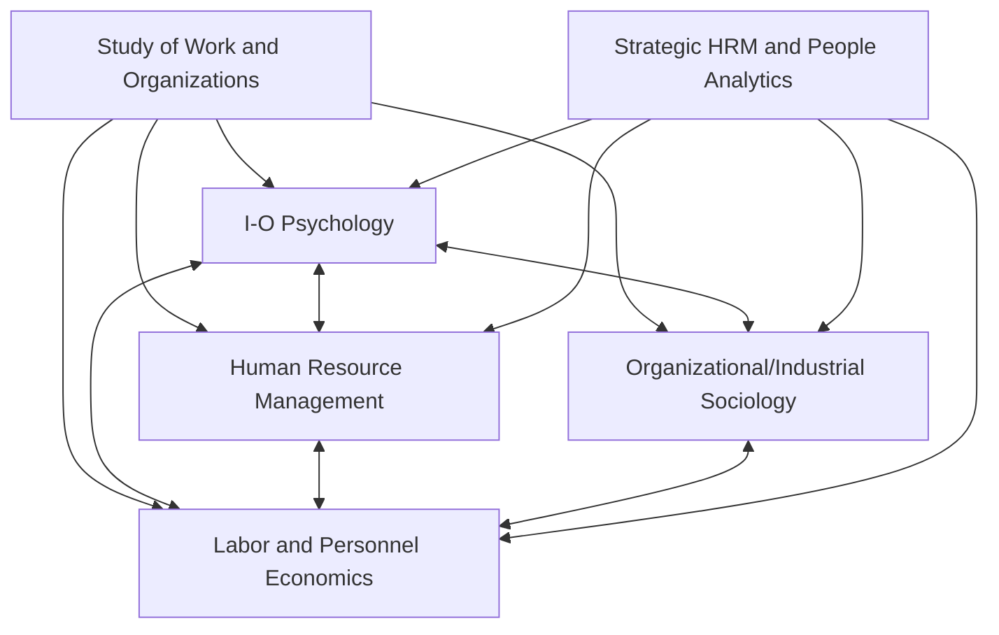

## Related Disciplines in Human Resource Management, Sociology, and Economics

### Overview

I-O Psychology does not operate in isolation; it sits within a broader interdisciplinary ecosystem of fields that study work, organizations, and labor from complementary angles. Understanding these boundaries and overlaps clarifies both what I-O Psychology distinctively contributes and where it draws on, competes with, or feeds into neighboring disciplines.

**Key Points**

- Each related discipline studies overlapping phenomena (e.g., pay, turnover, hiring) but with different units of analysis, methods, and underlying assumptions about human behavior
- I-O Psychology tends toward the psychological/individual-differences end of a spectrum; Sociology toward the structural/institutional end; Economics toward the rational-actor/market end; HRM toward the applied/managerial end
- Modern practice increasingly requires fluency across these boundaries, particularly in areas like people analytics and strategic HR

### Human Resource Management (HRM)

**Disciplinary character**: HRM is fundamentally a **management practice discipline**, typically housed in business schools, focused on the functional administration of the employment relationship.

**Core domains:**

- Recruitment and staffing operations
- Compensation and benefits administration
- Labor relations and collective bargaining
- Employment law compliance
- HR information systems (HRIS) and HR technology
- Strategic HR alignment with business objectives

**Relationship to I-O Psychology:**

- I-O Psychology often provides the **scientific/theoretical foundation** for HRM practices (e.g., validated selection tests, performance appraisal science, motivation theory), while HRM provides the **operational and administrative execution** framework
- HRM tends to be more comprehensive in scope (covering payroll, legal compliance, benefits administration) than I-O Psychology, which is narrower but deeper on the behavioral science side
- Many practitioners function as "I-O psychologists working within HR functions," blurring the professional line in practice even though the disciplines remain academically distinct

**[Inference]** In job markets, the title "HR" is often used loosely to describe roles that could be filled by HRM-trained generalists or I-O-trained specialists; the specific mix of skills expected under an "HR" job title varies substantially by employer and is not standardized across organizations.

### Sociology (Organizational and Industrial Sociology)

**Disciplinary character**: Sociology examines organizations as **social structures and institutions**, emphasizing macro-level and meso-level phenomena over individual psychology.

**Core domains and theoretical contributions:**

- **Institutional theory** (DiMaggio & Powell): Explains why organizations in the same field become structurally similar (isomorphism) due to normative, mimetic, and coercive pressures, not just efficiency
- **Organizational demography and network analysis**: Studies how the composition of organizational members and the structure of relationships (social network analysis) shape outcomes like innovation diffusion and turnover
- **Weberian bureaucracy theory**: Max Weber's foundational analysis of rational-legal authority, hierarchy, and formalized rules as the defining features of modern organizations
- **Labor process theory**: A more critical/Marxist-influenced tradition examining power, control, and alienation in the employment relationship (Harry Braverman's work on deskilling is a key reference point)

**Relationship to I-O Psychology:**

- Sociology's structural/institutional lens complements I-O Psychology's individual-differences lens; a sociologist might explain high turnover via industry-wide labor market institutions, while an I-O psychologist might explain the same phenomenon via person-job fit or selection validity
- Organizational Behavior (see prior chapter item) more directly absorbs sociological theory than core Industrial/Organizational Psychology does

### Economics (Labor Economics and Personnel Economics)

**Disciplinary character**: Economics analyzes work-related phenomena through the lens of **rational choice, incentives, markets, and equilibrium**, typically using formal mathematical modeling and econometric methods.

**Core domains and theoretical contributions:**

- **Human capital theory** (Gary Becker, Jacob Mincer): Models education and training as investments yielding returns via higher wages, providing an economic rationale for training investment decisions
- **Personnel economics**: A subfield explicitly studying HR practices (compensation design, promotion tournaments, incentive pay) using microeconomic and game-theoretic tools — Edward Lazear is a foundational figure
- **Signaling theory** (Michael Spence): Explains credentials (degrees, certifications) as signals of underlying ability rather than necessarily productive skill acquisition, offering an alternative to human capital explanations for education's labor market returns
- **Efficiency wage theory**: Explains why firms may pay above-market wages to increase productivity, reduce shirking, or reduce turnover, connecting to I-O concepts of motivation and retention from a different theoretical starting point
- **Principal-agent theory**: Models the employer-employee relationship as one of information asymmetry and misaligned incentives, informing compensation and monitoring system design

**Relationship to I-O Psychology:**

- Economics tends to assume rational, utility-maximizing behavior, while I-O Psychology incorporates bounded rationality, cognitive biases, and social/emotional motivators more centrally
- **Personnel economics and I-O Psychology frequently study identical phenomena (e.g., pay-for-performance effectiveness, turnover) using different methods and sometimes reaching different conclusions** — economics via natural experiments/econometrics on large administrative datasets, I-O via survey-based and experimental psychological methods
- **[Unverified]** The degree of productive cross-pollination versus parallel, non-communicating research streams between personnel economics and I-O Psychology is a matter that different scholars characterize differently; some observers argue the fields talk past each other more than they should, while interdisciplinary work (e.g., in strategic HRM research) increasingly bridges them, but no consensus exists on how well-integrated the two literatures currently are.

### Comparative Table

| Discipline | Primary Unit of Analysis | Core Assumption About Behavior | Primary Method | Academic Home |
| --- | --- | --- | --- | --- |
| I-O Psychology | Individual (+ group) | Psychological needs, cognition, individual differences | Psychometrics, surveys, experiments | Psychology Dept. |
| HRM | Organizational function/policy | Practical/managerial effectiveness | Case studies, applied research, benchmarking | Business School |
| Sociology | Institution/structure/network | Social structure shapes behavior | Ethnography, network analysis, comparative/historical | Sociology Dept. |
| Economics | Market/firm/rational agent | Rational utility maximization (with modern behavioral caveats) | Econometrics, formal modeling, natural experiments | Economics Dept. |

### Interdisciplinary Map

### Illustrative Example: One Question, Four Disciplinary Answers

**Question**: Why do employees leave organizations voluntarily?

- **I-O Psychology answer**: Poor person-job fit, low job satisfaction, weak organizational commitment, or inadequate realistic job previews during hiring
- **HRM answer**: Inadequate compensation benchmarking, poor onboarding process design, or insufficient career pathing programs
- **Sociology answer**: Institutional norms in the industry (e.g., "job-hopping culture" in tech), weak organizational embeddedness, or network effects (peers leaving triggers further departures)
- **Economics answer**: Wages below market-clearing rate, better outside options (opportunity cost), or a mismatch between compensation structure and observed productivity (efficiency wage failure)

**[Inference]** A rigorous, real-world turnover diagnosis would typically need to draw on multiple of these explanatory frameworks simultaneously, since the frameworks are not mutually exclusive and each captures genuinely distinct causal mechanisms; treating any single-discipline explanation as complete is a common but avoidable analytical shortcut.

### Emerging Interdisciplinary Convergence: People Analytics

- **People analytics** (or HR analytics) has emerged as an explicitly interdisciplinary practice area combining I-O psychometric theory, HRM operational data, sociological network analysis, and economic/econometric causal inference methods
- Organizations increasingly hire teams blending I-O psychologists, data scientists, and economists to analyze workforce data, reflecting practical convergence even where academic disciplines remain institutionally separate

### Conclusion

I-O Psychology exists within a dense interdisciplinary neighborhood alongside HRM, Sociology, and Economics, each offering a distinct but complementary lens on work and organizational phenomena. While disciplinary boundaries remain institutionally real (separate departments, journals, and methodological traditions), applied practice — particularly in emerging areas like people analytics — increasingly requires integrating insights across all four fields rather than treating them as competing silos.

**Related Topics**

- Personnel Economics: Incentive Design and Tournament Theory
- Institutional Theory and Organizational Isomorphism
- Human Capital Theory vs. Signaling Theory in Labor Markets
- People Analytics: Methods and Interdisciplinary Integration
- Strategic Human Resource Management (SHRM) Frameworks
- Social Network Analysis Applied to Organizations