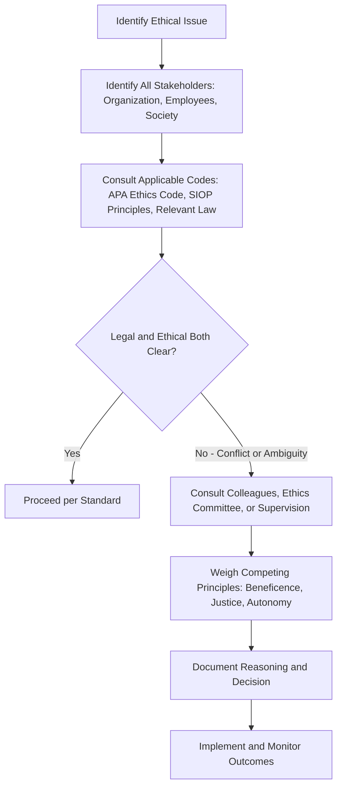

## Ethics and Professional Standards in Applied Practice

### Overview

Ethical conduct in I-O Psychology governs how practitioners design, administer, and interpret organizational interventions — particularly high-stakes ones like personnel selection, performance evaluation, and organizational change — that materially affect individuals' livelihoods and organizations' legal exposure. Ethics in this field sits at the intersection of general psychological ethics, employment law, and the specific power asymmetries of workplace research and consulting.

**Key Points**

- I-O psychologists are bound by the APA Ethics Code as a baseline, supplemented by SIOP-specific practice principles
- Ethical challenges in I-O Psychology are distinctive because the "client" (the organization paying for services) and the "subject" (the employee being assessed) are often different parties with potentially conflicting interests
- Legal and ethical obligations frequently overlap but are not identical — conduct can be legal but ethically questionable, or vice versa

### Foundational Ethical Frameworks

**APA Ethical Principles of Psychologists and Code of Conduct**

- The overarching ethical code governing all APA-affiliated psychologists, including I-O practitioners (via SIOP/Division 14 membership)
- Organized around five aspirational principles: Beneficence and Nonmaleficence, Fidelity and Responsibility, Integrity, Justice, and Respect for People's Rights and Dignity
- Enforceable standards cover areas including competence, informed consent, confidentiality, assessment, and avoiding harm

**SIOP-Specific Guidance**

- SIOP does not maintain a fully separate ethics code but provides interpretive guidance on applying APA ethical principles to organizational contexts, alongside the *Principles for the Validation and Use of Personnel Selection Procedures* (see prior chapter item), which embeds ethical expectations directly into technical validation practice

### Core Ethical Domains in I-O Practice

**1. Informed Consent and Transparency**

- Employees/candidates undergoing assessment (selection tests, 360-degree feedback, engagement surveys) should generally understand what is being measured, how data will be used, and who will see results
- Tension arises when full transparency could compromise assessment validity (e.g., disclosing exact scoring criteria for an integrity test might enable faking); ethical practice requires balancing transparency against legitimate measurement integrity concerns

**2. Confidentiality and Data Privacy**

- Assessment results, survey responses (especially engagement/climate surveys), and coaching/consulting disclosures often carry expectations of confidentiality
- Organizational context complicates confidentiality: aggregate survey data may be shared with management while individual responses remain protected, requiring careful communication of what confidentiality actually covers
- **[Inference]** The rise of continuous, passive workplace data collection (email metadata analysis, keystroke monitoring, wearable sensors) has significantly outpaced traditional confidentiality norms built around discrete, consent-based assessment events; this is widely discussed as an emerging ethical frontier in the field, though comprehensive professional consensus on best practices is still developing.

**3. Competence and Scope of Practice**

- Practitioners must only offer services within their demonstrated competence (e.g., not administering clinical psychological assessments without appropriate training)
- Requires staying current with evolving research, particularly as new assessment technologies (AI-scored interviews, gamified assessments) proliferate faster than peer-reviewed validation evidence accumulates

**4. Avoiding Harm and Managing Dual Relationships**

- I-O psychologists often face **dual-agency tension**: hired and paid by the organization, but their assessments/recommendations directly affect individual employees who are not the paying client
- Ethical practice requires clarity about who the client is, transparent communication to all parties about this relationship, and avoiding recommendations that serve organizational interests at the expense of basic fairness to individuals

**5. Fairness, Bias, and Adverse Impact**

- Selection and assessment tools must be evaluated for differential validity and adverse impact across protected groups (race, sex, age, disability, etc., per applicable jurisdiction's employment law)
- Ethical obligation extends beyond mere legal compliance (avoiding lawsuits) to proactively pursuing equitable measurement practice
- **[Unverified]** Debates continue within the field regarding the appropriate balance between maximizing predictive validity and minimizing adverse impact when these goals are empirically in tension for a given selection tool; various technical approaches (e.g., differential weighting, alternative predictors) are proposed, but no universally agreed-upon resolution exists across all contexts and expert opinion is genuinely divided.

**6. Research Ethics in Organizational Settings**

- Organizational research (e.g., field experiments testing management interventions) must still meet standard human-subjects research ethics: informed consent, minimization of harm, debriefing, and often Institutional Review Board (IRB) oversight when conducted in academic-affiliated contexts
- Power dynamics in workplace settings (employees may feel unable to freely decline participation in employer-sponsored research) raise distinctive concerns about the voluntariness of consent

### Ethical Decision-Making Framework

A common applied approach (reflecting APA/SIOP guidance broadly, not a single official algorithm) for navigating ethical dilemmas in practice:

### Illustrative Example

**Scenario**: An organization asks an I-O psychologist to design a personality assessment for hiring, and internal data suggests the assessment, while valid overall, produces a modest adverse impact against a protected group.

**Ethical practitioner response would typically involve:**

- Disclosing the adverse impact finding transparently to the client organization rather than concealing it
- Investigating whether alternative valid predictors with less adverse impact exist (per SIOP *Principles* guidance on exploring alternatives)
- Documenting the validity evidence and business necessity justification thoroughly, given potential legal exposure under disparate impact doctrine
- Avoiding recommending continued use of the tool solely because it is administratively convenient, if defensible lower-impact alternatives exist
- Communicating honestly with the organization about legal risk, not merely technical validity

**[Inference]** In practice, this kind of finding often triggers a genuine business-versus-ethics tension for the practitioner, since replacing a working assessment system carries real organizational cost; professional norms treat transparent disclosure and diligent exploration of alternatives as the ethical minimum, though the ultimate business decision rests with the client organization rather than the psychologist.

### Enforcement Mechanisms

- **APA Ethics Committee**: Can investigate complaints against APA members, with potential sanctions ranging from reprimand to expulsion
- **State licensing boards**: For I-O psychologists practicing in licensed capacities, state boards can independently investigate and sanction ethical violations
- **Professional reputational mechanisms**: SIOP membership and conference community standing function as informal enforcement, given the field's relatively small, interconnected professional network
- **Legal liability**: Employment discrimination law (e.g., Title VII in the U.S.) provides an independent, and often more consequential, enforcement mechanism for selection-related ethical failures, since adverse impact litigation carries direct financial and legal consequences distinct from professional ethics sanctions

### Emerging Ethical Frontiers

- **Algorithmic and AI-based assessment**: Raises novel questions about explainability, consent to automated decision-making, and validation standards for tools whose scoring logic may not be fully interpretable even to their developers
- **People analytics and surveillance**: Continuous behavioral data collection raises confidentiality and autonomy concerns beyond traditional discrete-assessment ethics frameworks
- **Cross-cultural and global practice**: Ethical norms developed primarily in U.S./Western contexts (individual privacy, informed consent frameworks) may require adaptation when practicing in different legal and cultural environments, an area of active professional discussion rather than settled guidance

### Conclusion

Ethics and professional standards in I-O Psychology extend general psychological ethical principles into the distinctive context of organizational practice, where dual-agency relationships, legal adverse-impact exposure, and high-stakes individual consequences (hiring, promotion, termination decisions) create ethical complexity beyond typical clinical or research settings. The field's professional infrastructure — APA ethics codes, SIOP validation principles, and legal frameworks like the Uniform Guidelines — together aim to ensure organizational psychology practice remains both scientifically defensible and fair to the individuals it affects, though genuine areas of ongoing debate (bias-validity tradeoffs, algorithmic assessment, data privacy) remain unresolved as the field evolves.

**Related Topics**

- Adverse Impact, Disparate Treatment, and the Four-Fifths Rule in Depth
- Informed Consent in Organizational Research and Assessment
- Ethical Issues in AI-Driven Hiring and People Analytics
- Dual-Agency and Multiple-Client Relationships in Consulting Psychology
- Cross-Cultural Ethics in Global Organizational Practice
- Employment Discrimination Law: Title VII and Disparate Impact Doctrine

**Next Steps**

- This completes the "Foundations and History of Organizational Psychology" chapter. Ready to proceed to the next chapter when you provide it.