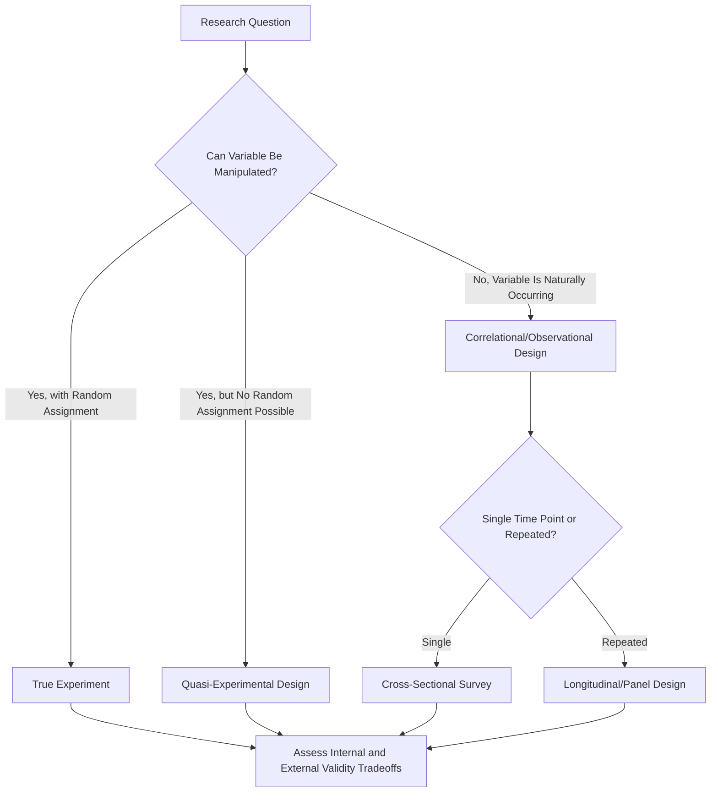

## Quantitative Research Design

### Overview

Quantitative research design encompasses the systematic planning of studies that collect and analyze numerical data to test hypotheses, estimate relationships, and draw generalizable conclusions about organizational phenomena. It forms the methodological backbone of empirical I-O Psychology, underlying everything from selection test validation to intervention evaluation.

**Key Points**

- Design choices directly determine what causal or correlational claims a study can legitimately support
- The central design tradeoff is typically between internal validity (confidence in causal claims) and external validity (generalizability to real organizational settings)
- I-O Psychology draws on the full spectrum of quantitative designs used across social science, adapted to organizational constraints (limited sample sizes, ethical limits on manipulation, field access constraints)

### Core Design Categories

**1. Experimental Designs**

- **True experiments**: Random assignment of participants to conditions (treatment vs. control), enabling strong causal inference
- **Laboratory experiments**: Conducted in controlled settings, often with student or online panel samples rather than actual employees, maximizing internal validity at some cost to external validity
- **Field experiments**: Conducted within actual organizations with real employees, randomly assigning some units (individuals, teams, or organizational subunits) to interventions — offers stronger external validity but is logistically and ethically harder to implement
- **[Inference]** True field experiments with random assignment remain relatively rare in organizational research compared to lab experiments or observational designs, primarily due to organizational resistance to randomizing potentially beneficial interventions (e.g., training, pay changes) across employees; this scarcity is widely acknowledged in the methodological literature, though exact prevalence figures vary by how "field experiment" is defined across reviews.

**2. Quasi-Experimental Designs**

- Used when true random assignment is infeasible but some form of comparison or manipulation still exists
- **Nonequivalent control group designs**: Compare a treatment group to a similar (but not randomly assigned) comparison group
- **Interrupted time-series designs**: Track an outcome variable before and after an intervention across many time points, allowing assessment of whether the intervention shifted the trend beyond what pre-existing patterns would predict
- **Regression discontinuity designs**: Exploit a cutoff/threshold rule (e.g., a test score cutoff for promotion eligibility) to approximate random assignment near the threshold

**3. Correlational/Observational (Non-Experimental) Designs**

- **Cross-sectional surveys**: Data collected at a single time point; useful for examining relationships between variables (e.g., job satisfaction and turnover intentions) but cannot establish temporal precedence or rule out reverse causation
- **Longitudinal/panel designs**: Same participants measured repeatedly over time, enabling examination of within-person change and stronger (though still not definitive) causal inference than cross-sectional designs
- **Archival/secondary data designs**: Analysis of existing organizational records (HR databases, performance records, exit interview data) not originally collected for research purposes

### Key Design Concepts

**Internal Validity**: The degree to which a study design supports confident causal conclusions — i.e., that the independent variable, not some confound, produced the observed effect on the dependent variable. Threats include history, maturation, testing effects, instrumentation, regression to the mean, selection bias, and attrition.

**External Validity**: The degree to which findings generalize beyond the specific sample, setting, and time of the study to other populations, organizations, or contexts.

**[Inference]** Internal and external validity often trade off against each other in practice (tighter experimental control typically narrows generalizability), though this tradeoff is not absolute — well-designed field experiments can achieve strong performance on both dimensions simultaneously, making the "tradeoff" framing a useful heuristic rather than a strict mathematical law.

**Construct Validity**: The degree to which the operationalized measures used in a study actually capture the theoretical constructs of interest (e.g., does a self-report survey item truly measure "organizational commitment" as theoretically defined).

**Statistical Conclusion Validity**: The degree to which statistical analyses correctly detect and estimate the true relationships in the data — threats include low statistical power, violated statistical assumptions, and inappropriate analysis choices.

### Sampling Considerations

- **Probability sampling** (random, stratified, cluster): Enables statistical generalization to a defined population but is often impractical in organizational settings where the researcher cannot randomly sample from "all employees" in a meaningful population frame
- **Convenience/non-probability sampling**: Common in I-O research (e.g., employees of a single partnering organization, online panels like MTurk or Prolific) — raises generalizability concerns that must be explicitly acknowledged
- **Power analysis**: Conducted a priori to determine adequate sample size for detecting expected effect sizes with acceptable statistical power (conventionally 80%), increasingly required by journals and grant reviewers before data collection begins

### Common Statistical Approaches by Design

| Design Type | Typical Analysis | Example Application |
| --- | --- | --- |
| True experiment (2 groups) | Independent samples t-test, ANOVA | Comparing training method A vs. B on post-test performance |
| Field experiment (multiple conditions/covariates) | ANCOVA, regression | Testing leadership intervention while controlling for baseline engagement |
| Cross-sectional survey | Multiple regression, structural equation modeling (SEM) | Predicting turnover intention from job satisfaction and commitment |
| Longitudinal/panel | Growth curve modeling, cross-lagged panel models, multilevel modeling | Tracking engagement trajectories across the first year of employment |
| Nested/multilevel data (individuals within teams within organizations) | Hierarchical linear modeling (HLM) / multilevel modeling (MLM) | Examining how team climate (team-level) predicts individual performance (individual-level) |

### Research Design Decision Flow

### Illustrative Example

**Research question**: Does a new onboarding program improve new-hire retention?

- **Weak design (cross-sectional, post-hoc)**: Survey current employees about onboarding satisfaction and correlate with tenure — vulnerable to survivorship bias (departed employees aren't surveyed) and reverse causation
- **Stronger design (quasi-experimental)**: Compare retention rates between a business unit that adopted the new onboarding program and a similar unit that did not, controlling for pre-existing differences
- **Strongest design (field experiment)**: Randomly assign incoming cohorts of new hires to the new vs. old onboarding program, then compare 12-month retention rates — enables the most confident causal claim, provided randomization is properly implemented and attrition is monitored

### Common Design Threats and Mitigations

- **Common method bias**: When both predictor and outcome are measured via the same method (e.g., same self-report survey at the same time), inflating observed relationships artificially. Mitigated via temporal separation, multiple data sources (supervisor ratings alongside self-report), or statistical controls (e.g., marker variable technique)
- **Attrition/dropout**: Particularly relevant in longitudinal organizational research, since employees who leave the organization also typically leave the study, potentially biasing results toward those who stayed
- **Range restriction**: Common in selection research, since only hired candidates (a non-random, already-selected subset) can have their subsequent job performance observed, artificially attenuating observed validity coefficients — addressed via statistical correction formulas

### Conclusion

Quantitative research design in I-O Psychology requires balancing methodological rigor against the practical, ethical, and access constraints inherent to studying real organizations. While true experiments offer the strongest causal inference, quasi-experimental and longitudinal designs represent the field's practical workhorses, given that randomization is frequently infeasible in applied organizational settings. Design choice should always be driven by the research question's causal versus descriptive/correlational ambitions, with explicit acknowledgment of the internal-external validity tradeoffs each design choice entails.

**Related Topics**

- Multilevel Modeling and Nested Organizational Data
- Common Method Bias: Detection and Mitigation Strategies
- Statistical Power Analysis in Organizational Research
- Longitudinal Data Analysis: Growth Curves and Cross-Lagged Models
- Field Experiments in Organizational Settings: Practical Challenges
- Range Restriction and Validity Coefficient Correction