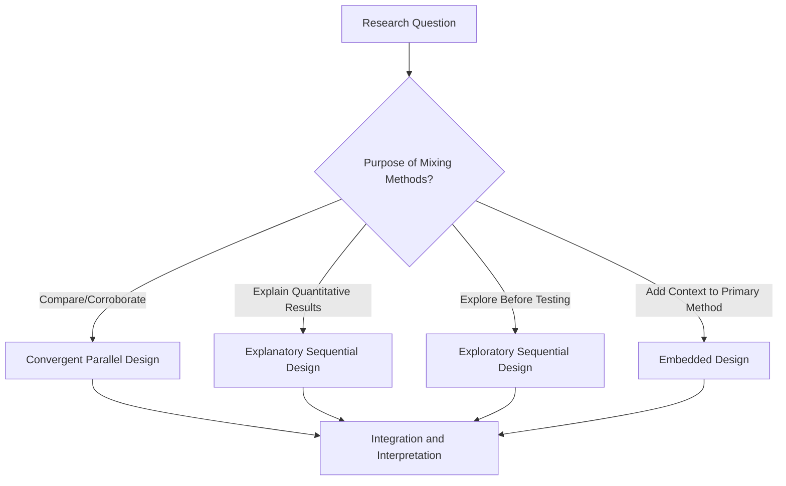

## Qualitative and Mixed Methods Research

### Overview

Qualitative research collects and analyzes non-numerical data (words, observations, images) to understand meaning, context, and process in organizational life, complementing quantitative methods' focus on measurement and generalization. Mixed methods research deliberately combines qualitative and quantitative approaches within a single study to leverage the strengths of both.

**Key Points**

- Qualitative methods excel at answering "how" and "why" questions and at discovering phenomena not yet captured by existing measurement instruments
- Quantitative methods excel at testing precise hypotheses and generalizing findings across large samples
- Mixed methods designs are increasingly valued in I-O Psychology for triangulating findings and addressing the field's historic overreliance on self-report surveys

### Major Qualitative Approaches

**1. Grounded Theory**

- Originated by Barney Glaser and Anselm Strauss (1967); an inductive approach where theory is developed systematically from data itself, rather than tested from pre-existing hypotheses
- Involves iterative cycles of data collection, coding, and constant comparison until "theoretical saturation" (new data no longer generates new insights) is reached
- Commonly used in I-O Psychology to explore emergent organizational phenomena where existing theory is thin (e.g., understanding a novel form of remote work culture)

**2. Case Study Research**

- In-depth examination of one or a small number of "cases" (an organization, team, or event), often combining multiple data sources (interviews, documents, observation)
- **Robert Yin's** methodological framework is widely referenced for distinguishing exploratory, descriptive, and explanatory case study designs
- Particularly useful for studying rare or unique organizational phenomena (a specific merger, a crisis response) where large-sample quantitative study is impossible

**3. Ethnography and Participant Observation**

- Researcher embeds within an organizational setting over extended time to observe naturally occurring behavior, culture, and social dynamics
- Rooted in anthropological tradition; in organizational contexts, often called "organizational ethnography"
- Provides rich contextual understanding but raises practical challenges (time-intensive, potential observer effects, researcher subjectivity)

**4. Phenomenology**

- Focuses on understanding the lived experience of a phenomenon from participants' own perspective (e.g., what it is like to experience workplace burnout, or to be a first-generation professional navigating corporate culture)
- Typically relies on in-depth interviews analyzed for common experiential themes

**5. Narrative Analysis**

- Examines how individuals construct and tell stories about their work experiences, treating the structure and content of narratives themselves as data (e.g., how employees narrate career transitions or organizational change experiences)

### Qualitative Data Collection Methods

- **Semi-structured interviews**: The most common qualitative data collection tool in I-O Psychology, using a flexible guide of open-ended questions allowing follow-up and exploration
- **Focus groups**: Group interviews leveraging participant interaction to surface shared and divergent perspectives, useful for understanding team or departmental culture
- **Document analysis**: Examination of organizational artifacts (mission statements, internal communications, policy documents) as data
- **Direct observation**: Systematic watching and recording of behavior in natural settings, ranging from unstructured ethnographic observation to more structured behavioral coding

### Qualitative Data Analysis Techniques

- **Thematic analysis**: Identifying, analyzing, and reporting patterns (themes) within qualitative data; among the most widely used general-purpose approaches (Braun & Clarke's framework is a commonly cited methodological reference)
- **Content analysis**: Systematically categorizing text data into predefined or emergent categories, sometimes quantified (counting theme frequency) to bridge toward quantitative analysis
- **Coding**: The foundational analytic process of labeling segments of data with conceptual tags; can be inductive (codes emerge from data) or deductive (codes derived from existing theory)
- **Computer-assisted qualitative data analysis software (CAQDAS)**: Tools like NVivo, ATLAS.ti, and MAXQDA support systematic coding and organization of large qualitative datasets

### Rigor Standards in Qualitative Research

Since qualitative research does not use statistical significance or effect sizes, it employs parallel rigor criteria:

- **Credibility** (parallel to internal validity): Achieved through techniques like member checking (verifying interpretations with participants) and prolonged engagement
- **Transferability** (parallel to external validity): Achieved through thick, detailed description enabling readers to judge applicability to other contexts
- **Dependability** (parallel to reliability): Achieved through audit trails documenting the analytic process
- **Confirmability** (parallel to objectivity): Achieved through reflexivity — researchers explicitly acknowledging their own positionality and potential influence on data interpretation

### Mixed Methods Research Designs

Mixed methods research explicitly integrates qualitative and quantitative data within a single study, guided by established design typologies (most influentially, Creswell & Plano Clark's framework).

**1. Convergent Parallel Design**

- Quantitative and qualitative data collected simultaneously, analyzed separately, then merged/compared during interpretation
- Example: Administering an employee engagement survey (quantitative) alongside open-ended interviews (qualitative) during the same period, then comparing whether findings converge or diverge

**2. Explanatory Sequential Design**

- Quantitative data collected and analyzed first; qualitative data collected afterward to help explain or elaborate on the quantitative findings
- Example: A survey reveals unexpectedly low engagement in one department; follow-up interviews explore why

**3. Exploratory Sequential Design**

- Qualitative data collected first to explore a phenomenon and generate hypotheses or build a measurement instrument; quantitative data collected afterward to test generalizability
- Example: Interviews reveal a previously undocumented form of workplace stress; researchers then develop and validate a survey instrument to measure it at scale

**4. Embedded Design**

- One data type (usually qualitative) is nested within a primarily quantitative (or vice versa) study design, providing supplementary context
- Example: A field experiment testing a leadership intervention (primarily quantitative outcome measures) embeds qualitative exit interviews to understand implementation experience

### Mixed Methods Design Flow

### Illustrative Example

**Scenario**: An organization wants to understand and address declining employee engagement following a major restructuring.

- **Qualitative-only approach**: Conduct in-depth interviews with employees across departments to understand the lived experience of the restructuring, surfacing themes like loss of team identity or unclear reporting lines — rich but not generalizable to the full workforce with statistical confidence
- **Quantitative-only approach**: Administer a validated engagement survey pre/post restructuring — generalizable and statistically testable, but may miss unanticipated concerns not captured by existing survey items
- **Mixed methods (exploratory sequential)**: Begin with focus groups to identify emergent, restructuring-specific concerns not captured by standard engagement surveys; use these findings to develop supplementary survey items; administer the enhanced survey organization-wide to quantify prevalence and identify which departments are most affected

### Strengths, Limitations, and When to Use Each Approach

| Consideration | Quantitative | Qualitative | Mixed Methods |
| --- | --- | --- | --- |
| Generalizability | High (with adequate sampling) | Low (context-specific) | Can achieve both, sequentially or in parallel |
| Depth of understanding | Lower (constrained by predefined measures) | High (rich, contextual) | High, informed by both |
| Best for | Testing established hypotheses at scale | Exploring novel or poorly understood phenomena | Complex questions requiring both breadth and depth |
| Resource intensity | Moderate (survey administration, analysis) | High (interview/observation time, coding) | Highest (requires both skill sets and more time) |

### Conclusion

Qualitative and mixed methods research provide essential complements to the quantitative tradition historically dominant in I-O Psychology, offering tools to explore emergent phenomena, understand lived experience, and generate richer, more contextually grounded organizational insight. Mixed methods designs, by deliberately integrating both traditions, are increasingly recognized as a powerful approach for addressing complex organizational questions that neither purely quantitative nor purely qualitative methods can fully answer alone.

**Related Topics**

- Grounded Theory Methodology in Organizational Research
- Thematic Analysis: Step-by-Step Application
- Organizational Ethnography: Methods and Ethical Considerations
- Survey Design and Validated Measurement Instruments
- Triangulation in Mixed Methods Organizational Research
- Reflexivity and Researcher Positionality in Qualitative Inquiry