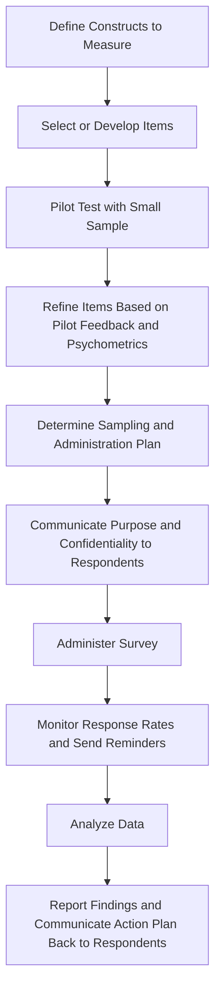

## Survey Design and Administration

### Overview

Surveys are the single most widely used data collection method in I-O Psychology, employed for measuring attitudes (satisfaction, engagement, commitment), perceptions (climate, justice, leadership), and self-reported behaviors across individual, team, and organizational levels. Rigorous survey design directly determines data quality and the validity of subsequent conclusions.

**Key Points**

- Survey quality depends on both item-level design (wording, response format) and administration-level design (sampling, timing, delivery mode)
- Poorly designed surveys introduce systematic measurement error that cannot be fully corrected through statistical analysis after the fact
- Organizational surveys face distinctive practical constraints (employee time, response fatigue, power dynamics affecting honesty) beyond general survey methodology concerns

### Item Writing Principles

**Clarity and simplicity**

- Use simple, direct, unambiguous language avoiding jargon, double negatives, and complex sentence structures
- Each item should ask about a single concept — **double-barreled items** (e.g., "My manager is supportive and communicates clearly") conflate two constructs and produce uninterpretable responses

**Avoiding bias in wording**

- **Leading questions**: Items that suggest a "correct" or socially desirable answer (e.g., "Don't you agree that our new policy improves things?") bias responses
- **Loaded language**: Emotionally charged or value-laden terms can skew responses independent of the underlying construct
- Balance of positively and negatively worded items is sometimes used to detect careless/acquiescent responding, though **[Unverified]** methodologists have increasingly debated whether reverse-worded items improve or actually degrade data quality (via confusion-driven measurement error), and current best-practice guidance is more mixed than the traditional recommendation to always include reverse-coded items.

### Response Format Options

**Likert-type scales**

- The dominant format in organizational surveys; typically 5-point or 7-point agreement, frequency, or satisfaction scales
- **[Inference]** Research comparing 5-point versus 7-point (or other point-count) scales generally finds relatively small practical differences in reliability and validity for most applications, though this is a matter of accumulated empirical evidence and reasonable methodologists continue to hold differing preferences depending on specific measurement goals.

**Semantic differential scales**

- Bipolar adjective pairs (e.g., "Satisfied ... Dissatisfied") with respondents marking a position between poles

**Behaviorally anchored formats**

- Response options tied to concrete behavioral descriptions rather than abstract agreement levels, often used in performance-related measurement to increase interpretability

**Open-ended items**

- Free-text responses providing qualitative depth within an otherwise quantitative instrument, often used for comments, suggestions, or explaining ratings

### Established Measurement Instruments

I-O research and practice draw heavily on previously validated instruments rather than constructing new measures from scratch, given the substantial psychometric development investment required:

- **Job Descriptive Index (JDI)**: A long-standing, well-validated measure of job satisfaction across facets (work itself, pay, promotion, supervision, coworkers)
- **Minnesota Satisfaction Questionnaire (MSQ)**: Another widely used job satisfaction instrument
- **Utrecht Work Engagement Scale (UWES)**: Measures engagement via vigor, dedication, and absorption dimensions
- **Organizational Commitment Questionnaire (OCQ)** and the **Three-Component Model of Commitment** (Meyer & Allen): Measures affective, continuance, and normative commitment
- **Maslach Burnout Inventory (MBI)**: The dominant standardized burnout measurement instrument across exhaustion, cynicism, and (reduced) professional efficacy dimensions

**[Inference]** Using established, previously validated instruments rather than newly created items is generally considered stronger practice in applied I-O work, since accumulated validity evidence supports interpretation; however, this preference must be balanced against situations where existing instruments do not adequately capture a novel or context-specific construct, in which case new scale development following formal procedures becomes appropriate.

### Survey Structure and Flow

- **Item ordering**: Generally proceeds from general/less sensitive to specific/more sensitive topics; demographic items are typically placed at the end to avoid priming stereotype threat or early respondent fatigue/dropout
- **Survey length**: Must balance comprehensiveness against respondent fatigue; **[Unverified]** while general survey methodology literature consistently documents declining data quality (increased straight-lining, higher dropout) as surveys lengthen, the precise length threshold at which this becomes problematic varies by population, survey salience, and delivery context, so no single universal "ideal length" figure is well established
- **Instructions and framing**: Clear communication of purpose, confidentiality/anonymity assurances, and estimated completion time at the outset improves both response rates and data quality

### Administration Considerations

**Sampling and response rate**

- Census surveys (all employees) versus sampled surveys, depending on organizational size and analytical goals
- Response rate management: reminder emails, leadership endorsement/communication, and clear communication of how results will be used and acted upon

**Timing**

- Avoiding survey administration during unusually stressful organizational periods (layoffs, major deadlines) unless those periods are specifically the object of study, as context can systematically bias responses
- Longitudinal survey administration requires consistent timing intervals and careful tracking of respondent identity (balanced against anonymity concerns) to enable within-person change analysis

**Anonymity versus confidentiality**

- **Anonymous**: No identifying information collected at all; strongest for encouraging honest responses on sensitive topics but precludes linking responses to other data (performance records) or following up with individuals
- **Confidential**: Identifying information collected but restricted-access and not shared with organizational decision-makers in identifiable form; enables richer analysis (linking survey data to outcomes) while still protecting individual disclosure
- Employees' *trust* that confidentiality promises will be honored significantly affects response honesty, particularly for sensitive topics like leadership criticism or harassment reporting

**Delivery mode**

- Online/web-based surveys now dominate due to cost, speed, and ease of analysis, though considerations remain for employee populations with limited computer/internet access (e.g., manufacturing floor workers, distributed field workers)
- Mobile-optimized survey design has become increasingly important as survey completion via smartphone has grown

### Survey Design and Administration Process

### Common Measurement Errors to Avoid

- **Acquiescence bias**: Tendency to agree regardless of item content, particularly relevant in cultures/contexts with strong social desirability pressures
- **Social desirability bias**: Respondents answer in ways they believe are viewed favorably rather than accurately, especially problematic for sensitive topics (ethics, discrimination experiences)
- **Straight-lining/careless responding**: Selecting the same response option repeatedly without genuine engagement, particularly on long surveys; detected via attention check items, response time analysis, and consistency indices
- **Common method bias**: When multiple constructs are measured via the same survey instrument at the same time, inflating apparent relationships between them (see prior chapter item on quantitative design)

### Illustrative Example

**Scenario**: Designing an employee engagement survey for a 5,000-employee organization.

- **Construct definition**: Engagement operationalized via the Utrecht Work Engagement Scale's three dimensions (vigor, dedication, absorption), supplemented by organization-specific items on recent restructuring concerns
- **Pilot testing**: Administered to a sample of 100 employees across departments to check item clarity and identify any confusing wording before full rollout
- **Administration**: Confidential (not anonymous) web-based survey allowing HR to link results to department/tenure for actionable reporting, while individual responses remain restricted from direct managers
- **Timing**: Scheduled to avoid the week of year-end performance reviews to reduce contamination from unrelated stress
- **Follow-up**: Results communicated back to employees with a summary of key findings and planned actions, supporting future survey response rates by demonstrating that participation leads to visible organizational response

### Conclusion

Rigorous survey design and administration requires careful attention to item wording, response format selection, established instrument use where possible, and administration logistics (timing, confidentiality, delivery mode) that together determine data quality. Because surveys remain the dominant data collection tool in applied I-O Psychology, methodological rigor at each stage directly translates into the validity of downstream organizational decisions based on survey findings.

**Related Topics**

- Scale Development and Psychometric Validation Procedures
- Common Method Bias: Detection and Mitigation Strategies
- Response Rate Optimization in Organizational Surveys
- Employee Engagement Measurement: Models and Instruments
- Careless Responding Detection Techniques
- Longitudinal Survey Design and Panel Attrition