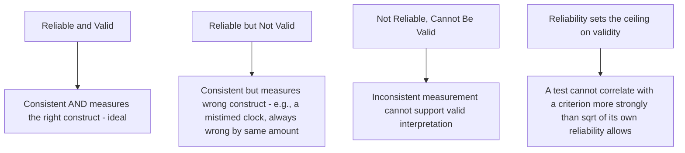

## Psychometric Reliability and Validity

### Overview

Reliability and validity are the two foundational psychometric properties that determine whether a measurement instrument (test, survey, rating scale) is trustworthy — reliability addressing consistency of measurement, validity addressing whether the instrument actually measures what it claims to measure. Together they form the technical backbone justifying the use of any assessment in I-O Psychology, from personality tests to performance ratings.

**Key Points**

- Reliability is a necessary but not sufficient condition for validity — an instrument can be highly reliable (consistent) while measuring the wrong construct entirely
- Validity is not a single property but a body of accumulated evidence supporting specific interpretations and uses of scores
- Legal defensibility of selection instruments in the U.S. depends directly on documented reliability and validity evidence (per the Uniform Guidelines and SIOP *Principles*, covered in an earlier chapter item)

### Reliability: Core Concept

Reliability refers to the **consistency** of measurement — the degree to which an instrument produces stable, reproducible scores across repeated administrations, item sets, or raters, assuming the underlying construct has not actually changed.

**Classical Test Theory (CTT) foundation:**

$$X = T + E$$

Where $X$ is the observed score, $T$ is the true score, and $E$ is random measurement error. Reliability is formally defined as the ratio of true score variance to observed score variance:

$$r_{xx} = \frac{\sigma^2_T}{\sigma^2_X}$$

### Types of Reliability

**1. Internal Consistency Reliability**

- Assesses whether items within a single scale correlate with each other, indicating they measure a common underlying construct
- **Cronbach's alpha ($\alpha$)** is the most widely reported statistic, generally interpreted with $\alpha \geq 0.70$ considered acceptable for research purposes and $\alpha \geq 0.80$–$0.90$ preferred for individual-level decision-making (e.g., selection)
- **[Inference]** These specific alpha thresholds (0.70, 0.80) are long-standing conventional benchmarks widely used in practice, though psychometricians have increasingly critiqued treating them as rigid cutoffs rather than context-dependent guidelines, and alternative reliability estimates (see below) are increasingly recommended as more accurate than alpha in many circumstances.
- **Omega ($\omega$)**: An alternative internal consistency estimate increasingly recommended over Cronbach's alpha because it does not require the restrictive assumption of tau-equivalence (that all items contribute equally to the true score)

**2. Test-Retest Reliability**

- Assesses stability of scores over time by administering the same instrument to the same respondents at two time points, correlating the results
- Appropriate for constructs expected to be stable (e.g., cognitive ability, personality traits) but not for constructs expected to genuinely fluctuate (e.g., daily mood, acute stress)

**3. Parallel/Alternate Forms Reliability**

- Correlates scores from two different but equivalent versions of a test, useful when practice effects from repeated identical testing would be problematic (e.g., cognitive ability retesting)

**4. Inter-Rater Reliability**

- Assesses agreement between different raters/judges evaluating the same target (e.g., two interviewers rating the same candidate, or two supervisors rating the same employee's performance)
- Common statistics include **Cohen's kappa** (for categorical ratings, correcting for chance agreement), **intraclass correlation coefficient (ICC)** (for continuous ratings), and simple percent agreement (less preferred due to inflation from chance agreement)

### Validity: Core Concept

Validity refers to the degree to which accumulated evidence and theory support the specific **interpretations and uses** of test scores for a given purpose. Modern psychometric theory (per the *Standards for Educational and Psychological Testing*) treats validity as a unified concept supported by multiple types of evidence, rather than as several independent "types" of validity.

### Sources of Validity Evidence

**1. Content Validity Evidence**

- The degree to which an instrument's items adequately and representatively sample the full content domain of the construct being measured
- Typically established through expert judgment (subject matter experts reviewing item-to-construct correspondence) rather than statistical analysis
- Particularly central to job knowledge tests and structured interviews built directly from job analysis

**2. Criterion-Related Validity Evidence**

- The degree to which test scores correlate with a relevant external criterion (e.g., job performance, turnover, training success)
- **Concurrent validity**: Predictor and criterion measured at approximately the same time (e.g., current employees take a test, correlated with current performance ratings)
- **Predictive validity**: Predictor measured before the criterion occurs (e.g., candidates take a selection test, correlated with performance measured months later) — generally considered the gold standard for selection validation since it mirrors actual predictive use
- Reported as a **validity coefficient** ($r$), the correlation between predictor and criterion; meta-analytic validity generalization research (Schmidt & Hunter, covered in the origins chapter) has established benchmark validity coefficients for common predictors

**3. Construct Validity Evidence**

- The broadest category, encompassing evidence that an instrument measures the theoretical construct it claims to measure, integrating content, criterion, and internal structure evidence
- **Convergent validity**: The instrument correlates strongly with other measures of the same or related constructs
- **Discriminant validity**: The instrument does not correlate too strongly with measures of theoretically distinct constructs (ruling out that it is merely measuring something else, like general cognitive ability or social desirability)
- **Factorial validity**: Confirmatory factor analysis (CFA) demonstrates that the instrument's internal item structure matches the theorized dimensional structure

### Reliability-Validity Relationship

**Attenuation due to unreliability**: Because measurement error attenuates observed correlations, the maximum possible observed validity coefficient is mathematically constrained by the reliability of both predictor and criterion:

$$r_{xy}(\text{observed}) \leq \sqrt{r_{xx} \cdot r_{yy}}$$

Corrections for attenuation (dividing the observed correlation by the square root of the reliability product) are used in meta-analytic validity generalization research to estimate "true" relationships free of measurement error, though such corrections carry their own assumptions and estimation uncertainty.

### Illustrative Example

**Scenario**: Validating a new structured interview for hiring sales representatives.

- **Reliability assessment**: Multiple trained interviewers independently rate video-recorded mock interviews; inter-rater reliability (ICC) is calculated to confirm raters are scoring consistently before deploying the interview at scale
- **Content validity evidence**: Interview questions are developed directly from a job analysis identifying key sales competencies (persuasion, resilience, relationship-building), with subject matter experts confirming question-to-competency alignment
- **Criterion-related (predictive) validity evidence**: Interview scores from actual hired candidates are correlated with their sales performance (revenue generated) six months later, yielding a validity coefficient
- **Construct validity evidence**: Interview scores are checked for convergent validity against an existing validated personality measure of extraversion/assertiveness (expected to correlate moderately) and discriminant validity against unrelated constructs (e.g., should not correlate strongly with general cognitive ability if the interview is intended to measure interpersonal skill specifically)

### Modern Extensions: Item Response Theory (IRT)

- An alternative to Classical Test Theory, IRT models the probability of a specific item response as a function of a respondent's underlying trait level and item-specific parameters (difficulty, discrimination, and sometimes guessing)
- Enables **computerized adaptive testing (CAT)**, where item selection dynamically adjusts based on prior responses, increasing measurement precision with fewer items
- **[Inference]** IRT-based approaches are increasingly favored in large-scale, high-stakes testing programs (including many major commercial cognitive ability and certification tests) over classical approaches due to their more granular item-level information and adaptive testing capability, though CTT remains widely used, particularly for smaller-scale organizational research, given IRT's larger sample size requirements for stable parameter estimation.

### Conclusion

Reliability and validity together constitute the technical foundation for defensible measurement in I-O Psychology, with reliability establishing the necessary consistency of measurement and validity establishing that accumulated evidence supports the intended interpretation and use of scores. Given the direct legal and practical consequences of assessment instruments used in personnel decisions, rigorous psychometric documentation of both properties is not merely a technical formality but a professional and often legal requirement.

**Related Topics**

- Item Response Theory (IRT) and Computerized Adaptive Testing
- Meta-Analysis and Validity Generalization in Selection Research
- Confirmatory Factor Analysis for Construct Validity
- Utility Analysis: Translating Validity into Economic Value
- Adverse Impact Analysis in Selection Test Validation
- Structured Interviews: Design and Validation Evidence