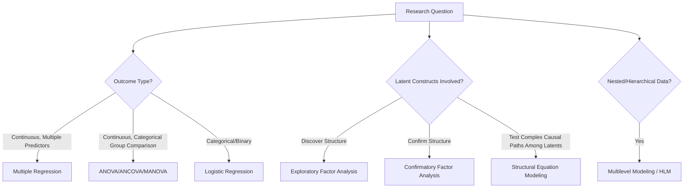

## Multivariate Statistics for Organizational Research

### Overview

Multivariate statistics involve the simultaneous analysis of multiple variables to model complex organizational phenomena that rarely reduce to simple bivariate relationships. These techniques form the primary analytical toolkit for testing theoretical models in I-O Psychology, from predicting turnover using multiple predictors to modeling how team-level and individual-level factors jointly influence performance.

**Key Points**

- Multivariate methods allow researchers to statistically control for confounding variables, test mediation and moderation, and model complex theoretical structures with multiple constructs
- Choice of technique depends on the research question's structure: prediction vs. classification, latent constructs vs. observed variables, and nested vs. independent data
- Modern I-O research increasingly relies on structural equation modeling and multilevel modeling to address the field's inherently nested (individuals within teams within organizations) data structures

### Multiple Regression

**Core function**: Models a continuous outcome variable as a linear function of multiple predictor variables simultaneously, estimating each predictor's unique contribution while statistically controlling for the others.

$$Y = \beta_0 + \beta_1 X_1 + \beta_2 X_2 + ... + \beta_k X_k + \varepsilon$$

**Common applications**: Predicting job performance from multiple selection predictors (cognitive ability, conscientiousness, structured interview score); predicting turnover intention from satisfaction, commitment, and perceived alternatives.

**Key extensions**:

- **Hierarchical/sequential regression**: Predictors entered in theoretically meaningful blocks/steps to assess incremental variance explained by each block (e.g., does personality predict performance beyond what cognitive ability alone explains?)
- **Moderated regression**: Tests whether the relationship between a predictor and outcome depends on a third variable (interaction terms), e.g., does the satisfaction-turnover relationship differ by tenure?
- **Logistic regression**: Used when the outcome is categorical/binary (e.g., stayed vs. left the organization) rather than continuous

### Analysis of Variance (ANOVA) Family

**Core function**: Tests whether group means differ significantly on a continuous outcome, extending the t-test logic to more than two groups or multiple factors.

**Variants relevant to I-O research**:

- **Factorial ANOVA**: Tests main effects and interaction effects of two or more categorical independent variables (e.g., training method × experience level on performance)
- **ANCOVA (Analysis of Covariance)**: Incorporates continuous covariates to statistically control for confounds while testing group differences (e.g., comparing training outcomes while controlling for baseline ability)
- **MANOVA (Multivariate ANOVA)**: Tests group differences across multiple related outcome variables simultaneously, reducing Type I error inflation from running many separate ANOVAs

### Factor Analysis

**Exploratory Factor Analysis (EFA)**

- Used to discover the underlying latent structure among a set of observed variables (typically survey items) without pre-specifying the number or nature of factors
- Common in early-stage scale development to identify how items naturally cluster into dimensions

**Confirmatory Factor Analysis (CFA)**

- Used to test whether a pre-specified factor structure (derived from theory or prior EFA) fits observed data adequately
- Central to establishing construct validity evidence (see prior chapter item) by confirming that items load onto their theorized dimensions and not others
- Evaluated using fit indices including **CFI** (Comparative Fit Index), **RMSEA** (Root Mean Square Error of Approximation), and **SRMR** (Standardized Root Mean Square Residual), with conventional (though debated) cutoff guidelines (e.g., CFI $\geq 0.95$, RMSEA $\leq 0.06$) commonly referenced from Hu and Bentler's methodological work

### Structural Equation Modeling (SEM)

**Core function**: A comprehensive framework combining factor analysis (measurement models, relating latent constructs to observed indicators) with path analysis (structural models, relating latent or observed constructs to each other), enabling simultaneous testing of complex theoretical models with multiple mediating and dependent variables.

**Key components**:

- **Measurement model**: Specifies how latent constructs (e.g., "job satisfaction") are measured by observed survey items
- **Structural model**: Specifies hypothesized causal/predictive paths among constructs (e.g., leadership → psychological safety → team performance)
- **Mediation testing**: SEM is the standard modern approach for testing whether a variable's effect on an outcome operates through an intermediate mechanism, often using bootstrapped confidence intervals for indirect effects (following methodological guidance associated with Kris Preacher and Andrew Hayes, among others)

**[Inference]** SEM has become one of the dominant analytical frameworks in published I-O research over the past two decades, given its capacity to simultaneously model measurement error and complex theoretical pathways, though its appropriate use requires relatively large sample sizes and carries ongoing methodological debate regarding model fit index interpretation and the risks of post-hoc model modification ("specification searching").

### Multilevel Modeling (MLM) / Hierarchical Linear Modeling (HLM)

**Core function**: Explicitly models data with a nested structure (individuals nested within teams, nested within organizations), correctly partitioning variance at each level and avoiding statistical errors that arise from ignoring nesting (e.g., inflated Type I error from violating independence assumptions in standard regression).

**Key applications in I-O research**:

- Testing **cross-level effects**: How team-level variables (e.g., team climate) predict individual-level outcomes (e.g., individual performance)
- **Random intercept models**: Allow baseline outcome levels to vary across groups (e.g., different teams have different average performance baselines)
- **Random slope models**: Allow the strength of a predictor-outcome relationship to vary across groups (e.g., the relationship between autonomy and satisfaction may be stronger in some teams than others)
- **Growth curve modeling**: A specific MLM application for longitudinal data, modeling individual trajectories of change over time (e.g., engagement trajectories across the onboarding period) as nested within-person observations

### Multivariate Method Selection Guide

### Illustrative Example

**Scenario**: Testing whether transformational leadership improves individual employee performance, and whether this relationship is mediated by psychological safety and moderated by team size.

- **Measurement model (CFA)**: Confirm that survey items measuring transformational leadership, psychological safety, and performance each load onto their intended latent constructs
- **Structural model (SEM)**: Test the hypothesized path leadership → psychological safety → performance, estimating the indirect (mediated) effect with bootstrapped confidence intervals
- **Multilevel component (MLM within SEM or separate HLM)**: Since employees are nested within teams led by different managers, model leadership and psychological safety as team-level constructs while performance is measured at the individual level, appropriately partitioning within-team and between-team variance
- **Moderation test**: Add team size as a moderator of the leadership-to-psychological-safety path to test whether the relationship weakens in larger teams

### Common Pitfalls

- **Overfitting via post-hoc model modification**: Iteratively adjusting SEM models based on modification indices until fit improves risks capitalizing on sample-specific noise rather than testing genuine theoretical structure; results should ideally be cross-validated on independent samples
- **Ignoring nested data structure**: Applying standard (non-multilevel) regression to data with meaningful team/organizational clustering violates independence assumptions and can produce misleadingly significant results (inflated Type I error)
- **Insufficient sample size for complex models**: SEM and multilevel models generally require larger samples than simple regression to produce stable parameter estimates, and under-powered complex models risk both false negatives and unstable, non-replicable estimates

### Conclusion

Multivariate statistical methods — from multiple regression through structural equation modeling and multilevel modeling — provide the analytical infrastructure for testing the complex, multi-construct, often nested theoretical models characteristic of contemporary I-O Psychology research. Appropriate method selection depends fundamentally on the research question's structure (number and type of variables, presence of latent constructs, data nesting), and misapplication of these techniques represents one of the most common sources of methodologically flawed organizational research.

**Related Topics**

- Mediation and Moderation Analysis in Organizational Research
- Confirmatory Factor Analysis and Model Fit Evaluation
- Multilevel Modeling for Team and Organizational Research
- Growth Curve Modeling for Longitudinal Employee Data
- Meta-Analytic Structural Equation Modeling
- Common Statistical Errors in Published Organizational Research