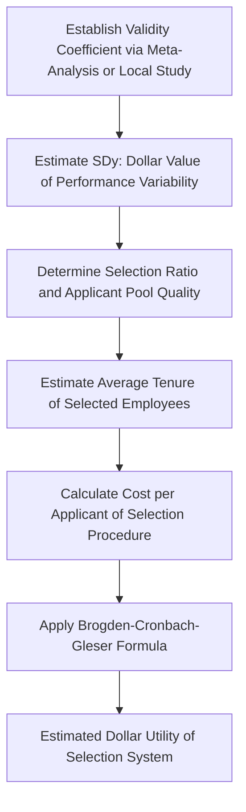

## Meta-Analysis and Utility Analysis

### Overview

Meta-analysis quantitatively synthesizes findings across multiple independent studies to estimate more precise and generalizable population effect sizes than any single study can provide. Utility analysis extends these effect size estimates into economic terms, translating statistical findings (e.g., a selection test's validity coefficient) into dollar-value organizational impact. Together, these techniques bridge the gap between academic research findings and practical organizational decision-making.

**Key Points**

- Meta-analysis addresses a core limitation of individual studies: small sample sizes and situational specificity produce noisy, inconsistent effect size estimates across the literature
- Validity generalization, a specific meta-analytic application pioneered by Schmidt and Hunter, fundamentally changed how the field understands the generalizability of selection test validity
- Utility analysis provides the financial argument that makes psychometrically sound selection systems persuasive to organizational decision-makers focused on cost-benefit tradeoffs

### Meta-Analysis: Core Logic

**The problem meta-analysis solves**: Individual studies testing the same relationship (e.g., does conscientiousness predict job performance?) often produce inconsistent effect sizes due to sampling error alone, even when a true underlying relationship exists and is stable across settings. Without meta-analysis, researchers might mistakenly conclude that a relationship is "situationally specific" when the variability is actually just statistical noise.

**Core steps**:

1. **Literature search and study selection**: Systematically identify all relevant studies (published and, ideally, unpublished, to address publication bias) testing the relationship of interest
2. **Effect size extraction and coding**: Extract a common effect size metric (correlation coefficient $r$, standardized mean difference $d$, or odds ratio) from each study, along with sample size and relevant moderators
3. **Corrections for statistical artifacts**: Following Hunter-Schmidt methodology, individual study effect sizes are corrected for sampling error, measurement unreliability (in both predictor and criterion), and range restriction, since these artifacts systematically attenuate observed correlations
4. **Aggregation**: Compute a sample-size-weighted average effect size across studies, along with a confidence interval and a credibility interval (which estimates the range of true population effect sizes across different contexts, distinct from the confidence interval around the mean estimate)
5. **Moderator analysis**: Test whether the effect size varies systematically by study characteristics (e.g., job complexity, cognitive ability test type, industry)

### Validity Generalization (VG)

**Historical significance**: Prior to Schmidt and Hunter's validity generalization research (beginning in the late 1970s), the field operated under the **situational specificity hypothesis** — the belief that a selection test's validity for predicting job performance was highly specific to each job and organization, requiring costly local validation studies for every new context.

**VG's core finding**: When individual study validity coefficients were corrected for statistical artifacts (sampling error, unreliability, range restriction) and meta-analytically combined, most apparent variability across studies was explained by these artifacts rather than genuine situational differences — suggesting that cognitive ability test validity, in particular, generalizes substantially across jobs and settings rather than requiring local validation in each new context.

**[Inference]** While VG findings are broadly influential and widely cited as having reshaped selection practice and legal/professional standards (e.g., informing SIOP's *Principles*), the degree to which validity fully generalizes without any local validation remains a topic some methodologists continue to nuance, particularly regarding how much residual, genuine situational variability remains even after artifact correction; this is an area of continued refinement rather than a fully closed debate.

### Meta-Analytic Results as Practical Reference Points

Meta-analytic validity coefficients (corrected for artifacts) for common selection predictors are widely cited as benchmark reference values in selection system design, though **[Unverified]** the exact numerical estimates vary somewhat across different meta-analytic studies, correction methodologies, and time periods, so practitioners should treat commonly cited figures as approximate, well-supported ranges rather than fixed universal constants. Broadly, cognitive ability tests, structured interviews, and work sample tests are consistently found among the strongest single predictors of job performance across the meta-analytic literature, while unstructured interviews and some biodata approaches tend to show comparatively weaker average predictive validity.

### Utility Analysis: Core Logic

**Purpose**: Utility analysis translates a selection system's validity coefficient into an estimated financial value, answering the practical question: "What is this selection procedure actually worth to the organization in dollar terms?"

**The Brogden-Cronbach-Gleser utility formula** (a foundational formulation):

$$\Delta U = N_s \times T \times r_{xy} \times SD_y \times \bar{Z}_x - (N \times C)$$

Where:

- $\Delta U$ = the utility (dollar value) gained from using the selection procedure
- $N_s$ = number of individuals selected
- $T$ = average tenure (years employees remain, capturing the duration over which benefits accrue)
- $r_{xy}$ = the validity coefficient of the selection procedure
- $SD_y$ = the standard deviation of job performance in dollar terms (the dollar value difference between an average and one-standard-deviation-above-average performer)
- $\bar{Z}_x$ = the average standardized predictor score of those selected (reflecting selection ratio and applicant pool quality)
- $N$ = total number of applicants tested
- $C$ = cost per applicant of administering the selection procedure

**Key input: $SD_y$ estimation methods**

- **CREPID (Cascio-Ramos Estimate of Performance in Dollars)**: A rational, job-analysis-based method for estimating the dollar value of performance variability
- **Global estimation method (Schmidt-Hunter)**: Asks supervisors to directly estimate the dollar value of employees at various performance percentiles
- **[Inference]** $SD_y$ estimation is widely acknowledged within the field as the most methodologically contested and imprecise component of utility analysis, since translating job performance into precise dollar terms inherently involves substantial estimation uncertainty regardless of method used; this measurement challenge is a well-documented limitation rather than a fully resolved technical matter.

### Utility Analysis Process Flow

### Illustrative Example

**Scenario**: An organization is deciding whether to adopt a validated cognitive ability test (with meta-analytically supported validity around $r = 0.50$ for the target job family) for hiring 100 customer service representatives annually, replacing an unstructured interview process.

**Utility analysis walkthrough**:

- $N_s = 100$ (selected annually)
- $T = 3$ years (average tenure estimate)
- $r_{xy} = 0.50$ (meta-analytic validity coefficient for the new test)
- $SD_y$ estimated via supervisor global estimation at, hypothetically, $15,000 (representing the dollar value difference between an average and a one-standard-deviation-above-average performer)
- $\bar{Z}_x$ depends on the selection ratio (how selective the hiring process is relative to the applicant pool)
- $C$ = cost per applicant tested (test licensing/administration cost)

The resulting $\Delta U$ estimate provides a defensible dollar figure demonstrating the selection system's financial value relative to its administration cost — a figure typically far more persuasive to organizational leadership than a bare statistical validity coefficient alone.

**[Inference]** In practice, utility analysis figures are sometimes viewed skeptically by organizational decision-makers due to the compounding of multiple uncertain estimates (especially $SD_y$) into a single, seemingly precise dollar figure; practitioners are generally advised to present utility estimates with appropriate ranges and sensitivity analysis (showing how the estimate changes under different assumptions) rather than a single point estimate, reflecting a widely shared methodological caution rather than a settled prescriptive rule.

### Conclusion

Meta-analysis and utility analysis together represent the field's primary tools for aggregating fragmented research evidence into generalizable conclusions and for translating those conclusions into organizationally actionable, financially framed recommendations. Validity generalization research fundamentally shifted selection practice away from costly, study-by-study local validation toward confidence in meta-analytically established predictor-criterion relationships, while utility analysis provides the economic argument connecting psychometric rigor to bottom-line organizational value — though both techniques carry acknowledged estimation uncertainties that responsible practice requires communicating transparently.

**Related Topics**

- The Situational Specificity Hypothesis: Historical Debate
- SDy Estimation Methods: CREPID and Global Estimation Compared
- Publication Bias and the File Drawer Problem in Meta-Analysis
- Structured Interviews and Work Sample Tests: Meta-Analytic Validity Evidence
- Selection Ratio and Its Effect on Utility
- Communicating Statistical Findings to Organizational Decision-Makers