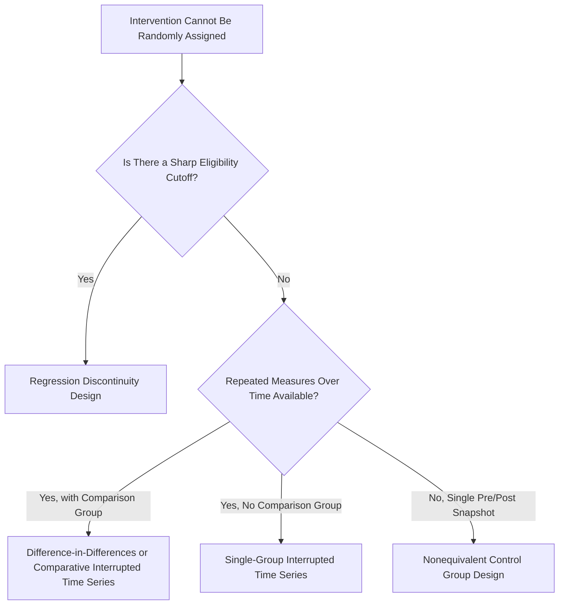

## Field Experiments and Quasi-Experimental Design

### Overview

Field experiments and quasi-experimental designs occupy the methodological middle ground between tightly controlled laboratory experiments and purely observational research, offering the field's most practical route to causal inference within real organizational settings where full experimental control is often impossible or unethical.

**Key Points**

- Field experiments retain random assignment but occur in natural organizational settings, maximizing external validity while preserving strong causal inference
- Quasi-experimental designs sacrifice random assignment (due to practical/ethical constraints) but use structural features of the research context to approximate experimental control
- Both approaches are central to evaluating organizational interventions (training programs, policy changes, leadership development) where randomizing all employees to conditions is often organizationally or ethically infeasible

### Field Experiments: Defining Features

**Core characteristic**: True random assignment to conditions, conducted within an actual organizational setting rather than a laboratory, using real employees performing real jobs.

**Why field experiments are valuable but rare**:

- They combine the causal inference strength of randomization with the external validity of a real organizational context — widely considered the strongest feasible design for organizational intervention research
- **[Inference]** Field experiments remain comparatively rare in I-O Psychology relative to correlational or lab-based designs, primarily due to organizational resistance to randomly denying potentially beneficial interventions to some employees, logistical complexity of implementation within ongoing business operations, and the difficulty of securing organizational partnership willing to accept the disruption randomization can create; this scarcity is a well-documented pattern in methodological reviews of the field's published research base.

**Common field experiment applications**:

- Randomly assigning new-hire cohorts to different onboarding programs and comparing subsequent retention/performance
- Randomly assigning work teams to different leadership training conditions and comparing team outcomes
- Randomly assigning job postings or resumes (in audit-style field experiments) to test discrimination in hiring processes

### Randomization Strategies in Organizational Field Experiments

Given organizational constraints, several randomization approaches are used depending on feasibility:

- **Individual-level randomization**: Individual employees randomly assigned to conditions — cleanest design but most likely to trigger organizational resistance or contamination (employees in different conditions may discuss/compare experiences)
- **Cluster/group-level randomization**: Entire teams, departments, or locations randomly assigned to conditions rather than individuals — reduces contamination risk and often more organizationally palatable, but requires larger numbers of clusters for adequate statistical power and analysis via multilevel modeling (see prior chapter item)
- **Waitlist/stepped-wedge designs**: All units eventually receive the intervention, but the *timing* of rollout is randomized, allowing comparison between "already treated" and "not yet treated" groups while avoiding permanently denying anyone the intervention — often more acceptable to organizational stakeholders

### Quasi-Experimental Designs: Core Types

Used when random assignment is infeasible but the researcher can still exploit some structural feature of the setting to approximate experimental comparison.

**1. Nonequivalent Control Group Design**

- Compares a treatment group to a similar but non-randomly-assigned comparison group (e.g., one office location adopts a new policy, another comparable location does not)
- Pretest measures on both groups help assess whether groups were reasonably comparable before treatment, strengthening (though not guaranteeing) causal interpretation

**2. Interrupted Time-Series Design**

- Involves multiple measurements of an outcome variable before and after an intervention, allowing the researcher to assess whether the intervention produced a detectable shift in level or trend beyond what the pre-existing trajectory would predict
- **Single-group interrupted time series**: One organizational unit tracked over time; vulnerable to history threats (other events coinciding with the intervention)
- **Multiple-group/comparison interrupted time series**: Adds a comparison unit not receiving the intervention, strengthening causal interpretation by ruling out shared external events

**3. Regression Discontinuity Design (RDD)**

- Exploits a sharp, pre-existing cutoff rule (e.g., a minimum test score required for promotion eligibility, a tenure threshold for benefit eligibility) to compare outcomes for units just above versus just below the cutoff
- Units near the threshold are assumed to be approximately equivalent except for treatment status, approximating random assignment locally around the cutoff
- Increasingly regarded within applied social science methodology as one of the strongest quasi-experimental approaches when a genuine sharp cutoff rule exists, given its close approximation to local randomization

**4. Difference-in-Differences (DiD)**

- Compares the *change* in outcomes over time between a treatment group and a comparison group, rather than comparing levels at a single point — controlling for stable pre-existing differences between groups and shared time trends
- Relies on the **parallel trends assumption**: absent treatment, the treatment and comparison groups would have followed similar trajectories, which is typically examined by checking whether pre-treatment trends were indeed parallel

### Quasi-Experimental Design Selection

### Threats to Validity Specific to These Designs

- **Selection threats**: In nonequivalent control group designs, pre-existing differences between treatment and comparison groups (rather than the intervention itself) may drive observed outcome differences
- **History threats**: External events coinciding with the intervention (e.g., a market downturn coinciding with a training rollout) can be mistaken for intervention effects, particularly in single-group time-series designs
- **Contamination/spillover**: In field experiments with individual-level randomization, control group members may be indirectly affected by treatment group members' experiences (e.g., treated employees sharing training content informally with untreated peers), diluting the observed treatment effect
- **Attrition**: Differential dropout between conditions (e.g., employees who found a new policy unfavorable leaving the organization at higher rates) can bias comparisons if not carefully monitored and addressed
- **Regression to the mean**: Particularly relevant when treatment/comparison group assignment is based on extreme prior scores (e.g., studying an intervention targeted at "low performers"), since extreme scores naturally tend to move toward the average upon retesting regardless of intervention effects

### Illustrative Example

**Scenario**: An organization wants to evaluate whether a new leadership development program improves team performance, but cannot randomly assign managers to receive or not receive training due to political and fairness concerns.

- **Quasi-experimental approach chosen**: A stepped-wedge design is negotiated — all managers will eventually receive training, but the rollout is randomized in three sequential waves across the year, creating temporary treatment/comparison contrasts at each stage
- **Analysis**: Team performance is tracked via interrupted time series across all three waves, comparing "already trained" versus "not yet trained" manager cohorts at each time point, with multilevel modeling accounting for teams nested within managers
- **Validity strengthening steps**: Pre-training baseline performance data is collected for all managers to check for pre-existing differences between wave cohorts; qualitative interviews are embedded to detect potential contamination (informal knowledge-sharing between trained and untrained managers)

### Conclusion

Field experiments and quasi-experimental designs provide I-O Psychology's most practical pathway to credible causal inference about organizational interventions when full laboratory control is unavailable and true randomization faces organizational or ethical barriers. Techniques like regression discontinuity, difference-in-differences, and stepped-wedge designs allow researchers to approximate experimental rigor by exploiting structural features of real organizational contexts, making them indispensable tools for evaluating training programs, policy changes, and interventions under real-world constraints.

**Related Topics**

- Stepped-Wedge Designs for Organizational Rollouts
- Threats to Internal Validity: A Comprehensive Taxonomy
- Program Evaluation Methods in Applied Organizational Research
- Difference-in-Differences: Assumptions and Robustness Checks
- Contamination and Spillover Effects in Field Experiments
- Ethical Considerations in Withholding Interventions for Research Purposes