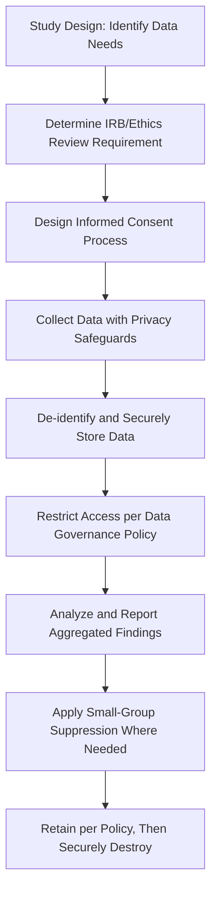

## Research Ethics and Data Privacy

### Overview

Research ethics and data privacy in organizational research govern how researchers collect, protect, and use data from human participants within workplace settings, addressing both general human-subjects research ethics and distinctive concerns arising from the employer-employee power relationship and the increasing scale of workplace data collection.

**Key Points**

- Organizational research ethics builds on general behavioral science research ethics frameworks (informed consent, beneficence, justice) while addressing workplace-specific power dynamics that can compromise the voluntariness of participation
- Data privacy concerns have intensified substantially with the growth of passive/continuous organizational data collection (HRIS systems, digital communication metadata, wearable sensors) beyond traditional discrete survey/interview data
- Regulatory frameworks (IRB oversight, data protection law) increasingly shape what organizational research is permissible and how data must be handled, varying meaningfully by jurisdiction

### Foundational Research Ethics Principles

**The Belmont Report framework** (1979, U.S.), though originating in biomedical/behavioral research broadly, provides the foundational ethical principles widely applied to organizational research:

- **Respect for persons**: Requires informed, voluntary consent and special protection for individuals with diminished autonomy
- **Beneficence**: Requires maximizing potential benefits and minimizing potential harms of research
- **Justice**: Requires fair distribution of research benefits and burdens across populations, avoiding exploitation of vulnerable groups

### Institutional Review Board (IRB) Oversight

- Academic-affiliated organizational research (dissertations, university-partnered studies) typically requires IRB review and approval before data collection begins, assessing risk level, consent procedures, and data protection plans
- **[Inference]** Purely internal organizational research conducted by in-house I-O practitioners (e.g., an internal engagement survey with no academic affiliation or publication intent) is generally not subject to formal IRB review in the way academic research is, though this creates a genuine gray area regarding ethical oversight for internal organizational research that several methodologists and ethicists have flagged as warranting more consistent professional guidance, without a single settled resolution across the field.
- IRB review typically categorizes research risk level (exempt, expedited, full review) based on factors like sensitivity of topics studied and vulnerability of the population, with anonymous survey research on non-sensitive topics often qualifying for expedited or exempt review

### Informed Consent in Organizational Settings

**Standard elements of informed consent**:

- Clear explanation of the study's purpose and procedures
- Explicit statement of voluntary participation and the right to withdraw without penalty
- Description of how data will be used, stored, and protected
- Disclosure of any risks and benefits associated with participation
- Contact information for questions or concerns

**Distinctive workplace complications**:

- **Power asymmetry**: Employees may feel implicit pressure to participate in employer-sponsored or employer-endorsed research, even when formal consent processes state participation is voluntary, since perceived career consequences for non-participation are difficult to fully eliminate
- **Supervisor involvement in recruitment**: When managers directly ask employees to participate (e.g., "please complete this survey"), this can blur the line between organizational directive and genuinely voluntary research participation
- **Deception and debriefing**: Some organizational research designs (e.g., certain field experiments) may involve limited deception about the study's true purpose to avoid demand effects; ethical practice requires debriefing participants afterward and justifying why deception was necessary and could not be avoided

### Confidentiality and Anonymity in Data Handling

- **De-identification practices**: Removing or coding identifying information (names, employee IDs) from datasets used for analysis and reporting, particularly important when reporting findings back to organizational stakeholders
- **Small-group suppression**: When reporting survey results by subgroup (e.g., department, demographic category), results for very small groups are often suppressed or aggregated further to prevent indirect identification of individuals through combination of demographic details
- **Data access restrictions**: Limiting which organizational stakeholders (e.g., HR, direct managers, executives) can access identifiable versus aggregated data, with clear documented data governance policies
- **Data retention and destruction policies**: Establishing how long identifiable research data will be retained and secure destruction procedures once retention periods expire

### Data Privacy Regulatory Frameworks

**General Data Protection Regulation (GDPR) — European Union**

- Establishes strict requirements for processing personal data, including employee data used in organizational research, requiring explicit lawful basis for processing, data minimization, and specific employee rights (access, correction, deletion/"right to be forgotten")
- Applies to any organization processing EU residents' data regardless of where the organization is headquartered, giving it broad extraterritorial relevance for multinational organizational research

**California Consumer Privacy Act (CCPA) and related U.S. state laws**

- U.S. data privacy regulation has historically been more sectoral and state-specific than the EU's comprehensive approach, though state-level comprehensive privacy laws (following California's lead) have proliferated significantly in recent years
- **[Unverified]** Given the rapid pace of U.S. state privacy legislation, any specific enumeration of which states currently have comprehensive privacy laws and their exact provisions should be verified against current sources rather than relied upon from general knowledge, since this regulatory landscape changes frequently.

**Sector and context-specific considerations**

- Health-related workplace data (e.g., wellness program biometric data) often triggers additional regulatory obligations (such as HIPAA-adjacent considerations in the U.S. when health data intersects with employer-sponsored wellness programs)
- Cross-border organizational research (e.g., a multinational company surveying employees across multiple countries) requires navigating varying, sometimes conflicting, national data protection requirements simultaneously

### Ethics and Privacy in Modern Data Collection Methods

**Passive and continuous data sources** increasingly used in organizational research/analytics raise distinctive privacy considerations beyond traditional survey ethics:

- **Digital communication metadata analysis**: Studying patterns in email/messaging metadata (frequency, network structure) without reading content still raises consent and expectation-of-privacy questions
- **Wearable and biometric sensors**: Used in some organizational research (e.g., studying stress physiology, activity patterns) raise heightened privacy and potential health-data regulatory concerns
- **People analytics dashboards**: Organizational systems that continuously aggregate employee data for management decision-making blur the line between "research" (governed by research ethics norms) and "routine business operations" (potentially governed by different, sometimes less protective, standards)

**[Inference]** The ethical and regulatory frameworks originally developed around discrete, consent-based research events (surveys, interviews) have not fully caught up with the realities of continuous, often passively collected organizational data streams; this is widely recognized within the field as an evolving frontier requiring ongoing professional and regulatory attention rather than a domain with settled, comprehensive best-practice standards.

### Ethical Research Data Lifecycle

### Illustrative Example

**Scenario**: A researcher wants to study how remote work arrangements affect team communication patterns using both survey data and digital communication metadata (message frequency, response times) from company collaboration platforms.

**Ethical considerations addressed**:

- **Informed consent**: Employees are explicitly informed that communication metadata (not message content) will be analyzed, with clear explanation of what "metadata" includes and does not include
- **Voluntary participation**: Since metadata collection could technically occur without active employee action, the researcher works with the organization to allow employees to opt out of having their metadata included in the research dataset, preserving genuine voluntariness
- **De-identification**: Individual-level metadata is aggregated to the team level for analysis and reporting wherever possible, reducing individual identifiability
- **IRB review**: Given the sensitivity of communication pattern data and its novel collection method, the study undergoes full IRB review rather than expedited review, with particular scrutiny on data security protocols
- **Data minimization**: Only communication frequency and timing metadata directly relevant to the research question is collected; message content is explicitly excluded from the research protocol

### Conclusion

Research ethics and data privacy in organizational research require applying foundational human-subjects protections (informed consent, confidentiality, beneficence) within the distinctive context of employer-employee power dynamics and an increasingly complex data privacy regulatory landscape. As organizational data collection expands beyond traditional discrete surveys into continuous, passive digital data streams, the field faces ongoing challenges in adapting established ethical frameworks to genuinely novel data collection realities, making this an active area of professional and regulatory development rather than a domain with fully settled standards.

**Related Topics**

- GDPR Compliance for Multinational Organizational Research
- People Analytics Ethics and Algorithmic Decision-Making
- Voluntary Participation and Power Dynamics in Workplace Research
- Data Governance Frameworks for HR and Organizational Data
- Small-Group Suppression and Statistical Disclosure Control
- Cross-Border Data Transfer Restrictions in Global Organizational Research