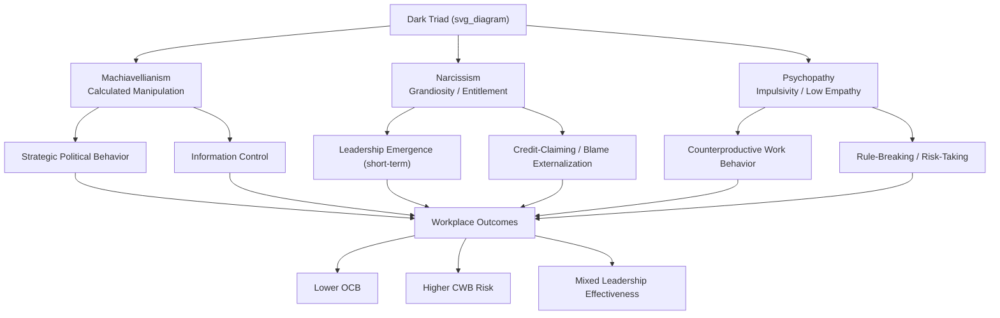

## Dark Triad Traits in the Workplace

### Definition and Construct Overview

The **Dark Triad** refers to a cluster of three socially aversive but subclinical personality traits: **Machiavellianism**, **narcissism**, and **psychopathy**. The construct was formally introduced by Paulhus and Williams (2002), who demonstrated that although the three traits are theoretically and empirically distinct, they share a common core of callousness, manipulativeness, and self-promotion, while remaining statistically separable in factor-analytic studies.

These traits are considered **subclinical** because they describe personality tendencies present in the general (non-clinical) population along a continuum, rather than diagnosable personality disorders. Everyone can be scored on Dark Triad measures to some degree; the traits are dimensional, not categorical.

### The Three Components

**Machiavellianism**

- Named after Niccolò Machiavelli's *The Prince*
- Characterized by strategic manipulation, cynical worldview, willingness to deceive, and a transactional/pragmatic view of interpersonal relationships
- Emphasis on tactics: flattery, strategic self-disclosure, and information control used instrumentally to achieve goals
- Distinguishing feature: cold, calculated, long-term manipulation strategy rather than impulsivity

**Narcissism**

- Grandiose self-view, sense of entitlement, need for admiration, and dominance-seeking
- Subclinical/"normal" narcissism is distinguished from Narcissistic Personality Disorder (NPD) by degree and functional impairment
- Two commonly studied subtypes: **grandiose narcissism** (overt, extraverted, dominance-oriented) and **vulnerable narcissism** (hypersensitive, defensive, less studied in workplace Dark Triad research)
- Distinguishing feature: self-focus and need for external validation/status

**Psychopathy (Subclinical/Primary Psychopathy)**

- High impulsivity, thrill-seeking, low empathy, low anxiety, and low remorse
- Considered the most "malevolent" of the three due to its association with impulsive antisocial behavior
- Distinguishing feature: lack of behavioral inhibition and low affective empathy, differentiating it from the more calculated Machiavellianism

### Measurement Instruments

| Instrument | Author(s) | Items | Notes |
| --- | --- | --- | --- |
| **Dirty Dozen (DD)** | Jonason & Webster (2010) | 12 | Ultra-short; 4 items per trait |
| **Short Dark Triad (SD3)** | Jones & Paulhus (2014) | 27 | Balances brevity with psychometric robustness; widely used in I-O research |
| **Mach-IV** | Christie & Geis (1970) | 20 | Machiavellianism-specific, legacy measure |
| **NPI (Narcissistic Personality Inventory)** | Raskin & Terry (1988) | 40 | Narcissism-specific |
| **SRP-III/IV (Self-Report Psychopathy Scale)** | Paulhus, Neumann, & Hare | 29–64 | Psychopathy-specific, more clinically grounded |

[Inference] The SD3 and Dirty Dozen are the most commonly cited instruments in organizational behavior journals due to survey-length constraints in field studies, though this is a methodological trend rather than a documented psychometric superiority claim.

### Theoretical Framework: Why Dark Triad Traits Emerge at Work

**Social Exchange and Resource Control Theory**

Dark Triad individuals often pursue **short-term, exploitative social strategies** rather than long-term reciprocal relationships. In organizational settings, this manifests as strategic networking for personal gain rather than mutual benefit.

**Life History Theory (Evolutionary Framing)**

[Inference] Some researchers frame Dark Triad traits as reflecting a "fast" life history strategy — prioritizing immediate rewards, mating opportunities, and resource acquisition over long-term relationship investment. This remains a theoretical lens rather than a settled empirical consensus.

**Person-Environment (P-E) Fit**

Certain organizational environments (high competition, individualistic reward structures, weak ethical oversight, fast-paced sales or finance cultures) may selectively attract, retain, or reward Dark Triad-congruent behavior — sometimes termed the **"toxic attractor" hypothesis**.

### Workplace Manifestations by Trait

**Machiavellianism at Work**

- Strategic impression management and political behavior
- Selective information sharing/withholding to maintain power asymmetry
- Higher likelihood of engaging in organizational politics as a deliberate tool
- Often correlates with lower organizational commitment when personal goals aren't served

**Narcissism at Work**

- Strong initial leadership emergence — narcissists are frequently *perceived* as leader-like in early interactions due to confidence, charisma, and assertiveness
- Tendency toward **credit-claiming** and blame externalization
- Associated with higher rates of workplace bullying instigation in supervisory roles
- Paradox: narcissistic leaders often generate short-term performance perceptions while incurring long-term team cohesion costs

**Psychopathy at Work**

- Strongest predictor among the three of **counterproductive work behaviors (CWBs)**: theft, sabotage, harassment
- Associated with poor rule-following and superficial charm masking risk-taking behavior
- Lower correlation with career success metrics compared to narcissism and Machiavellianism, since impulsivity often undermines strategic advancement

### Key Points

- Dark Triad traits are dimensional and subclinical — most working adults score low-to-moderate, not "psychopathic" in a clinical sense
- The three traits are moderately intercorrelated (typically $r \approx 0.25$ to $0.50$ across studies) but are empirically distinguishable
- Machiavellianism = calculated manipulation; Narcissism = self-aggrandizement; Psychopathy = impulsive callousness
- All three show meaningful (though modest-to-moderate) associations with counterproductive work behavior (CWB) and lower measures of organizational citizenship behavior (OCB)
- Narcissism has the most complex/mixed relationship with leadership outcomes — beneficial for emergence, often detrimental for effectiveness over time

### Organizational Outcomes: Empirical Patterns

**Counterproductive Work Behavior (CWB)**

[Inference] Meta-analytic work (e.g., O'Boyle et al., 2012) generally finds all three traits positively correlate with CWB, with psychopathy typically showing the strongest association and narcissism the weakest, though effect sizes vary across studies and should not be treated as fixed constants.

**Job Performance**

- Task performance correlations with Dark Triad traits tend to be near-zero or weakly negative in meta-analyses
- Narcissism sometimes shows a curvilinear (inverted-U) relationship with performance — moderate levels may support confidence-driven performance, while high levels undermine team functioning

**Leadership Emergence vs. Leadership Effectiveness**

This is one of the most cited distinctions in the literature:

- **Emergence** (being selected/perceived as a leader): narcissism shows a positive association, especially in short-term or unstructured group settings
- **Effectiveness** (actual performance in the leadership role over time): the association becomes weak, null, or negative as tenure increases and followers observe behavior beyond initial charisma

**Counterproductive Leadership / Abusive Supervision**

- Positive associations exist between Dark Triad traits (especially narcissism and psychopathy) and abusive supervision, workplace bullying, and unethical decision-making
- [Inference] Some scholars propose narcissistic leaders' sensitivity to ego threat (rather than trait psychopathy alone) is a specific mechanism driving retaliatory or abusive behavior toward subordinates who challenge their status; this remains an active area of study rather than a fully settled mechanism.

### Diagram: Dark Triad Trait Relationships and Workplace Outcomes (svg_diagram)

### Selection and Assessment Implications

**Pre-Employment Screening**

- Direct self-report Dark Triad measures are rarely used in selection due to high face validity and susceptibility to faking/social desirability bias
- Organizations more commonly rely on **integrity tests**, **structured behavioral interviews**, and **background/reference checks** as indirect proxies
- [Unverified] The predictive validity of Dark Triad self-report scales in high-stakes selection contexts (where applicants have strong incentive to fake good) is considerably weaker than in low-stakes research contexts; this is a frequently raised methodological caution in the I-O literature but exact effect-size degradation figures vary by study.

**Interview Red Flags (Practitioner Heuristics, not diagnostic)**

- Excessive self-promotion disconnected from verifiable achievements
- Pattern of blaming others for past failures across multiple contexts
- Inconsistent narrative details about past team conflicts
- [Speculation] These are practitioner heuristics circulated in applied HR contexts rather than empirically validated interview protocols with established predictive accuracy.

**Ethical and Legal Considerations**

- Using personality inference to exclude candidates raises adverse impact and validity concerns under selection law frameworks (e.g., in the U.S., Uniform Guidelines on Employee Selection Procedures)
- Labeling employees as "dark triad" based on informal observation (rather than validated instruments) risks stigmatization and biased performance evaluation

### Management and Mitigation Strategies

**Structural/Organizational Controls**

- Strong accountability systems (360-degree feedback, transparent performance metrics) reduce opportunities for manipulation and credit-shifting
- Clear ethical codes paired with enforcement (not just written policy) reduce Machiavellian tactical behavior
- Team-based reward structures can reduce the relative payoff of individualistic exploitative strategies

**Leadership Development**

- Executive coaching focused on feedback-receptivity can help moderate narcissistic defensiveness, though [Inference] outcomes are highly dependent on individual coachability and are not uniformly effective across all narcissism severity levels
- 360-degree feedback systems help counteract the self-report inflation common in narcissistic self-assessment

**Employee Protection**

- Anti-bullying and psychological safety policies specifically target the abusive supervision pathway associated with high Dark Triad supervisors
- Whistleblower protections reduce the power asymmetry that Machiavellian actors exploit

### Example: Applied Scenario

A sales organization implements individualized, winner-take-all bonus structures. Over 18 months, HR data shows rising CWB reports (client data manipulation, credit-stealing incidents) concentrated among top-performing reps. An internal review finds these reps score higher on unobtrusive Dark Triad proxies (peer-reported manipulativeness, disciplinary history for policy violations) than average performers.

**Interpretation**: This illustrates the **"toxic attractor" pattern** — a reward structure that inadvertently selects for and reinforces exploitative behavior. [Inference] This is a constructed illustrative scenario for pedagogical purposes, not a specific documented case study, though it reflects patterns commonly discussed in the person-environment fit literature on Dark Triad traits.

### Cross-Cultural and Contextual Considerations

- [Unverified] Cross-cultural variation in Dark Triad expression and social acceptability exists, but the degree to which cultural norms (e.g., collectivism vs. individualism) moderate trait expression versus merely its behavioral manifestation is not fully resolved in the literature and estimates vary across studies.
- Industry context matters: competitive, individualistic industries (finance, sales) are more frequently studied as high-Dark-Triad-density environments compared to collaborative/collectivist-structured industries (though this reflects sampling patterns in research as much as confirmed base-rate differences)

### Distinguishing Dark Triad from Related Constructs

| Construct | Key Distinction from Dark Triad |
| --- | --- |
| **Big Five: Low Agreeableness** | Broader trait; Dark Triad is a more specific, malevolent-intent-focused cluster |
| **Antisocial Personality Disorder** | Clinical diagnosis with functional impairment criteria; Dark Triad is subclinical/dimensional |
| **Toxic Leadership** | Behavioral/outcome-based construct; Dark Triad is a trait-based predictor, not synonymous |
| **Dark Tetrad** | Adds **sadism** (deriving pleasure from others' suffering) as a fourth trait; less established in workplace I-O literature than the original triad |

### Conclusion

Dark Triad traits provide a parsimonious framework for understanding a specific cluster of socially aversive workplace behaviors rooted in manipulation (Machiavellianism), grandiosity (narcissism), and impulsive callousness (psychopathy). While each trait shows distinct patterns of association with organizational outcomes — particularly the divergence between narcissism's leadership emergence advantage and its long-term effectiveness costs — the overarching empirical pattern links all three to elevated counterproductive work behavior risk and reduced citizenship behavior. Practical application in organizations should prioritize structural accountability mechanisms and validated indirect assessment methods over direct self-report labeling, given both psychometric faking concerns and the ethical/legal risks of informal trait-based exclusion.

### Related Topics

- Dark Tetrad (adding sadism as a fourth trait)
- Big Five personality model and the HEXACO framework (particularly low Honesty-Humility as a Dark Triad correlate)
- Counterproductive Work Behavior (CWB) taxonomy
- Organizational Citizenship Behavior (OCB)
- Abusive supervision and destructive leadership models
- Impression management and organizational politics
- Person-Organization (P-O) and Person-Environment (P-E) fit theory
- Integrity testing in personnel selection
- Emotional intelligence as a potential moderating trait
- Ethical leadership and psychological safety frameworks