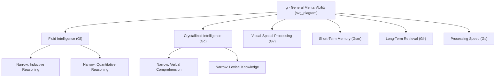

## Cognitive Ability and General Mental Ability

### Definition and Conceptual Overview

General Mental Ability (GMA), often used interchangeably with "cognitive ability" or the psychometric "g factor," refers to a person's capacity to learn, reason, solve problems, and process complex information. It is distinct from specific skills or acquired knowledge; rather, it represents an underlying capacity that influences performance across a wide range of cognitive tasks.

The concept originates from Charles Spearman's (1904) two-factor theory, which proposed that performance on any cognitive task is a function of:

- **g (general factor)**: A single, common underlying ability that contributes to performance on all cognitive tasks
- **s (specific factor)**: Ability specific to the particular task at hand

Spearman arrived at this via observation of the **positive manifold**: scores across diverse, seemingly unrelated cognitive tests (verbal, numerical, spatial) tend to correlate positively with one another. A person who does well on a vocabulary test also tends to do well on a numerical reasoning test, even though the content differs substantially.

### Theoretical Models of Cognitive Ability

**Spearman's Two-Factor Theory**

The earliest formal model, positing g plus task-specific s factors. It laid the groundwork for hierarchical models that followed.

**Thurstone's Primary Mental Abilities**

Louis Thurstone challenged the single-factor view, proposing seven relatively independent "primary mental abilities": verbal comprehension, word fluency, number facility, spatial visualization, associative memory, perceptual speed, and reasoning. Later factor-analytic work showed these primary abilities themselves correlate, which resurrected the idea of a higher-order g sitting above them.

**Cattell-Horn-Carroll (CHC) Theory**

The dominant contemporary model, integrating Cattell's fluid/crystallized distinction with Carroll's three-stratum theory:

- **Stratum III**: g (general ability) at the apex
- **Stratum II**: Broad abilities, including:
  - **Fluid intelligence (Gf)**: Novel problem-solving, reasoning independent of acquired knowledge
  - **Crystallized intelligence (Gc)**: Acquired knowledge and verbal comprehension, built through experience and education
  - Others: visual-spatial processing (Gv), short-term memory (Gsm), long-term storage/retrieval (Glr), processing speed (Gs), auditory processing (Ga)
- **Stratum I**: Narrow, specific abilities nested under each broad ability

**[Inference]** In applied I-O psychology, CHC theory is generally regarded as the most empirically supported structural model, though practitioners in personnel selection continue to rely heavily on the unitary g construct because of its superior predictive utility relative to the cost of measuring the full CHC hierarchy.

### Measurement of Cognitive Ability

**Common Instruments**

- **Wonderlic Personnel Test**: A 12-minute, 50-item test widely used in employment settings (well-known for its use in NFL scouting) that yields a composite score correlated with g
- **Wechsler Adult Intelligence Scale (WAIS)**: A comprehensive individually-administered battery yielding a Full Scale IQ along with index scores (Verbal Comprehension, Perceptual Reasoning, Working Memory, Processing Speed)
- **Raven's Progressive Matrices**: A non-verbal test of abstract reasoning, considered a relatively culture-fair measure of fluid intelligence
- **General Aptitude Test Battery (GATB)**: Developed by the U.S. Department of Labor, measures multiple aptitudes including cognitive, perceptual, and psychomotor abilities

**Psychometric Properties**

Cognitive ability tests used in employment settings are generally noted for:

- High reliability (test-retest and internal consistency coefficients often in the 0.80-0.95 range)
- Strong construct validity as measures of g
- Susceptibility to adverse impact concerns (discussed below)

### Cognitive Ability as a Predictor of Job Performance

**Meta-Analytic Evidence**

Schmidt and Hunter's (1998) landmark meta-analysis, synthesizing 85 years of selection research, concluded that GMA is the single best predictor of job performance across virtually all jobs, with an estimated mean validity coefficient of approximately $r = 0.51$ against overall job performance (corrected for range restriction and criterion unreliability).

**Key Points**

- Validity for GMA tends to increase with job complexity: correlations are highest for complex jobs (e.g., professional/managerial roles, around $r = 0.58$) and lowest for simple jobs (e.g., unskilled labor, around $r = 0.23$), though even at the low end validity remains meaningfully above zero
- GMA predicts performance largely through its effect on **job knowledge acquisition**: individuals higher in g learn job-relevant knowledge and skills faster and more thoroughly, and job knowledge in turn drives performance
- GMA shows **incremental validity** over most other predictors—meaning that combining GMA with a second predictor (e.g., a structured interview or a conscientiousness measure) typically improves predictive accuracy beyond GMA alone, whereas the reverse combination often adds less
- Unlike many other predictors (e.g., work sample tests, structured interviews), the validity of GMA tests generalizes well across situations, organizations, and job types—a conclusion central to the **validity generalization** research tradition

**[Inference]** The magnitude of these validity coefficients, while robust across many replications, remains a subject of ongoing methodological debate (particularly regarding correction procedures for range restriction), so practitioners should treat $r = 0.51$ as a well-supported approximation rather than an exact population parameter.

### Adverse Impact and Legal/Ethical Considerations

A central and persistent tension in the use of cognitive ability testing for selection:

- Cognitive ability tests are among the strongest predictors of job performance available, but they also tend to produce the largest **subgroup mean differences** between racial/ethnic groups of any commonly used selection tool, which can result in adverse impact against certain protected groups under frameworks such as the U.S. Uniform Guidelines on Employee Selection Procedures (the "four-fifths rule")
- This creates the so-called **diversity-validity dilemma**: the predictor with the strongest job-relevant validity is also the one most likely to trigger adverse impact litigation risk
- Common mitigation strategies studied in the I-O literature include:
  - Combining GMA tests with other predictors that show smaller subgroup differences (e.g., conscientiousness, structured interviews, situational judgment tests) to form a composite battery
  - Using test content with a narrower/more job-relevant focus rather than broad abstract reasoning where appropriate
  - Banding or alternative scoring approaches (though these carry their own legal and psychometric controversies)

**[Unverified]** The precise effectiveness of any single mitigation strategy at reducing adverse impact while preserving validity varies considerably by study design, job context, and applicant pool composition, and should not be assumed to generalize without local validation.

### Cognitive Ability and Other Workplace Outcomes

Beyond task performance, GMA has been linked in the literature to:

- **Training success**: strong predictor of performance in training programs, often with validities exceeding those for job performance itself
- **Leadership emergence and effectiveness**: moderate positive relationship, though the relationship is more complex and context-dependent than for task performance
- **Career advancement and income**: higher GMA is associated with attaining more complex, higher-status, higher-paying jobs over a career
- **Counterproductive work behavior (CWB)**: relationship is weak and inconsistent; GMA is a much better predictor of *can-do* performance than of motivation-based or *will-do* behaviors

### Illustrative Example

**Example**

A hospital system hiring for entry-level medical billing clerks versus hospital administrators would expect GMA testing to add more predictive value for the administrator role. Because administrative work involves complex, novel problem-solving, ambiguous decision-making, and rapid acquisition of new policy/regulatory knowledge, GMA validity would be expected to sit near the high end of the range (e.g., $r \approx 0.55-0.58$). For the billing clerk role—more routinized, procedural, and narrower in scope—GMA would still show a positive relationship with performance, but validity would be expected to be lower (e.g., $r \approx 0.20-0.30$), and a structured work-sample test might be a comparatively more efficient predictor for that specific role.

### Hierarchical Structure Diagram

### Validity by Job Complexity (Conceptual)

<svg viewBox="0 0 640 380" xmlns="http://www.w3.org/2000/svg">
<text x="320" y="28" text-anchor="middle" font-size="16" font-weight="bold" fill="#1a1a1a">GMA Validity by Job Complexity (svg_diagram)</text>
<line x1="70" y1="320" x2="600" y2="320" stroke="#333" stroke-width="2"/>
<line x1="70" y1="320" x2="70" y2="50" stroke="#333" stroke-width="2"/>

<text x="40" y="325" font-size="12" fill="#333">0.0</text>

<text x="40" y="245" font-size="12" fill="#333">0.2</text>

<text x="40" y="165" font-size="12" fill="#333">0.4</text>

<text x="40" y="85" font-size="12" fill="#333">0.6</text>

<text x="10" y="190" font-size="13" fill="#333" transform="rotate(-90 10,190)">Validity (r)</text>

<rect x="130" y="243" width="90" height="77" fill="#7fb3d5"/>
<text x="175" y="335" text-anchor="middle" font-size="12" fill="#333">Low Complexity</text>
<text x="175" y="235" text-anchor="middle" font-size="12" fill="#1a1a1a">0.23</text>
<rect x="290" y="167" width="90" height="153" fill="#5499c7"/>
<text x="335" y="335" text-anchor="middle" font-size="12" fill="#333">Medium Complexity</text>
<text x="335" y="159" text-anchor="middle" font-size="12" fill="#1a1a1a">0.40</text>
<rect x="450" y="87" width="90" height="233" fill="#2874a6"/>
<text x="495" y="335" text-anchor="middle" font-size="12" fill="#333">High Complexity</text>
<text x="495" y="79" text-anchor="middle" font-size="12" fill="#1a1a1a">0.58</text>

<text x="320" y="365" text-anchor="middle" font-size="11" fill="#666">Values approximate meta-analytic estimates (Schmidt & Hunter, 1998)</text>

</svg>

### Conclusion

Cognitive ability, structured around the g factor and its hierarchical CHC extensions, remains the most consistently validated predictor of job performance in the personnel selection literature, with validity scaling upward alongside job complexity. Its predictive power operates substantially through accelerated job knowledge acquisition. However, its practical use is inseparable from the diversity-validity dilemma, requiring practitioners to weigh strong predictive utility against adverse impact risk and to consider composite selection systems that balance both concerns.

**Related Topics**

- Fluid vs. Crystallized Intelligence in Adult Development
- Validity Generalization and Meta-Analytic Methods in Personnel Selection
- The Diversity-Validity Dilemma in Employee Selection
- Emotional Intelligence as a Complementary/Competing Construct
- Job Knowledge as a Mediator of the GMA-Performance Relationship
- Structured Interviews and Incremental Validity Over Cognitive Ability
- Adverse Impact, the Four-Fifths Rule, and the Uniform Guidelines
- Situational Judgment Tests as Alternative Selection Instruments