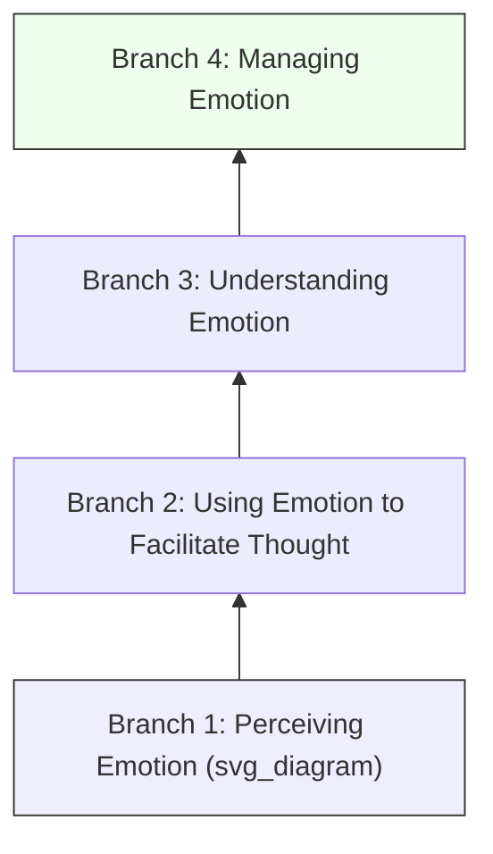

## Emotional Intelligence

### Definition and Construct Overview

Emotional Intelligence (EI) refers to the capacity to perceive, understand, regulate, and use emotions—both one's own and others'—in ways that facilitate thought, decision-making, and interpersonal functioning. In organizational psychology, EI is studied as an individual difference variable that predicts leadership effectiveness, job performance, team functioning, and well-being at work.

Three major theoretical traditions dominate the field, and they are not interchangeable:

- **Ability EI (Mayer-Salovey model)**: EI as a set of cognitive abilities for processing emotional information, measured via performance-based tests.
- **Trait EI (Petrides model)**: EI as a constellation of self-perceived emotional dispositions, sitting at the lower levels of personality hierarchies, measured via self-report.
- **Mixed models (Goleman, Bar-On)**: EI as a blend of abilities, competencies, and personality traits (e.g., self-motivation, empathy, social skills), typically measured via self-report or 360-degree instruments.

[Inference] The distinction between ability and trait EI is one of the more consequential but underappreciated issues in the field, since studies using different measurement traditions produce meaningfully different correlations with outcomes like performance and personality overlap.

### The Four-Branch Ability Model (Mayer-Salovey-Caruso)

This is the most empirically rigorous and widely cited ability-based framework, forming the basis of the MSCEIT (Mayer-Salovey-Caruso Emotional Intelligence Test).

1. **Perceiving Emotion** – Accurately identifying emotions in faces, voices, and other stimuli.
2. **Using Emotion to Facilitate Thought** – Harnessing emotions to prioritize thinking and direct attention to important information.
3. **Understanding Emotion** – Comprehending emotional language, how emotions combine, progress, and transition (e.g., irritation escalating to rage).
4. **Managing Emotion** – Regulating emotions in oneself and others to achieve desired outcomes.

The branches are arranged hierarchically from more basic (perception) to more complex (management) psychological processes.

### Trait EI and the Personality Overlap Debate

Trait EI is measured through instruments like the **TEIQue (Trait Emotional Intelligence Questionnaire)** and captures self-perceptions such as emotion regulation, empathy, assertiveness, and stress management.

**Key Points**

- Trait EI shows substantial overlap with the Big Five, particularly low Neuroticism and high Extraversion.
- [Inference] Because of this overlap, critics argue trait EI may add limited incremental validity over established personality models in predicting job performance, though proponents note it still explains unique variance in specific criteria like well-being and social effectiveness.
- Trait EI is best conceptualized as a compound personality trait rather than an intelligence in the psychometric sense (it does not have objectively "correct" answers).

### Measurement Approaches

| Approach | Example Instrument | Format | Captures |
| --- | --- | --- | --- |
| Ability-based | MSCEIT | Performance test (correct/incorrect answers) | Maximal emotional cognitive performance |
| Trait-based | TEIQue | Self-report | Typical emotional self-perceptions |
| Mixed-model | EQ-i 2.0, ESCI (Goleman/Boyatzis) | Self-report / 360 | Competencies, behaviors, personality blend |

**Key Points**

- Ability tests correlate weakly with self-report EI measures (typically $r < .30$), reinforcing that they tap different constructs.
- Mixed-model instruments are the most commonly used in corporate leadership development but face the strongest criticism for construct vagueness and social desirability bias.

### Goleman's Mixed-Model Competency Framework

Daniel Goleman's popularized framework, widely used in management and leadership training, organizes EI into four domains with associated competencies:

1. **Self-Awareness** – Emotional self-awareness, accurate self-assessment.
2. **Self-Management** – Self-control, adaptability, achievement orientation, initiative.
3. **Social Awareness** – Empathy, organizational awareness.
4. **Relationship Management** – Influence, conflict management, teamwork, inspirational leadership.

[Unverified] The specific competency lists have shifted across Goleman's publications (1995, 1998, 2002) and consulting-firm adaptations, so the exact taxonomy cited can vary by source.

### EI and Workplace Outcomes

**Leadership Effectiveness**

EI is theorized to support leadership through enhanced self-regulation under pressure, accurate reading of follower emotional states, and skillful influence tactics. Meta-analytic evidence shows small-to-moderate positive correlations between EI (particularly ability and mixed measures) and leadership effectiveness ratings.

**Job Performance**

- EI shows the strongest performance correlations in roles with high **emotional labor** demands (customer service, healthcare, sales, education).
- [Inference] In highly technical or low-interpersonal roles, EI's incremental predictive value over cognitive ability and conscientiousness is likely smaller, since job-relevant emotional demands are lower.

**Team Functioning**

Teams with higher average EI (and particularly EI among informal leaders) show better conflict resolution, cohesion, and collective efficacy.

**Well-Being and Stress Management**

Higher EI, especially the "managing emotion" branch, is associated with lower burnout, better coping strategies, and greater job satisfaction.

### EI vs. Cognitive Ability and Personality: Incremental Validity

A central research question is whether EI predicts outcomes above and beyond $g$ (general cognitive ability) and the Big Five personality traits.

$$\Delta R^2_{EI} = R^2_{full\ model} - R^2_{model\ without\ EI}$$

**Key Points**

- Ability EI tends to show modest but statistically significant incremental validity over cognitive ability and personality for predicting job performance and leadership outcomes.
- Trait and mixed EI measures show weaker incremental validity once personality (especially Neuroticism, Extraversion, and Conscientiousness) is controlled for, due to conceptual and empirical overlap.
- [Inference] The magnitude of incremental validity likely depends heavily on the criterion measured and the emotional demands of the job—larger effects for emotionally-loaded criteria (e.g., customer satisfaction), smaller for purely task-based performance.

### Criticisms and Controversies

- **Construct proliferation**: Different models measure fundamentally different things under the same "EI" label, complicating cross-study comparison.
- **Circularity in mixed models**: Some competency lists (e.g., "achievement orientation," "initiative") resemble general performance traits rather than emotion-specific constructs, raising concerns about criterion contamination.
- **Faking and social desirability**: Self-report EI measures are vulnerable to impression management, particularly in high-stakes selection contexts.
- **Popular science overreach**: Claims that "EI matters more than IQ for success" popularized in trade literature substantially outrun the empirical evidence base. [Speculation] Some of this gap reflects commercial incentives in the corporate training and assessment industry rather than purely scientific consensus.

### Developing Emotional Intelligence

Unlike general cognitive ability, EI (particularly its skill-based components) is considered more malleable through training, though effects vary by component.

**Example**

A common organizational intervention sequence:

1. Self-assessment (e.g., 360-degree EI feedback)
2. Awareness-building (recognizing emotional triggers and patterns)
3. Skill practice (role-play in giving difficult feedback, active listening drills)
4. Coaching and reinforcement over time (since EI skills, like other soft skills, show decay without practice)

[Inference] Ability EI (the underlying cognitive skill of accurately perceiving and reasoning about emotions) is likely less trainable in the short term than the behavioral expression of emotional competencies (e.g., learning specific active-listening scripts), though the field lacks strong longitudinal training-effect data to confirm the size of this difference.

### Illustrative Model Comparison

<svg xmlns="http://www.w3.org/2000/svg" viewBox="0 0 760 380" font-family="Arial, sans-serif">
<text x="380" y="25" text-anchor="middle" font-size="16" font-weight="bold">EI Model Comparison (svg_diagram)</text>
<rect x="20" y="60" width="220" height="280" rx="10" fill="#eef2ff" stroke="#4338ca" stroke-width="1.5" />
<text x="130" y="90" text-anchor="middle" font-size="13" font-weight="bold" fill="#3730a3">Ability EI</text>
<text x="130" y="115" text-anchor="middle" font-size="11">MSCEIT</text>
<text x="130" y="140" text-anchor="middle" font-size="11">Performance-based</text>
<text x="130" y="165" text-anchor="middle" font-size="11">Objective scoring</text>
<text x="130" y="200" text-anchor="middle" font-size="11" fill="#4338ca">Low overlap with</text>
<text x="130" y="218" text-anchor="middle" font-size="11" fill="#4338ca">Big Five</text>
<text x="130" y="250" text-anchor="middle" font-size="11">Weak-moderate</text>
<text x="130" y="268" text-anchor="middle" font-size="11">predictive validity</text>
<rect x="270" y="60" width="220" height="280" rx="10" fill="#ecfdf5" stroke="#047857" stroke-width="1.5" />
<text x="380" y="90" text-anchor="middle" font-size="13" font-weight="bold" fill="#065f46">Trait EI</text>
<text x="380" y="115" text-anchor="middle" font-size="11">TEIQue</text>
<text x="380" y="140" text-anchor="middle" font-size="11">Self-report</text>
<text x="380" y="165" text-anchor="middle" font-size="11">Typical performance</text>
<text x="380" y="200" text-anchor="middle" font-size="11" fill="#047857">High overlap with</text>
<text x="380" y="218" text-anchor="middle" font-size="11" fill="#047857">Neuroticism/Extraversion</text>
<text x="380" y="250" text-anchor="middle" font-size="11">Predicts well-being,</text>
<text x="380" y="268" text-anchor="middle" font-size="11">social outcomes</text>
<rect x="520" y="60" width="220" height="280" rx="10" fill="#fff7ed" stroke="#c2410c" stroke-width="1.5" />
<text x="630" y="90" text-anchor="middle" font-size="13" font-weight="bold" fill="#9a3412">Mixed-Model EI</text>
<text x="630" y="115" text-anchor="middle" font-size="11">EQ-i 2.0, ESCI</text>
<text x="630" y="140" text-anchor="middle" font-size="11">Self-report / 360</text>
<text x="630" y="165" text-anchor="middle" font-size="11">Competencies + traits</text>
<text x="630" y="200" text-anchor="middle" font-size="11" fill="#c2410c">Popular in corporate</text>
<text x="630" y="218" text-anchor="middle" font-size="11" fill="#c2410c">L&amp;D and coaching</text>
<text x="630" y="250" text-anchor="middle" font-size="11">Criticized for construct</text>
<text x="630" y="268" text-anchor="middle" font-size="11">vagueness</text>
</svg>

### Conclusion

Emotional Intelligence is a multidimensional individual-difference construct with genuine, if modest and model-dependent, predictive value for leadership, performance in emotionally demanding roles, team functioning, and well-being. Its practical utility in organizations depends heavily on selecting the appropriate model (ability vs. trait vs. mixed) for the assessment purpose—ability measures for rigorous prediction and research, and mixed-model competency frameworks for developmental coaching—while remaining cautious about overstated popular claims regarding its supremacy over cognitive ability.

**Related Topics**

- The Big Five Personality Model and its overlap with Trait EI
- Emotional Labor and Surface vs. Deep Acting
- Transformational Leadership and Affective Influence Tactics
- Self-Monitoring as an Individual Difference
- Cognitive Ability ($g$) as a Predictor of Job Performance
- Social Intelligence and Interpersonal Competence Models
- 360-Degree Feedback Systems in Leadership Development
- Emotion Regulation Strategies (Gross's Process Model)