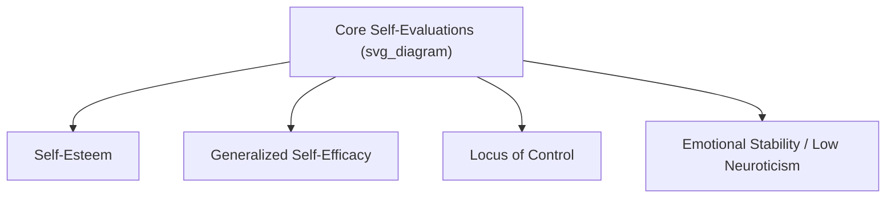

## Core Self-Evaluations and Locus of Control

### Overview and Theoretical Placement

Core Self-Evaluations (CSE) and Locus of Control (LOC) are both broad, dispositional constructs in organizational psychology that describe how individuals fundamentally appraise themselves and their relationship to outcomes in their environment. LOC is one of the four narrower traits subsumed within the broader CSE construct, making these two topics conceptually nested rather than parallel.

### Core Self-Evaluations: Definition and Structure

Developed primarily by Timothy Judge and colleagues in the late 1990s, **Core Self-Evaluations** is a broad, higher-order personality trait reflecting the fundamental, bottom-line evaluations individuals hold about their own worth, competence, and capabilities. It is theorized as a latent factor underlying four first-order traits:

1. **Self-Esteem** – The overall value one places on oneself as a person.
2. **Generalized Self-Efficacy** – Belief in one's competence to perform successfully across a variety of situations.
3. **Locus of Control** – Beliefs about the extent to which one controls events in one's life.
4. **Emotional Stability (low Neuroticism)** – The tendency to feel secure, calm, and unthreatened rather than anxious or depressed.

**Key Points**

- CSE is measured either by aggregating the four component scales or via a direct instrument, the **Core Self-Evaluations Scale (CSES)**, a 12-item self-report measure developed by Judge, Erez, Bono, and Thoresen (2003).
- People high in CSE appraise themselves as capable, worthy, and in control of their lives; people low in CSE tend toward self-doubt, perceived powerlessness, and negative self-regard.
- CSE is considered a dispositional source of job satisfaction and performance that operates largely through consistent, positive self-referential appraisals across situations.

### Locus of Control: Definition and Origins

**Locus of Control**, originating from Julian Rotter's (1966) social learning theory, refers to the degree to which individuals believe that outcomes in their lives result from their own actions (**internal locus**) versus external forces such as luck, fate, or powerful others (**external locus**).

- **Internal LOC**: "My effort and decisions determine my outcomes."
- **External LOC**: "Outcomes are determined by chance, luck, or other people, regardless of my effort."

LOC is conceptualized as a continuum rather than a strict dichotomy; most individuals fall somewhere between the extremes.

**Example**

- An internal-LOC employee who misses a promotion is more likely to attribute it to skill gaps they can address ("I need to strengthen my presentation skills").
- An external-LOC employee facing the same outcome is more likely to attribute it to favoritism, bad luck, or organizational politics beyond their control.

### Measurement Instruments

| Construct | Instrument | Format | Notes |
| --- | --- | --- | --- |
| CSE | Core Self-Evaluations Scale (CSES) | 12-item self-report | Direct, unidimensional measure of the higher-order factor |
| Locus of Control | Rotter's Internal-External (I-E) Locus of Control Scale | 29-item forced-choice | Original and most widely cited LOC measure |
| Locus of Control (work-specific) | Work Locus of Control Scale (Spector) | Likert self-report | Domain-specific version for organizational research |

[Unverified] Some newer domain-specific LOC scales exist beyond Spector's Work Locus of Control Scale, but Rotter's original I-E scale remains the most frequently referenced in foundational organizational behavior literature.

### CSE and Workplace Outcomes

**Job Satisfaction**

CSE is one of the strongest dispositional predictors of job satisfaction in the organizational behavior literature. High-CSE individuals tend to perceive their jobs more positively, set and pursue more challenging goals, and interpret ambiguous work situations more favorably.

**Job Performance**

CSE relates to performance partly through motivational mechanisms: high-CSE individuals set higher goals, persist longer in the face of setbacks, and experience greater intrinsic motivation.

$$Performance = f(CSE, Goal\ Level, Persistence, Self\text{-}Efficacy)$$

**Stress and Well-Being**

High CSE buffers against the negative effects of job stressors, partly because high-CSE individuals appraise stressors as more manageable (a challenge rather than a threat).

[Inference] Because CSE aggregates self-esteem, self-efficacy, emotional stability, and internal LOC, its predictive strength for satisfaction and stress outcomes likely stems from shared variance across these components rather than any single sub-trait acting alone, though isolating the unique contribution of each component is an ongoing empirical challenge.

### Locus of Control and Workplace Outcomes

**Key Points**

- **Internal LOC** is generally associated with higher job performance, greater job satisfaction, higher motivation, more effective coping strategies, and greater likelihood of engaging in proactive career behaviors (e.g., seeking feedback, negotiating).
- **Internal LOC** individuals are more likely to engage in **problem-focused coping** (directly addressing the stressor).
- **External LOC** individuals are more likely to engage in **emotion-focused coping** (managing emotional reactions to the stressor) and may show higher susceptibility to learned helplessness under chronic uncontrollable stress.
- Internal LOC is linked to more effective leadership behavior, partly through greater initiative-taking and higher perceived self-efficacy in influencing outcomes.

**Boundary Conditions**

[Inference] The performance advantage of internal LOC is likely context-dependent: in roles or organizational cultures with genuinely low autonomy (e.g., highly bureaucratic, rule-bound environments), a strong internal LOC without matching actual control may increase frustration rather than performance, though this moderating effect is less firmly established than the main effect itself.

### CSE vs. Locus of Control: Distinguishing the Constructs

| Dimension | Core Self-Evaluations | Locus of Control |
| --- | --- | --- |
| Scope | Broad, higher-order trait | Narrower, first-order trait (one CSE component) |
| Core question | "Am I fundamentally capable and worthy?" | "Do I control outcomes, or do external forces?" |
| Origin | Judge et al. (1997, 2003) | Rotter (1966), social learning theory |
| Overlap with Big Five | Strongly related to low Neuroticism | Moderately related to low Neuroticism, higher Conscientiousness |
| Typical use | Predicting satisfaction, performance, stress resilience broadly | Predicting attribution style, coping, motivation, proactivity |

### Practical Applications in Organizations

**Example**

Common applied uses include:

- **Selection**: Some organizations use CSE or LOC-related items in personality assessments for roles requiring resilience, initiative, or independent judgment (e.g., sales, entrepreneurship, leadership pipelines).
- **Career development**: Internal LOC individuals often respond well to autonomy-supportive management and stretch assignments; external LOC individuals may benefit more from structured goal-setting and explicit feedback loops.
- **Change management**: Employees with more external LOC may perceive organizational change as something "happening to them," warranting more communication and perceived-control-building interventions (e.g., participative decision-making) during transitions.

### Criticisms and Limitations

- **Redundancy concerns**: Because CSE substantially overlaps with established Big Five traits (especially Neuroticism), some researchers question whether it adds meaningful incremental explanatory power beyond existing personality frameworks.
- **Western/individualist bias**: [Inference] Locus of control research has been conducted predominantly in individualist Western contexts; the internal-external distinction and its "internal is better" value orientation may not generalize identically across collectivist cultures where outcomes are more normatively attributed to group or relational factors, though cross-cultural LOC research is more limited than domestic U.S.-based studies.
- **Static trait framing**: Both constructs are typically treated as relatively stable dispositions, but state-like fluctuations (e.g., temporary loss of perceived control after a negative event) are less well captured by trait-level measurement.

### Conclusion

Core Self-Evaluations and Locus of Control represent complementary layers of dispositional self-appraisal in the workplace: CSE as the broad, integrative trait capturing overall self-worth and capability beliefs, and LOC as one of its key narrower components capturing beliefs about control over outcomes. Both constructs offer robust, replicated predictive value for job satisfaction, performance, coping, and resilience, making them foundational tools for understanding individual differences in how employees interpret and respond to their work environments.

**Related Topics**

- The Big Five Personality Model (Five-Factor Model) and trait overlap with CSE
- Self-Efficacy Theory (Bandura) and its distinct role beyond CSE
- Attribution Theory in Organizational Behavior
- Learned Helplessness and Chronic Stress
- Proactive Personality and Career Self-Management
- Coping Strategies: Problem-Focused vs. Emotion-Focused
- Person-Job Fit and Dispositional Approaches to Job Satisfaction