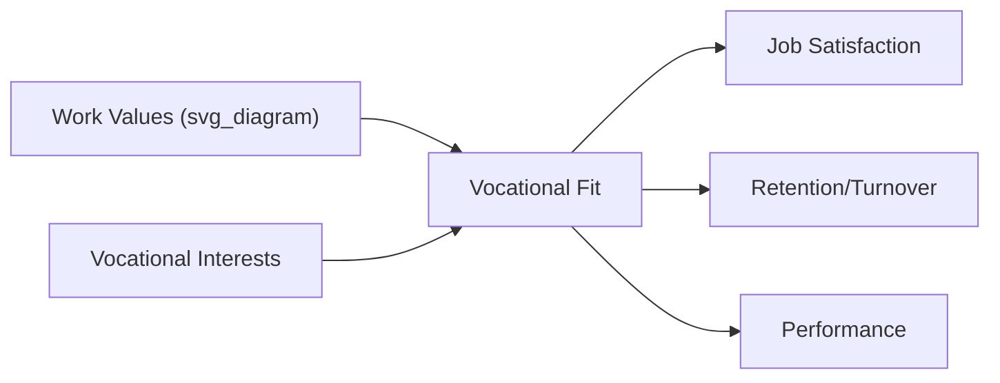

## Values, Interests, and Vocational Fit

### Overview

Values, interests, and vocational fit form a cluster of individual-difference constructs concerned with what people care about, what they enjoy doing, and how well their personal characteristics align with their work environment. Unlike ability or personality traits, these constructs are primarily motivational and preference-based, shaping career choice, satisfaction, and persistence rather than raw performance capacity.

### Work Values

**Definition**

Work values are enduring beliefs about desirable end-states or behaviors related to work, guiding what individuals seek to attain or avoid in a job (e.g., achievement, security, autonomy, altruism).

**Key Frameworks**

1. **Super's Work Values Inventory** – Categorizes values such as achievement, altruism, independence, prestige, security, and economic returns.
2. **Schwartz's Theory of Basic Human Values** (adapted to work contexts) – Organizes values along two bipolar dimensions: openness-to-change vs. conservation, and self-enhancement vs. self-transcendence.
3. **Meyer, Irving, and Allen's Work Values** – Distinguishes intrinsic values (interesting, meaningful work) from extrinsic values (pay, security, status).

**Key Points**

- Values differ from interests in that values represent what matters (the "why"), while interests represent what one enjoys doing (the "what").
- Values differ from personality traits in that they are more consciously held, evaluative, and goal-directed, whereas traits are more descriptive of typical behavioral tendencies.
- Person-organization value congruence has consistently shown positive relationships with job satisfaction, organizational commitment, and reduced turnover intentions.

### Vocational Interests

**Definition**

Vocational interests reflect stable preferences for engaging in particular types of activities, environments, and occupations, typically assessed for career guidance and selection purposes.

**Holland's RIASEC Model**

The dominant framework in vocational psychology, developed by John Holland, organizes interests into six types arranged in a hexagonal structure:

- **R**ealistic – Hands-on, mechanical, outdoor work (e.g., engineer, technician)
- **I**nvestigative – Analytical, scientific, research-oriented work (e.g., scientist, analyst)
- **A**rtistic – Creative, expressive, unstructured work (e.g., designer, writer)
- **S**ocial – Helping, teaching, interpersonal work (e.g., counselor, teacher)
- **E**nterprising – Persuading, leading, business-oriented work (e.g., sales manager, entrepreneur)
- **C**onventional – Structured, detail-oriented, data-management work (e.g., accountant, administrator)

<svg xmlns="http://www.w3.org/2000/svg" viewBox="0 0 400 400" font-family="Arial, sans-serif">
<text x="200" y="25" text-anchor="middle" font-size="16" font-weight="bold">RIASEC Hexagon (svg_diagram)</text>
<polygon points="200,60 320,130 320,270 200,340 80,270 80,130" fill="#f0f4ff" stroke="#3730a3" stroke-width="2" />
<line x1="200" y1="60" x2="320" y2="130" stroke="#c7d2fe" />
<line x1="320" y1="130" x2="320" y2="270" stroke="#c7d2fe" />
<line x1="320" y1="270" x2="200" y2="340" stroke="#c7d2fe" />
<line x1="200" y1="340" x2="80" y2="270" stroke="#c7d2fe" />
<line x1="80" y1="270" x2="80" y2="130" stroke="#c7d2fe" />
<line x1="80" y1="130" x2="200" y2="60" stroke="#c7d2fe" />
<circle cx="200" cy="60" r="28" fill="#fecaca" stroke="#991b1b" />
<text x="200" y="65" text-anchor="middle" font-size="13" font-weight="bold">R</text>
<circle cx="320" cy="130" r="28" fill="#fed7aa" stroke="#9a3412" />
<text x="320" y="135" text-anchor="middle" font-size="13" font-weight="bold">I</text>
<circle cx="320" cy="270" r="28" fill="#fef08a" stroke="#854d0e" />
<text x="320" y="275" text-anchor="middle" font-size="13" font-weight="bold">A</text>
<circle cx="200" cy="340" r="28" fill="#bbf7d0" stroke="#166534" />
<text x="200" y="345" text-anchor="middle" font-size="13" font-weight="bold">S</text>
<circle cx="80" cy="270" r="28" fill="#bfdbfe" stroke="#1e40af" />
<text x="80" y="275" text-anchor="middle" font-size="13" font-weight="bold">E</text>
<circle cx="80" cy="130" r="28" fill="#e9d5ff" stroke="#6b21a8" />
<text x="80" y="135" text-anchor="middle" font-size="13" font-weight="bold">C</text>
</svg>

**Key Points**

- The hexagonal arrangement is meaningful: adjacent types (e.g., Realistic-Investigative) share more similarity than opposite types (e.g., Realistic-Social), which sit across the hexagon from each other.
- Most individuals do not fit a single pure type; interest profiles are typically summarized as a three-letter code (e.g., "SEC") representing the top three types.
- Common instruments include the **Strong Interest Inventory** and the **Self-Directed Search (SDS)**, both widely used in career counseling and vocational guidance.

### Vocational Fit: The Person-Environment (P-E) Fit Framework

**Definition**

Vocational fit, or person-environment fit, refers to the degree of congruence between an individual's characteristics (values, interests, abilities, personality) and characteristics of the work environment (job, organization, team, supervisor).

**Major Sub-Types of Fit**

| Fit Type | Definition | Example Measure Focus |
| --- | --- | --- |
| Person-Job (P-J) Fit | Match between individual skills/needs and job demands/supplies | Skill requirements vs. abilities |
| Person-Organization (P-O) Fit | Match between individual values and organizational culture/values | Value congruence |
| Person-Group (P-G) Fit | Match between individual and immediate team/coworkers | Interpersonal compatibility |
| Person-Supervisor (P-S) Fit | Match between individual and supervisor's style/values | Leadership style congruence |
| Person-Vocation (P-V) Fit | Match between individual interests and broader occupational field | Holland congruence (RIASEC) |

**Two Conceptual Models of Fit**

1. **Complementary fit** – The individual supplies something the environment lacks, or the environment supplies something the individual needs (Needs-Supplies fit).
2. **Supplementary fit** – The individual resembles others already in the environment, sharing similar values or characteristics (Demands-Abilities fit falls under a related but distinct logic focused on requirements rather than similarity).

$$Fit_{P\text{-}E} = f(\text{Needs}_{Person} \cap \text{Supplies}_{Environment},\ \text{Demands}_{Environment} \cap \text{Abilities}_{Person})$$

### Holland's Congruence Concept

Within vocational psychology specifically, "fit" is often operationalized as **congruence**: the degree of match between a person's RIASEC interest profile and the RIASEC profile of their occupational environment.

**Example**

An Investigative-Artistic-Social (IAS) individual working as a research psychologist experiences high congruence (the occupational environment is coded predominantly I-S-A), predicting greater satisfaction and stability, whereas the same individual working as an assembly-line technician (a Realistic-Conventional environment) would experience low congruence.

**Related Holland Constructs**

- **Consistency**: Degree of relatedness among a person's top interest types (adjacent hexagon types = more consistent).
- **Differentiation**: How distinctly a person's interests are peaked toward certain types versus flat across all types.
- **Identity**: Clarity and stability of one's vocational self-concept.

[Inference] Higher consistency and differentiation are generally assumed to predict more stable and satisfying career paths, though the empirical strength of these secondary constructs (as opposed to congruence itself) is less robust and more debated in the vocational literature.

### Outcomes Associated with Fit

**Key Points**

- P-O fit shows consistent positive relationships with job satisfaction, organizational commitment, and reduced turnover intentions.
- P-J fit tends to show the strongest relationships with job satisfaction and performance specifically, since it directly addresses skill-demand matching.
- Holland congruence shows modest but reliable associations with career satisfaction and tenure, though effect sizes are generally smaller than popularly assumed. [Inference] This gap between popular assumption and empirical effect size likely reflects the intuitive appeal of "find your passion" narratives in career guidance outpacing the actual predictive strength found in meta-analyses.
- Poor fit across multiple dimensions (P-O, P-J, P-G) compounds and is a strong predictor of voluntary turnover.

### Practical Applications

**Example**

Organizational applications include:

- **Recruitment and selection**: Realistic job previews and values-based interview questions to assess P-O fit before hire.
- **Career counseling**: Using RIASEC-based instruments (Strong Interest Inventory, SDS) to guide career exploration and occupational choice.
- **Onboarding**: Structured socialization processes to strengthen perceived P-O and P-G fit early in tenure, which is associated with faster acculturation and lower early turnover.
- **Team staffing**: Considering P-G fit alongside task-relevant skills when assembling project teams, particularly for long-duration or high-interdependence work.

### Distinguishing the Three Constructs

| Construct | Core Question | Stability | Primary Assessment Context |
| --- | --- | --- | --- |
| Values | "What matters to me?" | Relatively stable, can shift with life stage | Career counseling, culture-fit assessment |
| Interests | "What do I enjoy doing?" | Stable from adolescence into adulthood | Vocational guidance, career choice |
| Fit | "How well do I match this environment?" | Dynamic; changes as person or environment changes | Selection, retention, organizational diagnosis |

### Criticisms and Limitations

- **Static assessment vs. dynamic fit**: Most instruments measure values/interests at a single point in time, but perceived fit can shift as roles, teams, and personal priorities evolve.
- **Self-report bias**: Nearly all measures in this domain rely on self-report, introducing social desirability and self-insight limitations.
- **Cultural specificity**: [Inference] The RIASEC hexagon and Western work-values frameworks were developed primarily in U.S. contexts; while cross-cultural validity studies exist for Holland's model, the structure and salience of specific values (e.g., individual achievement vs. collective harmony) may vary in ways not fully captured by these instruments.
- **Fit as a moving target**: Perceived fit is influenced by sensemaking and retrospective rationalization, meaning reported P-O fit can partly reflect post-hoc justification of a job choice rather than a purely objective congruence measure.

### Conclusion

Values, interests, and vocational fit together explain why individuals gravitate toward certain careers, find some work environments more satisfying than others, and remain in or leave organizations. Values capture what people prioritize, interests capture what activities they find engaging, and fit frameworks integrate these (along with abilities and personality) into an overall assessment of person-environment congruence—collectively forming a core toolkit for career guidance, selection, and retention strategy in organizations.

**Related Topics**

- Holland's RIASEC Model in Depth and Career Counseling Applications
- Organizational Culture and Person-Organization Fit
- Realistic Job Previews and Anticipatory Socialization
- Turnover Theory: Voluntary Turnover and the Unfolding Model
- Schwartz's Theory of Basic Human Values
- Job Characteristics Model and Intrinsic Motivation
- Career Development Theories (Super's Life-Span, Life-Space Theory)