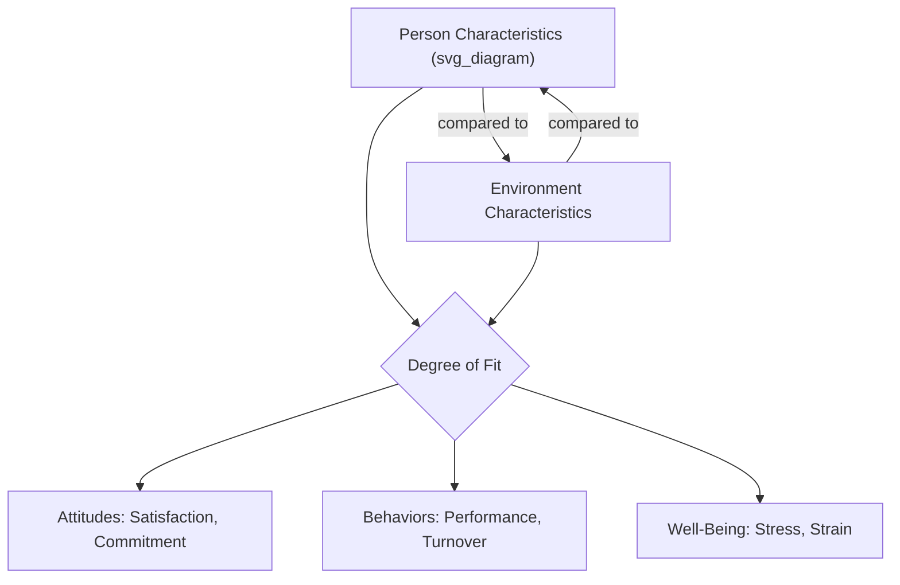
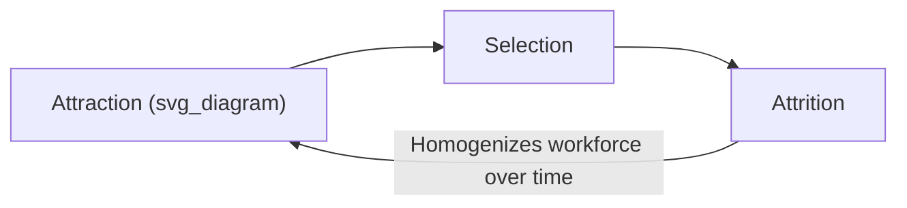

## Person-Environment Fit Theory

### Overview and Theoretical Foundations

Person-Environment (P-E) Fit Theory is a foundational framework in organizational psychology proposing that attitudes, behaviors, and well-being at work result not from the person or the environment in isolation, but from the degree of **congruence** between the two. Its intellectual roots trace to Lewin's classic formulation that behavior is a function of the person and the environment interacting.

$$B = f(P, E)$$

Rather than asking "is this a good employee?" or "is this a good job?" in isolation, P-E fit theory asks how well a specific person matches a specific environment, making it inherently relational and interactionist rather than purely dispositional or purely situational.

### Core Conceptual Distinction: Complementary vs. Supplementary Fit

**Complementary Fit**

Occurs when a person's characteristics "make whole" or complement the environment—the person fills a gap, or the environment fulfills a need the person has. This is the mechanism underlying most classic fit subtypes (e.g., a person's skills fulfilling a job's demands).

**Supplementary Fit**

Occurs when a person possesses characteristics that are similar to, or match, other individuals already present in the environment (e.g., sharing values with existing organizational members). This underlies value-congruence models of person-organization fit.

**Key Points**

- Complementary fit is typically operationalized through the **Needs-Supplies (N-S)** and **Demands-Abilities (D-A)** models (see below).
- Supplementary fit is typically operationalized through **similarity indices**, comparing a person's profile (values, personality) to an aggregate profile of the environment (e.g., organizational culture, team composition).

### The Two Primary Fit Mechanisms

**1. Needs-Supplies (N-S) Fit**

Fit occurs when the environment supplies what the individual needs, wants, or desires (e.g., autonomy, resources, growth opportunities, fair pay).

$$Fit_{N\text{-}S} = |Needs_{Person} - Supplies_{Environment}|$$

**2. Demands-Abilities (D-A) Fit**

Fit occurs when the individual possesses the abilities required to meet the demands of the environment (e.g., skills matching job requirements, workload matching capacity).

$$Fit_{D\text{-}A} = |Demands_{Environment} - Abilities_{Person}|$$

[Inference] Smaller absolute discrepancies in both equations are generally assumed to predict better outcomes, but the relationship is not always strictly linear—some research suggests supplies or abilities that substantially exceed needs or demands (excess fit) can still produce different outcomes than a precise match, though this asymmetry is less consistently studied than simple discrepancy.

### The Five Major Sub-Types of Fit

| Fit Type | Definition | Typical Outcome Focus |
| --- | --- | --- |
| Person-Job (P-J) Fit | Congruence between individual KSAs/needs and job requirements/supplies | Task performance, job satisfaction |
| Person-Organization (P-O) Fit | Congruence between individual values and organizational values/culture | Commitment, turnover, citizenship behavior |
| Person-Group (P-G) Fit | Congruence between individual and immediate team members | Team cohesion, interpersonal satisfaction |
| Person-Supervisor (P-S) Fit | Congruence between individual and supervisor (values, working style) | LMX quality, satisfaction with supervision |
| Person-Vocation (P-V) Fit | Congruence between individual interests and a broader occupational field | Career satisfaction, occupational tenure |

**Key Points**

- These fit types are not mutually exclusive; an employee may have high P-J fit (right skills for the role) but low P-O fit (misaligned with company culture), producing mixed outcomes.
- P-O fit has received the most sustained empirical attention because of its strong ties to voluntary turnover and organizational citizenship behavior.
- Multiple fit types interact: poor fit in one domain can sometimes be offset by strong fit in another (a compensatory pattern), though chronic multi-domain misfit compounds turnover risk.

### Measurement Approaches

**Objective (Indirect) Fit**

Calculated by separately measuring the person's characteristics and the environment's characteristics, then computing an algebraic, absolute, or squared difference score (or profile correlation).

**Subjective (Direct) Fit**

Measured by directly asking individuals to rate their perceived fit (e.g., "I feel my values match this organization's values").

**Key Points**

- Subjective fit measures tend to show stronger correlations with attitudinal outcomes (satisfaction, commitment) than objective difference-score measures, partly because they capture the same perceptual lens the person uses to form those attitudes—raising some concern about common-method variance.
- Difference-score methodologies (e.g., $|P - E|$ or polynomial regression approaches) carry known statistical limitations, including loss of information about the direction and absolute levels of $P$ and $E$, reduced reliability, and conflation of distinct mismatch patterns (too much vs. too little).
- **Polynomial regression with response surface analysis** has become the methodologically preferred approach in fit research, as it avoids collapsing $P$ and $E$ into a single difference score and instead models their joint, potentially nonlinear, relationship with an outcome.

$$Z = b_0 + b_1P + b_2E + b_3P^2 + b_4PE + b_5E^2 + e$$

### Outcomes of P-E Fit

**Attitudinal Outcomes**

- Job satisfaction (particularly linked to P-J and N-S fit)
- Organizational commitment (particularly linked to P-O fit)
- Reduced turnover intentions

**Behavioral Outcomes**

- Task performance (linked to D-A fit)
- Organizational citizenship behavior (linked to P-O and P-G fit)
- Actual voluntary turnover

**Well-Being Outcomes**

- Reduced strain and burnout when D-A fit is high (i.e., when job demands do not chronically exceed the person's abilities and resources)
- Greater psychological well-being when N-S fit is high (needs for autonomy, growth, and belonging are met)

[Inference] The strength of fit-outcome relationships likely varies by outcome type, with attitudinal outcomes (satisfaction, commitment) generally showing more consistent and stronger fit correlations than hard behavioral outcomes (actual performance), since attitudes are more proximally shaped by subjective appraisal processes that closely mirror how fit itself is often measured.

### Related and Overlapping Frameworks

- **Attraction-Selection-Attrition (ASA) Model (Schneider)**: A dynamic, macro-level companion theory explaining how organizations become increasingly homogeneous over time, as individuals are attracted to, selected by, and retained in (or attrit from) organizations based on fit—effectively describing the process by which P-O fit levels shift across an organization's lifecycle.
- **Job Demands-Resources (JD-R) Model**: Related but distinct; JD-R focuses on the balance between job demands and resources predicting burnout/engagement, whereas P-E fit is broader, addressing congruence across values, abilities, and needs, not just demands and resources.
- **Realistic Job Previews (RJPs)**: An applied intervention designed to improve pre-hire fit assessment by giving candidates accurate information about the job, reducing post-hire fit surprises and early turnover.

### Practical Applications

**Example**

Common organizational uses of P-E fit theory include:

1. **Selection systems**: Structured interviews and assessments targeting P-O fit (values alignment) alongside traditional P-J fit (skills testing).
2. **Onboarding design**: Socialization tactics intended to actively shape and strengthen perceived P-O and P-G fit during the critical early tenure period.
3. **Job redesign**: Adjusting job demands or resources to restore D-A fit when an employee's role has expanded beyond their current capacity (a common driver of burnout).
4. **Team formation**: Considering P-G fit alongside functional skill requirements when composing project teams, especially for long-term or highly interdependent work.
5. **Retention diagnostics**: Exit interview frameworks that assess which specific fit type (P-J, P-O, P-G, P-S) broke down prior to a voluntary departure.

### Criticisms and Limitations

- **Measurement complexity**: The shift toward polynomial regression and response surface analysis, while more methodologically rigorous, is statistically demanding and less intuitive for practitioners than simple difference scores.
- **Direction of causality**: Much P-E fit research is cross-sectional, making it difficult to determine whether fit causes positive attitudes or whether positive attitudes cause individuals to perceive greater fit (a sensemaking/rationalization concern).
- **Static snapshots of dynamic environments**: Both the person and the environment change over time (job crafting, role evolution, personal growth), yet many fit studies treat both sides as relatively fixed at the time of measurement.
- **Over-homogenization risk**: [Inference] Heavy selection for P-O fit, if pursued aggressively as an organizational strategy, risks reducing cognitive and demographic diversity by systematically screening out candidates who differ from the existing cultural profile, a concern raised in critiques of the ASA model's long-run implications, though this is a theoretical extension rather than a directly measured outcome in most fit studies.

### Conclusion

Person-Environment Fit Theory provides an integrative, interactionist lens for understanding workplace attitudes and behavior, shifting the analytical focus from the person or the job alone to the congruence between them. Through its major sub-types (P-J, P-O, P-G, P-S, P-V) and mechanisms (Needs-Supplies, Demands-Abilities), the theory has generated a substantial applied toolkit for selection, onboarding, job design, and retention, while ongoing methodological refinement (particularly polynomial regression approaches) continues to sharpen its precision as a research and diagnostic framework.

**Related Topics**

- Attraction-Selection-Attrition (ASA) Model in Depth
- Job Demands-Resources (JD-R) Model
- Realistic Job Previews and Anticipatory Socialization
- Polynomial Regression and Response Surface Analysis Methodology
- Organizational Culture and Value Congruence
- Turnover Theory and the Unfolding Model
- Job Crafting and Dynamic Person-Job Fit Over Time