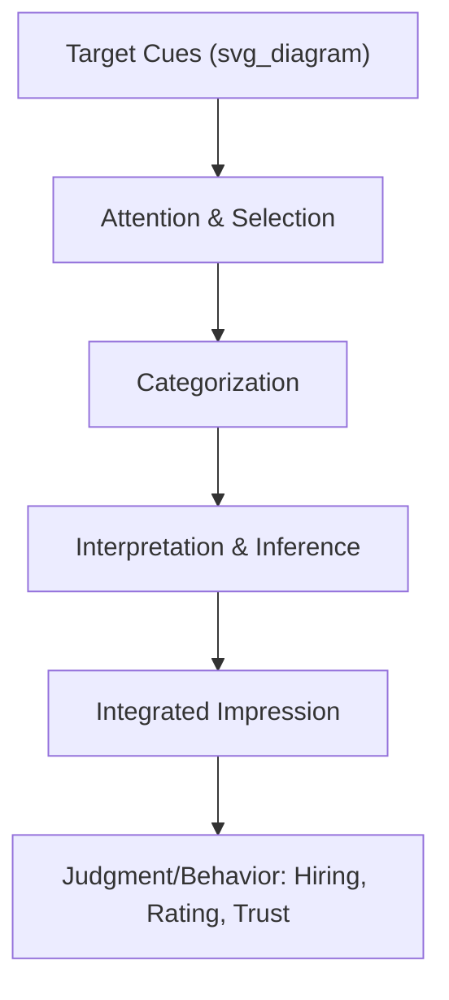
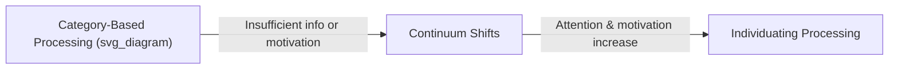

## Social Perception and Impression Formation

### Overview

Social perception refers to the processes by which individuals come to know and interpret information about others—their traits, intentions, emotions, and likely behaviors. Impression formation is the specific sub-process of assembling discrete pieces of observed information into a coherent, integrated judgment of another person. In organizational contexts, these processes underlie interview evaluations, performance appraisals, leadership perceptions, and everyday workplace interactions, making them foundational to understanding bias, fairness, and interpersonal accuracy at work.

### The Social Perception Process

Social perception unfolds through a sequence of cognitive stages, each susceptible to distortion:

1. **Selective Attention** – Perceivers cannot process all available information about a target; attention is drawn to salient, unusual, or schema-relevant cues (e.g., a raised voice, an unusual credential).
2. **Categorization** – Perceivers sort targets into pre-existing mental categories (e.g., "engineer," "extrovert," "new hire") to reduce cognitive load.
3. **Attribution** – Perceivers infer causes for observed behavior (dispositional vs. situational), shaping evaluative judgments.
4. **Integration** – Discrete pieces of information are combined into an overall, coherent impression.

[Inference] This staged model is a useful analytical simplification; in practice, these stages likely overlap and iterate rather than proceeding in a strict linear sequence, since categorization can influence what gets attended to in the first place (a feedback loop rather than a one-way pipeline).

### Schemas and Their Role in Perception

**Definition**

Schemas are cognitive structures that organize prior knowledge and expectations about a category of people, roles, or events, guiding how new information is interpreted and what gaps are filled by inference.

**Types Relevant to Organizations**

- **Person schemas** – Expectations about specific individuals based on prior interactions.
- **Role schemas** – Expectations tied to a social role or job (e.g., "managers are decisive").
- **Event schemas (scripts)** – Expectations about sequences of events (e.g., what a typical job interview looks like).
- **Self-schemas** – Organized knowledge about oneself, which colors perception of others through comparison.

**Key Points**

- Schemas enable rapid, efficient processing but can also produce systematic distortion, since ambiguous information tends to be interpreted in schema-consistent ways.
- Schema-consistent information is generally better recalled than schema-inconsistent information, though strongly schema-inconsistent information can sometimes be recalled well if it is salient enough to prompt deliberate processing (a documented but more context-dependent effect).

### Models of Impression Formation

**1. Additive Model**

Overall impression is the sum of the evaluative value of each individual trait or piece of information observed.

$$Impression = \sum_{i=1}^{n} w_i \cdot trait_i$$

**2. Averaging Model (Anderson)**

Overall impression is a weighted average, not a sum, of trait information—meaning adding a moderately positive trait to an already very positive impression can actually lower the overall impression (a dilution effect), since averaging weights all pieces of information relative to each other.

$$Impression = \frac{\sum_{i=1}^{n} w_i \cdot trait_i}{\sum_{i=1}^{n} w_i}$$

**3. Configural Model (Asch)**

Solomon Asch's classic research demonstrated that certain **central traits** (notably "warm" vs. "cold") disproportionately shape the interpretation of surrounding traits, producing a Gestalt-like, holistic impression rather than a simple mechanical sum or average—information is integrated as a configuration where each piece takes on meaning based on the others.

**Key Points**

- Asch's central trait findings suggest warmth and competence function as two primary dimensions along which most social judgments are organized (later formalized in the Stereotype Content Model).
- [Inference] The relative dominance of additive, averaging, or configural processing likely depends on the perceiver's cognitive load, motivation, and the type of information being integrated, rather than one model universally describing all impression formation.

### Dual-Process Models: Continuum and Category-Based Perception

**Fiske and Neuberg's Continuum Model** proposes that impression formation ranges along a continuum from category-based (fast, schema-driven, effortless) to individuating (slow, attribute-by-attribute, effortful) processing.

**Key Points**

- Perceivers default to category-based (stereotype-driven) processing unless motivated and able to engage in more effortful individuation.
- Motivation to individuate increases under conditions of outcome dependency (e.g., the target will be a close collaborator), accountability (having to justify judgments), or self-relevance.
- [Inference] This dual-process framing implies that structured, accountable evaluation processes (e.g., requiring written justification for interview ratings) likely push perceivers toward more individuating, less stereotype-driven processing, though the size of this effect varies by study and evaluator.

### Key Biases in Impression Formation

**Primacy and Recency Effects**

- **Primacy effect**: Earlier information disproportionately shapes overall impressions, because it sets an interpretive frame for later information (an anchoring-like mechanism).
- **Recency effect**: Later information can dominate under conditions of high cognitive load, long delays between information pieces, or explicit instruction to attend to the most current data.

**Halo Effect**

A single salient positive (or negative) trait or overall impression colors judgments of unrelated traits (e.g., assuming an articulate candidate is also more competent and trustworthy).

**Confirmation Bias**

Perceivers selectively seek, interpret, and recall information that confirms an initial impression, while discounting disconfirming evidence.

**First Impressions and Thin-Slicing**

Research on "thin-slicing" shows that perceivers form impressions—sometimes with notable predictive accuracy for specific narrow judgments—from very brief exposures (seconds) to a target's behavior. [Unverified] The generalizability and effect sizes of thin-slicing accuracy findings vary considerably by judgment domain and have been subject to replication debates, so specific numeric accuracy claims should be treated cautiously.

**Example**

In a job interview, an interviewer who perceives a candidate's firm handshake and confident opening statement (primacy) may then interpret the candidate's subsequent hesitations as "thoughtful deliberation" rather than "uncertainty" (confirmation bias operating through the halo of the initial positive impression).

### Attribution Processes in Impression Formation

Attribution theory intersects heavily with impression formation, since interpreting *why* someone behaved a certain way shapes the resulting impression.

- **Fundamental Attribution Error**: Overweighting dispositional causes and underweighting situational causes when explaining others' behavior (e.g., attributing a colleague's missed deadline to laziness rather than an unreasonable workload).
- **Actor-Observer Asymmetry**: Tendency to attribute one's own behavior to situational factors while attributing others' behavior to disposition.
- **Correspondence Bias**: Related to the fundamental attribution error, this is the tendency to infer that observed behavior corresponds to a stable underlying trait, even when the behavior was constrained by role or circumstance.

### Organizational Applications

**Selection Interviews**

Unstructured interviews are especially vulnerable to primacy effects, halo effects, and confirmation bias, since interviewers often form judgments within the first few minutes and then unconsciously seek confirming evidence for the remainder of the interview. Structured interviews with standardized questions and behaviorally anchored rating scales are a common mitigation strategy.

**Performance Appraisal**

Halo effects and schema-driven categorization (e.g., "she's a high performer" schemas) can bias ratings across unrelated performance dimensions, contributing to leniency, severity, and central tendency errors in ratings.

**Leadership Perception**

**Implicit Leadership Theories (ILTs)** are schemas about what leaders "should" look like and act like; perceivers implicitly compare targets against these prototypes, shaping who is perceived as leader-like independent of actual leadership behavior or outcomes.

**Diversity and Inclusion**

Category-based processing underlies many forms of workplace bias, since demographic categories (race, gender, age) are highly salient, easily accessible schema triggers that can dominate impression formation unless perceivers are motivated and able to individuate.

### Mitigation Strategies

**Example**

Common evidence-informed interventions include:

1. **Structuring evaluative processes**: Standardized interview questions, behaviorally anchored rating scales, and blind resume review reduce reliance on uncontrolled category-based processing.
2. **Increasing accountability**: Requiring evaluators to justify judgments in writing or to a third party increases motivation toward individuating processing.
3. **Delaying judgment**: Structured decision protocols that separate information-gathering from evaluation reduce premature impression formation and confirmation-driven information search.
4. **Perspective-taking and individuation training**: Deliberately prompting perceivers to consider individuating, counter-stereotypic information about a target.

[Inference] These interventions are generally supported by the broader dual-process and motivated-reasoning literature, but their effectiveness in any specific organizational context likely depends on consistent implementation and organizational reinforcement, since one-off training interventions (e.g., single-session bias training) tend to show weaker and less durable effects than structural changes to evaluation processes.

### Conclusion

Social perception and impression formation describe the cognitive machinery through which people transform fragmented observations of others into coherent, actionable judgments—machinery that is efficient but systematically vulnerable to schema-driven distortion, biased attribution, and premature closure. In organizational settings, these processes have direct consequences for hiring, performance evaluation, and leadership emergence, making an understanding of category-based versus individuating processing, central trait effects, and attributional biases essential for designing fairer and more accurate evaluation systems.

**Related Topics**

- Attribution Theory in Organizational Behavior
- Implicit Leadership Theories and Leadership Categorization
- Stereotype Content Model (Warmth and Competence Dimensions)
- Structured vs. Unstructured Selection Interviews
- Performance Appraisal Rating Errors (Halo, Leniency, Central Tendency)
- Motivated Reasoning and Confirmation Bias
- Implicit Bias and Workplace Diversity Interventions