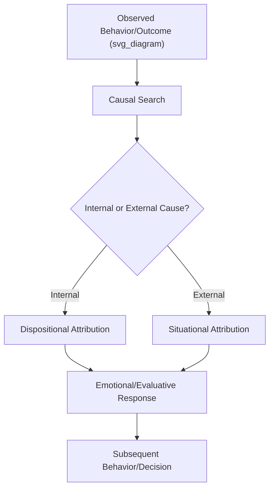

## Attribution Theory

### Overview

Attribution theory examines how individuals explain the causes of behavior—their own and others'—and how these causal explanations shape subsequent emotions, judgments, and actions. In organizational psychology, attribution processes underlie performance evaluations, leadership perceptions, responses to feedback, conflict interpretation, and reactions to organizational events (e.g., layoffs, failures, successes), making the theory a core building block for understanding workplace judgment and decision-making.

### Heider's Naive Psychology and the Origins of Attribution Theory

Fritz Heider's foundational work proposed that people act as "naive scientists," instinctively searching for causes to make sense of behavior and events, because understanding causality allows for prediction and control of the environment. Heider introduced the core internal-external distinction that underlies nearly all subsequent attribution research:

- **Internal (dispositional) attribution**: Behavior is caused by the person's traits, abilities, effort, or motives.
- **External (situational) attribution**: Behavior is caused by factors outside the person—task difficulty, luck, other people, or environmental constraints.

### Jones and Davis: Correspondent Inference Theory

This theory addresses how perceivers infer that observed behavior corresponds to a stable underlying disposition, specifying the conditions under which such inferences are more or less confidently made:

- **Choice**: Freely chosen behavior yields stronger dispositional inferences than coerced behavior.
- **Expectedness/Social Desirability**: Unexpected or socially undesirable behavior yields stronger dispositional inferences than expected or normative behavior, because it stands out against situational pressures to conform.
- **Non-common effects**: When comparing chosen actions to foregone alternatives, effects unique to the chosen action (not shared with alternatives) provide clearer information about underlying disposition.

**Example**

An employee who volunteers for an unpopular, high-effort project (freely chosen, unexpected, non-normative) prompts stronger dispositional inferences ("she must be genuinely committed") than an employee who takes on a project because it was mandatorily assigned.

### Kelley's Covariation Model

Harold Kelley's covariation model formalizes how perceivers use multiple observations across time, targets, and circumstances to arrive at an attribution, based on three dimensions of information:

1. **Consensus** – Do other people behave the same way in this situation?
2. **Distinctiveness** – Does this person behave differently in other, similar situations?
3. **Consistency** – Does this person behave the same way in this situation across time?

| Consensus | Distinctiveness | Consistency | Resulting Attribution |
| --- | --- | --- | --- |
| Low | Low | High | Internal (dispositional) |
| High | High | High | External (situational) |
| Low/High | Low/High | Low | Attribution to circumstance/temporary factors |

**Example**

If an employee (Employee A) misses a deadline, and no other team member missed it (low consensus), Employee A also misses deadlines on other unrelated tasks (low distinctiveness), and Employee A has missed this same recurring deadline before (high consistency), an observer is likely to make an **internal attribution**—concluding the cause lies in Employee A's work habits or reliability rather than the task or team circumstances.

$$Attribution_{internal} \propto (Consensus_{low} \times Distinctiveness_{low} \times Consistency_{high})$$

[Inference] Kelley's model describes an idealized, fully rational information-integration process; in practice, perceivers rarely have complete consensus, distinctiveness, and consistency information available, so real-world attributions likely rely on incomplete data and default heuristics far more than the full covariation model implies.

### Weiner's Attributional Theory of Motivation and Emotion

Bernard Weiner extended attribution theory into achievement contexts, proposing that causal attributions are organized along three underlying dimensions, each with distinct motivational and emotional consequences:

1. **Locus** – Internal vs. external (where the cause resides)
2. **Stability** – Stable vs. unstable (whether the cause is likely to persist or change over time)
3. **Controllability** – Controllable vs. uncontrollable (whether the person could have influenced the cause)

| Dimension | Example Cause (Success/Failure) | Emotional/Motivational Consequence |
| --- | --- | --- |
| Internal, Stable, Controllable | Consistent effort | Pride (success) / Guilt (failure) |
| Internal, Stable, Uncontrollable | Ability level | Confidence (success) / Shame, helplessness (failure) |
| External, Unstable, Uncontrollable | Luck | Surprise, limited motivational impact either way |
| External, Stable, Uncontrollable | Task difficulty | Limited personal emotional impact, may still shape expectancy |

**Key Points**

- The **stability** dimension is particularly influential for future expectancy: attributing failure to a stable cause (low ability) predicts lower expectations for future success than attributing it to an unstable cause (insufficient effort this one time).
- The **controllability** dimension is central to emotional and interpersonal reactions: attributing another's failure to a controllable cause (e.g., laziness) tends to elicit anger and reduced willingness to help, whereas attributing it to an uncontrollable cause (e.g., illness) tends to elicit sympathy and greater willingness to help.
- This dimensional framework underlies much of the applied research on manager reactions to employee failure and feedback-giving behavior.

### Major Attribution Biases

**Fundamental Attribution Error (Correspondence Bias)**

The pervasive tendency to overweight dispositional causes and underweight situational causes when explaining *others'* behavior.

**Actor-Observer Asymmetry**

The tendency to attribute one's *own* behavior to situational factors while attributing *others'* identical behavior to disposition—rooted partly in differential information access (actors know their own situational constraints; observers do not) and differential perceptual focus (actors attend to the environment; observers attend to the actor).

**Self-Serving Bias**

The tendency to attribute one's own successes to internal, controllable factors (skill, effort) while attributing one's own failures to external, uncontrollable factors (bad luck, unfair circumstances)—serving a self-esteem-protective function.

$$Self\text{-}Serving\ Bias: P(Internal\ Attribution\ |\ Success) > P(Internal\ Attribution\ |\ Failure)$$

**Group-Serving Bias (Ultimate Attribution Error)**

An extension of self-serving bias to group membership: attributing positive in-group behavior and negative out-group behavior to disposition, while attributing negative in-group behavior and positive out-group behavior to situational factors.

[Inference] These biases likely operate simultaneously and can compound in organizational settings—for example, a manager's self-serving bias regarding their own team's failures may combine with fundamental attribution error when evaluating an underperforming subordinate, producing a doubly dispositional (and less forgiving) explanation than either bias would produce alone.

### Applications in Organizational Contexts

**Performance Appraisal**

Managers' attributions for an employee's poor performance (effort vs. ability vs. external constraints) strongly shape the type of corrective action taken—coaching and support for attributions to controllable, unstable causes, versus reassignment or termination for attributions to stable, uncontrollable causes.

**Leader-Member Exchange and Feedback**

A supervisor's attribution for a subordinate's mistake (e.g., "she didn't try hard enough" vs. "the system failed her") shapes both the emotional tone of feedback delivery and the perceived fairness of subsequent discipline.

**Employee Reactions to Organizational Change**

Employees' attributions for layoffs or restructuring (e.g., attributing job loss to personal inadequacy vs. macroeconomic forces) affect subsequent self-esteem, job search motivation, and mental health outcomes.

**Diversity and Bias in Evaluation**

Attributional biases intersect with stereotyping: research on attributional ambiguity shows that members of stereotyped groups may face systematically different (often less generous) attributions for identical performance outcomes compared to majority-group members. [Inference] This intersection likely compounds fundamental attribution error and group-serving bias, though the precise mechanisms and magnitude vary considerably depending on the specific evaluative context and rater.

### Attribution Retraining and Organizational Interventions

**Example**

Applied interventions informed by attribution theory include:

1. **Attribution retraining programs**: Teaching employees to attribute setbacks to unstable, controllable causes (e.g., "I used the wrong strategy this time" rather than "I lack ability") to preserve motivation and persistence after failure.
2. **Structured feedback protocols**: Training managers to separate behavior description from causal inference, reducing premature dispositional attributions during performance conversations.
3. **360-degree feedback systems**: Incorporating multiple raters partially mitigates single-observer attributional bias by triangulating consensus information (Kelley's covariation logic) across sources.
4. **Attributional accountability**: Requiring evaluators to document the specific evidence behind a causal judgment (rather than a global impression) encourages more systematic, less bias-prone attribution processes.

### Criticisms and Limitations

- **Rational-actor assumption**: Both Kelley's and Jones and Davis's models assume relatively deliberate, systematic information processing, which likely overstates how much real-world attribution is effortful versus heuristic-driven, especially under time pressure or low motivation.
- **Cultural variability**: [Inference] Much of the foundational research (fundamental attribution error, self-serving bias) was conducted in individualist Western samples; cross-cultural research suggests the fundamental attribution error is attenuated in more collectivist cultures, where situational and contextual explanations are more chronically accessible, though the precise boundary conditions remain an active area of study.
- **Measurement challenges**: Attributions are typically inferred from self-report or coded from open-ended explanations, introducing subjectivity and potential mismatch between stated and actual underlying causal beliefs.

### Conclusion

Attribution theory provides the conceptual machinery for understanding how people assign causes to behavior and outcomes, and why those causal judgments—organized along locus, stability, and controllability—carry distinct emotional and motivational consequences. Its core biases (fundamental attribution error, actor-observer asymmetry, self-serving bias) recur across nearly every domain of organizational judgment, from performance appraisal to reactions to failure, making attribution theory one of the most broadly applicable frameworks in organizational psychology for diagnosing and correcting systematic errors in workplace judgment.

**Related Topics**

- Social Perception and Impression Formation
- Performance Appraisal Rating Errors and Bias Mitigation
- Weiner's Attributional Theory of Achievement Motivation (Extended)
- Learned Helplessness and Attributional Style
- Leader-Member Exchange (LMX) Theory
- Cross-Cultural Differences in Social Cognition
- Organizational Justice and Perceived Fairness of Outcomes