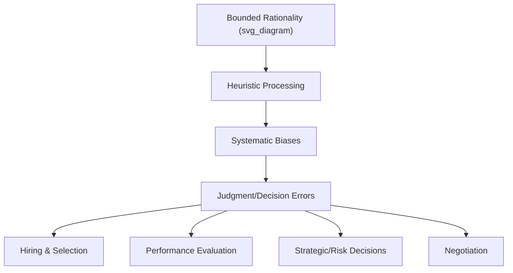
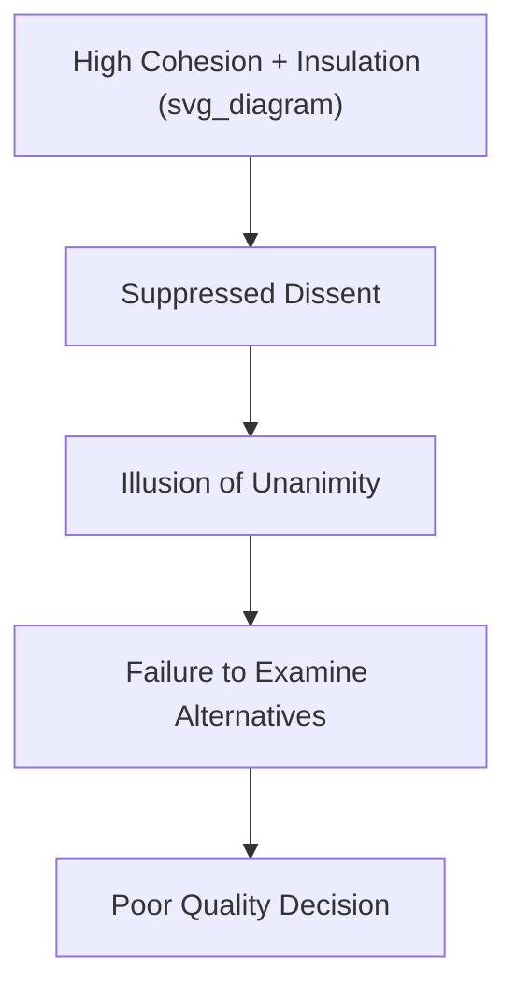

## Cognitive Biases in Organizational Judgment

### Overview

Cognitive biases are systematic, predictable deviations from rational judgment that arise from the mental shortcuts (heuristics) people use to process information efficiently under uncertainty, time pressure, or limited cognitive resources. In organizational contexts, these biases affect decisions ranging from hiring and performance evaluation to strategic planning, risk assessment, and negotiation, making them a central concern for both individual decision-making research and organizational design.

### Theoretical Foundation: Bounded Rationality and Dual-Process Theory

Herbert Simon's concept of **bounded rationality** established that decision-makers do not have unlimited cognitive resources or perfect information, and therefore rely on heuristics and "satisficing" (choosing a satisfactory, not optimal, option) rather than pure utility-maximizing rationality.

This was later formalized in **dual-process theory** (notably by Kahneman), distinguishing two modes of thinking:

- **System 1**: Fast, automatic, intuitive, effortless—the source of most heuristic-driven biases.
- **System 2**: Slow, deliberate, analytical, effortful—capable of overriding System 1 outputs but resource-intensive and often not engaged.

[Inference] Most organizational biases are best understood as System 1 outputs that go uncorrected by System 2, either because the decision-maker lacks awareness of the bias, lacks motivation to engage effortful processing, or operates under conditions (time pressure, cognitive load, fatigue) that suppress System 2 engagement.

### Heuristics and Their Associated Biases (Tversky & Kahneman)

**1. Availability Heuristic**

Judging the likelihood or frequency of an event based on how easily examples come to mind, rather than actual statistical frequency.

**Example**

A manager overestimates the risk of employee theft after a recent, highly memorable theft incident, even though base-rate theft incidence in the organization is low.

**2. Representativeness Heuristic**

Judging the probability of an event or category membership based on how similar it is to a prototype, while neglecting base rates.

**Example**

Assuming a soft-spoken, detail-oriented candidate is more likely to be an accountant than a salesperson, based on stereotype match, while ignoring the actual base rate of salespeople versus accountants in the applicant pool.

**3. Anchoring and Adjustment**

Relying too heavily on an initial piece of information (the "anchor") when making subsequent judgments, with insufficient adjustment away from that anchor.

**Example**

A salary negotiation where the first number stated (by either party) disproportionately shapes the final settlement, even when that number was arbitrary.

$$Final\ Judgment \approx Anchor + (Insufficient\ Adjustment)$$

### Confirmation and Motivated Reasoning Biases

**Confirmation Bias**

The tendency to search for, interpret, and recall information in ways that confirm pre-existing beliefs or hypotheses, while discounting disconfirming evidence.

**Motivated Reasoning**

A broader pattern in which the *desired conclusion* (rather than accuracy) drives the reasoning process—information consistent with a preferred outcome is processed less critically than information that threatens it.

**Key Points**

- Confirmation bias is especially consequential in selection interviews, where an interviewer's early positive or negative impression shapes how subsequent candidate responses are interpreted.
- Motivated reasoning underlies escalation of commitment (see below), since decision-makers are motivated to interpret ambiguous evidence in ways that justify continuing a chosen course of action.

### Overconfidence and Related Judgment Biases

**Overconfidence Bias**

The tendency to overestimate the accuracy of one's own judgments, predictions, or knowledge.

**Planning Fallacy**

A specific manifestation of overconfidence in which individuals underestimate the time, costs, and risks of future actions while overestimating the benefits—commonly observed in project timeline and budget estimation.

**Illusion of Control**

The tendency to overestimate one's ability to control or influence outcomes that are substantially or entirely determined by chance.

[Inference] Overconfidence-related biases likely compound in group settings when senior decision-makers with high status also display high confidence, since group members may defer to confidently stated judgments rather than independently assessing their accuracy—though the size of this deference effect depends heavily on group norms around dissent and psychological safety.

### Escalation of Commitment (Sunk Cost Bias)

**Definition**

The tendency to continue investing resources (time, money, effort) in a failing course of action because of prior investment already made, rather than basing the decision purely on the future expected value of continuing versus stopping.

$$Decision_{rational} = f(Future\ Costs, Future\ Benefits) \quad \text{[sunk costs should be irrelevant]}$$

$$Decision_{observed} = f(Future\ Costs, Future\ Benefits,\ Prior\ Investment)$$

**Key Points**

- Escalation is intensified by psychological factors including self-justification (avoiding admission of an earlier bad decision), public commitment to the original decision, and ambiguity about whether the project can still be salvaged.
- Escalation is a well-documented driver of failed capital projects, prolonged unprofitable product lines, and continued investment in underperforming personnel or vendor relationships.

**Example**

A manager continues funding a software project that is significantly over budget and behind schedule, reasoning "we've already invested $2 million, we can't abandon it now," rather than evaluating the project purely on its remaining expected costs and benefits.

### Framing Effects

**Definition**

Judgments and choices shift depending on how logically equivalent information is presented (framed), particularly whether outcomes are framed in terms of gains or losses.

**Example**

Employees respond more favorably to a compensation change framed as "you keep 90% of your current bonus" than to the logically identical framing "you lose 10% of your current bonus," despite the two statements being mathematically equivalent.

[Inference] Framing effects are generally understood through Prospect Theory's value function, which suggests losses are weighted more heavily than equivalent gains (loss aversion), making loss-framed messages more psychologically salient and often more behaviorally impactful, though the specific magnitude of framing effects varies by context and individual risk preferences.

### Halo Effect and Related Judgment Distortions

**Halo Effect**

A single salient positive (or negative) trait, or an overall favorable impression, colors judgments of unrelated, specific traits or behaviors—closely tied to impression formation processes.

**Horn Effect**

The negative-valence counterpart to the halo effect: a single salient negative trait disproportionately colors otherwise unrelated judgments.

**Similar-to-Me Bias**

The tendency to evaluate individuals who share one's own background, values, or characteristics more favorably, independent of actual performance—a significant contributor to homogeneity in hiring and promotion decisions.

### Group-Level Judgment Biases

**Groupthink (Janis)**

A pattern of deteriorated group decision-making arising from strong cohesion and desire for consensus, which suppresses critical evaluation of alternatives, dissenting views, and risk assessment.

**Group Polarization**

The tendency for group discussion to shift the group's collective judgment toward a more extreme position than the average of individual members' initial positions.

**Key Points**

- Groupthink is more likely under conditions of high cohesion, insulation from outside expert opinion, directive leadership, and high stress with low perceived alternatives.
- Structural correctives to groupthink include assigning a formal devil's advocate role, seeking outside expert input, and encouraging leaders to withhold their own opinion until after group discussion.

### Organizational Contexts Where Biases Manifest

| Context | Common Biases at Play |
| --- | --- |
| Selection/Hiring | Similar-to-me bias, halo effect, confirmation bias, representativeness heuristic |
| Performance Appraisal | Halo/horn effects, availability heuristic (recency of incidents), anchoring on prior ratings |
| Strategic Planning | Overconfidence, planning fallacy, escalation of commitment |
| Risk Assessment | Availability heuristic, illusion of control, framing effects |
| Negotiation | Anchoring, overconfidence, fixed-pie bias (assuming negotiation is purely zero-sum) |
| Group Decision-Making | Groupthink, group polarization, confirmation bias amplified by social validation |

### Debiasing Strategies

**Example**

Evidence-informed organizational debiasing approaches include:

1. **Structured decision protocols**: Checklists, standardized criteria, and pre-registered decision rules reduce reliance on unstructured intuitive judgment (particularly effective against halo effects and similar-to-me bias in hiring).
2. **Devil's advocacy and dialectical inquiry**: Formally assigning someone to challenge the prevailing view counteracts groupthink and confirmation bias.
3. **Base-rate anchoring and reference-class forecasting**: Deliberately consulting statistical base rates or comparable historical projects counteracts the planning fallacy and representativeness heuristic.
4. **Pre-mortems**: Imagining a future failure and working backward to identify causes, which surfaces risks that overconfidence and illusion of control might otherwise obscure.
5. **Blind or masked evaluation**: Removing identifying information (name, demographic cues) during initial screening reduces similar-to-me bias and halo effects tied to irrelevant characteristics.
6. **Accountability structures**: Requiring decision-makers to justify judgments to others increases the likelihood of System 2 engagement and reduces uncorrected heuristic processing.

[Inference] Debiasing interventions that alter decision *structure* (checklists, blind review, decision protocols) tend to show more durable effects than interventions that merely raise *awareness* of biases, since awareness alone does not reliably translate into behavior change without accompanying structural or procedural support—though the comparative effectiveness varies by bias type and organizational context.

### Criticisms and Limitations of the Bias Literature

- **Heuristics-are-adaptive counterpoint**: Some researchers (e.g., Gigerenzer's "fast and frugal heuristics" perspective) argue that many so-called biases reflect ecologically rational strategies well-suited to real-world environments, rather than pure errors, and that lab-based bias demonstrations do not always generalize to naturalistic decision contexts.
- **Replication and effect-size concerns**: [Unverified] Some classic bias findings from the heuristics-and-biases tradition have faced replication challenges or shown smaller effect sizes in more recent, higher-powered studies than originally reported, so practitioners should treat specific numeric effect-size claims from older studies with some caution.
- **Individual differences**: Susceptibility to specific biases varies with cognitive style, expertise, and need for cognition, meaning organizational debiasing interventions are unlikely to be uniformly effective across all employees.

### Conclusion

Cognitive biases in organizational judgment arise from the same heuristic processing that makes everyday decision-making efficient, but which systematically distorts judgment under the complexity, ambiguity, and social pressures characteristic of organizational life. Understanding the mechanisms behind availability, representativeness, anchoring, confirmation bias, overconfidence, escalation of commitment, framing, and group-level distortions like groupthink provides the diagnostic foundation for designing structural interventions—checklists, blind review, accountability, and pre-mortems—that can meaningfully improve the quality of organizational decisions.

**Related Topics**

- Social Perception and Impression Formation
- Attribution Theory in Organizational Behavior
- Prospect Theory and Decision-Making Under Risk
- Groupthink and Group Decision-Making Dynamics
- Structured vs. Unstructured Selection Interviews
- Behavioral Economics Applications in Management
- Naturalistic Decision-Making and Expertise