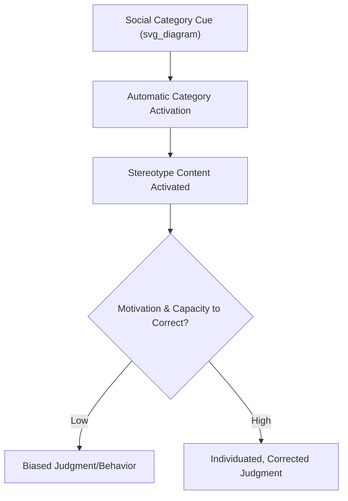

## Stereotyping and Implicit Bias at Work

### Overview

Stereotyping and implicit bias describe how mental associations about social groups shape perception, judgment, and behavior toward individuals, often outside conscious awareness or intent. In organizational psychology, this topic sits at the intersection of social cognition and diversity research, explaining persistent disparities in hiring, evaluation, promotion, and workplace treatment that occur even absent explicit prejudicial intent.

### Defining the Core Constructs

**Stereotypes**

Cognitive structures containing beliefs and expectations about the characteristics, attributes, and likely behaviors of members of a social group (e.g., gender, race, age, nationality). Stereotypes function as a special case of schemas, applied specifically to social categories.

**Prejudice**

The affective (emotional/evaluative) component—positive or negative feelings toward a group, often accompanying stereotypic beliefs but conceptually distinct from them.

**Discrimination**

The behavioral component—differential treatment of individuals based on group membership, which can result from stereotypes and prejudice but can also occur independent of consciously held biased beliefs (e.g., through biased organizational systems).

**Implicit Bias**

Automatic, often unconscious associations between social categories and evaluative or stereotypic content, which can influence judgment and behavior even among individuals who consciously reject those associations and hold genuinely egalitarian explicit beliefs.

**Key Points**

- Implicit and explicit biases are theorized as **dissociable**: an individual can hold low explicit prejudice while still exhibiting measurable implicit bias, because the two are thought to arise from different underlying cognitive systems (automatic association vs. deliberate belief).
- The **Implicit Association Test (IAT)**, developed by Greenwald and colleagues, is the most widely known measure of implicit bias, assessing the relative speed of associating social categories (e.g., race, gender) with positive or negative/stereotypic concepts.
- [Unverified] The predictive validity of the IAT for individual-level discriminatory behavior has been the subject of substantial scientific debate, with meta-analyses generally reporting modest correlations between IAT scores and behavioral outcomes; practitioners should treat strong individual-level predictive claims about the IAT with caution even as the broader construct of implicit bias remains an active and legitimate research area.

### The Stereotype Content Model

Fiske, Cuddy, Glick, and Xu's **Stereotype Content Model (SCM)** proposes that group stereotypes are organized along two fundamental dimensions:

1. **Warmth** – Perceived friendliness, trustworthiness, good intent
2. **Competence** – Perceived capability, skill, effectiveness

These two dimensions combine to produce four distinct stereotype clusters, each associated with a specific emotional response (per the related **Behaviors from Intergroup Affect and Stereotypes, or BIAS map**):

| Warmth | Competence | Cluster | Associated Emotion | Example (illustrative, not exhaustive) |
| --- | --- | --- | --- | --- |
| High | High | Admiration | Pride, admiration | In-group, reference groups |
| High | Low | Paternalistic | Pity, sympathy | Groups stereotyped as warm but incompetent (e.g., elderly workers, in some contexts) |
| Low | High | Envious | Envy, resentment | Groups stereotyped as competent but cold (e.g., certain high-status professional or ethnic out-groups, in some contexts) |
| Low | Low | Contemptuous | Contempt, disgust | Stigmatized out-groups |

[Inference] The SCM's mixed-stereotype clusters (paternalistic and envious) are theoretically significant because they show that bias is not simply uniform negativity toward out-groups; a "positive" stereotype along one dimension (e.g., warmth) can still support discriminatory treatment along the other (e.g., being passed over for a role requiring perceived competence), a pattern with direct relevance to workplace evaluation.

### Cognitive Mechanisms Underlying Stereotyping

**Categorization and Cognitive Efficiency**

Social categorization is a special case of general categorization processes: sorting individuals into groups reduces cognitive load, but ambiguous or limited individuating information increases reliance on category-based (stereotypic) inference, consistent with the continuum model of impression formation.

**In-Group/Out-Group Bias**

People tend to favor in-group members (shared category membership) in trust, resource allocation, and evaluative judgments—even when group membership is arbitrarily assigned (as shown in minimal group paradigm research), suggesting the mechanism is partly about categorization itself, not only pre-existing intergroup history.

**Illusory Correlation**

The tendency to perceive a stronger association between two variables (e.g., group membership and a negative behavior) than actually exists in the data, particularly when both the group and the behavior are relatively infrequent/distinctive, making their co-occurrence more memorable.

**Stereotype Threat**

A situational phenomenon (distinct from implicit bias in the perceiver, but a downstream consequence of stereotyping in the environment) in which awareness of a negative stereotype about one's group creates performance-impairing anxiety in stereotype-relevant tasks (e.g., women in quantitative fields, older workers on technology tasks).

[Inference] Stereotype threat effects have shown some heterogeneity across replication attempts and moderating conditions (e.g., task difficulty, identity salience), so the size and robustness of the effect likely depends considerably on the specific task and population studied, even though the general phenomenon is well established in the literature.

### Manifestations in Organizational Processes

**Recruitment and Resume Screening**

Name-based and demographic-cue studies have repeatedly found that identical resumes receive different callback rates depending on perceived race, gender, or other demographic markers signaled by name or affiliation.

**Interviews**

Similar-to-me bias and category-based (rather than individuating) processing are more likely under time pressure, high cognitive load, or unstructured interview formats.

**Performance Evaluation**

Stereotype-congruent behaviors may be more readily noticed, recalled, and attributed dispositionally (per attribution theory), while stereotype-incongruent behaviors may be discounted, explained away situationally, or simply underweighted in the internal evaluative narrative.

**Promotion and Leadership Emergence**

Implicit Leadership Theories (schemas of what a "leader" looks like) often carry demographic content (historically skewed toward certain gender and racial prototypes in many organizational cultures), disadvantaging candidates who do not match the prototype regardless of actual leadership competence—a phenomenon closely related to the "**glass ceiling**" and "**glass cliff**" (women and minorities disproportionately promoted into precarious, high-risk leadership positions) literatures.

**Example**

Two candidates submit identical qualifications for a management role. A candidate who matches evaluators' implicit leadership prototype (e.g., certain gender or communication-style expectations) may be rated as showing "natural authority," while an equally qualified candidate who does not match the prototype exhibiting the same behavior may be rated as "abrasive" or "trying too hard"—illustrating how identical behavior is interpreted differently depending on activated stereotype content.

### Aversive and Modern Forms of Bias

**Aversive Racism/Bias**

A form of bias in which individuals genuinely hold egalitarian explicit values and would be distressed to be seen as biased, but still exhibit discriminatory behavior in ambiguous situations where a non-bias-based justification is available (allowing the behavior to be rationalized without confronting an implicit bias).

**Benevolent vs. Hostile Bias**

Particularly studied in gender bias research: **hostile bias** involves overtly negative stereotyping, while **benevolent bias** involves seemingly positive but ultimately limiting stereotypes (e.g., assuming women need to be "protected" from demanding assignments), both of which can restrict opportunity though through different mechanisms.

### Measurement Approaches

| Method | What It Captures | Limitations |
| --- | --- | --- |
| Implicit Association Test (IAT) | Relative speed of automatic category-evaluation associations | Modest test-retest reliability; debated individual-level predictive validity |
| Explicit self-report scales | Consciously endorsed attitudes and beliefs | Vulnerable to social desirability bias |
| Behavioral audit studies (resume/callback studies) | Real-world differential treatment outcomes | Cannot isolate specific cognitive mechanism producing the effect |
| Linguistic/text analysis of evaluations | Differential language patterns across demographic groups (e.g., word choice in performance reviews) | Correlational; requires careful coding methodology |

### Organizational Interventions and Debiasing Strategies

**Example**

Evidence-informed approaches include:

1. **Structuring decision processes**: Standardized interview questions, structured rating scales, and pre-defined evaluation criteria reduce reliance on unconstrained category-based judgment.
2. **Blind/masked review**: Removing names and demographic-signaling information during initial resume screening or audition-style evaluation.
3. **Increasing accountability**: Requiring documented justification for hiring/promotion decisions increases motivation toward individuating, effortful processing.
4. **Diverse evaluation panels**: Multiple raters from varied backgrounds can offset any single rater's idiosyncratic biases (though panels are not immune to shared or majority-driven bias).
5. **Bias literacy training**: Raising awareness of stereotype content and implicit bias mechanisms. [Inference] Awareness-only training (e.g., single-session IAT-based workshops) has shown mixed and often limited durability of behavior change in evaluation studies, suggesting such training is more likely to be effective when paired with structural changes to decision processes rather than delivered as a standalone intervention.
6. **Counter-stereotypic exposure**: Deliberate exposure to counter-stereotypic exemplars (e.g., diverse representation in leadership) may weaken automatic stereotype activation over repeated exposure, though effects on deeply ingrained associations tend to be gradual.

### Legal and Organizational Policy Context

**Key Points**

- Discrimination law in most jurisdictions distinguishes **disparate treatment** (intentional differential treatment) from **disparate impact** (facially neutral policies that produce disproportionate adverse effects on a protected group), and implicit bias research is most directly relevant to disparate impact analysis since it does not require conscious discriminatory intent.
- Organizations increasingly use structured, criteria-based evaluation systems partly in response to legal risk associated with unstructured, bias-susceptible decision processes.
- [Unverified] Specific legal standards, permissible remedies, and evidentiary requirements for bias-related claims vary substantially by jurisdiction and are subject to ongoing legislative and judicial change, so organizational policy design in this area typically requires jurisdiction-specific legal guidance beyond the psychological research base.

### Criticisms and Ongoing Debates

- **Implicit-explicit dissociation debate**: Some researchers question the degree to which implicit measures capture a truly distinct construct from explicit attitudes versus measurement artifacts of the IAT methodology itself.
- **Intervention efficacy skepticism**: A body of research has raised concerns that popular diversity training programs, particularly brief or mandatory ones, show limited and sometimes even counterproductive effects on long-term behavior change or organizational diversity outcomes.
- **Individual vs. systemic focus**: Critics note that a heavy focus on individual-level implicit bias can understate the role of structural and systemic organizational factors (biased job requirements, network-based referral systems, inequitable access to development opportunities) that produce disparities independent of any single evaluator's cognitive bias.

### Conclusion

Stereotyping and implicit bias operate through well-documented social-cognitive mechanisms—category activation, illusory correlation, in-group favoritism, and stereotype-congruent attribution—that shape organizational outcomes even absent explicit discriminatory intent. Because the Stereotype Content Model shows that bias operates along multiple dimensions (warmth and competence) rather than uniform negativity, and because implicit and explicit attitudes are dissociable, effective organizational responses typically combine individual awareness-building with structural interventions—standardized evaluation criteria, blind review, and accountability mechanisms—that reduce the space in which unconstrained, category-based judgment can operate.

**Related Topics**

- Social Perception and Impression Formation
- Stereotype Content Model and the BIAS Map in Depth
- Implicit Leadership Theories and Leadership Categorization
- Stereotype Threat and Performance Under Evaluative Pressure
- Structured vs. Unstructured Selection Interviews
- Disparate Treatment vs. Disparate Impact in Employment Law
- Organizational Diversity, Equity, and Inclusion Interventions