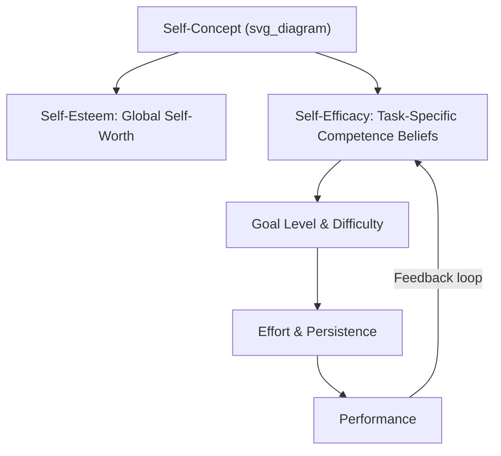
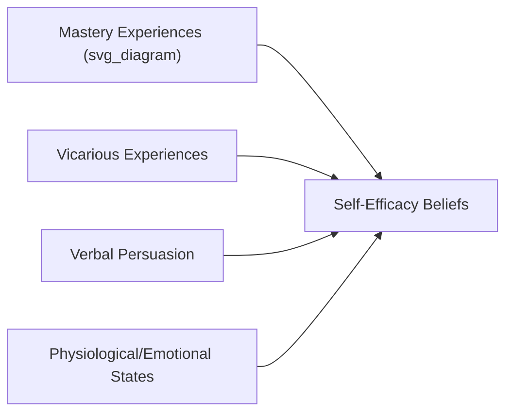

## Self-Concept and Self-Efficacy

### Overview

Self-concept and self-efficacy are interrelated constructs describing how individuals perceive themselves and their capabilities—perceptions that fundamentally shape motivation, goal-setting, persistence, and behavior in organizational settings. While self-concept refers to the broader, multidimensional sense of who one is, self-efficacy refers more narrowly to beliefs about one's competence to execute specific tasks or achieve specific outcomes.

### Self-Concept: Definition and Structure

**Definition**

Self-concept is the organized, multidimensional set of beliefs, perceptions, and knowledge an individual holds about themselves, encompassing traits, roles, abilities, values, and social identities.

**Key Structural Features**

- **Multidimensionality**: Self-concept comprises distinct domains (e.g., academic self-concept, social self-concept, professional self-concept), which may be evaluated differently from one another.
- **Hierarchical organization**: Global self-concept sits atop more specific sub-domains, which in turn are informed by even more specific facet-level self-perceptions.
- **Self-schemas**: Cognitive generalizations about the self, derived from past experience, that organize and guide the processing of self-relevant information.
- **Possible selves**: Cognitive representations of what one could become, would like to become, or fears becoming—future-oriented components of self-concept that guide motivation and goal pursuit.

**Key Points**

- Self-concept is theorized to be relatively stable but not fixed; it can be updated through significant experiences, feedback, and social comparison processes.
- Organizational role identities (e.g., "I am a manager," "I am an engineer") form an important work-specific layer of self-concept, shaped by tenure, socialization, and professional training.

### Core Self-Concept Constructs

**Self-Esteem**

The global evaluative component of self-concept—the overall value or worth an individual attributes to themselves. Distinguished from self-efficacy in that self-esteem is a broad affective self-evaluation, whereas self-efficacy is a specific cognitive judgment about capability.

**Organization-Based Self-Esteem (OBSE)**

A domain-specific variant reflecting the degree to which an employee believes they are competent, significant, and worthy as an organizational member specifically—distinct from global self-esteem, which extends across all life domains.

**Self-Identity and Social Identity**

Work-relevant identities (occupational identity, organizational identity) that are partly derived from group memberships, consistent with Social Identity Theory—individuals derive part of their self-concept from the organizations and professional groups to which they belong.

[Inference] Organization-based self-esteem likely functions as a more proximal predictor of work-specific outcomes (job satisfaction, organizational citizenship behavior) than global self-esteem, since it is measured at the same level of specificity as the outcomes it predicts, consistent with general principles of construct correspondence in psychological measurement.

### Self-Efficacy: Bandura's Social Cognitive Theory

**Definition**

Self-efficacy, as formalized by Albert Bandura, is the belief in one's own capability to organize and execute the courses of action required to produce specific performance attainments—critically, it is task- and context-specific rather than a global trait (in contrast to the related but distinct construct of generalized self-efficacy).

$$Self\text{-}Efficacy \neq Actual\ Ability; \quad Self\text{-}Efficacy = Perceived\ Capability\ to\ Execute$$

**Four Sources of Self-Efficacy (in descending order of typical influence)**

1. **Mastery experiences** – Direct personal experience of success (or failure) at a task; the most powerful source, since successfully performing a task provides direct evidence of capability.
2. **Vicarious experiences (modeling)** – Observing similar others succeed at a task, which is especially influential when the observed model is perceived as similar to oneself.
3. **Verbal/social persuasion** – Encouragement or feedback from others (e.g., a supervisor expressing confidence in an employee's ability), generally weaker and more temporary than mastery or vicarious sources.
4. **Physiological and emotional states** – Interpreting one's own arousal, anxiety, or fatigue as informative about capability (e.g., interpreting pre-presentation nervousness as evidence of unpreparedness rather than normal activation).

### Self-Efficacy's Role in Motivation and Performance

Self-efficacy operates through several well-established mechanisms in Bandura's Social Cognitive Theory and its integration with goal-setting theory:

- **Goal level**: Higher self-efficacy leads individuals to set more challenging goals for themselves.
- **Effort and persistence**: Higher self-efficacy predicts greater effort investment and persistence in the face of obstacles or setbacks.
- **Strategy development**: High-efficacy individuals are more likely to develop and adapt task strategies when initial approaches fail, rather than abandoning the task.
- **Attributions for failure**: High-efficacy individuals are more likely to attribute failure to insufficient effort or a fixable strategy problem (unstable, controllable) rather than lack of ability (stable, uncontrollable)—linking directly to Weiner's attributional framework.

$$Performance = f(Ability, Self\text{-}Efficacy, Goal\ Level, Effort, Persistence)$$

**Key Points**

- Meta-analytic research consistently finds self-efficacy to be one of the stronger individual-difference predictors of work-related performance, particularly in tasks involving learning, skill acquisition, and adaptive performance.
- The self-efficacy–performance relationship is understood as substantially reciprocal: prior performance shapes subsequent self-efficacy beliefs (via mastery experience), which then shapes future performance—forming a dynamic, self-reinforcing loop rather than a one-directional causal chain.

### Generalized Self-Efficacy vs. Task-Specific Self-Efficacy

| Construct | Scope | Stability | Typical Use |
| --- | --- | --- | --- |
| Task-specific self-efficacy | Belief in capability for a specific task/domain | More malleable, situation-dependent | Predicting performance on a defined task (e.g., using new software) |
| Generalized self-efficacy (GSE) | Broad belief in one's overall competence across situations | More trait-like, stable | Predicting cross-situational adaptability, one of the four components of Core Self-Evaluations |

[Inference] Task-specific self-efficacy generally shows stronger predictive relationships with performance on that specific task than generalized self-efficacy does, consistent with the broader principle that predictor-criterion specificity match tends to improve predictive validity, though generalized self-efficacy retains value for predicting broader, cross-situational outcomes.

### Collective Efficacy

An extension of self-efficacy to the team or organizational level: **collective efficacy** is a group's shared belief in its conjoint capability to organize and execute courses of action required to produce given levels of attainment.

**Key Points**

- Collective efficacy is not simply the average of individual members' self-efficacy; it reflects a socially constructed, shared belief that emerges partly through group interaction and communication processes.
- Collective efficacy has shown consistent positive relationships with team performance, particularly in interdependent task contexts where coordinated effort is required.

### Practical Applications in Organizations

**Example**

Common applied strategies leveraging self-efficacy theory include:

1. **Training design**: Structuring skill-building programs to include early, achievable mastery experiences (small wins) before introducing more challenging tasks, to build efficacy incrementally.
2. **Mentoring and role modeling**: Pairing employees with similar, relatable role models who have successfully navigated a challenge (e.g., a promotion, a difficult client negotiation) to leverage vicarious efficacy-building.
3. **Feedback framing**: Providing specific, credible verbal encouragement tied to genuine capability evidence (rather than generic praise) to support the verbal persuasion pathway without undermining credibility.
4. **Stress and arousal management**: Training employees to reinterpret physiological arousal (e.g., pre-presentation nerves) as functional activation rather than evidence of incompetence.
5. **Goal-setting integration**: Combining self-efficacy-building interventions with specific, challenging goal-setting (per Locke and Latham's Goal-Setting Theory), since the two constructs interact to jointly predict motivation and performance.

### Self-Concept, Self-Efficacy, and Related Constructs

| Construct | Core Focus | Distinguishing Feature |
| --- | --- | --- |
| Self-Concept | Overall organized self-knowledge | Broad, multidimensional, descriptive and evaluative |
| Self-Esteem | Global self-worth evaluation | Affective, evaluative, not task-specific |
| Self-Efficacy | Task-specific capability belief | Cognitive judgment, malleable, situation-specific |
| Core Self-Evaluations | Higher-order trait bundling self-esteem, generalized self-efficacy, locus of control, emotional stability | Broadest, most trait-like of the four |

### Criticisms and Limitations

- **Overconfidence risk**: Self-efficacy beliefs that substantially exceed actual ability can, in some circumstances, contribute to inadequate preparation or excessive risk-taking; [Inference] this concern is more theoretically plausible than robustly quantified in the applied literature, since most self-efficacy research focuses on its generally positive relationship with performance rather than boundary conditions where efficacy becomes miscalibrated.
- **Reciprocal causality complicates intervention**: Because self-efficacy and performance are mutually reinforcing, isolating the independent causal contribution of efficacy-building interventions (versus simply providing better skill training that happens to also raise efficacy) can be methodologically difficult.
- **Cultural and individual variability**: [Inference] The relative influence of the four sources of self-efficacy (particularly vicarious experience and verbal persuasion) may vary across individualist versus collectivist cultural contexts, given differing norms around social comparison and authority-based feedback, though this specific moderation is less thoroughly documented than the core sources themselves.

### Conclusion

Self-concept and self-efficacy together describe how individuals' self-perceptions shape workplace motivation and behavior—self-concept as the broad, organized architecture of self-knowledge, and self-efficacy as the task-specific capability beliefs that most directly drive goal-setting, effort, persistence, and ultimately performance. Bandura's four sources of self-efficacy (mastery, vicarious experience, verbal persuasion, physiological states) provide a practical, evidence-based framework for designing training, coaching, and feedback interventions that build the specific capability beliefs most predictive of successful task performance.

**Related Topics**

- Core Self-Evaluations and Locus of Control
- Goal-Setting Theory (Locke and Latham)
- Weiner's Attributional Theory of Motivation and Emotion
- Social Identity Theory and Organizational Identification
- Collective Efficacy and Team Performance
- Social Cognitive Theory (Bandura) in Depth
- Possible Selves and Career Identity Development