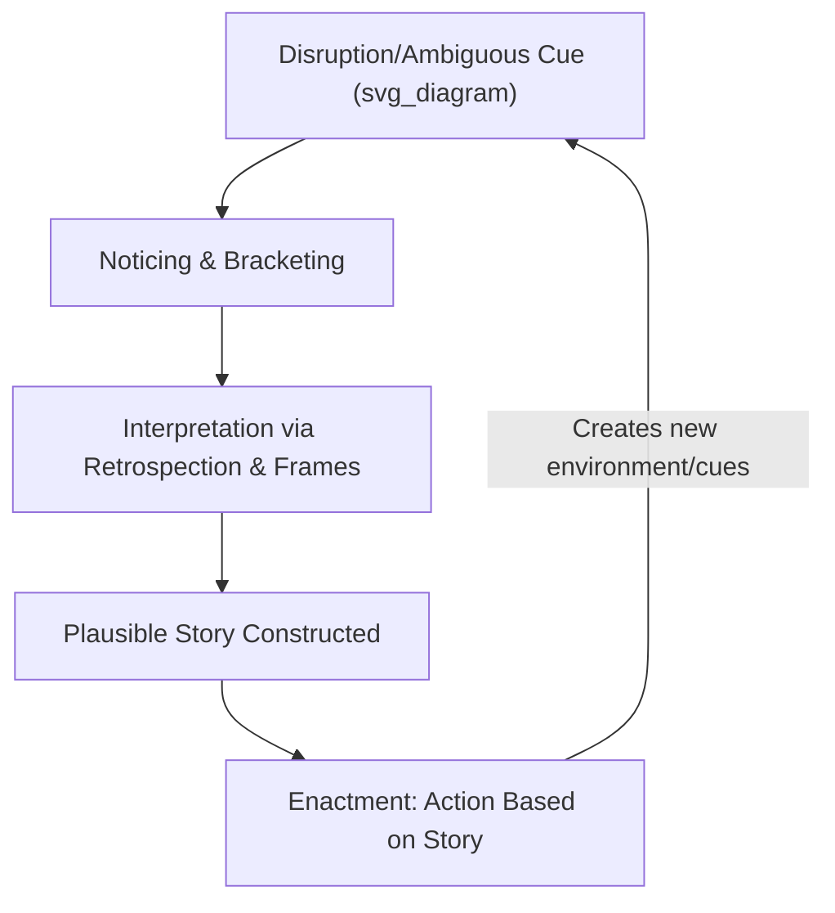

## Organizational Sensemaking

### Overview

Organizational sensemaking refers to the ongoing, social process by which individuals and groups interpret ambiguous, novel, or unexpected events in order to construct a plausible understanding that enables continued action. Developed most influentially by Karl Weick, sensemaking theory departs from traditional decision-making and information-processing models by treating organizational reality as something actively constructed through interpretation, rather than simply perceived and processed as an objective given.

### Theoretical Origins: Weick's Departure from Rational Decision Models

Traditional organizational decision-making models (e.g., rational choice, bounded rationality) assume a relatively stable, knowable environment that decision-makers perceive and then act upon. Weick's sensemaking perspective instead argues that:

- Organizational environments are frequently equivocal, ambiguous, and only partially knowable in real time.
- People do not simply "perceive" an objective reality; they actively **construct** meaning through interpretation, and that constructed meaning then shapes what they perceive as relevant going forward.
- Action often precedes and shapes understanding, rather than understanding fully preceding action—captured in Weick's oft-cited framing that people frequently discover what they think by seeing what they say and do.

[Inference] This ordering (act first, interpret after) is a central and somewhat counterintuitive claim of sensemaking theory relative to classical rational-decision frameworks, and it is best understood as describing a common organizational pattern under ambiguity rather than a universal claim that all organizational cognition works this way.

### The Seven Properties of Sensemaking (Weick)

Weick characterized sensemaking through seven interrelated properties:

1. **Grounded in identity construction** – Sensemaking is shaped by who the sensemaker believes themselves to be; interpretation of events is filtered through self- and role-identity.
2. **Retrospective** – Meaning is made in reflection on action already taken or events already unfolding, not purely prospectively.
3. **Enactive of sensible environments** – People partly create the environments they then interpret, through their own actions (a co-constitutive relationship between actor and environment).
4. **Social** – Sensemaking is fundamentally a social, conversational process, even when it appears to occur within a single individual's mind, since interpretive frames are culturally and socially derived.
5. **Ongoing** – Sensemaking never truly starts or stops; it is a continuous flow, with specific sensemaking episodes carved out of an ongoing stream of experience.
6. **Focused on and extracted from cues** – Sensemakers notice and extract particular cues from the environment (bracketing), and these cues serve as a starting point for building a larger interpretation.
7. **Driven by plausibility rather than accuracy** – Sensemaking prioritizes constructing a plausible, actionable story over establishing objectively accurate truth, since organizational actors typically need to act under time pressure and incomplete information.

**Key Points**

- The plausibility-over-accuracy property is one of the most distinctive and sometimes controversial claims in the framework: a sensible, coherent, action-enabling story may be preferred by organizational actors even when a more accurate (but less coherent or more paralyzing) account is available.
- The "enactive" property implies a recursive relationship between organizations and their environments: organizations do not simply respond to an objective environment, they partly construct the environment they respond to through their own prior actions and interpretations.

### Cue Extraction, Bracketing, and Frames

**Bracketing**

The process of selecting a subset of the continuous flow of experience to attend to and interpret, since the full stream of organizational experience is too vast and undifferentiated to process wholesale.

**Frames**

Prior knowledge structures, cognitive maps, or interpretive schemes that shape which cues are noticed and how they are interpreted—conceptually related to but broader than schemas in social cognition, since frames operate at the level of interpreting entire situations or events rather than individual targets.

**Example**

Following a sudden drop in quarterly sales, one manager (framing the situation through a "market conditions" lens) may bracket cues like competitor pricing and economic indicators, constructing a sensemaking narrative of external market disruption. A different manager (framing through an "internal execution" lens) may bracket cues like sales team turnover and missed targets, constructing a narrative of internal performance failure. The same raw event yields different plausible stories depending on which frame guides cue extraction.

### Enactment and the Cocreation of Organizational Environments

**Definition**

Enactment refers to the process by which organizational actors actively bring aspects of their environment into being through their own actions, which they then must interpret—environment and action are mutually constitutive rather than the environment being a fixed, external given awaiting discovery.

$$Environment_{t+1} = f(Action_t, Interpretation_t)$$

**Example**

A management team convinced that a competitor is likely to undercut prices may preemptively lower prices themselves (an enacted action), which can trigger the very competitive price war they anticipated—illustrating how the "environment" they subsequently must interpret was partly created by their own prior sensemaking and action.

### Retrospective Sensemaking

Because sensemaking is fundamentally retrospective, individuals often construct explanations for events only after they have unfolded to some degree, drawing on memory, prior frames, and social conversation to assemble a coherent narrative. This has important implications for organizational learning and post-event analysis:

**Key Points**

- Retrospective sensemaking can be vulnerable to hindsight bias, where post-hoc narratives make prior events seem more predictable or coherent than they appeared at the time.
- Formal organizational practices like after-action reviews and post-mortems are, in effect, structured retrospective sensemaking exercises, aiming to convert ambiguous experience into shared, actionable organizational knowledge.

### Sensemaking Under Crisis: The Mann Gulch Case

Weick's influential analysis of the 1949 Mann Gulch wildfire disaster—in which a team of smokejumpers experienced a catastrophic collapse of coordinated action under extreme threat—became a foundational case study illustrating what Weick termed a **"cosmology episode"**: a moment when people suddenly and deeply feel that the universe is no longer a rational, orderly system, producing a collapse of sensemaking itself.

**Key Points**

- Weick argued that the disaster resulted partly from a simultaneous breakdown of role structure, communication, and improvisation capacity under extreme novelty and threat—conditions that overwhelmed the group's collective sensemaking capacity.
- This analysis contributed to organizational resilience research on **High-Reliability Organizations (HROs)**, which studies how certain organizations (e.g., aircraft carriers, nuclear plants, emergency response teams) maintain robust collective sensemaking even under conditions of extreme complexity and risk.

[Inference] The Mann Gulch case is widely cited as a foundational illustration of sensemaking collapse under crisis, but as a single historical case study, it should be understood as an illustrative and theory-generating example rather than a basis for precise generalizable statistics about crisis sensemaking failure rates.

### Sensemaking vs. Related Constructs

| Construct | Core Focus | Key Distinction from Sensemaking |
| --- | --- | --- |
| Decision-Making (rational/bounded) | Choosing among known alternatives | Assumes a more stable, pre-given set of options and environment |
| Social Perception | Interpreting individual targets/behavior | Narrower scope (person perception vs. broader organizational events/situations) |
| Organizational Learning | Accumulating knowledge over time from experience | Sensemaking is a mechanism that can feed into learning, but learning implies more durable knowledge retention |
| Framing (in cognitive bias literature) | How information presentation shapes a single judgment | Sensemaking frames operate more broadly across entire narrative construction, not just isolated judgments |

### Applications in Organizational Contexts

**Change Management**

Sensemaking theory informs change management by emphasizing that employees do not passively receive information about organizational change; they actively construct meaning about "what this change really means for me," often through informal conversation and social comparison—making change communication as much about shaping sensemaking as about transmitting facts.

**Crisis and Emergency Management**

Understanding sensemaking collapse (as in Mann Gulch) has informed training for high-stakes teams (emergency responders, flight crews, surgical teams) to preserve role clarity, communication structure, and improvisational capacity under extreme novelty.

**Strategic Management**

Strategy formation is increasingly understood through a sensemaking lens: strategic plans are partly retrospective narratives that make sense of prior organizational action, rather than purely prospective, fully rational blueprints developed before action occurs.

**Post-Incident Analysis and Organizational Learning**

Structured retrospective processes (after-action reviews, post-mortems) function as deliberate sensemaking exercises intended to convert ambiguous, socially distributed experience into more coherent, shareable organizational understanding.

**Example**

After a failed product launch, rather than simply compiling a list of "facts," a sensemaking-informed post-mortem would explicitly surface the different frames various stakeholders used to interpret the failure (e.g., "market timing" vs. "product-market fit" vs. "execution") to build a richer, socially negotiated shared understanding rather than assuming a single objective cause exists to be discovered.

### Criticisms and Limitations

- **Ambiguity and testability concerns**: Sensemaking's core concepts (frames, plausibility, enactment) are richly descriptive but can be difficult to operationalize and test with the same rigor as more quantifiable constructs in organizational psychology, leading some critics to view the framework as more interpretive/qualitative than strictly predictive.
- **Overemphasis on construction risk**: [Inference] A strong reading of sensemaking's emphasis on socially constructed, plausibility-driven narratives could be misused to understate the role of objective organizational facts and data, though Weick's own writing does not deny an external reality—it emphasizes that access to and interpretation of that reality is always mediated by frames and social process.
- **Limited prescriptive guidance**: The framework is strong on diagnosing how meaning is constructed but offers comparatively less concrete, step-by-step prescriptive guidance for managers compared to more applied organizational behavior theories.

### Conclusion

Organizational sensemaking reframes how ambiguity, meaning, and action are understood in organizations, emphasizing that people actively construct plausible, actionable interpretations of their environment—often retrospectively, socially, and in ways that partly create the very environment being interpreted—rather than simply perceiving and processing an objective, stable reality. Weick's seven properties and the enactment concept remain foundational for understanding organizational change communication, crisis response, and strategic narrative construction, offering a richly interpretive complement to more traditional rational decision-making models covered elsewhere in organizational cognition research.

**Related Topics**

- Karl Weick's High-Reliability Organizations (HRO) Research
- Organizational Change Communication and Employee Sensemaking
- Cognitive Biases in Organizational Judgment (Hindsight Bias)
- Social Perception and Impression Formation
- Crisis Management and Team Coordination Under Extreme Novelty
- Organizational Learning and Post-Incident Review Practices
- Narrative and Discourse Analysis in Organizational Research