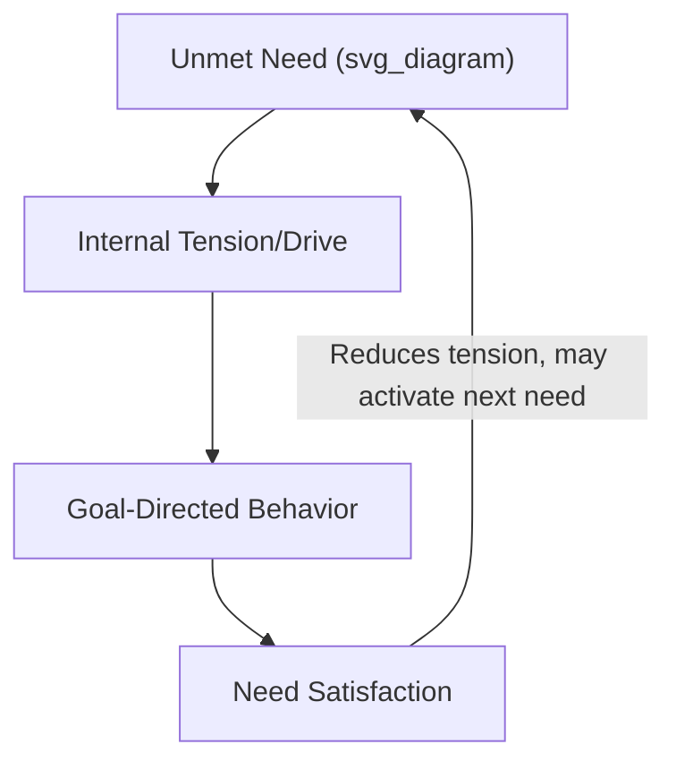

## Need-Based Theories of Motivation

### Overview

Need-based theories of motivation propose that human behavior is driven by the desire to satisfy underlying needs—deficiencies or requirements that, when unmet, create internal tension motivating action to reduce that tension. These theories represent the earliest major branch of formal motivation theory in organizational psychology and remain foundational reference points, even as later process-oriented theories (expectancy, goal-setting, equity) have supplemented and in some respects supplanted them empirically.

### Maslow's Hierarchy of Needs

**Structure**

Abraham Maslow proposed five need categories arranged in a hierarchy, with lower-order needs generally requiring at least partial satisfaction before higher-order needs become salient motivators:

1. **Physiological** – Basic survival needs (food, water, shelter, rest); in work terms, adequate pay and safe working conditions.
2. **Safety** – Security, stability, freedom from physical and economic threat; in work terms, job security, safe working environment, benefits.
3. **Social (Belongingness)** – Friendship, affection, acceptance; in work terms, positive coworker relationships, team belonging.
4. **Esteem** – Self-respect, recognition, status; in work terms, promotions, awards, respected job titles.
5. **Self-Actualization** – Realizing one's full potential, personal growth; in work terms, challenging and meaningful work, opportunities for creativity and development.

<svg xmlns="http://www.w3.org/2000/svg" viewBox="0 0 500 400" font-family="Arial, sans-serif">
<text x="250" y="25" text-anchor="middle" font-size="16" font-weight="bold">Maslow's Hierarchy (svg_diagram)</text>
<polygon points="250,50 320,130 380,400 120,400 180,130" fill="none" stroke="#333" stroke-width="1.5" />
<line x1="152" y1="180" x2="348" y2="180" stroke="#333" />
<line x1="133" y1="245" x2="367" y2="245" stroke="#333" />
<line x1="114" y1="310" x2="386" y2="310" stroke="#333" />
<line x1="180" y1="130" x2="320" y2="130" stroke="#333" />
<text x="250" y="110" text-anchor="middle" font-size="11">Self-Actualization</text>
<text x="250" y="160" text-anchor="middle" font-size="11">Esteem</text>
<text x="250" y="215" text-anchor="middle" font-size="11">Social/Belongingness</text>
<text x="250" y="280" text-anchor="middle" font-size="11">Safety</text>
<text x="250" y="360" text-anchor="middle" font-size="11">Physiological</text>
</svg>

**Key Points**

- Maslow proposed the hierarchy as generally sequential (lower needs must be substantially satisfied before higher needs become primary motivators), though he acknowledged flexibility and individual variation in strict ordering.
- [Unverified] Empirical support for the strict hierarchical, sequential-satisfaction structure of Maslow's model is weak; organizational research has generally failed to confirm that needs activate in the precise stepwise order the theory proposes, though the broad categorization of need types retains intuitive and pedagogical value.
- Despite limited empirical support for its strict structural claims, Maslow's hierarchy remains widely used as an accessible framework in management education and popular organizational discourse.

### Alderfer's ERG Theory

Clayton Alderfer's **ERG Theory** condensed and revised Maslow's five categories into three broader need groups, while relaxing the strict hierarchical assumption:

1. **Existence (E)** – Physiological and safety needs combined (material and physical well-being).
2. **Relatedness (R)** – Interpersonal relationships and social connection (roughly corresponding to Maslow's social and portions of esteem needs).
3. **Growth (G)** – Personal development and self-actualization (roughly corresponding to Maslow's esteem and self-actualization needs).

**Key Distinguishing Features from Maslow**

- **Non-sequential activation**: Multiple need levels can be active simultaneously, rather than requiring strict lower-to-higher progression.
- **Frustration-regression principle**: If a higher-order need (e.g., growth) is frustrated or blocked, individuals may regress and intensify focus on a lower-order need (e.g., relatedness) instead—a dynamic not present in Maslow's original model.

$$Frustration_{Growth} \rightarrow Regression \rightarrow Increased\ Salience_{Relatedness}$$

**Example**

An employee whose growth needs are frustrated by a lack of promotion opportunities may, per ERG theory, respond by placing greater emphasis on workplace social relationships and team belonging (relatedness) rather than intensifying pursuit of the blocked growth need directly.

[Inference] ERG theory's frustration-regression mechanism gives it somewhat greater flexibility and closer alignment with observed workplace behavior than Maslow's strict hierarchy, since real employees do appear to shift need emphasis dynamically based on which needs are currently blocked, though ERG theory has also received comparatively less rigorous empirical testing than some other motivation frameworks.

### McClelland's Acquired Needs Theory (Learned Needs Theory)

David McClelland proposed that certain needs are not innate in a fixed hierarchy but are largely **learned through life experience and socialization**, and vary in relative strength across individuals rather than following a universal developmental sequence. Three needs are central to workplace motivation:

1. **Need for Achievement (nAch)** – Desire to excel, accomplish challenging goals, and receive feedback on performance.
2. **Need for Affiliation (nAff)** – Desire for close interpersonal relationships and social acceptance.
3. **Need for Power (nPow)** – Desire to influence, control, or have impact on others; further divided into **personalized power** (dominance for personal gain) and **socialized power** (influence used for organizational or collective benefit).

**Key Points**

- High-nAch individuals prefer moderately challenging goals (neither too easy nor unrealistically difficult), desire concrete performance feedback, and prefer personal responsibility for outcomes over group-diffused responsibility.
- McClelland's research suggested that effective organizational leaders often show a profile of moderate-to-high socialized power motivation combined with lower affiliation motivation, since leadership frequently requires making decisions that may not be universally popular.
- McClelland pioneered the use of the **Thematic Apperception Test (TAT)**, a projective measurement technique, to assess these needs indirectly (via themes in stories written about ambiguous images), rather than relying solely on direct self-report—based on the premise that individuals may not have full conscious insight into or willingness to report their own underlying need strengths.

**Example**

A high-nAch salesperson would likely be more motivated by a moderately stretch-target commission structure with clear, frequent performance feedback than by either an easily attainable quota (insufficient challenge) or a wildly unrealistic target (low perceived attainability, undermining the value of effort).

### Herzberg's Two-Factor Theory (Motivation-Hygiene Theory)

Frederick Herzberg's theory proposes that job satisfaction and job dissatisfaction are driven by two qualitatively distinct sets of factors, rather than existing on a single continuum from dissatisfied to satisfied.

- **Hygiene factors** – Extrinsic factors related to the job context (pay, company policy, working conditions, supervision quality, interpersonal relations). Their absence or inadequacy causes dissatisfaction, but their presence does not actively create satisfaction—it merely prevents dissatisfaction.
- **Motivator factors** – Intrinsic factors related to the job content itself (achievement, recognition, the work itself, responsibility, advancement, growth). Their presence actively creates satisfaction and motivation; their absence leads to a neutral state (no satisfaction) rather than active dissatisfaction.

$$Satisfaction \neq -Dissatisfaction \quad \text{(two independent continua, not one bipolar scale)}$$

| Factor Type | Examples | Effect if Absent | Effect if Present |
| --- | --- | --- | --- |
| Hygiene | Salary, company policy, supervision, working conditions | Dissatisfaction | No dissatisfaction (neutral) |
| Motivator | Achievement, recognition, responsibility, growth | No satisfaction (neutral) | Satisfaction/motivation |

**Key Points**

- Herzberg's theory implies that simply improving hygiene factors (e.g., raising pay, improving office conditions) will reduce dissatisfaction but will not, by itself, actively motivate employees—motivator factors must be addressed separately to drive genuine engagement.
- This theory directly informed **job enrichment** as an organizational intervention strategy, emphasizing the redesign of job content (increasing responsibility, autonomy, and meaningful work) rather than solely adjusting job context (pay, conditions).
- [Unverified] Herzberg's methodology (the critical-incident technique, asking employees to recall times they felt exceptionally good or bad about their job) has been criticized for potentially inducing self-serving attributional bias—employees may be more likely to attribute satisfying experiences to their own achievements (motivators) and dissatisfying experiences to external factors (hygiene)—which could partly explain the clean two-factor separation the theory reports; subsequent research using different methodologies has often failed to fully replicate the strict two-factor structure.

### Comparative Summary of Need-Based Theories

| Theory | Number of Need Categories | Structural Assumption | Key Distinguishing Mechanism |
| --- | --- | --- | --- |
| Maslow's Hierarchy | 5 | Strict sequential hierarchy | Lower needs must be satisfied before higher needs activate |
| Alderfer's ERG | 3 | Flexible, non-strict hierarchy | Frustration-regression allows movement back to lower needs |
| McClelland's Acquired Needs | 3 (nAch, nAff, nPow) | No fixed hierarchy; individual differences in relative strength | Needs are learned/socialized, not innate or universally sequenced |
| Herzberg's Two-Factor | 2 factor categories (hygiene, motivator) | Two independent continua, not a hierarchy | Satisfaction and dissatisfaction have separate causal drivers |

### Applications in Organizational Practice

**Example**

Common applied uses, despite mixed empirical support for some underlying theoretical claims, include:

1. **Compensation and benefits design**: Informed loosely by Maslow/ERG existence needs and Herzberg's hygiene factors—ensuring baseline pay and security needs are met to prevent dissatisfaction, while recognizing this alone will not drive high engagement.
2. **Job design and enrichment**: Directly informed by Herzberg's motivator factors—redesigning jobs to increase autonomy, responsibility, and meaningful challenge (closely related to the later Job Characteristics Model).
3. **Individualized motivational matching**: Informed by McClelland's framework—assigning high-nAch employees to roles with clear individual performance metrics and feedback, while placing high-nAff employees in more collaborative, team-based roles.
4. **Leadership development**: McClelland's socialized-power profile has informed leadership competency models emphasizing influence for organizational benefit over personal dominance.
5. **Recognition programs**: Directly targeting esteem needs (Maslow) and recognition as a motivator factor (Herzberg), on the premise that formal acknowledgment of achievement drives intrinsic motivation.

### Criticisms and Limitations of Need-Based Theories as a Category

- **Weak empirical support for structural claims**: Both Maslow's strict hierarchy and Herzberg's clean two-factor separation have received limited support in rigorous empirical testing, despite their enduring popularity in management education and practice.
- **Overreliance on Western, individualist samples**: [Inference] Much of the foundational research (particularly Maslow's) was developed and tested primarily in Western, individualist contexts; the relative prioritization of needs (e.g., self-actualization vs. relatedness/collective belonging) may differ in more collectivist cultural contexts, though systematic cross-cultural replication of these specific theories remains more limited than the theories' popularity would suggest.
- **Static, content-based limitation**: Need-based ("content") theories describe *what* motivates people but offer limited explanation of the cognitive *process* by which motivation translates into specific goal-directed behavior—a gap later addressed by process theories (Expectancy Theory, Goal-Setting Theory, Equity Theory).
- **Measurement challenges**: Needs are internal, often not fully consciously accessible states (particularly in McClelland's framework), making direct, reliable measurement inherently difficult and partly explaining the field's historical reliance on indirect or projective techniques.

### Conclusion

Need-based theories of motivation—Maslow's Hierarchy, Alderfer's ERG Theory, McClelland's Acquired Needs Theory, and Herzberg's Two-Factor Theory—represent the foundational "content" branch of motivation theory, explaining workplace behavior in terms of underlying needs individuals seek to satisfy. While each theory's specific structural claims have faced significant empirical challenges, their core insights—that intrinsic and extrinsic factors operate differently, that individuals vary meaningfully in their dominant need profiles, and that need satisfaction and frustration shape subsequent motivational focus—continue to inform practical organizational design in compensation, job enrichment, and individualized management approaches, even as process-oriented theories have become the more empirically dominant framework in contemporary research.

**Related Topics**

- Process Theories of Motivation (Expectancy Theory, Equity Theory)
- Goal-Setting Theory (Locke and Latham)
- Job Characteristics Model and Job Enrichment
- Self-Determination Theory and Intrinsic Motivation
- McClelland's Leadership Motive Pattern
- Cross-Cultural Differences in Work Values and Motivation
- Compensation and Total Rewards Strategy