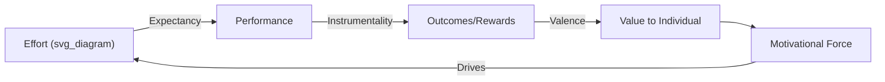
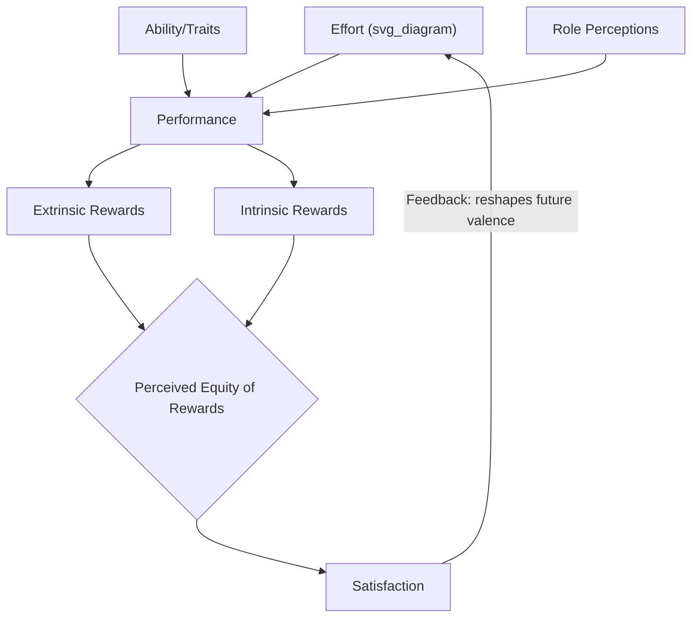

## Expectancy Theory

### Overview

Expectancy Theory, developed by Victor Vroom (1964) and later refined by Porter and Lawler, is a process theory of motivation proposing that individuals make rational, cognitive calculations about whether to exert effort based on their beliefs about the relationship between effort, performance, and valued outcomes. Unlike need-based (content) theories, Expectancy Theory explains the cognitive *process* by which motivation is generated, making it one of the most influential process theories in organizational psychology.

### The Core Formula

Vroom's model proposes that motivational force (the effort an individual is willing to exert) is a multiplicative function of three cognitive beliefs:

$$Force = Expectancy \times \sum(Instrumentality \times Valence)$$

**Key Points**

- The relationship is **multiplicative, not additive**: if any one component is zero, overall motivational force is theoretically zero, regardless of how strong the other components are.
- This multiplicative structure has an important practical implication: an employee who highly values a reward (high valence) but believes performance will not actually lead to receiving it (low instrumentality), or believes effort will not translate into performance (low expectancy), will show low overall motivation despite strong desire for the outcome.

### The Three Core Components

**1. Expectancy (Effort → Performance)**

The perceived probability that exerting effort will lead to a given level of performance. Ranges from 0 (no perceived relationship between effort and performance) to 1 (certainty that effort will produce the desired performance level).

*Influenced by*: self-efficacy, prior experience with similar tasks, availability of necessary resources and training, clarity of performance requirements.

**2. Instrumentality (Performance → Outcome)**

The perceived probability that achieving a given level of performance will lead to a specific outcome or reward. Also ranges from 0 to 1.

*Influenced by*: trust in the organization/manager to follow through on stated reward contingencies, clarity and consistency of the performance-reward linkage, perceived fairness of the reward allocation system.

**3. Valence (Outcome Value)**

The anticipated satisfaction or value an individual attaches to a particular outcome. Can range from negative (the outcome is aversive) through zero (indifference) to positive (the outcome is desired).

*Influenced by*: individual needs, values, and preferences (linking back to need-based theories as an input into valence formation).

**Example**

A salesperson considering whether to pursue an aggressive sales push this quarter evaluates:

- **Expectancy**: "If I work extra hours and follow up on all leads, will I actually hit the higher sales target?" (Perceived as high if resources and market conditions support it, low if the target is seen as unrealistic regardless of effort.)
- **Instrumentality**: "If I hit the target, will I actually receive the promised bonus?" (Perceived as high if the company has a consistent track record of paying out bonuses as promised, low if past bonus payouts have been inconsistent or arbitrarily reduced.)
- **Valence**: "How much do I personally want this bonus?" (High if the salesperson has pressing financial needs or values the recognition; lower if the bonus amount is modest relative to the required effort, or if the salesperson prioritizes work-life balance over additional income.)

Only if all three are reasonably high does Vroom's model predict strong motivational force toward the effortful sales push.

### Porter and Lawler's Extension

Lyman Porter and Edward Lawler extended Vroom's original model into a more complete performance-satisfaction cycle, addressing a key gap: Vroom's original model treated performance largely as an outcome of motivation, without fully specifying the role of ability and role clarity, and without explicitly modeling the feedback loop from outcomes back to future effort.

**Key Additions**

- **Ability and traits**: Performance is a joint function of effort AND ability/traits, not effort alone—high motivational force does not guarantee high performance if the individual lacks the requisite skills.
- **Role perceptions**: Accurate understanding of what behaviors are actually required for effective performance moderates the effort-performance relationship.
- **Intrinsic and extrinsic rewards**: Distinguished as separate outcome categories, each with potentially different valence and instrumentality profiles.
- **Perceived equity of rewards**: Satisfaction with rewards received is filtered through a perceived-fairness judgment (connecting to Equity Theory), not simply the raw magnitude of the reward.
- **Feedback loop**: Satisfaction with outcomes feeds back to influence the valence attached to future outcomes and subsequent effort.

$$Performance = f(Effort, Ability, Role\ Perceptions)$$

### Practical Diagnostic Applications

Because Expectancy Theory decomposes motivation into three distinct, separately diagnosable components, it offers a practical diagnostic framework for identifying *why* a specific motivational problem exists, rather than treating "low motivation" as a single undifferentiated issue.

| Diagnosed Problem | Likely Root Component | Example Organizational Intervention |
| --- | --- | --- |
| "I could work as hard as I want, it won't change my output" | Low Expectancy | Provide better training, tools, resources, or clearer performance guidance |
| "I hit my targets, but nothing changes for me" | Low Instrumentality | Strengthen and clarify the actual performance-reward linkage; ensure consistent follow-through |
| "I'll get the reward, but I don't care about it" | Low Valence | Individualize rewards; conduct needs assessment to identify what employees actually value |

**Example**

If a manager observes an underperforming but clearly skilled employee, Expectancy Theory suggests diagnosing which link is broken: Does the employee believe increased effort will actually improve performance (expectancy)? Does the employee trust that improved performance will be recognized and rewarded (instrumentality)? Does the employee actually value the rewards on offer (valence)? Addressing the wrong link (e.g., offering a bigger reward when the actual problem is low expectancy due to inadequate training) will not resolve the underlying motivational gap.

### Applications in Compensation and Incentive Design

**Key Points**

- Expectancy Theory provides the theoretical foundation for **pay-for-performance** and merit-based compensation systems: such systems are only motivationally effective if employees perceive a credible, transparent link between performance and pay (instrumentality) and if the pay differential is large enough to matter to them (valence).
- Poorly designed incentive systems—where performance metrics are seen as unachievable (low expectancy), payout criteria are ambiguous or inconsistently applied (low instrumentality), or reward amounts are trivial relative to effort required (low valence)—predictably fail to motivate behavior even when well-intentioned.
- Individualizing rewards (recognizing that valence varies across employees) is a direct practical implication of the theory, since a reward with high valence for one employee (e.g., additional vacation time) may have low valence for another (who might prefer cash or public recognition instead).

### Empirical Support and Measurement Challenges

**Key Points**

- Expectancy Theory has received moderate empirical support overall, with individual studies varying in the strength of support for the specific multiplicative combination rule versus simpler additive models.
- [Unverified] A recurring methodological critique is that the multiplicative model makes precise quantitative predictions that are difficult to test rigorously with typical self-report survey measures, and some meta-analytic work has found that simpler additive combinations of the three components predict outcomes about as well as the full multiplicative formulation, casting some doubt on the necessity of the strict multiplicative structure specifically (as opposed to the general logic of the three components mattering).
- The theory's within-person, decision-focused framing (comparing an individual's motivation across different possible effort levels or task choices) is better supported than cross-person comparisons of absolute motivation levels, since individual differences in response scale use complicate between-person comparisons of self-reported expectancy, instrumentality, and valence.

### Relationship to Other Motivation Theories

| Theory | Relationship to Expectancy Theory |
| --- | --- |
| Need-Based Theories (Maslow, McClelland) | Provide the underlying content that shapes an individual's valence for specific outcomes |
| Goal-Setting Theory | Complementary process theory; goal difficulty and specificity can be understood as inputs shaping perceived expectancy |
| Equity Theory | Porter and Lawler's extension explicitly incorporates equity perceptions as a moderator of satisfaction with rewards |
| Self-Efficacy Theory | Self-efficacy beliefs are a primary determinant of the expectancy component specifically |

### Criticisms and Limitations

- **Cognitive complexity assumption**: The theory assumes individuals engage in relatively deliberate, conscious cognitive calculation of effort-performance-outcome probabilities, which may overstate the degree of conscious, rational deliberation involved in everyday motivational decisions (particularly for habitual or low-stakes tasks).
- **Measurement difficulty**: Precisely and reliably measuring expectancy, instrumentality, and valence as distinct, multiplicable quantities is methodologically challenging, contributing to mixed empirical support for the exact mathematical form of the model.
- **Individual and cultural variability**: [Inference] The theory's assumption of individualized, self-interested outcome valuation may require adaptation in more collectivist cultural contexts, where instrumentality and valence judgments might be substantially shaped by group or family-level outcomes rather than purely individual reward calculations, though this specific cross-cultural extension has received less systematic empirical testing than the core Western-context model.

### Conclusion

Expectancy Theory provides a cognitively grounded, diagnostically useful framework for understanding workplace motivation as a function of three distinct beliefs: whether effort leads to performance (expectancy), whether performance leads to outcomes (instrumentality), and whether those outcomes are valued (valence). Its multiplicative structure highlights those any single broken link can undermine overall motivation regardless of strength elsewhere, making it a particularly practical tool for diagnosing specific motivational breakdowns and designing effective incentive and reward systems, even as its precise mathematical formulation remains subject to ongoing empirical debate.

**Related Topics**

- Porter-Lawler Extended Expectancy Model in Depth
- Equity Theory and Perceived Fairness of Rewards
- Goal-Setting Theory (Locke and Latham)
- Self-Efficacy and Its Role in Expectancy Formation
- Pay-for-Performance and Incentive Compensation Design
- Need-Based Theories of Motivation
- Organizational Justice: Distributive and Procedural Fairness