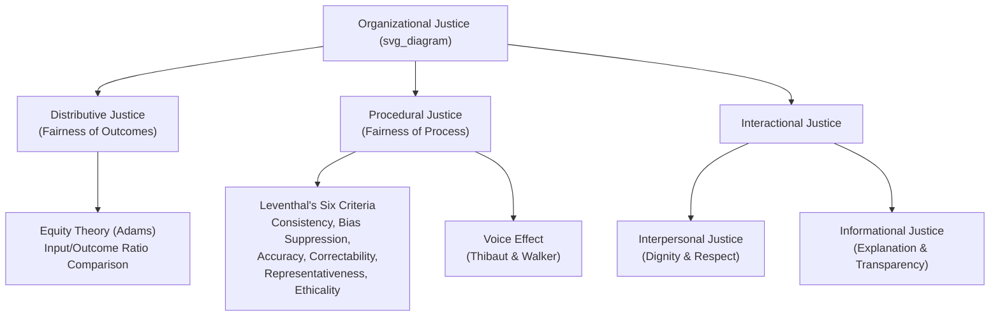

## Equity Theory and Organizational Justice

### Definition and Construct Overview

**Equity Theory**, developed by J. Stacy Adams (1963, 1965), posits that individuals are motivated to maintain fairness in the ratio of their perceived **inputs** (effort, skill, time, education) to **outcomes** (pay, recognition, benefits) relative to a **comparison other**. Perceived imbalance in this ratio produces psychological tension that motivates corrective action.

**Organizational Justice** is the broader, contemporary theoretical umbrella that emerged from and extended equity theory, encompassing employees' perceptions of fairness across multiple dimensions of organizational decision-making, not just outcome distribution. It is now the dominant framework in I-O psychology for studying fairness perceptions at work.

### Adams' Equity Theory: Core Mechanics

**The Equity Ratio**

$$\frac{O_p}{I_p} \; \text{vs.} \; \frac{O_o}{I_o}$$

Where $O_p$ = person's own outcomes, $I_p$ = person's own inputs, $O_o$ = comparison other's outcomes, $I_o$ = comparison other's inputs.

- **Equity** exists when the two ratios are perceived as equal
- **Underpayment inequity** occurs when the person's ratio is lower than the comparison other's
- **Overpayment inequity** occurs when the person's ratio is higher than the comparison other's

**Inputs (examples)**

- Effort, time, skill, education, experience, loyalty, creativity

**Outcomes (examples)**

- Pay, promotions, recognition, job security, status symbols, interesting work

**Comparison Others**

- Adams originally proposed comparisons can be made against: (1) self in a different role/time (historical self), (2) another person in the same organization, or (3) another person in a different organization
- [Inference] Modern applications also commonly include generalized/aggregate referents (e.g., "people in my field" or industry salary surveys), though this extension is more a practitioner adaptation than part of Adams' original formal model.

### Responses to Perceived Inequity

Adams proposed six behavioral/cognitive strategies employees use to resolve perceived inequity:

1. **Alter inputs** — reduce effort (underpayment) or increase effort (overpayment)
2. **Alter outcomes** — seek higher pay/rewards, or unauthorized outcome acquisition (e.g., theft) in extreme underpayment cases
3. **Cognitively distort own inputs/outcomes** — reframe perception of what one contributes or receives
4. **Cognitively distort comparison other's inputs/outcomes** — reassess the referent's contributions ("they actually work harder than I thought")
5. **Change the comparison other** — select a different, more favorable referent
6. **Leave the field** — turnover, absenteeism, transfer requests

**Key Points**

- Equity theory is fundamentally a **social comparison** theory — perceived fairness is relative, not absolute
- Both underpayment and overpayment can generate tension, though underpayment inequity produces more robust and consistent empirical effects
- Overpayment inequity often resolves through cognitive distortion (rationalizing one's higher worth) rather than behavioral change, since increasing effort is costlier than reframing perception
- The theory predicts specific direction of behavior change, which gives it stronger practical/predictive utility than many general motivation theories

### Example: Underpayment Inequity Scenario

An employee learns a peer with similar tenure and responsibilities earns 15% more. Following Adams' model, the employee may:

- Reduce discretionary effort (arrive later, decline extra tasks)
- Request a raise (altering outcomes)
- Rationalize that the peer has "better technical skills" (distorting the other's inputs)
- Begin comparing themselves to a lower-paid colleague instead (changing referent)
- Begin job searching (leaving the field)

### The Evolution to Organizational Justice: Four Dimensions

Equity theory's exclusive focus on outcome fairness proved insufficient to explain the range of fairness perceptions in organizations. Organizational Justice theory expanded this into four (some models: three) distinct but related dimensions.

**1. Distributive Justice**

- Direct descendant of Adams' equity theory — perceived fairness of outcomes/allocations
- Governed by allocation norms: **equity** (proportional to contribution), **equality** (same for all), and **need** (based on individual circumstances)
- [Inference] Which allocation norm is preferred often depends on context — equity norms tend to dominate in individualist/performance-oriented cultures and task-focused settings, while equality or need norms are more often preferred in collectivist or relationship-maintenance contexts, though this is a generalized pattern rather than a fixed rule.

**2. Procedural Justice**

- Perceived fairness of the **processes** used to determine outcomes, independent of the outcome itself
- Foundational framework: Leventhal's (1980) six criteria for fair procedures:
  - **Consistency** (applied the same across people/time)
  - **Bias suppression** (decision-maker free of self-interest)
  - **Accuracy** (based on good information)
  - **Correctability** (mechanisms to appeal/correct decisions)
  - **Representativeness** (input from all affected parties)
  - **Ethicality** (consistent with moral/ethical standards)
- Also grounded in Thibaut & Walker's (1975) earlier work on **voice** — the perception of having input into a decision-making process, even without control over the final outcome

**3. Interactional Justice**

- Proposed by Bies & Moag (1986); concerns the fairness of **interpersonal treatment** during the enactment of procedures
- Often split into two sub-dimensions (Greenberg, 1993):
  - **Interpersonal Justice**: being treated with dignity, respect, and politeness
  - **Informational Justice**: receiving adequate explanations and truthful, timely communication about decisions

**4. (Combined Model)**

Some scholars (e.g., Colquitt, 2001) treat all four — distributive, procedural, interpersonal, informational — as empirically distinct factors, which is now the dominant measurement approach in contemporary research (via the **Colquitt Organizational Justice Scale**).

### Diagram: Organizational Justice Dimensions (svg_diagram)

### Theoretical Integration: Why the Split Matters

**The "Fair Process Effect"**

Research consistently shows that procedural justice can buffer negative reactions to unfavorable outcomes — employees are more accepting of a bad outcome (e.g., being denied a promotion) if they perceive the process used to reach it as fair. This is one of the most replicated findings in the organizational justice literature.

**Interaction Effects**

[Inference] Distributive and procedural justice often interact rather than operate purely additively — the negative impact of low distributive justice tends to be most pronounced when procedural justice is also low, whereas high procedural justice appears to partially offset dissatisfaction with unfavorable outcomes. Exact effect sizes and boundary conditions vary across meta-analyses.

**Group Value / Relational Model (Lind & Tyler, 1988)**

Procedural and interactional justice are theorized to matter not just instrumentally (as a means to fair outcomes) but symbolically — fair treatment signals one's status and standing within the group/organization, tapping into identity and belongingness needs beyond pure resource concerns.

### Organizational Outcomes Associated with Justice Perceptions

| Justice Dimension | Commonly Associated Outcomes |
| --- | --- |
| **Distributive** | Pay satisfaction, outcome-specific satisfaction |
| **Procedural** | Organizational commitment, trust in management, rule compliance |
| **Interpersonal** | Supervisor-directed OCB, reduced counterproductive behavior toward supervisor |
| **Informational** | Trust, acceptance of change initiatives, reduced uncertainty/anxiety |

[Inference] Meta-analytic work (e.g., Colquitt et al., 2001) generally finds procedural and interactional justice show stronger associations with attitudinal/relational outcomes (trust, commitment) while distributive justice shows a comparatively stronger association with outcome-specific satisfaction (e.g., pay satisfaction); however, precise comparative effect sizes vary across studies and samples, so this should be read as a directional pattern rather than a fixed ranking.

### Practical Applications

**Compensation Design**

- Transparent, criterion-based pay structures reduce ambiguity that fuels perceived distributive inequity
- Pay transparency policies directly address equity theory's comparison-other mechanism by making referent comparisons explicit rather than speculative

**Performance Management**

- Structured, criterion-referenced performance appraisal systems support procedural justice via Leventhal's consistency and accuracy criteria
- Appeal/grievance mechanisms directly operationalize the "correctability" criterion

**Layoffs and Downsizing**

- Research on layoff survivors consistently shows that procedural and informational justice during downsizing (clear communication, consistent criteria, advance notice) substantially affects survivors' subsequent commitment and performance, independent of whether the layoffs themselves were viewed as fair on outcome grounds
- **Example**: An organization conducting layoffs that provides clear rationale, consistent selection criteria, and respectful communication to affected employees (high procedural/interactional justice) tends to see less erosion of remaining employees' trust than an organization using the same layoff criteria but communicated abruptly and inconsistently

**Change Management**

- Communicating the rationale behind organizational changes (informational justice) and allowing employee input/voice (procedural justice) are widely cited as key levers for reducing change resistance

### Measurement

**Colquitt (2001) Organizational Justice Scale**

- 20-item scale measuring all four dimensions (distributive, procedural, interpersonal, informational) as distinct factors
- Currently the most widely used and psychometrically validated multidimensional justice measure in I-O research

**Legacy Equity-Specific Measures**

- Various equity sensitivity instruments (e.g., Huseman, Hatfield, & Miles' Equity Sensitivity Instrument) assess individual differences in equity preference — distinguishing **"Benevolents"** (tolerant of underpayment), **"Equity Sensitives"** (classic Adams-style comparison), and **"Entitleds"** (prefer overpayment/expect more relative to input)

### Distinguishing Equity Theory from Related Constructs

| Construct | Key Distinction |
| --- | --- |
| **Equality** | Treating everyone the same, regardless of input — a distinct (sometimes conflicting) allocation norm from equity |
| **Expectancy Theory** | Focuses on effort-performance-outcome expectations, not social comparison of ratios |
| **Psychological Contract** | Broader perceived reciprocal obligations between employee and organization; overlaps with but is not identical to justice perceptions |
| **Organizational Justice** | The broader, multidimensional successor framework; equity theory is essentially the historical foundation for the distributive justice dimension specifically |

### Boundary Conditions and Critiques

- Equity theory has been critiqued for underspecifying how individuals select comparison others and weight different inputs/outcomes, limiting precise predictive testing
- [Unverified] The relative strength of equity-driven behavioral responses (e.g., effort withdrawal) versus purely cognitive resolution (e.g., distortion) across different occupational or cultural contexts is not fully resolved, and findings vary depending on measurement approach and sample.
- Cultural moderators: [Inference] collectivist cultural contexts may show weaker equity-norm dominance and greater acceptance of equality/need-based allocation compared to individualist contexts, consistent with broader cross-cultural allocation-preference research, though this remains an area of ongoing empirical refinement rather than a settled universal finding.

### Conclusion

Equity theory established the foundational insight that motivation and satisfaction at work are driven by relative, comparative fairness judgments rather than absolute outcome levels. Organizational justice theory substantially extended this insight by decomposing fairness perceptions into distributive, procedural, interpersonal, and informational dimensions, revealing that *how* decisions are made and communicated matters as much as — and sometimes more than — the favorability of the outcomes themselves. Together, these frameworks provide one of the most practically actionable toolsets in I-O psychology for designing compensation systems, performance management processes, and organizational change initiatives that sustain employee trust and commitment.

### Related Topics

- Distributive vs. procedural justice interaction effects
- Psychological contract theory and contract breach
- Pay transparency and compensation communication strategies
- Voice effects and employee participation in decision-making
- Trust in management and organizational trust repair
- Leader-member exchange (LMX) theory and interactional justice
- Layoff survivor syndrome and downsizing justice research
- Cross-cultural variation in justice norms and allocation preferences
- Colquitt Organizational Justice Scale (measurement deep dive)
- Expectancy theory (Vroom) as a complementary motivation framework