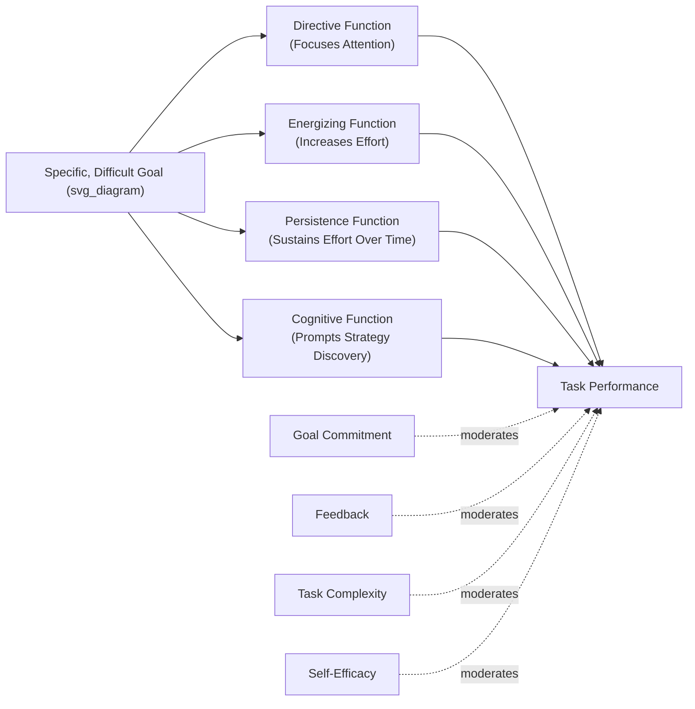

## Goal-Setting Theory

### Definition and Construct Overview

**Goal-Setting Theory**, developed primarily by Edwin Locke and Gary Latham beginning in the late 1960s and consolidated over decades of research, posits that **conscious goals and intentions are the primary determinants of task motivation and performance**. The theory holds that specific, difficult goals lead to higher performance than vague or easy goals, provided the individual is committed to the goal and possesses the requisite ability.

Locke and Latham's 1990 book *A Theory of Goal Setting and Task Performance* and their 2002 summary article in *American Psychologist* are considered the definitive theoretical statements, synthesizing over 400 studies.

### Core Propositions

**1. Specific, Difficult Goals Produce Higher Performance**

- Specific goals reduce ambiguity about what constitutes success, focusing attention and effort more effectively than vague goals like "do your best"
- Within the achievable range, more difficult goals produce higher performance than easy goals, because they require and elicit greater effort and persistence
- This relationship is **linear**, not curvilinear, as long as the goal remains within the person's capability — performance continues to rise with difficulty up to the point where ability or commitment becomes limiting

**2. The "Do Your Best" Problem**

- Vague, non-specific goals such as "do your best" consistently underperform specific difficult goals in empirical studies, because they allow a wide range of acceptable performance levels and provide no clear standard against which to calibrate effort

### The Four Mechanisms by Which Goals Affect Performance

Goal-setting theory specifies the psychological mechanisms through which goals translate into performance:

1. **Directive function** — goals focus attention and effort toward goal-relevant activities and away from goal-irrelevant ones
2. **Energizing function** — difficult goals lead to greater effort than easy goals
3. **Persistence function** — goals affect the duration of effort, particularly under time pressure or when the individual controls their own pace
4. **Cognitive/strategic function** — goals prompt the discovery and application of task-relevant knowledge and strategies, especially for complex tasks

### Moderators of the Goal-Performance Relationship

Goal-setting theory is notable for explicitly specifying boundary conditions under which the goal-difficulty-performance relationship holds:

**Goal Commitment**

- The degree to which an individual is attached to and determined to reach a goal
- Most critical when goals are difficult, since commitment determines whether the individual sustains effort rather than abandoning or lowering the goal
- Enhanced by: goal importance, self-efficacy for the goal, participation in goal-setting (context-dependent), and public commitment

**Feedback**

- Necessary for goals to affect performance — without feedback on progress, individuals cannot adjust effort or strategy relative to the goal standard
- Feedback and goals are theorized to work interactively: feedback alone has limited motivational effect without a goal standard to interpret it against

**Task Complexity**

- For simple, well-learned tasks, the direct effort/persistence mechanisms dominate
- For complex tasks, the cognitive/strategic mechanism becomes more important, and goals may need to be paired with adequate time for strategy development, or performance can suffer if individuals pursue goals with inadequate task-relevant strategies

**Self-Efficacy**

- Higher self-efficacy (belief in one's capability) is associated with acceptance of more difficult goals and greater persistence in pursuing them
- Self-efficacy and goal-setting share a reciprocal relationship — self-efficacy affects goal choice and commitment, and goal attainment feeds back into subsequent self-efficacy

**Situational Constraints**

- Availability of resources, organizational support, and absence of external obstacles moderate whether goal-directed effort translates into actual performance

### Diagram: Goal-Setting Theory Mechanism Model (svg_diagram)

### Key Points

- The core empirical finding — specific, difficult goals outperform vague or easy goals — is among the most consistently replicated findings in organizational psychology
- Goal commitment and feedback are **necessary conditions**, not optional enhancements — difficult goals without commitment or feedback do not reliably produce the expected performance gains
- The theory is explicitly **mechanistic**, specifying *how* goals affect performance (attention, effort, persistence, strategy) rather than only *that* they do
- Goal-setting theory is considered one of the most practically validated theories in I-O psychology, with direct application in performance management systems

### SMART Goals: Practitioner Extension

The widely used **SMART** framework (Specific, Measurable, Achievable, Relevant, Time-bound) is a popular applied heuristic that operationalizes goal-setting theory's core "specific and difficult-but-attainable" principles for practitioner use.

[Inference] While SMART goals are frequently presented in management training as derived directly from Locke and Latham's research, the acronym itself originated in management practice literature (commonly attributed to Doran, 1981) rather than being formally part of Locke and Latham's academic theory; the underlying "specific and measurable" principle is consistent with goal-setting theory even though the acronym is a separate applied development.

### Goal Proximity: Proximal vs. Distal Goals

- **Distal goals** (long-term, e.g., annual targets) provide overall direction but can feel distant and less motivationally immediate
- **Proximal goals** (short-term, e.g., weekly milestones) break distal goals into manageable steps, providing more frequent feedback opportunities and maintaining motivation over extended timeframes
- [Inference] Combining distal and proximal goals is generally considered more effective than either alone for sustained performance on long-duration or complex tasks, though the relative weighting and optimal proximal-goal interval likely varies by task type and individual differences in self-regulation, an area with less definitive consensus than the core difficulty-specificity finding.

### Participative vs. Assigned Goal Setting

A historically debated question: does employee participation in setting goals improve outcomes compared to goals assigned by a supervisor?

- Early research suggested participative goal-setting increases commitment through greater "ownership"
- However, subsequent research found that **assigned goals can produce equivalent performance to participative goals**, provided the rationale for the goal is communicated and goal difficulty/specificity are held constant
- [Inference] The practical benefit of participation appears to operate primarily through increased goal commitment and acceptance rather than through goal difficulty or specificity per se — meaning participation matters most in contexts where commitment is otherwise likely to be low (e.g., unfamiliar or unwelcome goals), rather than universally boosting performance.

### Example: Applied Workplace Scenario

**Vague goal**: "Improve customer service this quarter."

**Specific, difficult goal**: "Reduce average customer complaint resolution time from 48 hours to 24 hours by end of Q3, with weekly team check-ins on progress."

The second goal:

- Provides a clear, measurable standard (directive function)
- Is difficult enough to require increased effort (energizing function)
- Includes a feedback mechanism (weekly check-ins), supporting persistence and strategy adjustment
- Enables commitment tracking, since progress toward a 24-hour target is observable in a way "improve service" is not

### Goal-Setting and Performance Management Systems

**Management by Objectives (MBO)**

- Peter Drucker's MBO framework, developed independently but conceptually complementary to goal-setting theory, structures organizational performance management around cascading specific objectives from organizational to individual levels
- [Inference] MBO's practical effectiveness is generally considered contingent on the same moderators goal-setting theory specifies — commitment, feedback, and goal specificity — rather than on the cascading structure alone; poorly implemented MBO systems without genuine feedback loops often fail to produce the theorized benefits.

**OKRs (Objectives and Key Results)**

- Popular contemporary framework (originating at Intel, popularized by Google) pairing qualitative objectives with quantitative key results
- Conceptually aligns with goal-setting theory's specificity and measurability principles, though it emerged from management practice rather than academic I-O research

### Potential Negative Consequences of Goal-Setting

Goal-setting theory research has also identified documented risks when goals are poorly designed or implemented:

- **Narrow focus / goal fixation**: overly narrow goals can cause neglect of non-goal-relevant but still important task dimensions (goals as a "double-edged sword," per Ordóñez et al., 2009 critique)
- **Unethical behavior**: high-pressure, difficult goals without ethical guardrails have been associated in some studies with increased rule-bending or unethical shortcuts to reach targets
- **Risk-taking**: goals framed around specific numeric thresholds can incentivize excessive risk-taking to cross the threshold (e.g., sales targets encouraging end-of-quarter manipulation)
- **Reduced intrinsic motivation**: [Inference] Some research suggests externally imposed difficult goals can undermine intrinsic motivation for inherently interesting tasks, consistent with broader self-determination theory concerns about autonomy, though this effect is more consistently documented for creative/exploratory tasks than for routine performance tasks.
- **Learning goals vs. performance goals**: for complex or novel tasks, specific difficult *performance* goals ("achieve X output") can sometimes impair performance if they crowd out strategy exploration; **learning goals** ("discover effective strategies for X") are often recommended instead for tasks requiring skill acquisition

### Distinguishing Goal-Setting Theory from Related Constructs

| Construct | Key Distinction |
| --- | --- |
| **Expectancy Theory** | Focuses on effort-performance-outcome expectancy calculations; goal-setting focuses on the goal itself as the proximal motivational mechanism |
| **Self-Efficacy Theory (Bandura)** | Self-efficacy is a moderator/input into goal-setting theory, not a competing theory — the two are typically integrated |
| **Self-Determination Theory** | Concerned with autonomous vs. controlled motivation quality; goal-setting theory is largely agnostic to motivational source unless goals are externally imposed in ways that undermine autonomy |
| **MBO** | An organizational management practice/system; goal-setting theory is the underlying psychological theory that can inform MBO's design |

### Measurement and Research Methodology

- Goal commitment is commonly measured via self-report scales (e.g., Hollenbeck, Klein, O'Leary, & Wright's Goal Commitment Scale)
- Laboratory studies frequently use quantifiable tasks (e.g., brainstorming output, assembly tasks) to manipulate goal difficulty/specificity experimentally, which has contributed to the theory's strong internal validity base
- [Unverified] The generalizability of laboratory goal-setting effect sizes to complex, multi-goal, real-world knowledge work is less extensively documented than for simple/quantifiable field tasks, and effect sizes in applied organizational settings may vary depending on task complexity and measurement approach.

### Conclusion

Goal-setting theory stands as one of the most empirically robust and practically influential theories in organizational psychology, with a core finding — specific, difficult goals enhance performance more than vague or easy goals — replicated across hundreds of studies and diverse task contexts. Its explanatory power derives from specifying the mechanisms (direction, energy, persistence, strategy) and boundary conditions (commitment, feedback, task complexity, self-efficacy) governing when and how goals translate into performance, making it directly actionable for designing performance management systems, while also cautioning practitioners about the documented risks of narrow, poorly calibrated, or excessively pressured goal structures.

### Related Topics

- Self-efficacy theory (Bandura) and its reciprocal relationship with goal-setting
- Feedback intervention theory and feedback sign effects
- Management by Objectives (MBO) and OKR frameworks
- Learning goal orientation vs. performance goal orientation
- Self-determination theory and intrinsic vs. extrinsic goal motivation
- Unethical goal pursuit and the "goals gone wild" critique (Ordóñez et al.)
- Proximal-distal goal structuring in long-term performance management
- Goal orientation individual differences (Dweck's mindset theory application)
- Performance appraisal system design
- Expectancy theory (Vroom) as a complementary motivation framework