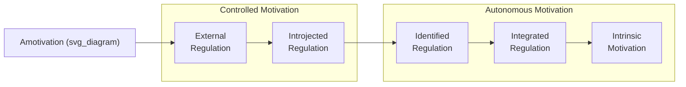

## Self-Determination Theory

### Definition and Construct Overview

**Self-Determination Theory (SDT)**, developed by Edward Deci and Richard Ryan beginning in the 1980s and substantially elaborated through the 2000s, is a macro-theory of human motivation centered on the distinction between **autonomous** and **controlled** forms of motivation, and the role of three innate psychological needs in fostering optimal functioning, well-being, and sustained motivation.

Unlike theories that treat motivation as a unidimensional quantity (more vs. less), SDT's central contribution is distinguishing motivation by **quality and source**, arguing that *why* a person pursues a goal matters as much as *whether* they pursue it.

### The Three Basic Psychological Needs

SDT proposes that human motivation and well-being depend on the satisfaction of three innate, universal psychological needs:

**1. Autonomy**

- The need to experience one's behavior as self-endorsed and volitional, rather than controlled by external pressures
- Distinct from independence — autonomy concerns the *sense of choice and ownership* over one's actions, not acting alone or without influence from others

**2. Competence**

- The need to feel effective and capable in interacting with one's environment and producing desired outcomes
- Related to but distinct from Bandura's self-efficacy; competence in SDT is framed as a fundamental need rather than a task-specific belief

**3. Relatedness**

- The need to feel connected to, cared for by, and significant to others
- Encompasses belongingness and meaningful interpersonal connection within work and social contexts

[Inference] SDT researchers generally treat these three needs as necessary for well-being across cultures and contexts, though the relative weighting or culturally-specific expression of each need (particularly autonomy, given its association with individualist values) has been a subject of ongoing cross-cultural investigation rather than fully settled consensus.

### The Motivation Continuum (Organismic Integration Theory)

SDT's sub-theory of **Organismic Integration Theory (OIT)** describes a continuum of motivation types ranging from fully controlled to fully autonomous, based on the degree to which a behavioral regulation has been internalized:

| Type | Regulation Style | Locus of Causality | Description |
| --- | --- | --- | --- |
| **Amotivation** | None | Impersonal | Lack of intention or motivation to act |
| **External Regulation** | Controlled | External | Behavior driven purely by external rewards/punishments |
| **Introjected Regulation** | Controlled | Somewhat external | Behavior driven by internal pressures like guilt, shame, or ego-involvement |
| **Identified Regulation** | Autonomous | Somewhat internal | Behavior valued because it aligns with personally endorsed goals |
| **Integrated Regulation** | Autonomous | Internal | Behavior fully assimilated with one's values and identity |
| **Intrinsic Motivation** | Autonomous | Internal | Behavior performed for inherent interest/enjoyment |

**Key distinction**: Identified and integrated regulation are both **extrinsically motivated** (the behavior is instrumental to an outcome) but are experienced as **autonomous** because the underlying value has been internalized — this is a critical nuance often missed in simplified intrinsic/extrinsic dichotomies.

### Diagram: SDT Motivation Continuum (svg_diagram)

### Cognitive Evaluation Theory (CET): Effects of External Rewards on Intrinsic Motivation

CET, an SDT sub-theory, addresses how external factors (rewards, feedback, deadlines) affect intrinsic motivation:

- **Controlling events** (rewards perceived as controlling behavior, surveillance, imposed deadlines) tend to **undermine** intrinsic motivation by shifting the perceived locus of causality from internal to external — this is the well-documented **"undermining effect"** or "overjustification effect"
- **Informational events** (positive feedback that affirms competence without being controlling) tend to **support** intrinsic motivation by satisfying the competence need
- [Inference] The undermining effect of extrinsic rewards on intrinsic motivation is one of the more empirically contested areas in motivation psychology — while foundational meta-analyses (e.g., Deci, Koestner, & Ryan, 1999) support the effect under specific conditions (particularly tangible, expected, task-contingent rewards for already-interesting tasks), the magnitude and generalizability across all reward types and contexts remains debated among researchers, and some scholars (e.g., Eisenberger and colleagues) have raised methodological critiques of the underlying studies.

### Causality Orientations Theory

A sub-theory addressing individual differences in how people generally orient toward regulating their behavior across contexts:

- **Autonomy orientation**: general tendency to seek out and interpret situations in self-determined ways
- **Controlled orientation**: general tendency to orient toward external controls and directives
- **Impersonal orientation**: general tendency toward amotivation and belief that outcomes are uncontrollable

### Basic Psychological Needs Theory

The sub-theory formalizing the three needs (autonomy, competence, relatedness) as universal requirements for psychological growth, integrity, and well-being — need satisfaction predicts positive outcomes (well-being, engagement) while need frustration/thwarting predicts negative outcomes (ill-being, burnout, defensive/rigid functioning), which are theorized as distinct (not merely opposite) processes.

### Key Points

- SDT's central insight is that motivation **quality**, not just quantity, predicts sustained engagement, performance on complex/creative tasks, and well-being
- Autonomous motivation (identified, integrated, intrinsic) is consistently associated with better persistence, creativity, and psychological well-being than controlled motivation (external, introjected)
- The three basic needs — autonomy, competence, relatedness — function as the mechanism through which work design, leadership style, and organizational context affect motivation quality
- Extrinsic motivation is not inherently "bad" in SDT — the theory explicitly distinguishes autonomous extrinsic motivation (identified/integrated) from controlled extrinsic motivation, avoiding a simplistic intrinsic-good/extrinsic-bad framing

### Workplace Applications

**Need-Supportive Management Practices**

| Need | Supportive Managerial Behaviors |
| --- | --- |
| **Autonomy** | Providing rationale for tasks/requests, offering meaningful choice where possible, minimizing controlling language ("must," "should") |
| **Competence** | Providing structured, informational feedback; setting optimally challenging tasks; ensuring adequate resources/training |
| **Relatedness** | Demonstrating genuine care and interest, fostering team cohesion, ensuring inclusion in decisions affecting employees |

**Autonomy-Supportive vs. Controlling Leadership**

- Autonomy-supportive leadership style (offering choice, acknowledging perspectives, providing meaningful rationale for directives) is consistently associated with higher employee autonomous motivation, engagement, and well-being in SDT-based organizational research
- Controlling leadership styles (pressuring language, contingent rewards used manipulatively, surveillance) tend to shift employees toward introjected/external regulation, associated with lower persistence on complex tasks and higher burnout risk

**Compensation and Reward System Design**

- [Inference] SDT-informed practitioners generally caution against reward structures that make pay highly contingent and salient on specific narrow behaviors for tasks requiring creativity or complex problem-solving, since this risks triggering the undermining effect; however, for routine/repetitive tasks, extrinsic contingent rewards appear less likely to undermine motivation, since intrinsic motivation for such tasks tends to be low to begin with. This distinction is drawn from CET's boundary conditions but requires contextual judgment in application, not a universal rule against incentive pay.

### Example: Applied Workplace Scenario

**Controlling framing**: "You need to complete this report by Friday or there will be consequences."

**Autonomy-supportive framing**: "This report needs to be done by Friday because the client review depends on it — let me know if you'd like to discuss how to approach it or if you need any support."

The second framing:

- Provides meaningful rationale (supports autonomy by explaining *why*, not just *what*)
- Leaves room for input on approach (supports autonomy through choice)
- Offers support rather than surveillance (supports competence and relatedness)

[Inference] This is an illustrative constructed example reflecting SDT's general framing principles rather than a documented case study.

### SDT and Related Organizational Constructs

**Work Engagement**

- SDT need satisfaction is commonly cited as a proximal predictor of work engagement in the broader engagement literature, though engagement itself (as operationalized by Schaufeli et al.'s vigor-dedication-absorption model) is a related but conceptually distinct construct from SDT's motivational quality framework

**Burnout**

- Need frustration (rather than merely low need satisfaction) is specifically theorized in SDT as a precursor to burnout and exhaustion, distinguishing "not having needs met" from the more active, depleting experience of needs being actively thwarted (e.g., by highly controlling supervision)

**Job Crafting**

- Employees' proactive reshaping of their job tasks/relationships/perceptions can be understood through an SDT lens as autonomy-driven behavior aimed at increasing need satisfaction within existing job constraints

### Measurement

- **Work Extrinsic and Intrinsic Motivation Scale (WEIMS)**: assesses the full motivation continuum in work contexts
- **Basic Psychological Need Satisfaction and Frustration Scale (BPNSFS)**: assesses satisfaction and frustration of the three needs, reflecting SDT's more recent theoretical distinction between these as separate processes
- **Work Climate Questionnaire**: assesses perceived autonomy support from supervisors/organizations

### Distinguishing SDT from Related Motivation Theories

| Theory | Key Distinction from SDT |
| --- | --- |
| **Goal-Setting Theory** | Focuses on goal properties (specificity, difficulty) as proximal performance drivers; SDT focuses on the *quality* of motivation underlying goal pursuit — the two are often integrated (e.g., autonomously held difficult goals) |
| **Expectancy Theory** | Cognitive-calculative model of effort based on expectancy-instrumentality-valence; SDT is a needs-based, developmental/organismic model |
| **Herzberg's Two-Factor Theory** | Distinguishes hygiene vs. motivator factors as job characteristics; SDT distinguishes motivation by internal regulatory process, not by factor type |
| **Maslow's Hierarchy of Needs** | Broader, hierarchical need structure without strong contemporary empirical support; SDT's three needs are non-hierarchical (theorized as simultaneously essential) and have substantially more contemporary empirical grounding in organizational research |

### Critiques and Boundary Conditions

- [Unverified] The universality claim — that autonomy, competence, and relatedness are needs across all cultures — has been questioned particularly regarding autonomy in highly collectivist contexts, where some researchers argue autonomy may manifest differently (e.g., as "volitional endorsement of group-oriented goals" rather than independence-oriented choice); the extent to which this reflects genuine cultural moderation versus measurement/conceptual differences remains an active research question.
- The undermining effect of extrinsic rewards, while foundational to CET, has drawn methodological critique regarding meta-analytic inclusion criteria and real-world applicability to organizational incentive systems, which typically differ from laboratory reward paradigms in duration, magnitude, and context.
- [Inference] SDT's applied organizational research has expanded substantially since the 2000s, but the bulk of foundational experimental evidence for CET's undermining effect originates from laboratory studies using simple, inherently interesting tasks (e.g., puzzles), and its direct generalizability to complex, long-term organizational incentive structures (e.g., annual bonuses, commission structures) is more inferential than directly tested in equivalent controlled field designs.

### Conclusion

Self-Determination Theory offers one of the most theoretically comprehensive and empirically active frameworks in contemporary work motivation research, distinguished by its emphasis on motivational *quality* — the internalization continuum from controlled to autonomous regulation — rather than motivational quantity alone. Its three basic psychological needs (autonomy, competence, relatedness) provide an actionable diagnostic lens for designing management practices, feedback systems, and organizational structures that support sustained engagement and well-being, while its sub-theories (Cognitive Evaluation Theory, Causality Orientations Theory, Basic Psychological Needs Theory) offer more granular mechanisms for understanding how specific contextual and individual-difference factors shape motivational outcomes at work.

### Related Topics

- Cognitive Evaluation Theory and the extrinsic reward undermining effect
- Autonomy-supportive leadership and management training interventions
- Work engagement (Schaufeli's vigor-dedication-absorption model) and its relationship to SDT
- Burnout and need frustration as distinct processes from low need satisfaction
- Job crafting and proactive work design
- Goal-setting theory integration with autonomous goal pursuit
- Cross-cultural applicability of basic psychological needs
- Intrinsic vs. extrinsic motivation in incentive/compensation design
- Psychological well-being frameworks in organizational contexts
- Herzberg's Two-Factor Theory as a comparative historical framework