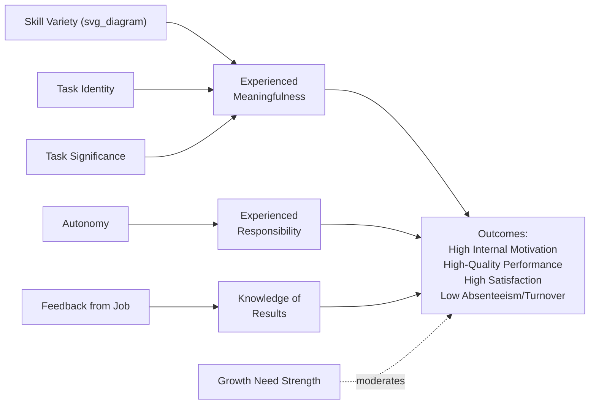

## The Job Characteristics Model

### Definition and Construct Overview

The **Job Characteristics Model (JCM)**, developed by J. Richard Hackman and Greg Oldham (1975, 1976, with the definitive formulation in their 1980 book *Work Redesign*), is a theory of work motivation and job design specifying that **five core job dimensions** produce **three critical psychological states** in employees, which in turn drive **personal and work outcomes** — with the strength of these relationships moderated by individual differences, particularly **growth need strength**.

The model built on earlier job enrichment concepts (notably Herzberg's motivator-hygiene theory and Turner & Lawrence's earlier work on task attributes) but provided a more precise, testable, and measurable framework linking specific job features to specific psychological mechanisms.

### The Five Core Job Characteristics

**1. Skill Variety**

- The degree to which a job requires a range of different activities, skills, and talents

**2. Task Identity**

- The degree to which a job requires completion of a whole, identifiable piece of work from beginning to end, with a visible outcome

**3. Task Significance**

- The degree to which a job has a substantial impact on the lives or work of other people, whether within the organization or in the broader world

**4. Autonomy**

- The degree to which a job provides substantial freedom, independence, and discretion in scheduling work and determining procedures for carrying it out

**5. Feedback (from the job itself)**

- The degree to which carrying out job-required activities provides direct and clear information about the effectiveness of one's performance
- Importantly, this refers to feedback **inherent in the work itself** (e.g., seeing a completed product), distinct from feedback delivered by supervisors or peers

### The Three Critical Psychological States

The five job characteristics are theorized to produce three psychological states, which are the direct mechanisms driving motivational outcomes:

| Psychological State | Produced By |
| --- | --- |
| **Experienced Meaningfulness of the Work** | Skill Variety + Task Identity + Task Significance |
| **Experienced Responsibility for Outcomes** | Autonomy |
| **Knowledge of the Actual Results of Work Activities** | Feedback |

Note the structural asymmetry: meaningfulness is produced by *three* combined characteristics, while responsibility and knowledge of results are each produced by a *single* characteristic (autonomy and feedback, respectively).

### The Motivating Potential Score (MPS)

Hackman and Oldham formalized the combination of the five characteristics into a single index predicting a job's overall motivational potential:

$$MPS = \left(\frac{\text{Skill Variety} + \text{Task Identity} + \text{Task Significance}}{3}\right) \times \text{Autonomy} \times \text{Feedback}$$

**Key structural implications of this formula:**

- The three meaningfulness-related characteristics are **averaged**, meaning a job can still score reasonably on meaningfulness even if it's low on one of the three components
- Autonomy and Feedback are **multiplicative**, meaning a job scoring zero (or near-zero) on either autonomy or feedback will produce a near-zero MPS **regardless of how high the other characteristics are** — this is a critical and often-tested feature of the model, since it predicts that even highly varied, significant, identity-rich work will fail to be motivating if the employee has no autonomy or no feedback

### Diagram: Job Characteristics Model Structure (svg_diagram)

### Outcomes Predicted by the Model

The three psychological states, when jointly present, are theorized to produce:

- **High internal work motivation** — motivation generated by the work itself rather than external rewards
- **High-quality work performance**
- **High satisfaction with the work**
- **Low absenteeism and turnover**

### Moderators: Growth Need Strength and Others

**Growth Need Strength (GNS)**

- An individual-difference variable reflecting the degree to which a person desires personal growth, learning, and accomplishment from their work
- Central moderator in the model: individuals high in GNS respond more strongly (both psychologically and behaviorally) to enriched jobs with high MPS, while individuals low in GNS show weaker or attenuated responses to the same job characteristics

**Additional Moderators (secondary, less central to the original model)**

- **Knowledge and skill** — individuals need adequate ability to experience positive psychological states from complex, enriched work rather than frustration
- **Context satisfaction** — satisfaction with pay, supervision, coworkers, and job security was theorized to moderate responses to job enrichment, on the logic that dissatisfaction with these "context" factors could undermine responsiveness to intrinsic job features

[Inference] Empirical support for GNS as a moderator has been more consistently documented across studies than support for context satisfaction as a moderator, though neither moderator's effects have proven as robust or universally replicated as the core job-characteristics-to-psychological-states pathway itself.

### Measurement: The Job Diagnostic Survey (JDS)

Hackman and Oldham developed the **Job Diagnostic Survey (JDS)** as the primary instrument for assessing the five core job characteristics, the three psychological states, growth need strength, and general/specific satisfaction outcomes — enabling calculation of the MPS for a given job.

[Inference] The JDS remains a historically important and frequently cited instrument in job design research, though more recent multidimensional work design measures (e.g., the Work Design Questionnaire by Morgeson & Humphrey, 2006) have extended and, in some research contexts, superseded it by incorporating a broader range of task, knowledge, social, and contextual work characteristics beyond Hackman and Oldham's original five.

### Key Points

- The JCM is distinguished from earlier job enrichment approaches by its precision: it specifies *which* job characteristics matter, *how* they combine (via the MPS formula), and *why* they affect motivation (via the three psychological states)
- The multiplicative relationship between autonomy and feedback in the MPS formula is a theoretically important and empirically testable claim distinguishing the JCM from simpler additive job design models
- Growth need strength functions as the primary boundary condition — the model does not predict uniform benefit from job enrichment across all employees
- The model's psychological states (particularly experienced meaningfulness) anticipated later constructs like "meaningful work," which remains a major independent research area in organizational psychology

### Job Redesign Strategies (Implementation Guidance from Hackman & Oldham)

Hackman and Oldham proposed five implementing concepts, each targeting specific core characteristics:

1. **Combining tasks** — increases skill variety and task identity by consolidating fragmented tasks into larger work modules
2. **Forming natural work units** — increases task identity and task significance by grouping tasks into a coherent, meaningful whole (e.g., assigning a single employee ownership of a client account rather than fragmenting across departments)
3. **Establishing client relationships** — increases skill variety, autonomy, and feedback by connecting workers directly with the end users/clients of their work
4. **Vertical loading** — increases autonomy by pushing decision-making responsibilities (traditionally held by supervisors) down to the worker level
5. **Opening feedback channels** — increases feedback by ensuring workers receive direct, timely information about performance, ideally from the work itself rather than solely through supervisory reports

### Example: Applied Job Redesign Scenario

**Low-MPS job**: An assembly-line worker who installs a single component repeatedly, has no input into work pace/method, and never sees the finished product or learns about defect rates.

**Redesigned high-MPS job**: The same worker is organized into a small team responsible for assembling a complete subunit (natural work units, increasing task identity), given discretion over work sequencing within quality standards (vertical loading, increasing autonomy), and given direct visibility into quality metrics/customer feedback for their specific output (opening feedback channels).

Following the MPS formula, this redesign primarily targets autonomy and feedback — the multiplicative terms — meaning even modest gains in these two areas could disproportionately raise the job's overall motivating potential compared to focusing solely on skill variety.

### Applications Beyond Traditional Manufacturing Contexts

- **Knowledge work and remote work**: [Inference] Autonomy and feedback (the multiplicative MPS terms) are often cited as particularly salient design levers in modern knowledge work and remote/hybrid contexts, given the reduced direct supervisory oversight and increased reliance on self-directed work; however, this application represents a contemporary extension of the model's logic rather than something directly tested in Hackman and Oldham's original manufacturing/clerical-heavy research base.
- **Service and gig work**: Task significance has received renewed research attention in service contexts, particularly regarding how workers' awareness of their impact on customers/beneficiaries affects motivation (connecting to later "prosocial motivation" research, e.g., Grant, 2008)

### Distinguishing the JCM from Related Theories

| Theory | Key Distinction from JCM |
| --- | --- |
| **Herzberg's Two-Factor Theory** | Precursor/influence on JCM; Herzberg's motivators are conceptually related to JCM's core characteristics, but Herzberg's theory lacks the JCM's precise psychological-state mechanism and quantifiable MPS formula |
| **Self-Determination Theory** | SDT's autonomy, competence (related to feedback/mastery), and relatedness needs conceptually overlap with JCM's psychological states, but SDT is a broader needs-based theory not limited to job design, while JCM is specifically a job/task design model |
| **Goal-Setting Theory** | Concerned with goal properties (difficulty, specificity) rather than the structural characteristics of the job/task itself; the two theories are complementary rather than competing |
| **Work Design Questionnaire (Morgeson & Humphrey)** | Contemporary extension incorporating a broader taxonomy of task, knowledge, social, and contextual characteristics beyond JCM's original five |

### Critiques and Boundary Conditions

- [Unverified] Meta-analytic reviews have generally supported the core relationship between job characteristics and outcomes like satisfaction and internal motivation, but support specifically for the *multiplicative* form of the MPS formula (versus a simpler additive combination) has been more mixed across studies, and the precise superiority of the multiplicative model over additive alternatives is not fully resolved in the literature.
- The moderating role of growth need strength, while theoretically central, has shown inconsistent effect sizes across studies, leading some researchers to question whether it functions as strongly as originally proposed
- [Inference] The JDS and original JCM research base draw heavily from manufacturing, clerical, and structured task contexts common in 1970s-80s organizational research; applicability to highly autonomous, loosely structured, or creative knowledge work has been extended by subsequent researchers but represents an evolution of, rather than a direct empirical replication within, the original model's evidence base.

### Conclusion

The Job Characteristics Model remains a foundational framework in work design research, notable for its precision in specifying five measurable job characteristics, the psychological mechanisms (meaningfulness, responsibility, knowledge of results) through which they operate, and a formal mathematical structure (the MPS) capturing how these characteristics combine — including the theoretically significant claim that autonomy and feedback function multiplicatively rather than additively. While growth need strength and the exact mathematical form of the MPS have drawn some empirical scrutiny, the model's core practical legacy — the five implementing concepts for job redesign — continues to inform contemporary job enrichment, job crafting, and work design interventions across both traditional and modern organizational contexts.

### Related Topics

- Work Design Questionnaire (Morgeson & Humphrey) as a contemporary extension
- Job crafting theory and employee-initiated work redesign
- Herzberg's Two-Factor Theory as a historical precursor
- Meaningful work as an independent research construct
- Prosocial motivation and task significance (Grant's research)
- Self-Determination Theory's conceptual overlap with psychological states
- Job enrichment vs. job enlargement as distinct redesign strategies
- Remote/hybrid work design and autonomy in modern knowledge work
- Growth need strength as an individual difference variable
- Sociotechnical systems theory as an alternative work design tradition