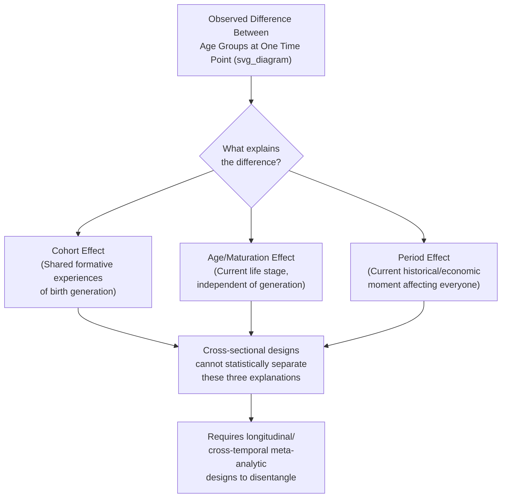

## Generational and Lifespan Perspectives on Motivation

### Definition and Construct Overview

This topic encompasses two related but distinct theoretical traditions for understanding how work motivation varies across time: **generational perspectives**, which examine cohort-based differences in values and motivational preferences (e.g., Baby Boomers vs. Millennials vs. Generation Z), and **lifespan perspectives**, which examine how motivation shifts as individuals age and progress through career and life stages, largely independent of birth cohort. These traditions have substantially different levels of empirical support within organizational psychology, and distinguishing them is essential for accurate application.

### Generational Perspectives: Core Claims and Terminology

**Common Generational Cohort Labels (U.S.-centric convention)**

| Generation | Approximate Birth Years |
| --- | --- |
| Traditionalists/Silent Generation | 1928–1945 |
| Baby Boomers | 1946–1964 |
| Generation X | 1965–1980 |
| Millennials (Gen Y) | 1981–1996 |
| Generation Z | 1997–2012 |

[Inference] Exact birth-year boundaries for each generational label vary across sources (e.g., Pew Research Center, Strauss & Howe), and there is no single authoritative demarcation; these ranges represent commonly cited approximations rather than fixed scientific categories.

**Popular Claims About Generational Motivational Differences**

Popular management literature commonly asserts that generations differ systematically in what motivates them at work — for example, claims that Millennials prioritize purpose and flexibility over pay, or that Baby Boomers prioritize loyalty and hierarchical advancement. [Speculation] These specific claims are widely circulated in trade publications and corporate training materials, but their empirical grounding in rigorously controlled organizational research is substantially weaker than their popularity would suggest.

### The Cohort-Age-Period Confound: Central Methodological Problem

The foundational methodological challenge in generational research is disentangling three overlapping explanations for observed differences between age groups at a single point in time:

**1. Cohort Effects**

- Differences attributable to shared formative experiences of a birth cohort (e.g., growing up during a specific economic era or technological shift) that persist as the cohort ages

**2. Age/Maturation Effects**

- Differences attributable to an individual's current life stage or age, regardless of birth cohort (e.g., younger workers generally showing more job-hopping regardless of which generation they belong to, then settling as they age)

**3. Period Effects**

- Differences attributable to the specific historical/economic moment of measurement, affecting all age groups simultaneously (e.g., a recession affecting job security concerns across all generations at that time)

**The core problem**: Most published generational research is **cross-sectional** (comparing different age groups at one point in time), which makes it statistically impossible to separate cohort effects from age effects — a 25-year-old and a 55-year-old surveyed today differ in both birth cohort *and* current age simultaneously, and cross-sectional designs cannot isolate which factor drives observed differences.

### Diagram: Cohort-Age-Period Confound (svg_diagram)

### Empirical Evidence: What Rigorous Research Actually Finds

**Meta-Analytic and Cross-Temporal Studies**

[Inference] A body of research using more rigorous designs — including cross-temporal meta-analyses that track the same age group across different historical periods, and large longitudinal panel studies — has generally found that documented generational differences in core work values and motivational drivers are substantially smaller than popular narratives suggest, with several prominent studies (e.g., work associated with researchers like Jean Twenge on some dimensions showing modest generational shifts, and other researchers such as Costanza and colleagues in meta-analytic work finding minimal or inconsistent generational effects on work-related outcomes) reaching differing conclusions depending on methodology, measured construct, and analytic approach. This remains a genuinely contested area of research rather than a settled empirical consensus, and readers should treat specific popular claims (e.g., "Millennials value purpose over pay") with caution absent rigorous longitudinal support.

**Key Point of Broad Scholarly Agreement**

[Inference] There is broader consensus among I-O psychology researchers that many observed workplace differences attributed to "generation" in popular discourse are more plausibly explained by **career stage/age effects** (e.g., early-career workers generally prioritizing skill development and job mobility regardless of birth year) or **period effects** (e.g., economic conditions at time of labor market entry) than by durable, generation-specific value differences — though this remains an area of active debate rather than fully unanimous agreement across all researchers and all measured constructs.

### Key Points

- Generational labels are social/demographic constructs, not validated psychological categories with agreed-upon boundaries
- Cross-sectional comparisons of age groups cannot statistically distinguish cohort, age, and period effects — a critical methodological limitation of most popular generational research
- Empirical support for large, actionable generational differences in core work motivation is considerably weaker and more contested than popular management literature suggests
- Career stage and age-related life circumstances often provide more empirically grounded and actionable explanations for observed workplace differences than generational cohort membership

### Lifespan Perspectives: Socioemotional Selectivity Theory

**Socioemotional Selectivity Theory (SST)**, developed by Laura Carstensen, is one of the most empirically grounded frameworks for understanding age-related (not generational) motivational shifts. SST proposes that motivation is driven substantially by **perceived time horizon**, not chronological age per se:

- When future time is perceived as **open-ended** (typically associated with younger age), individuals prioritize motives oriented toward knowledge acquisition, skill-building, and expanding social networks
- When future time is perceived as **limited** (typically associated with older age, but also triggered by other circumstances such as terminal illness or major life transitions), individuals prioritize motives oriented toward emotionally meaningful goals, close relationships, and present-focused emotional well-being

[Inference] SST's core mechanism — perceived time horizon rather than chronological age itself — is a well-supported and widely cited finding in lifespan developmental psychology, though its specific application and effect sizes within organizational/work motivation contexts (as opposed to the broader social-psychological contexts where it was originally developed and tested) represent a smaller and more targeted body of applied research.

### Workplace Applications of Lifespan/Age-Related Motivation Research

**Selective Optimization with Compensation (SOC) Model**

- Developed by Baltes and Baltes, this lifespan development model proposes that as individuals age and experience changes in resources/capacities, they adaptively manage goal pursuit through:
  - **Selection**: narrowing focus to fewer, more personally meaningful goals
  - **Optimization**: investing available resources more efficiently toward selected goals
  - **Compensation**: using alternative strategies or external aids to offset age-related capacity changes
- [Inference] SOC has been applied in organizational aging research to explain how older workers often maintain or even increase job performance and engagement despite potential declines in certain physical/cognitive capacities, by strategically reallocating effort — though the model's application to occupational contexts represents an extension of a broader lifespan-developmental framework rather than a theory originally developed for workplace settings specifically.

**Generativity and Meaningful Work**

- Erikson's psychosocial development concept of **generativity** (concern for guiding and contributing to future generations, associated with midlife/later-career stages) has been applied in organizational research to explain increased motivation toward mentoring, knowledge-transfer, and legacy-oriented work among more senior/experienced employees
- [Inference] This application connects a well-established developmental psychology construct to organizational behavior, though direct empirical workplace validation of generativity's specific motivational effects is a more limited research base compared to the foundational developmental psychology literature on generativity itself.

### Career Stage Models

Distinct from strict chronological-age models, **career stage theories** (e.g., Super's career stage model, Levinson's adult development stages as applied to careers) propose that motivation shifts according to career phase rather than age or generation per se:

| Career Stage | Typical Motivational Emphasis |
| --- | --- |
| **Exploration/Early Career** | Skill acquisition, identity establishment, feedback-seeking |
| **Establishment/Advancement** | Achievement, advancement, increasing responsibility |
| **Maintenance/Mid-Career** | Sustaining performance, mentoring others, reassessing goals (sometimes associated with "midcareer plateau" phenomena) |
| **Disengagement/Late Career** | Legacy, knowledge transfer, transition planning, selective goal narrowing |

[Inference] Career stage models offer an alternative to both purely generational and purely chronological-age explanations, since career stage can vary independently of age (e.g., someone starting a second career later in life may show "early career" motivational patterns despite chronological age typically associated with "late career" stages); however, empirical validation of the precise stage boundaries and universality of this sequence across modern, non-linear career paths is less robust than the model's intuitive appeal suggests.

### Practical Implications for Management

**Cautions Against Generational Stereotyping**

- [Inference] Given the weak and contested empirical base for generational differences, I-O practitioners increasingly caution against designing HR policies, engagement surveys, or management training around generational stereotypes, as doing so risks both inaccurate assumptions and potential age-based stereotyping/discrimination concerns.
- Individual differences within any generational cohort (in personality, values, career stage, and life circumstances) are consistently found to be larger than average differences between generational cohorts across most rigorously measured constructs

**More Empirically Grounded Alternatives**

- Assessing **individual** values, career stage, and life circumstances directly (rather than inferring them from birth year) is more consistent with the stronger evidence base from lifespan and career-stage research
- Flexible work design that accommodates varying individual needs (rather than generationally-targeted programs) aligns better with the finding that within-cohort variability typically exceeds between-cohort variability

### Example: Applied Scenario

An organization observes that younger employees job-hop more frequently than older employees and attributes this to "Millennial values" around loyalty. A lifespan/career-stage-informed reinterpretation: early-career individuals across historical eras have generally shown higher voluntary turnover as they explore fit and build transferable skills — a pattern observed among young Baby Boomers and Gen Xers at comparable career stages in earlier eras, based on labor market mobility research. This reframes an apparent "generational" finding as more plausibly a career-stage/age effect.

[Inference] This is an illustrative scenario constructed to demonstrate the cohort-age-period confound principle, not a specific cited empirical study.

### Distinguishing These Frameworks from Related Constructs

| Framework | Key Distinction |
| --- | --- |
| **Generational Theory (popular)** | Cohort-based, often cross-sectional, contested empirical support |
| **Socioemotional Selectivity Theory** | Age/time-horizon-based, strong empirical support in developmental psychology, narrower applied organizational base |
| **Career Stage Models** | Career-phase-based, can vary independently of chronological age |
| **Life-Span, Life-Space Theory (Super)** | Broader career development theory encompassing career stages as one component among life-role considerations |

### Conclusion

Generational and lifespan perspectives on work motivation represent two conceptually distinct traditions with substantially different levels of empirical rigor. Popular generational cohort theories, despite widespread use in management training and HR practice, face a fundamental methodological challenge — the cohort-age-period confound — that undermines many commonly cited claims about generational differences in work values. In contrast, lifespan developmental frameworks such as Socioemotional Selectivity Theory and Selective Optimization with Compensation offer more empirically grounded, mechanism-based explanations for how motivation shifts with perceived time horizon, career stage, and developmental context — providing organizational psychology with a more defensible foundation for understanding and responding to workforce motivational diversity than birth-year-based generational stereotyping.

### Related Topics

- Cross-temporal meta-analysis methodology in organizational research
- Socioemotional Selectivity Theory (Carstensen) in depth
- Selective Optimization with Compensation (SOC) model
- Career stage theories (Super, Levinson) and modern non-linear career paths
- Age discrimination and stereotyping in HR practice
- Generativity (Erikson) and mentoring motivation in later career stages
- Workforce aging and successful aging at work research
- Individual differences vs. group-based approaches to motivation diagnosis
- Longitudinal research design in organizational psychology
- Flexible/individualized work design as an alternative to generationally-targeted HR policy