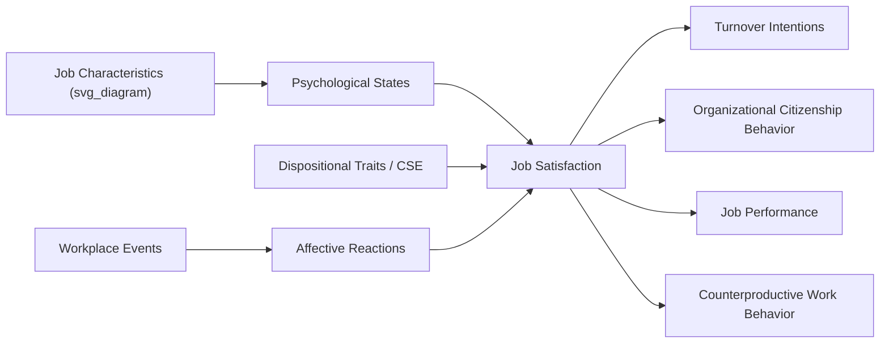

## Job Satisfaction Theory and Measurement

### Definition and Conceptual Overview

Job satisfaction refers to the extent to which individuals hold positive attitudes or feelings toward their job, based on cognitive evaluation and affective experience of their work and work context. Locke's (1976) classic definition frames it as "a pleasurable or positive emotional state resulting from the appraisal of one's job or job experiences."

Two conceptual dimensions are commonly distinguished:

- **Global job satisfaction**: An overall, holistic attitude toward the job as a single construct
- **Facet satisfaction**: Attitudes toward specific dimensions of the job (e.g., pay, supervision, coworkers, the work itself, promotion opportunities, working conditions)

**[Inference]** Whether global satisfaction is best modeled as the sum of facet satisfactions or as a distinct higher-order construct that merely correlates with facets remains debated; most contemporary measurement approaches treat both as useful but non-interchangeable.

### Major Theories of Job Satisfaction

**Discrepancy Theories**

*Locke's Range of Affect Theory*

Proposes that satisfaction results from the discrepancy between what an individual wants/values from a job facet and what they perceive they actually receive. Critically, the theory posits that facets weighted as more important to the individual produce larger swings in satisfaction/dissatisfaction when discrepancies occur ("range of affect"), while less important facets produce smaller emotional reactions regardless of discrepancy size.

$$\text{Satisfaction}_{facet} = f(\text{Value Importance} \times (\text{Want} - \text{Have}))$$

*Value-Percept Theory*

A related discrepancy model asserting satisfaction is a function of the perceived difference between what is desired and what is received, weighted by the importance of the value to the individual.

**Herzberg's Two-Factor (Motivator-Hygiene) Theory**

Proposes that satisfaction and dissatisfaction are driven by qualitatively different factors rather than existing on a single continuum:

- **Motivators** (intrinsic factors: achievement, recognition, the work itself, responsibility, advancement) drive satisfaction when present
- **Hygiene factors** (extrinsic factors: pay, company policy, supervision, working conditions, interpersonal relations) prevent dissatisfaction when adequate but do not actively create satisfaction

**Key Points**

- Herzberg's theory has received substantial methodological criticism (particularly regarding reliance on critical-incident self-report methodology, which may produce self-serving attribution biases), and empirical support for the strict two-factor separation is weak
- **[Inference]** Despite limited empirical support for its structural claims, the theory remains influential in applied practice and job design discussions because of its intuitive appeal and its contribution to job enrichment thinking

**Dispositional Approach**

Argues that job satisfaction is substantially a stable individual trait rather than purely a reaction to situational/job characteristics. Supporting evidence includes:

- Longitudinal studies showing satisfaction levels remain relatively stable even across job changes
- Twin studies suggesting a heritable component to satisfaction levels
- Core Self-Evaluations (CSE) research (Judge et al.), linking satisfaction to four underlying traits: self-esteem, generalized self-efficacy, locus of control, and (low) neuroticism

**Job Characteristics Model (Hackman & Oldham, 1976)**

Positions satisfaction as an outcome of experienced psychological states, which arise from five core job characteristics:

- Skill variety, task identity, task significance → **experienced meaningfulness**
- Autonomy → **experienced responsibility**
- Feedback → **knowledge of results**

These psychological states then predict internal work motivation, growth satisfaction, general job satisfaction, and work effectiveness, moderated by **growth need strength** (the individual's desire for personal growth and development at work).

**Affective Events Theory (AET) (Weiss & Cropanzano, 1996)**

Reframes job satisfaction as emerging from an accumulation of affective reactions to discrete workplace events, rather than as a static cognitive judgment alone:

- Work environment features → discrete workplace events → affective reactions (moods/emotions) → affect-driven behaviors (spontaneous) AND job satisfaction judgments → judgment-driven behaviors (deliberate)
- Distinguishes between immediate mood-based reactions and longer-term, more stable cognitive satisfaction judgments

### Measurement Instruments

**Job Descriptive Index (JDI)**

One of the most extensively validated and widely used facet measures. Assesses satisfaction across five facets: work itself, pay, promotion opportunities, supervision, and coworkers. Uses simple adjective-checklist format (respondents indicate "yes," "no," or "?" to descriptive words/phrases for each facet).

**Minnesota Satisfaction Questionnaire (MSQ)**

Available in long form (100 items, 20 facets) and short form (20 items). Yields both facet scores and separate intrinsic/extrinsic satisfaction composite scores, aligning conceptually with Herzberg's motivator/hygiene distinction.

**Job in General (JIG) Scale**

Companion measure to the JDI designed specifically to assess global job satisfaction as a distinct construct rather than summing facet scores.

**Job Satisfaction Survey (JSS)**

Developed by Spector, particularly oriented toward human service, public sector, and nonprofit organizations. Assesses nine facets: pay, promotion, supervision, benefits, contingent rewards, operating procedures, coworkers, nature of work, and communication.

**Faces Scale**

A simple, non-verbal single-item measure using a series of facial expressions (from very unhappy to very happy) for respondents to select, useful in low-literacy populations.

**Key Points on Measurement**

- Facet measures allow diagnostic specificity (identifying which aspects of the job drive overall attitudes) but require longer administration
- Global/single-item measures are efficient but sacrifice diagnostic detail
- Common method bias is a persistent concern, since satisfaction and its correlates (e.g., self-rated performance) are frequently measured via the same self-report survey at the same time point

### Antecedents of Job Satisfaction

- **Job characteristics**: autonomy, task variety, feedback, task significance (per JCM)
- **Organizational factors**: pay equity, organizational justice (distributive, procedural, interactional), leadership style, organizational culture
- **Social factors**: quality of relationships with supervisors and coworkers, social support
- **Person factors**: core self-evaluations, affectivity (positive/negative), person-job fit, person-organization fit

### Consequences of Job Satisfaction

**Key Points**

- **Job performance**: Meta-analytic evidence (Judge et al., 2001) indicates a moderate corrected correlation of approximately $r = 0.30$ between satisfaction and performance—weaker than early management theory assumed, and the causal direction is debated (satisfaction → performance vs. performance → satisfaction vs. reciprocal)
- **Turnover and turnover intentions**: Consistently one of the strongest and most replicated correlates; dissatisfaction is a robust predictor of intent to leave and, to a lesser degree, actual turnover
- **Organizational Citizenship Behavior (OCB)**: Positive relationship, satisfied employees more likely to engage in discretionary, prosocial work behaviors
- **Counterproductive Work Behavior (CWB)** and withdrawal (absenteeism, lateness): Negative relationship with satisfaction
- **Life satisfaction**: Moderate positive spillover relationship, consistent with the broader work-life interface literature
- **Physical and psychological well-being**: Chronic dissatisfaction is associated with stress-related health outcomes

### Illustrative Example

**Example**

Two employees at the same company report different satisfaction trajectories after a company-wide policy change eliminating a hybrid work arrangement. Employee A, high on core self-evaluations, appraises the change as a manageable adjustment and reports only a brief dip in satisfaction that recovers within weeks—consistent with the dispositional perspective. Employee B, who highly valued autonomy (a facet weighted heavily in their personal value hierarchy), experiences a persistent drop in facet satisfaction with "the work itself" and eventually reports elevated turnover intentions—consistent with Locke's range-of-affect discrepancy prediction, where a high-importance facet produces an outsized negative reaction.

### Theoretical Relationships Diagram

### Satisfaction Facet Comparison Table

| Instrument | Format | Facets Assessed | Global Score? |
| --- | --- | --- | --- |
| JDI | Adjective checklist | 5 (work, pay, promotion, supervision, coworkers) | No (paired with JIG) |
| MSQ (long) | Likert scale | 20 | Intrinsic/Extrinsic composites |
| JSS | Likert scale | 9 | Yes (summed) |
| Faces Scale | Pictorial | Global only | Yes |

### Conclusion

Job satisfaction theory has evolved from simple need-fulfillment and discrepancy models toward integrative frameworks (JCM, AET) that account for both cognitive appraisal and affective/event-driven processes, alongside recognition of a stable dispositional component. Measurement approaches range from rich, diagnostic facet instruments (JDI, MSQ) to efficient global measures, each suited to different research and applied purposes. Job satisfaction's practical importance stems largely from its robust relationships with turnover and citizenship behavior, even though its link to performance is more modest than classical management theory assumed.

**Related Topics**

- Organizational Commitment and Its Relationship to Job Satisfaction
- Core Self-Evaluations and Dispositional Affect
- Affective Events Theory in Depth
- Organizational Justice (Distributive, Procedural, Interactional)
- Person-Job Fit and Person-Organization Fit
- Employee Engagement as a Related but Distinct Construct
- Turnover Models (e.g., Mobley's Withdrawal Decision Process)
- Job Characteristics Model and Job Design Interventions