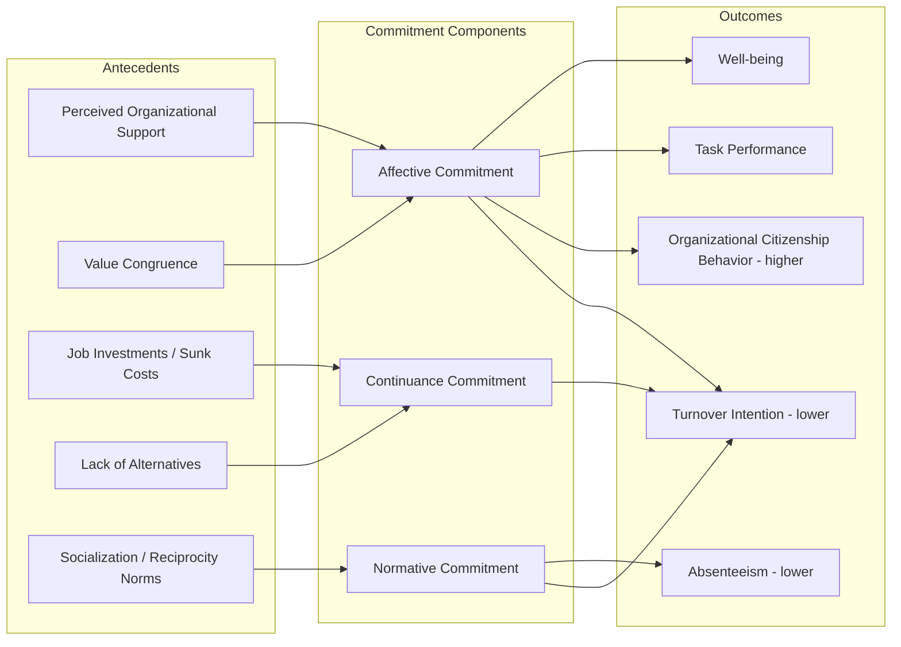

## Organizational Commitment

### Definition and Conceptual Overview

Organizational commitment refers to the psychological state that characterizes an employee's relationship with their organization and has implications for the decision to continue or discontinue membership in that organization. It reflects the relative strength of an individual's identification with, and involvement in, a particular organization.

Unlike job satisfaction, which is an attitude toward one's job tasks and conditions, organizational commitment is an attitude toward the organization as a whole. It tends to be more stable over time and is a stronger predictor of turnover than job satisfaction, though satisfaction often predicts day-to-day behaviors like absenteeism more strongly.

### The Three-Component Model (Meyer & Allen)

The dominant framework in organizational psychology, developed by John Meyer and Natalie Allen (1991), conceptualizes commitment as consisting of three distinct but related components. Employees can experience each component to varying degrees simultaneously, producing a "commitment profile" rather than a single score.

#### Affective Commitment

An employee's emotional attachment to, identification with, and involvement in the organization. Employees with strong affective commitment remain because they *want to*.

- **Key Points**:
  - Rooted in positive work experiences, perceived organizational support, and value congruence
  - Most consistently linked to positive outcomes: higher performance, organizational citizenship behavior (OCB), lower turnover and absenteeism
  - Develops through experiences that satisfy psychological needs for competence, relatedness, and autonomy

#### Continuance Commitment

An awareness of the costs associated with leaving the organization. Employees with strong continuance commitment remain because they *need to*.

- **Key Points**:
  - Driven by two sub-dimensions: perceived sacrifice (loss of investments like pension, seniority, relationships) and perceived lack of alternatives
  - Associated with weaker or even negative relationships to performance and citizenship behavior
  - Can foster a "trapped" psychological state, sometimes correlating with resentment or reduced discretionary effort

#### Normative Commitment

A felt obligation to remain with the organization. Employees with strong normative commitment remain because they feel they *ought to*.

- **Key Points**:
  - Shaped by socialization experiences (family, cultural values) and reciprocity norms (e.g., the organization invested in the employee's training)
  - Generally correlates positively with desirable outcomes, though more weakly than affective commitment
  - Can overlap conceptually with affective commitment, which has drawn some criticism (see Critiques below)

### Comparative Summary of Components

| Dimension | Affective | Continuance | Normative |
| --- | --- | --- | --- |
| Underlying mindset | Want to stay | Need to stay | Ought to stay |
| Primary driver | Emotional attachment | Perceived cost of leaving | Felt obligation |
| Relationship with performance | Strong positive | Weak/negative | Weak positive |
| Relationship with turnover intention | Strong negative | Negative (but fragile) | Moderate negative |
| Antecedent example | Supportive supervision | Non-transferable pension benefits | Employer-funded education |

### Mermaid Diagram: Antecedents to Outcomes Pathway

### Measurement

The most widely used instrument is the **Meyer & Allen Organizational Commitment Questionnaire (OCQ)**, which contains subscales for each of the three components (typically 6-8 items per subscale, rated on a Likert scale).

An older and still-referenced measure is the **Porter et al. (1974) Organizational Commitment Questionnaire**, which conceptualized commitment unidimensionally, emphasizing:

1. A strong belief in and acceptance of organizational goals and values
2. A willingness to exert considerable effort on behalf of the organization
3. A strong desire to maintain membership

**[Unverified]** The Porter OCQ is sometimes criticized for conflating commitment with behavioral intentions and job satisfaction, which reduces its discriminant validity relative to the Meyer & Allen model.

### Antecedents

**Key Points**:

- **Personal characteristics**: age, tenure, and internal locus of control show modest positive correlations with commitment, though effect sizes are generally small
- **Organizational structures and experiences**: role clarity, participative decision-making, and perceived organizational support (POS) are among the strongest predictors of affective commitment
- **Job characteristics**: autonomy, task significance, and skill variety (drawing on Hackman & Oldham's Job Characteristics Model) contribute to affective attachment
- **Leadership style**: transformational leadership and leader-member exchange (LMX) quality correlate positively with affective and normative commitment

### Consequences

**Key Points**:

- **Turnover and turnover intention**: meta-analytic evidence (e.g., Meyer, Stanley, Herscovitch, & Topolnytsky, 2002) consistently shows negative correlations, strongest for affective commitment
- **Organizational Citizenship Behavior (OCB)**: affectively committed employees are more likely to engage in discretionary, prosocial behaviors beyond formal role requirements
- **Job performance**: the affective-performance link is positive but moderate; continuance commitment shows near-zero or slightly negative associations
- **Employee well-being**: affective commitment associates with lower strain and burnout; continuance commitment (particularly the "perceived sacrifice" sub-dimension) can associate with higher strain
- **Absenteeism and withdrawal behaviors**: negatively related to affective and normative commitment

### Example

A mid-career software engineer stays at their company for three different reasons depending on the dominant commitment type:

- **Affective**: "I genuinely enjoy this team and believe in what we're building."
- **Continuance**: "I'd lose my vested stock options and it would be hard to match this salary elsewhere."
- **Normative**: "They paid for my certification last year; I'd feel guilty leaving so soon."

A single employee often holds a blend — e.g., moderate affective commitment combined with high continuance commitment, producing a "reluctant stayer" profile who remains but exhibits lower discretionary effort.

### Distinguishing Commitment from Related Constructs

- **Job satisfaction**: an attitude toward the job itself (tasks, pay, supervision); more transient and situation-specific than commitment
- **Job involvement**: the degree to which a person identifies psychologically with their specific job/role, distinct from identification with the organization
- **Organizational identification**: a related but distinct construct emphasizing self-concept overlap with the organization (drawing on Social Identity Theory), sometimes treated as a cognitive precursor to affective commitment
- **Employee engagement**: a motivational/energetic state (vigor, dedication, absorption) toward work, conceptually broader and more state-like than the more stable, attitudinal construct of commitment

### Critiques and Contemporary Developments

**Key Points**:

- The normative and affective components show high inter-correlations in some studies, raising questions about their empirical distinctiveness [Inference: based on commonly cited meta-analytic overlap, though the degree varies across samples]
- The three-component model was developed primarily in Western, individualist contexts; cross-cultural applicability has been questioned, particularly regarding how "obligation" (normative commitment) is culturally interpreted
- Some scholars have proposed **profile-based approaches** (e.g., latent profile analysis) that classify employees into commitment "types" (e.g., fully committed, affective-dominant, continuance-dominant, uncommitted) rather than treating each component as an independent continuous score
- With rising rates of job mobility and "boundaryless careers," some researchers argue organizational commitment is being supplemented or partially replaced by **occupational commitment** or **team-level commitment** as more relevant units of analysis in certain labor markets [Speculation]

### Practical Applications for Practitioners

**Key Points**:

- Onboarding programs that build early value congruence and social integration tend to strengthen affective commitment more effectively than compensation-focused retention strategies alone
- Golden handcuffs (e.g., vesting schedules, retention bonuses) build continuance commitment, which can retain staff short-term but does not reliably improve performance or engagement
- Investment in employee development (tuition reimbursement, mentorship) tends to build normative commitment through reciprocity norms, per social exchange theory
- Commitment should be measured and tracked by component, since interventions that raise continuance commitment without addressing affective commitment risk retaining "quiet quitters"

### Related Topics

- Job Satisfaction and the Job Descriptive Index (JDI)
- Organizational Identification and Social Identity Theory
- Psychological Contract Theory (transactional vs. relational contracts)
- Employee Engagement (Kahn's model; the Job Demands-Resources model)
- Turnover Models (Mobley's intermediate linkages model; unfolding model of voluntary turnover)
- Perceived Organizational Support (POS) and Organizational Support Theory
- Leader-Member Exchange (LMX) Theory
- Social Exchange Theory in organizational contexts