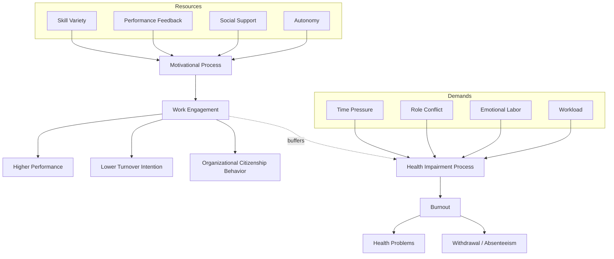

## Employee Engagement

### Definition and Conceptual Overview

Employee engagement is a positive, fulfilling, work-related psychological state characterized by high levels of energy and involvement with one's work. It is distinguished from related constructs by its motivational, energetic quality — engagement describes *how fully* a person invests their physical, cognitive, and emotional energy into their work role, rather than merely how satisfied or attitudinally attached they are.

The construct emerged from both academic research (notably William Kahn's foundational 1990 work) and consulting/practitioner traditions (Gallup's Q12 survey), which has produced some definitional inconsistency across the literature.

### Kahn's Personal Engagement Model

William Kahn (1990) provided the theoretical origin of the construct, defining personal engagement as the harnessing of organizational members' selves to their work roles, expressed through the simultaneous employment and expression of a person's preferred self in task behaviors.

#### Three Psychological Conditions for Engagement

- **Meaningfulness**: the sense of receiving a return on investment of self in role performance, in terms of psychological or economic worth
- **Safety**: the sense of being able to show and employ oneself without fear of negative consequences to self-image, status, or career
- **Availability**: the sense of possessing the physical, emotional, and psychological resources necessary to invest in role performance

**Key Points**:

- Engagement in this model is a moment-to-moment fluctuating state, not a stable trait
- Disengagement, in contrast, involves the withdrawal and defense of one's preferred self, uncoupling the self from the work role

### The Job Demands-Resources (JD-R) Model

The most empirically dominant contemporary framework (Bakker & Demerouti, 2007) situates engagement within a broader model of work-related well-being.

#### Core Mechanisms

- **Motivational process**: job resources (autonomy, feedback, social support, skill variety) foster engagement, which in turn predicts performance and reduced turnover intention
- **Health-impairment process**: job demands (workload, emotional labor, role conflict) deplete energy and lead to burnout, which predicts health problems and withdrawal
- **Job crafting**: employees proactively reshape their demands and resources to optimize their own engagement [Inference: job crafting's direct causal effect on engagement is well-supported but effect sizes vary considerably by study design]

$$\text{Engagement} = f(\text{Job Resources}, \text{Personal Resources}) - g(\text{Job Demands})$$

### Mermaid Diagram: JD-R Model Pathways

### The Three Dimensions of Engagement (Schaufeli & Bakker)

Operationalized through the **Utrecht Work Engagement Scale (UWES)**, engagement is measured along three correlated dimensions:

#### Vigor

High levels of energy and mental resilience while working, willingness to invest effort, and persistence even in the face of difficulties.

#### Dedication

A sense of significance, enthusiasm, inspiration, pride, and challenge derived from one's work.

#### Absorption

Being fully concentrated and happily engrossed in one's work, such that time passes quickly and one has difficulty detaching.

**Key Points**:

- Absorption bears conceptual resemblance to Csikszentmihalyi's concept of *flow*, though flow is typically more intense and short-lived, whereas engagement is a more persistent state
- The UWES is available in full (17-item) and short (9-item) versions

### The Gallup Q12 Approach

Gallup's practitioner-oriented model operationalizes engagement through 12 survey items measuring employees' perceptions of basic needs, management support, teamwork, and growth opportunities (e.g., "I know what is expected of me at work," "I have a best friend at work").

**[Unverified]** Gallup's proprietary meta-analyses report substantial differences in profitability, productivity, and turnover between top- and bottom-quartile business units on engagement scores; because the methodology and raw data are not fully public, these figures should be treated as industry-reported rather than independently peer-reviewed findings.

### Distinguishing Engagement from Related Constructs

| Construct | Core Focus | Temporal Stability |
| --- | --- | --- |
| Employee Engagement | Energy/absorption invested in work role | State-like, fluctuates day-to-day |
| Job Satisfaction | Evaluative attitude toward job facets | Moderately stable |
| Organizational Commitment | Attachment to the organization | Stable, trait-like |
| Job Involvement | Psychological identification with the job/role | Moderately stable |
| Flow | Intense absorption in a specific task | Momentary, episodic |

### Antecedents

**Key Points**:

- **Job resources**: autonomy, supervisor coaching, performance feedback, opportunities for development
- **Personal resources**: self-efficacy, optimism, resilience, and organization-based self-esteem (drawing on Conservation of Resources theory)
- **Leadership**: transformational and servant leadership styles positively predict follower engagement, largely by increasing perceived meaningfulness and psychological safety
- **Perceived organizational support (POS)**: strongly associated with engagement via reciprocity norms

### Consequences

**Key Points**:

- **Task and contextual performance**: engaged employees show higher performance ratings and more frequent organizational citizenship behavior
- **Turnover intention**: engagement is a consistent negative predictor
- **Customer outcomes**: in service contexts, engagement has been linked to customer satisfaction, sometimes framed through the "service-profit chain"
- **Well-being**: engagement is generally positively associated with well-being, though very high absorption combined with excessive workload can co-occur with dimensions of workaholism [Inference: the engagement-workaholism boundary is an active area of scholarly debate rather than a settled distinction]

### Example

A hospital nurse experiencing high engagement might describe:

- **Vigor**: coming into a demanding 12-hour shift and still feeling capable of handling an emergency admission near the end
- **Dedication**: describing patient care as personally meaningful, taking pride in positive patient outcomes
- **Absorption**: losing track of time while coordinating a complex care plan

By contrast, a *disengaged* colleague in the same unit might complete required tasks but describe the work as "just a job," show minimal discretionary effort, and mentally "clock out" well before their shift ends.

### Measurement Approaches Compared

- **UWES (academic)**: three-dimension structure, strong psychometric validation across cultures, widely used in peer-reviewed research
- **Gallup Q12 (practitioner)**: single overall engagement index derived from perceived workplace conditions, favored in HR/consulting contexts for its brevity and actionability
- **Job Engagement Scale (Rich, LePine, & Crawford, 2010)**: operationalizes engagement as physical, emotional, and cognitive investment, closely tracking Kahn's original three dimensions

### Critiques and Contemporary Developments

**Key Points**:

- Critics argue "engagement" as used in HR practice sometimes functions as a rebranding of older constructs (satisfaction, commitment, motivation) without sufficient discriminant validity, a concern raised in several construct-clarity reviews
- The instructional/practitioner emphasis on engagement "scores" and organizational rankings has been critiqued for prioritizing measurement convenience over theoretical precision
- Team-level and collective engagement (as opposed to purely individual-level) is a growing area of study, examining how engagement can be socially contagious within work groups [Speculation]
- Post-pandemic remote and hybrid work research has begun examining how engagement's "availability" and "absorption" components manifest differently absent physical co-location [Inference: this is an emerging research area without yet-converged findings]

### Practical Applications for Practitioners

**Key Points**:

- Engagement surveys should be paired with manager action-planning; survey administration without follow-through tends to erode trust and can decrease subsequent engagement scores
- Job crafting interventions (encouraging employees to redesign tasks/relationships within their role) have shown promise for boosting engagement, particularly the vigor and dedication dimensions
- Engagement should be monitored alongside burnout indicators, since high demands can produce short-term engagement spikes that are unsustainable
- Manager-level behaviors (regular feedback, recognition, growth conversations) are consistently among the strongest organizational levers for engagement, more so than broad company-wide perks

### Related Topics

- Job Demands-Resources (JD-R) Model in depth
- Burnout (Maslach Burnout Inventory; Conservation of Resources Theory)
- Flow Theory (Csikszentmihalyi)
- Job Crafting (Wrzesniewski & Dutton)
- Psychological Safety (Edmondson)
- Organizational Commitment (Meyer & Allen Three-Component Model)
- Perceived Organizational Support Theory
- Transformational and Servant Leadership