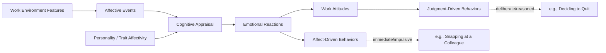

## Emotions and Moods at Work

### Definition and Conceptual Overview

Affect is the umbrella term in organizational psychology for the broad range of feelings people experience, encompassing both emotions and moods. While often used interchangeably in casual speech, emotions and moods are theoretically and empirically distinct constructs that differ in cause-specificity, duration, and behavioral expression.

#### Emotions vs. Moods

| Dimension | Emotions | Moods |
| --- | --- | --- |
| Cause | Specific, identifiable event or object | Often diffuse or unclear cause |
| Duration | Brief (seconds to minutes) | Longer-lasting (hours to days) |
| Action tendency | Strong, specific action urges | Weaker, more general behavioral influence |
| Cognitive content | Directed at a specific target | Free-floating, not target-specific |
| Facial expression | Often distinct and visible | Rarely displayed distinctly |

**Key Points**:

- Emotions can transform into moods when the specific cause is forgotten but the residual feeling lingers (e.g., anger at a specific comment fading into a generally irritable mood for the rest of the day)
- Both are subsets of **affect**, the broader term encompassing the full range of feelings

### Core Affective Structure: The Circumplex Model

Most contemporary organizational research organizes discrete emotions and moods along two orthogonal dimensions (Russell, 1980; Watson & Tellegen, 1985):

- **Valence** (pleasant–unpleasant / positive–negative)
- **Activation/Arousal** (high energy–low energy)

$$\text{Affective State} = f(\text{Valence}, \text{Arousal})$$

This produces four quadrants: high-activation positive (e.g., enthusiasm, excitement), low-activation positive (e.g., calm, contentment), high-activation negative (e.g., anger, anxiety), and low-activation negative (e.g., fatigue, boredom).

### SVG Diagram: The Circumplex Model of Affect (svg_diagram)

<svg xmlns="http://www.w3.org/2000/svg" viewBox="0 0 480 480">
<text x="240" y="24" text-anchor="middle" font-size="15" font-weight="bold" fill="#1a1a1a">Circumplex Model of Affect (svg_diagram)</text>
<line x1="60" y1="240" x2="420" y2="240" stroke="#555" stroke-width="1.5" />
<line x1="240" y1="60" x2="240" y2="420" stroke="#555" stroke-width="1.5" />

<text x="428" y="244" font-size="12" fill="#333">Pleasant</text>

<text x="15" y="244" font-size="12" fill="#333">Unpleasant</text>

<text x="240" y="52" text-anchor="middle" font-size="12" fill="#333">High Activation</text>

<text x="240" y="436" text-anchor="middle" font-size="12" fill="#333">Low Activation</text>

<circle cx="240" cy="240" r="150" fill="none" stroke="#bbb" stroke-dasharray="4,4" />

<text x="330" y="150" font-size="12" fill="`#0a6b2b`">Excited</text>

<text x="345" y="170" font-size="12" fill="`#0a6b2b`">Enthusiastic</text>

<text x="330" y="330" font-size="12" fill="`#0a6b2b`">Content</text>

<text x="335" y="350" font-size="12" fill="`#0a6b2b`">Relaxed</text>

<text x="105" y="150" font-size="12" fill="`#a30000`">Anxious</text>

<text x="115" y="170" font-size="12" fill="`#a30000`">Angry</text>

<text x="120" y="330" font-size="12" fill="`#a30000`">Bored</text>

<text x="115" y="350" font-size="12" fill="`#a30000`">Fatigued</text>

<circle cx="240" cy="240" r="4" fill="#1a1a1a" />
</svg>

### Affective Events Theory (AET)

Developed by Weiss and Cropanzano (1996), Affective Events Theory is the dominant organizing framework linking workplace events to emotional reactions and, ultimately, work attitudes and behaviors.

#### Core Sequence

1. **Work environment features** (job characteristics, organizational constraints, leadership) shape the occurrence of...
2. **Affective events** — discrete incidents at work (a compliment from a supervisor, a conflict with a coworker, a missed deadline)
3. Which trigger **emotional reactions**, filtered through the individual's disposition (trait affectivity) and prior appraisals
4. Producing **affect-driven behaviors** (impulsive, immediate reactions) and, over time, **judgment-driven behaviors** and **work attitudes** (e.g., job satisfaction) via cumulative affective experience

### Mermaid Diagram: Affective Events Theory Sequence

### Trait Affectivity: Positive and Negative Affectivity

Beyond momentary states, individuals differ in their dispositional tendency to experience certain affective states.

#### Positive Affectivity (PA)

A trait disposition to experience pleasant, engaged emotional states across situations and time (enthusiasm, alertness, high energy).

#### Negative Affectivity (NA)

A trait disposition to experience unpleasant emotional states (distress, nervousness, irritability), largely independent of actual objective circumstances.

**Key Points**:

- PA and NA are measured via the **Positive and Negative Affect Schedule (PANAS)**, a widely used 20-item instrument
- High trait NA is associated with a tendency to interpret ambiguous workplace stimuli negatively, which can confound self-report measures of stressors and strain
- PA and NA are largely orthogonal (not strict opposites) — an individual can be high on both simultaneously

### Emotional Labor

Emotional labor refers to the effort, planning, and control needed to express organizationally desired emotions during interpersonal transactions, particularly prominent in service roles (Hochschild, 1983).

#### Regulation Strategies

- **Surface acting**: modifying outward emotional expression without changing the underlying felt emotion (e.g., forcing a smile while feeling frustrated)
- **Deep acting**: attempting to actually modify one's internal feelings to align with the required display, so the expressed emotion is genuinely felt

**Key Points**:

- Surface acting is more consistently linked to emotional exhaustion and burnout than deep acting, because it creates emotional dissonance — the internal conflict between felt and displayed emotion
- **Display rules** are organizational or occupational norms dictating which emotions should (or should not) be expressed (e.g., flight attendants expressing calm regardless of turbulence-related stress)
- Deep acting, while less exhausting than surface acting long-term, still requires cognitive/emotional resources and is not cost-free [Inference: the deep-acting resource cost is well-documented, though its relative magnitude compared to surface acting varies by study and occupational context]

### Emotional Contagion

The tendency for emotions to spread between individuals, largely through nonconscious mimicry of facial expressions, vocal tone, and posture, resulting in emotional convergence.

**Key Points**:

- Relevant at both dyadic (leader-follower) and group levels — leader mood can "cascade" through a team, influencing collective affective tone
- Explains phenomena such as customer emotional responses mirroring service employee affect during interactions

### Emotional Intelligence (EI) in the Workplace

Emotional intelligence refers to the ability to perceive, understand, manage, and use emotions effectively in oneself and others. Common frameworks include:

- **Ability model** (Mayer & Salovey): EI as a set of cognitive abilities (perceiving, facilitating, understanding, managing emotions), typically measured via performance-based tests like the MSCEIT
- **Trait/mixed models** (e.g., Goleman's popularized framework, Bar-On's model): blend emotional abilities with personality traits and competencies, typically measured via self-report

**[Unverified]** Meta-analytic estimates of EI's incremental predictive validity for job performance (beyond cognitive ability and personality) vary substantially across studies and measurement approaches, and this remains a debated area in the I-O psychology literature.

### Consequences of Workplace Affect

**Key Points**:

- **Decision-making**: positive affect is associated with more creative, flexible cognitive processing; negative affect (particularly anxiety) narrows attentional focus but can improve performance on detail-oriented vigilance tasks
- **Job performance**: moderate positive mood is generally associated with better performance and helping behavior; extremely high positive affect can, in some contexts, reduce systematic processing needed for complex tasks
- **Organizational citizenship behavior (OCB)**: positive affect reliably predicts spontaneous helping and prosocial behavior at work
- **Counterproductive work behavior (CWB)**: negative emotions, especially anger, are a robust predictor of CWB, consistent with frustration-aggression theoretical models
- **Customer service outcomes**: displayed positive affect by service employees is linked to customer satisfaction, though the effect is moderated by perceived authenticity of the display

### Example

A retail employee experiences a specific **affective event**: a customer yells at them over a return policy. This triggers an immediate **emotional reaction** (anger, embarrassment). Per Affective Events Theory:

- The **affect-driven behavior** might be a curt, defensive response given immediately after the incident
- If the employee engages in **surface acting** to comply with the "always be pleasant" display rule, suppressing visible anger while still feeling upset internally, they may experience emotional dissonance
- Repeated events of this kind, accumulated over weeks, contribute to a **judgment-driven** decision to reduce job satisfaction or seek other employment — the cumulative, attitude-based response distinct from the moment's impulsive reaction

### Measurement Approaches

- **PANAS**: measures trait or state positive/negative affectivity via adjective checklists
- **Experience Sampling Method (ESM) / Ecological Momentary Assessment**: captures real-time, in-the-moment affect via repeated brief surveys throughout the workday, reducing retrospective recall bias
- **Facial action coding and physiological measures** (e.g., cortisol, heart rate variability): used in more controlled research settings to triangulate self-report affect data

### Critiques and Contemporary Developments

**Key Points**:

- Some scholars argue the emotion/mood distinction, while theoretically useful, is difficult to operationalize cleanly in survey-based field research, since retrospective self-reports blur temporal boundaries
- The mixed-model approach to emotional intelligence has drawn criticism for overlapping substantially with existing personality traits (e.g., low neuroticism, high agreeableness), raising incremental validity concerns
- Research increasingly uses within-person, day-level or moment-level designs (via ESM) rather than only between-person trait measures, better capturing affective *dynamics* rather than static snapshots [Inference: this methodological shift reflects a broader trend in organizational research toward dynamic, multilevel modeling rather than a fully settled consensus]
- Cross-cultural research suggests display rules and the social acceptability of expressing negative emotion at work vary meaningfully across cultural contexts, complicating universal claims about emotional labor's health effects

### Practical Applications for Practitioners

**Key Points**:

- Training programs targeting deep acting (reframing, empathic perspective-taking) rather than merely suppressing expression may reduce emotional exhaustion in service roles
- Leaders should be aware of emotional contagion dynamics — visible leader stress or negativity can propagate through teams independent of the leader's intent
- Organizations relying heavily on strict display rules (e.g., "always smile") should weigh the burnout costs of surface acting against customer-facing benefits
- Momentary affect measurement (brief daily pulse surveys) can surface affective patterns invisible to periodic annual engagement surveys

### Related Topics

- Affective Events Theory (full model elaboration)
- Emotional Labor and Emotional Dissonance
- Job Satisfaction (cognitive vs. affective components)
- Emotional Intelligence Models and Measurement
- Counterproductive Work Behavior (CWB)
- Burnout and Emotional Exhaustion
- Experience Sampling Methodology in Organizational Research
- Leader Affective Displays and Team Emotional Climate